# 1. Giới thiệu về CWP
## Centos Web Panel là gì?

Nó giống như cPanel và WHM mà các bạn thường dùng đó, Centos Web Panel (CWP) được dùng để quản trị mọi thứ trong server qua các thao tác click thay vì gõ từng dòng command khiến bạn phát ngán.

Không giống VirtualMin hay Koloxo, khi vừa cài CWP xong bạn có thể chạy tốt WordPress như các share host nước ngoài một cách bình thường mà không cần cấu hình gì thêm

## Các tính năng của CWP

- Cài sẵn nhiều phiên bản PHP khác nhau, bạn có thể đổi phiên bản trong 1 cú click. PHP cũng đã được tối ưu hóa để tăng tỷ lệ hiệu suất lên 20%.
Cài sẵn MySQL và PhpMyAdmin đã được bảo mật.

- Cài sẵn Varnish cache, chỉ cần bật lên và chạy mà thôi. Được dùng để tăng tốc, giảm tải cho máy chủ (dùng kèm với W3 Total Cache là tuyệt vời).

- Backup & Restore dữ liệu.

- Hỗ trợ SuPHP và suExec để bảo mật tốt hơn. Tức là khi cài các plugin WordPress bạn không cần phải CHMOD thủ công, đặc biệt là CHMOD thành 777.

- Hỗ trợ SSL Manager.

- Có tính năng xem thông tin phần cứng của server.

- Xem tiến trình làm việc của server, thông tin sử dụng CPU cực kỳ chi tiết.

- Cài sẵn Web Mail và Exim.

- Cài sẵn CFS FireWall để bảo mật.

- Có hỗ trợ File Manager.

- Hỗ trợ bảng thông báo nhắc nhở tinh chỉnh để bảo mật, ví dụ bạn đang để port SSH là 22 thì nó sẽ bảo port này không an toàn và hướng dẫn bạn cách sửa.

- Ít bug, support forum rất nhanh.

- Và nhiều tính năng nhỏ li ti khác.

**Như vậy bạn thấy đó, với một control panel như thế thì bạn đã hoàn toàn thay thế được cPanelX hoàn toàn miễn phí và sử dụng rất tốt nữa vì hiện tại mình có sử dụng trên 1 server của site khách**

Tuy nhiều tính năng nhưng CWP khá nhẹ, mình đã thử đo trên một VPS có 1GB RAM thì nó chỉ chiếm 135MB tính luôn cả các phần mềm đi theo hệ điều hành.

# 2. Hướng dẫn cài đặt CWP

## Chuẩn bị

- Hệ điều hành Centos 6.5 trở lên

- RAM 512GB trở lên

- CPU 2 core

## Cài đặt

Truy cập vào VPS và gõ 4 dòng lệnh sau là ta có thể cài CWP một cách đơn giản.

```
cd /usr/local/src

yum install wget unzip -y

wget http://dl1.centos-webpanel.com/files/cwp-latest.sh

sh cwp-latest.sh
```

Đợi tầm 15 phút sẽ cài đặt xong và hiển thị MySQL Root Password, Các bạn nhớ lưu lại để sau này khi cần vào tài khoản root MySQL để quản trị cơ sở dữ liệu.

Sau khi cài xong thì màn hình sẽ hiển thị địa chỉ đăng nhập và tài khoản mật khẩu của CWP. Ta theo đó để đăng nhập vào trang quản trị của CWP.

```
URL: http://IP:2031

User: root

Password: mật khẩu root của server

```

Và đây là giao diện của trang quản trị CWP.

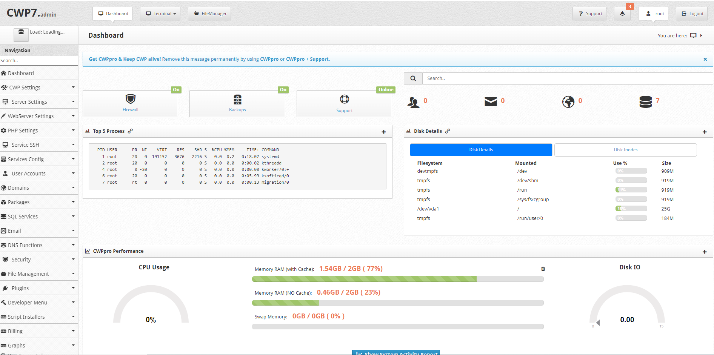

# 3.  Các thao tác cơ bản với CWP

## Dashboard

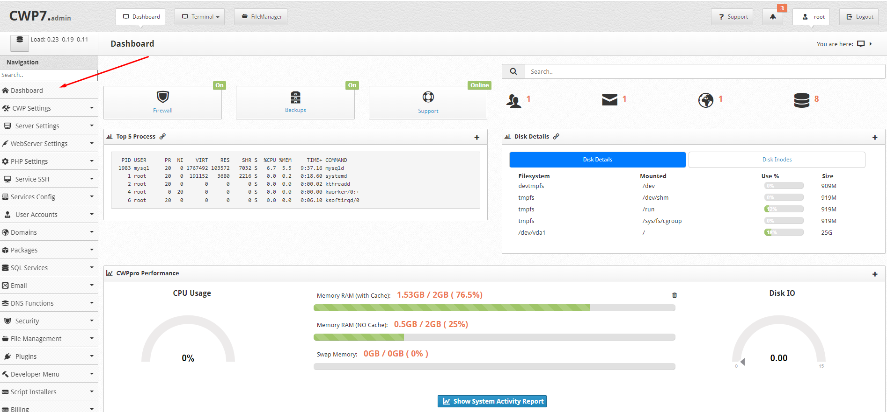

Nơi hiển thị các thông tin cơ bản của hệ thống. Tình trạng của các Service như Firewall, Backups, Dung lượng ổ đĩa, Ram, CPU, Swap,

Ngoài ra còn hiển thị số lượng account. Mail box, domains tiện cho người quản trị theo dõi.

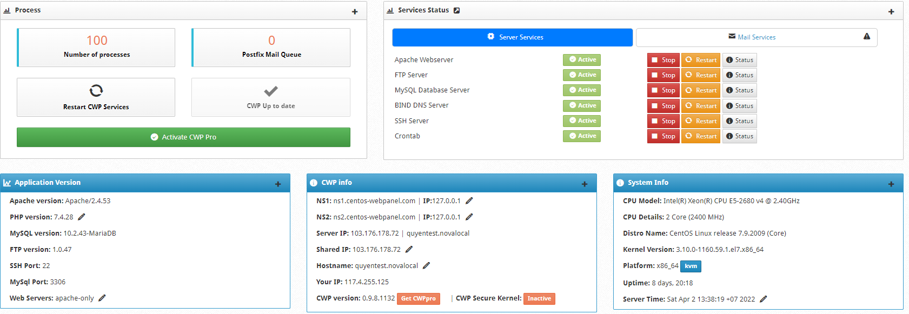

Kéo chuột xuống phía dưới ta còn có thể thấy được một vài thông tin như về Process, số tiền trình, số mail ở hàng đợi, Trạng thái của các Service, Thông tin về phiên bản ứng dụng, thông tin về CWP, thông số chip, nhân của hệ điều hành.

## Package (Gói dịch vụ)

Phần không thể thiếu của các Control Panel đó là Các gói dịch vụ để người quản trị có thể gán cho các user tùy theo mục đích sử dụng. Ở đây là các Packages

Ta vào tùy chọn Package để thêm, sửa, xóa các Package

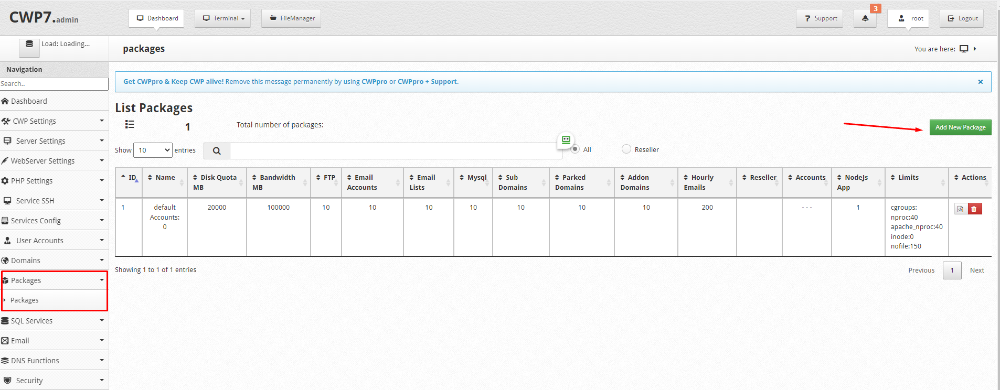

Tùy chỉnh các thông số cho Package tùy theo nhu cầu của khách hàng

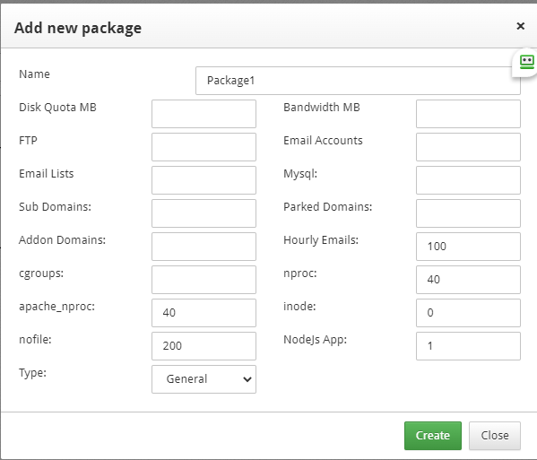

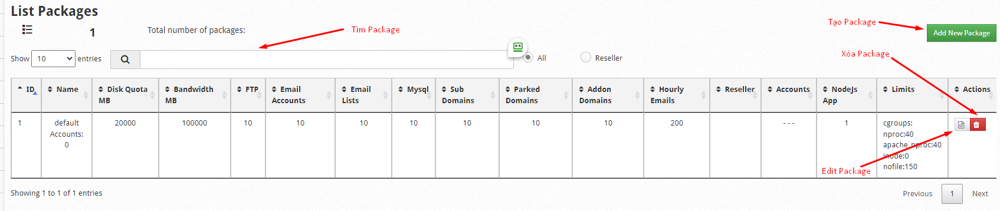

## User Account

User là tài khoản riêng được cấp cho các người dùng với các vai trò, chức năng và tài nguyên sử dụng khác nhau. Việc tạo các user dưới quyền root sẽ giúp phân chia chức năng và quyền hạn sử dụng để có thể dễ dàng quản lí các tài nguyên được cài đặt trên server.

Ta vào tùy chọn User Account

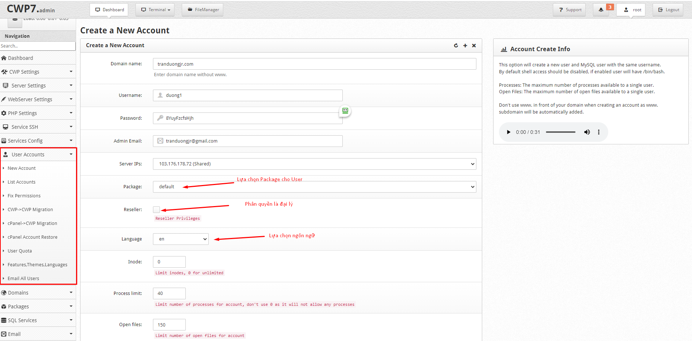

Khi nhấn vào Create thì ta sẽ có thông báo về tài khoản đã tạo

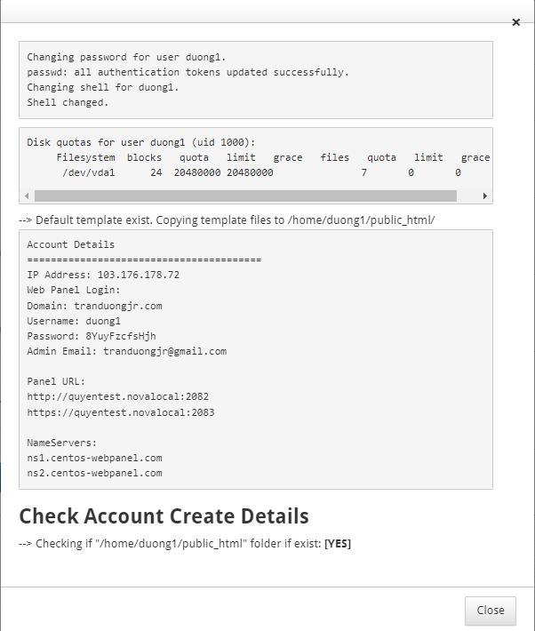

Ta vào tùy chọn List Accounts để quản lý các tài khoản

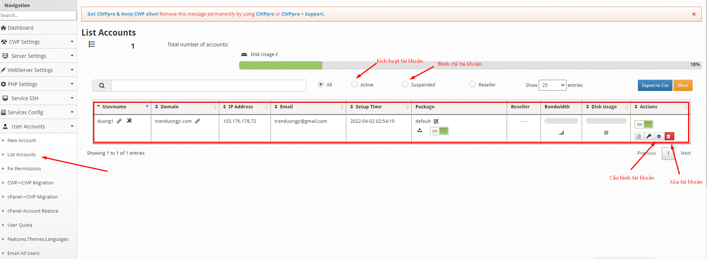

Ta cũng có thể truy cập vào trang quản trị của người dùng theo như hình dưới đây:

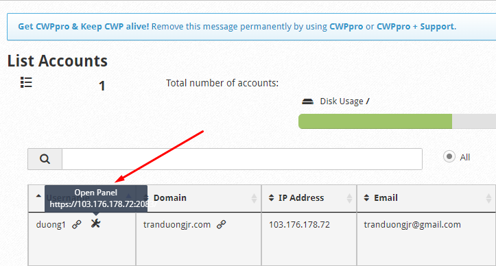

Giao diện quản trị hosting của người dùng hiện ra :

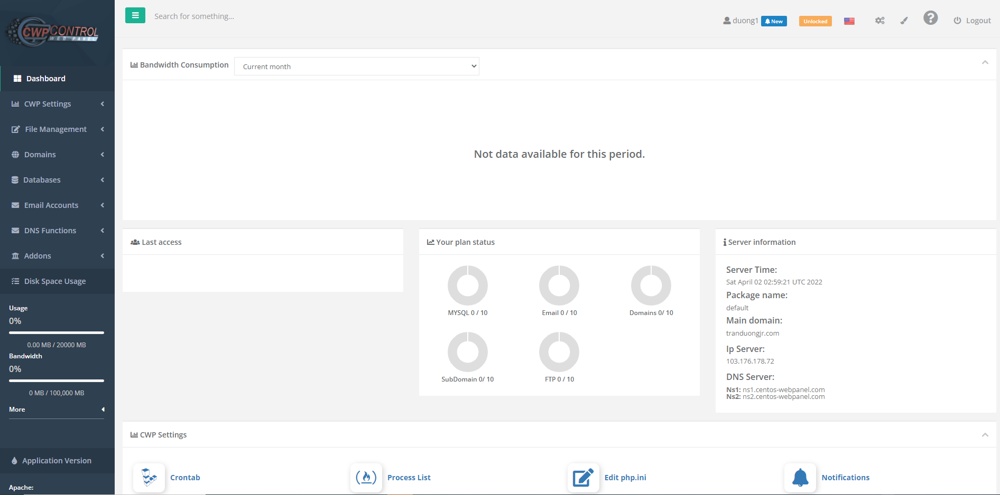

## Domain

**1. Thêm domain từ tài khoản root**

Để thêm domain từ tài khoản, trên giao diện của cwp, ta nhấn vào Domains, chọn Add Domain

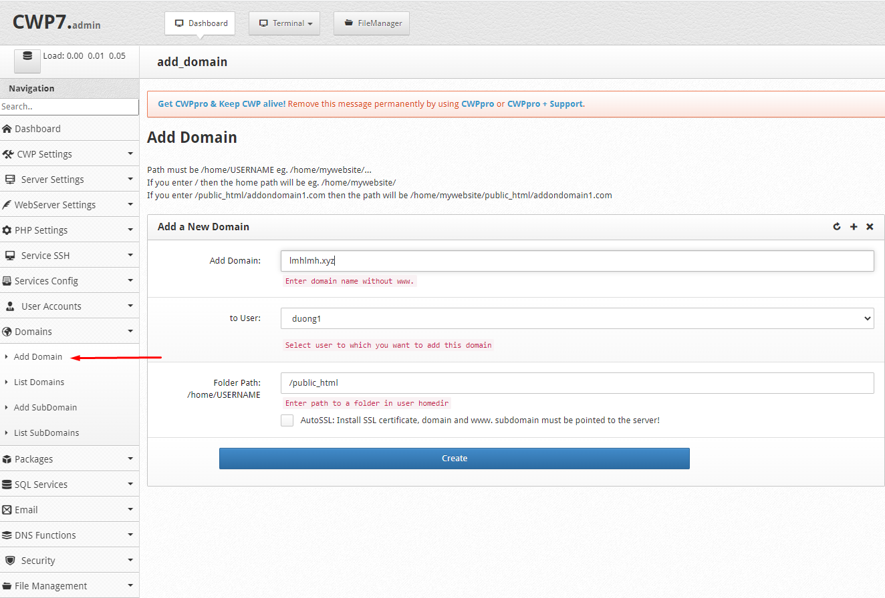

Các thông tin bao gồm:

- Add Domain: nhập thông tin domain cần tạo

- To User: gán user quản lí cho domain đó

- Folder Path: Thư mục chứa mã nguồn của domain

- AutoSSL: cài đặt chứng chỉ SSL cho domain

Sau khi điền tên miền mới, nhấn Create để tạo.

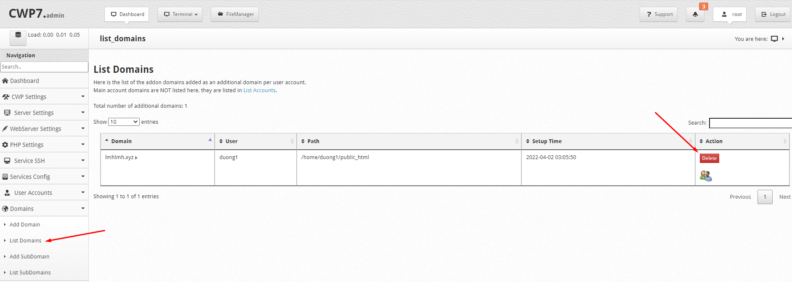

Ta thực hiện quản lý các domain tại List domains.

Ta cũng có thể add các Subdomain tại tùy chọn Add SubDomain và quản lý tại List SubDomain

## Email

Ta có thể quản lý tất cả các mail của các tất cả các user, ta có thể tìm theo domain.

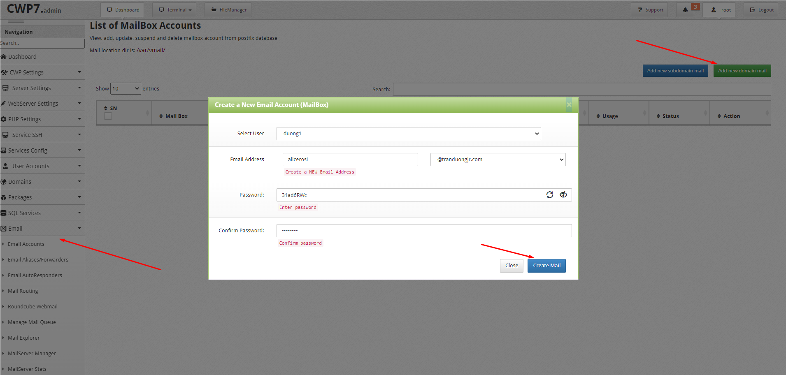

Tại đây ta có các tùy chọn quản lý đối với Mail như:

- Email Account: Quản lý các Email của các user, domain

- Email Aliases/Forwarders: Chuyển tiếp Mail

- Email AutoResponders: Email tự động trả lời

- Email Routing: thiết lập đường truyền Mail

- Roundcube Webmail: Trang Webmail người dùng

- Mail Explore

- MailServer Manager: Quản lý cấu hình Mail server

Và các tùy chọn về quản lý các bản ghi DKIM, SPF, Cấu hình antispam mail, SpamExperts

## File Management

Tùy chọn quản lý File, bao gồm các tùy chọn nhỏ như:

- File Manager: Quản lý các file

- Server Logs: Logs của hệ thống

### FTP Account

Để tạo tài khoản FTP ta vào tùy chọn File Management.

Các thông tin cần quan tâm bao gồm:

- Login: Tên tài khoản FTP

- Directory: Đường đẫn mà người dùng này được phép truy cập

- Password: Mật khẩu của tài khoản ftp

- Password (Again): Nhập lại mật khẩu

- Sau khi nhập các thông tin xong, chọn Submit để xác nhận.

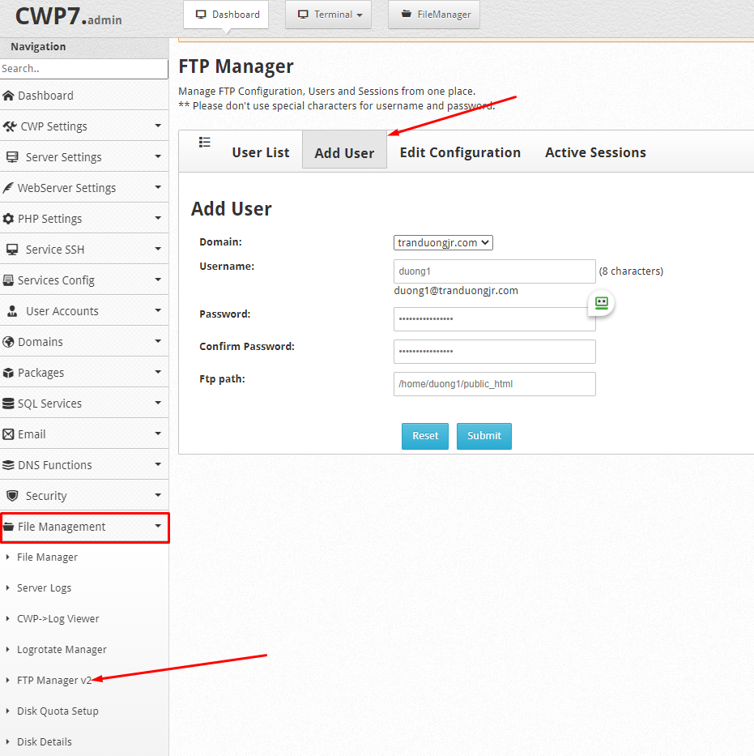

## Server Settings

Tại tùy chọn này ta có thể thao tác một vài tùy chọn để cấu hình cho Server như:

- Crontab for root: Tạo các job tự động thực thi với root

- Crontab for users: Tạo các job tự động thực thi đối với user

- Change Root Password: Thay đổi password tài khoản root

- SSH Key Generator: Sinh Key SSH

- Change Date & Time: Thay đổi thời gian 

- Change Hostname: Thay đổi hostname

- Disk Quota: Kiểm tra dung lượng các ổ đĩa của hệ thống, thiết lập hạn ngạch cho các phân vùng

- Yum manager: Kho quản lý thư viện của hệ thống

- Reboot server: Khởi động lại hệ thống, hoặc có thể thiết lập thời gian khởi động lại hệ thống

## WebServer Settings

Thiết lập các cấu hình cài đặt với Webserver của hệ thống như:

- Select Webserver: Lựa chọn kiểu Webserver cho hệ thống như: Apache, Nginx, LiteSpeed Enterprise, Nginx kết hợp Apache, Nginx kết hợp Varnish, Hoặc kết hợp cả 3 là Nginx, Apache và Varnish

- Webserver Main conf: Quản lý cấu hình cho Webserver đang chạy, Cấu hình dịch vụ Web, PHP,...

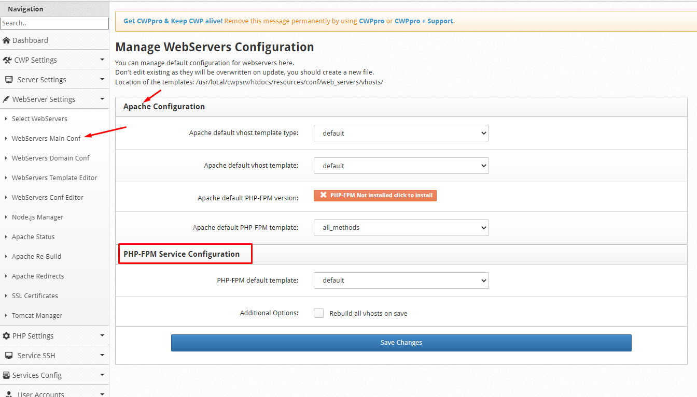

- WebServer Domain conf: Quản lý các domain đối với các user

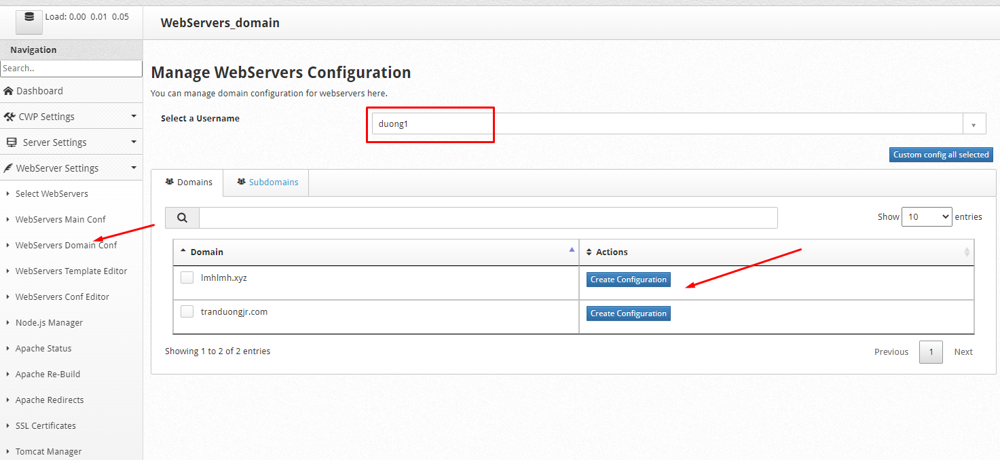

- Apache Status: Trạng thái hoạt động của Apache

- Apache Re-build: Build các bản của Apache và PHP:

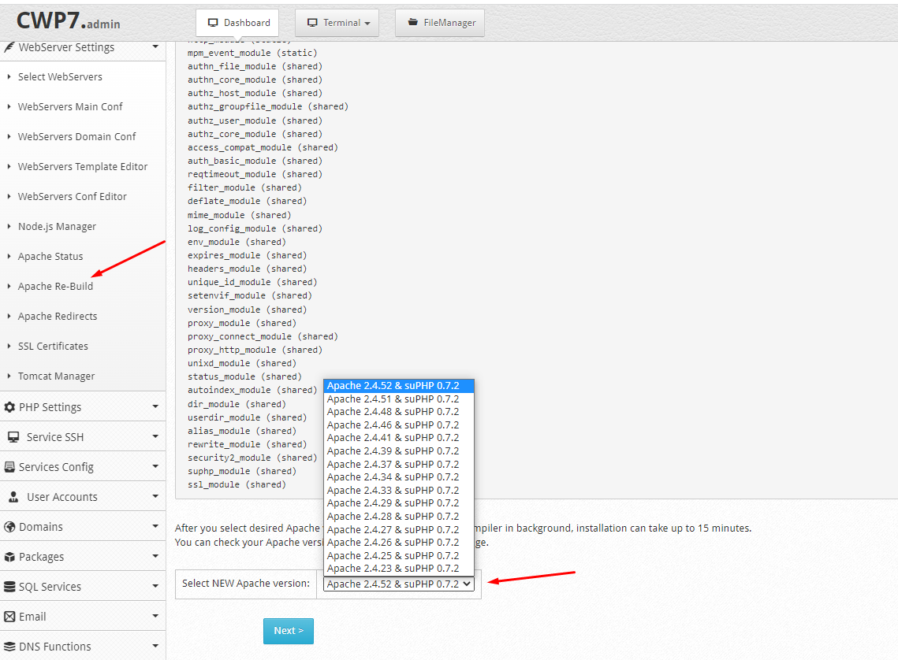

- SSL Certificate: Nơi quản lí, thực hiện cài đặt các chứng chỉ SSL (free hoặc trả phí) trên các domain, user,...

## PHP Settings

Quản lý cài đặt PHP của hệ thống như:

- PHP info: Xem thông tin chi tiết về PHP đang cài trên hệ thống

- PHP short info: Tóm tắt thông tin phiên bản PHP đang chạy của hệ thống

- PHP Selector: Lựa chọn cài đặt các phiên bản PHP cho hệ thống

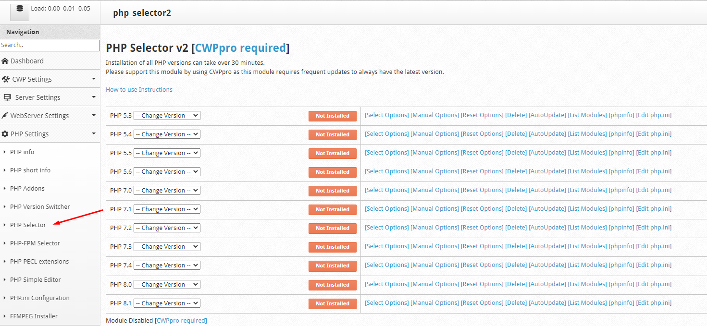

- PHP-FPM Selector: Lựa chọn cài đặt PHP-FPM cho hệ thống

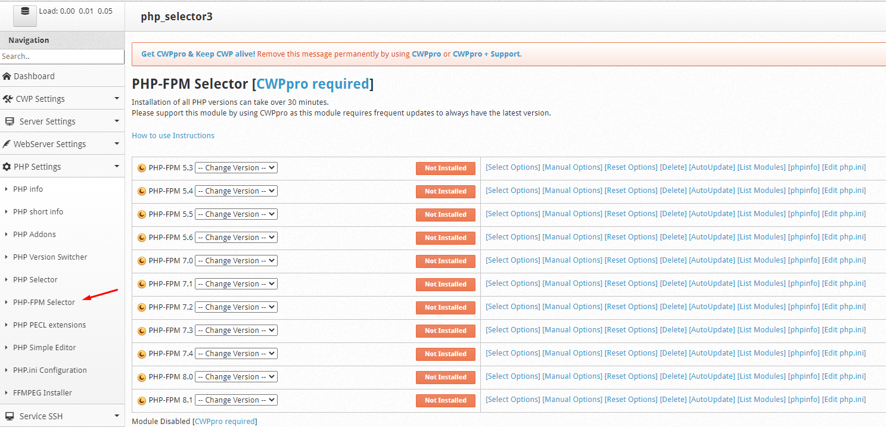

- PHP Simple Editor: Tùy chỉnh các thông số PHP

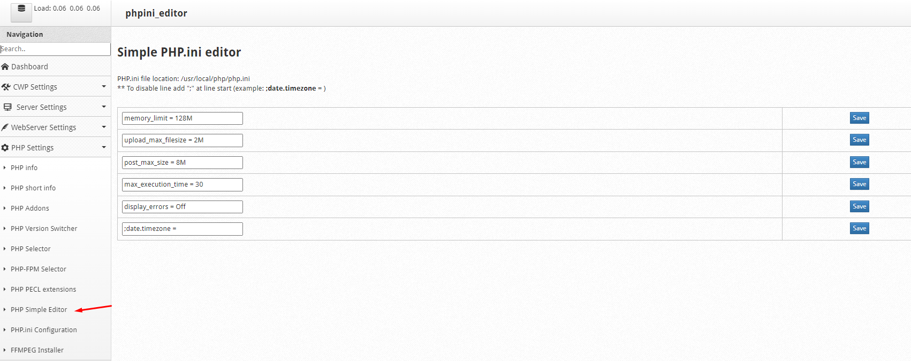

- PHP.ini Configuration: Tùy chỉnh cấu hình các thông số PHP ini:

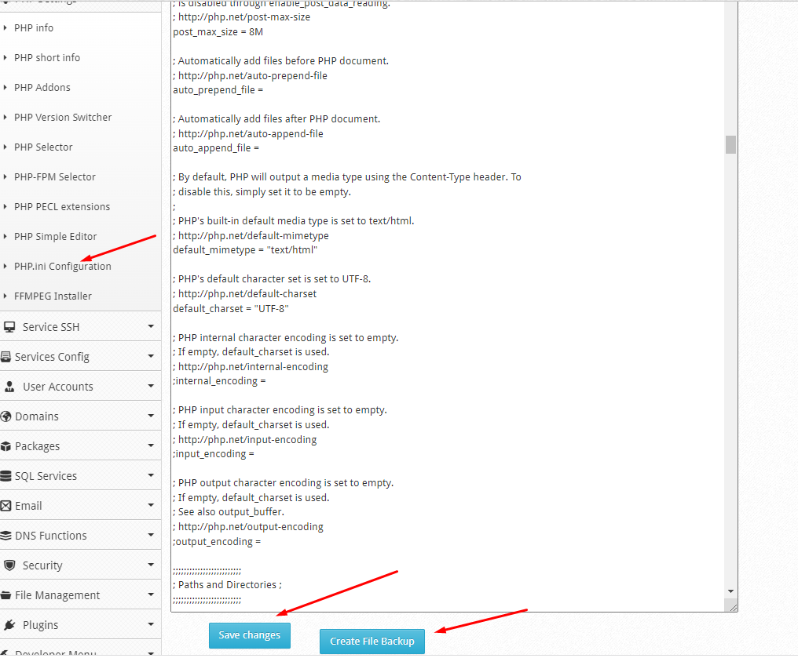

## Wordpress

Để cài Wordpress cơ bản cho 1 site ta vào trong trang quản trị hosting của user, click vào tùy chọn Addons -> Scripts 

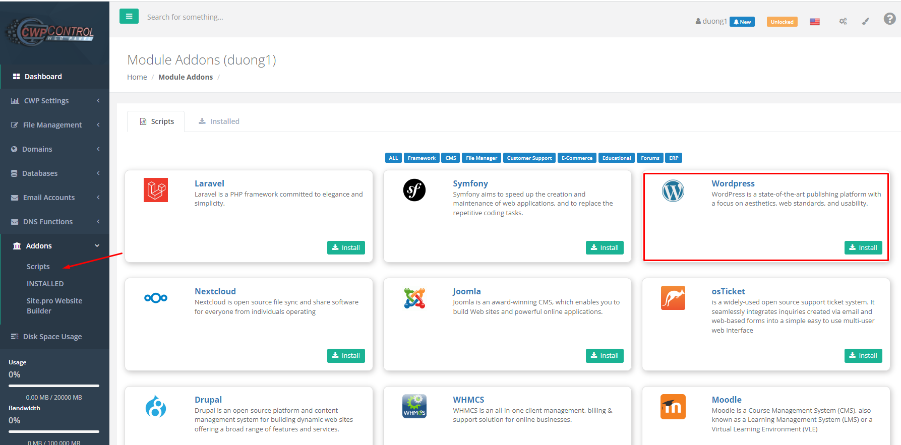

## Backup

Để backup dữ liệu ta vào tùy chọn SQL Service -> MySQL Manager và thực hiện chọn backup:

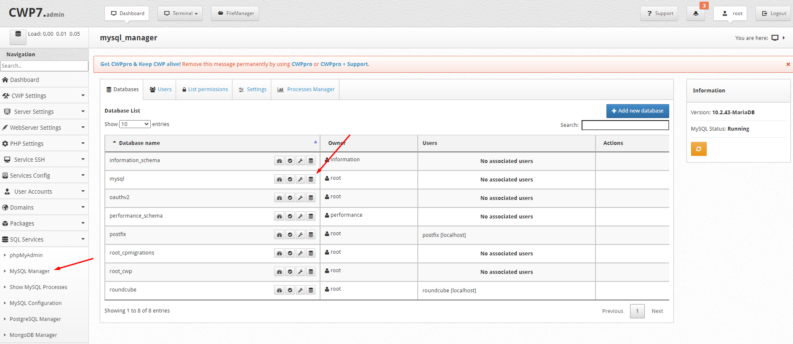

Khi đó file backup sẽ được tải về và lưu trữ trên máy của bạn.
