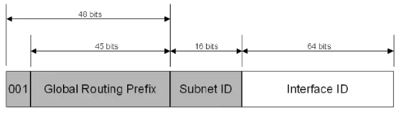
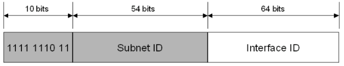
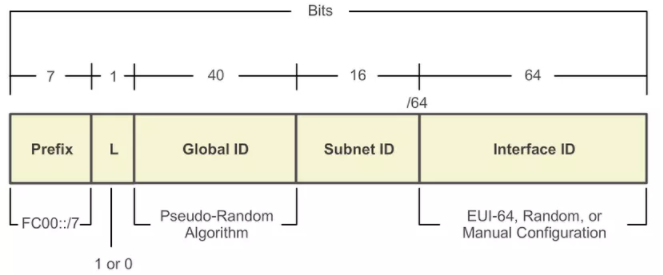
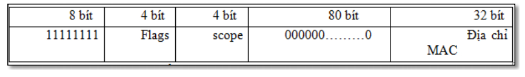

# 1. Tổng quan về IPv4
IPv4 (Internet Protocol version 4) là phiên bản thứ tư trong quá trình phát triển của các giao thức Internet. IP – Internet Protocol, là một giao thức của chồng giao thức TCP/IP thuộc về lớp Internet, tương ứng với tầng thứ ba (Network Layer) của mô hình OSI. Ngày nay, IP gần như là giao thức mạng thống trị, được sử dụng rộng rãi trong mọi hệ thống mạng trên phạm vi toàn thế giới.
## 1.1. Chức năng

Dùng định danh máy tính và tính toán trong các giao thức định tuyến (OSPF, EIRP, RIP,...). IP biểu diễn theo Bit:  1 hoặc 0.

1 Byte= 8 Bit

1 Octet= 8 Bit gồm các số nhị phân

## 1.2 Cấu trúc Ipv4

Địa chỉ IP gồm 32 bit nhị phân, chia thành 4 cụm 8 bit (gọi là các octet). Các octet được biểu diễn dưới dạng thập phân và được ngăn cách nhau bằng các dấu chấm.

Sẽ có 2 mũ 32 địa chỉ IP được sinh ra

Địa chỉ IP được chia thành hai phần: phần mạng (network) và phần host.

Việc đặt địa chỉ Ip phải tuân thủ theo các quy tắc sau:

- Các Bit phần mạng không được phép đồng thời bằng 0

Ví dụ: Địa chỉ 0.0.0.1 với phần mạng là 0.0.0 và phần host là 1 không hợp lệ

- Nếu các bit phần host đồng thời bằng không, ta có một địa chỉ mạng.

Ví dụ: Địa chỉ 192.168.1.1 là một địa chỉ có thể gán cho host nhưng địa chỉ 192.168.1.0 là một địa chỉ mạng, không thể gán cho host được

### 1.2.1. Các Lớp địa chỉ IP
#### 1.2.1.1. Lớp A

Địa chỉ lớp A có dạng 0xxxxxxx.host.host.host

Địa chỉ lớp A sử dụng 1 Octet đầu làm phần mạng, Ba Octet sau làm phần host

=> Các địa chỉ mạng của lớp A sẽ là 1.0.0.0 đến 127.0.0.0

Lưu ý: Mạng 127.0.0.0 được sử dụng làm loopback và địa chỉ 127.0.0.1 được làm loopback.

#### 1.2.1.2. Lớp B

Địa chỉ lớp B có dạng 10xxxxxx.network.host.host

Địa chỉ lớp B sử dụng 2 Octet đàu làm phần mạng và 2 Octest sau làm phần host

=> Các địa chỉ mạng của lớp B sẽ là 128.0.0.0 đến 191.255.0.0

Có tất cả 2 mũ 14 (16 bit của 2 octet trừ đi 2 bit 10 ở đầu) địa chỉ mạng trong lớp B

Phần host: 16 bit sau. Một mạng lớp B có 2^16 - 2 host

#### 1.2.1.3. Lớp C

Địa chỉ lớp C có dạng 110xxxxx.network.network.host

Địa chỉ lớp C sử dụng 3 Octet đầu làm phần mạng và 1 Octet cuối làm host.

Có tất cả 2^21 (24 bit của 3 octet đầu từ đi 3 bit đầu tiên là 110) địa chỉ mạng trong lớp C

Phần host 8 bit cuối, một lớp mạng C có 2^8 -2 host.

#### 1.2.1.4. Lớp D

Địa chỉ từ 224.0.0.0 đến 239.255.255.255 được dùng làm địa chỉ multicast

#### 1.2.1.5. Lớp E

Từ 240.0.0.0 trờ đi và được dùng cho mục đích dự phòng.

**Lưu ý**:

- Các lớp địa chỉ Ip có thể sử dụng để đặt cho các host là các lớp A,B,C.
- Để thuận tiện cho việc nhận diện 1 địa chỉ IP thuộc lớp nào, có network và host ra sao thì ta chỉ cần quan sát octet đầu của địa chỉ có giá trị bao nhiêu:

1-126 : Địa chỉ lớp A

127-191: Địa chỉ lớp B

192-223: Địa chỉ lớp C

224-239: Địa chỉ lớp D

240-255: Địa chỉ lớp E

Vì phiên bản IPv4 chỉ sử dụng 32 bit nên không gian của nó chỉ có 2^32 địa chỉ. Sự bùng nổ Internet trong thời điểm hiện tại khiến cho tài nguyên IPv4 dần cạn kiệt. Vì thế cần có giải pháp khắc phục những hạn chế của ipv4 và từ đó IPv6 được nghiên cứu và ra đời với chiều dài 128 bit gấp 4 lần chiều dài địa chỉ IPv4 nên không gian và tài nguyên của IPv6 là lớn hơn rất nhiều so với IPv4.

## 1.3. Phân Loại
### 1.3.1. Theo tiêu chí quan hệ.

- Unicast (1-1)

Thuộc loại địa chỉ 1  hót liên lạc với 1 host. Ví dụ 192.168.1.2 ping tới 192.168.1.10

- Multicast (1-nhiều)

Thuộc 1 loại host liên lạc được đồng thời một nhóm host, Ví dụ class D (Có phạm vi 223-239) đều thuộc loại này, chủ yếu dùng trong các giao thức định tuyến và các dịch vụ.

- Broadcast address (1-all)

Là loại địa chỉ dùng bởi các ứng dụng và host để gửi thông tin tới tất cả các máy trong Network mà Ip đó thuộc.

Ví dụ 255.255.255.255 gửi tới tất cả các máy (host) trong mạng.

172.32.255.255. gửi tất cả các máy trong mạng 172.32.0.0

10.255.255.255 gửi tới tất cả các máy trong mạng 10.0.0.0

### 1.3.2. Phân loại theo phạm vi

- Địa chỉ chung (Ip Public)

Là các địa chỉ được thuê từ các nhà cung cấp IPvaf sẽ tồn tại, hoạt động trên Internet.

- Địa chỉ riêng (Private)

Là loại không cần thuê nhà cung cấp mà ta có thể tự gán cho các thiết bị thuojc các dãy nhât định, và chúng chỉ có phạm vi hoạt động là trong mạng nội bộ Lan.

Tương ứng với 3 class có 3 dải Private sau: 

Lớp A: 10.0.0.0 đến 10.255.255.255

Lớp B: 172.16.0.0 đến 172.31.255.255

Lớp C: 192.168.0.0 đến 192.168.255.255

- Địa chỉ mạng (Network Addressing)

Dùng định danh mỗi mạng. Các thiết bị có IP nằm trong 1 mạng thì có thể chia sẻ tài nguyên với nhau mà không cần thiết bị ghép nối. Còn nếu khác Net mà muốn liên lạc với nhau thì cần thiết bị ghép nối như Router hay thiết bị có chức năng tương tự.

Ví dụ: Address 172.16.1.2 có 172.16 là địa chỉ mạng

# 2. Tổng quan về IPv6

IPv6 (Internet Protocol Version 6) là phiên bản mới nhất của Giao thức Internet (IP), Giao thức truyền thông cung cấp một hệ thống định vị cho các máy tính trên mạng và định tuyến lưu lượng trên Internet. IPv6 được nghiên cứu và ra đời để giải quyết vấn đề cạn kiệt địa chỉ IPv4.

## 2.1. Chức năng

Ipv6 cho phép thiết bị IPv6 tự động cấu hình các thông số phục vụ cho việc kết nối mạng như địa chỉ Gateway, địa chỉ máy chủ miền khi kết nối vào mạng. Từ đó giảm thiểu được việc cấu hình thử công cho thiết bị so với  công việc phải thực hiện với IPv4

## 2.2. Cấu trúc IPv6

Trong IPv6, thay vì sử dụng một địa chỉ nguồn và đích là 32 bit để cung cấp khoảng 2^32 địa chỉ như ipv4, địa chỉ ipv6 có chiều dài 128 bit, do đó sẽ lớn hơn rất nhiều so với ipv4. Ngoài ra có một vài sự khác nhau trong các biểu diễn địa chỉ của ipv6, một địa chỉ ipv6 được chia làm 8 nhóm, mỗi nhóm 16 bit được biểu diễn dưới dạng 4 số hex và mỗi nhóm được tách biệt với nhau bởi dấu ":". Ví dụ: 2201:0f62:0000:0000:1823:0000:af12:1202.

*1 số nguyên tắc nhằm rút ngắn lại cách biểu diễn địa chỉ IPv6*

- Cho phép bỏ các số 0 nwafm trước mỗi nhóm
- Thay bằng số 0 ccho các nhóm có toàn số 0
- Thay bằng dấu "::" cho các nhóm liên tiếp nhau có toàn số 0;

Ví dụ địa chỉ 2201:0f62:0000:0000:1823:0000:af12:1202 ở trên dựa theo quy tắc đã nêu trên, ta có thể nén địa chỉ IPtreen thành 2201:f62::1823:0:af12:1202

*Lưu ý* dấu "::" chỉ được sử dụng 1 lần trong toàn bộ địa chỉ IPv6

## 2.3. Phân loại

Địa chỉ Ipv6 có thể được phân thành 1 trong 3 loại sau:

### 2.3.1. Unicast

Một địa chỉ unicast được định nghĩa duy nhất trên một cổng của một node Ipv6. Một gói tin được gửi đến một địa chỉ unicast được đưa đến cổng được định nghĩa bởi địa chỉ đó.

**Global Unicast Address**

Là địa chỉ IPv6 toàn cầu (tương tự địa chỉ public của ipv4).

3 bit đầu luôn có giá trị là 001

Global Routing Prefix : gồm 45 bit. Là địa chỉ được cung cấp của một cơ quan, tổ chức nào đó khi đăng kí địa chỉ IPv6 public

Subnet ID: gồm 16 bit, là địa chỉ do các tổ chức tự cấp.

Interface ID: Gồm 54 bi, là địa chỉ của các Interface trong subnet.

**Link local Address**

Là địa chỉ được sử dụng cho những node trên 1 link duy nhất. Tự động cấu hình, tìm kiếm neighbor. Router không được chuyển tiếp gói tin có địa chỉ nguồn hoặc đích là link local ra khỏi phạm vi liên kết. 

**Site local Address**

Được sử dụng trong hệ thống nội bộ (Intranet) tương tự các địa chỉ Private IPv4. Phạm vi sử dụng của Site Local Address là trong cùng site.

1111 1110 11: 10 bit đầu có giá trị cố định ( FEC0/10)

Subnet ID: gồm 54 bit dùng để xác định các subnet trong cùng site

Interface ID: Gồm 64 bit là địa chỉ của các interface trong subnet

**Unique Local Address**

Được dùng cho  các tổ chức có nhiều site để tránh sự trùng lặp về SLA (Site Local Address)

111 110: 7 bit đầu giá trị cố định (FC00/8)

Glocal ID: Địa chỉ site. Có thể gán thêm tùy ý

Subnet ID: Địa chỉ Subnet trong site.

### 2.3.2. Multicast

Một địa chỉ maulticast định nghĩa một nhóm các cổng ipv6. Một gói tin gửi tới địa chỉ multicast được xử lý bởi tất cả thành viên trong nhóm multicast

Octet đầu tiền : 1111 1111, định nghĩa đây là địa chỉ multicast.

4 bit Flag: 3 bit đầu được dùng lưu trữ và đặt là 0. Bit cuối cùng chỉ thị đâu là một địa chỉ multicast được đăng ký chính thức bởi tổ chức nào đó trên toàn cầu, đâu là một địa chỉ transisent - địa chỉ transisent được đưa ra trong phạm vi và chỉ có giá trị trong phạm vị đó, không có nghĩa gì ở phạm vi khác.

4 bit scope: để giới hạn phạm vi của địa chỉ multicast

Scope=0: dự trữ

Scope=1: Dùng cho node local

Scope=2: Dùng cho link local

Scope=5: Dùng cho site local

Scope=8: Dùng cho Organization local

Scope=E: Global Scope: Địa chỉ internet toàn cầu

Scope=f: Dự trữ một số ví dụ về địa chỉ multicast được sử dụng

Ví dụ:

FF01::1(Địa chỉ multicast cho tất cả các node trong phạm vi các Interface)

FF05::2 (Địa chỉ multicsat cho tất cả các router trong phạm vi 1 site)

### 2.3.3. Anycast Address:

Địa chỉ Anycast được gán cho một nhóm các giao diện gồm 1 nhóm các node khác nhau, và những gói tin có địa chỉ này sẽ được chuyển đổi giao diện gần nhất có địa chỉ này. Khi gửi một gói tin thay vì gửi 1 gói tin tới 1 server nào đó, nó gửi gói tin đến địa chỉ chung mà sẽ được nhận ra bởi tất cả các loại server trong loại nào đó, và nó tin vào hệ thống định tuyến để gói tin đến các server gần nhất này.

Địa chỉ Anycast không có cấu trúc đặc biệt. Do đó về cấu trúc thì anycast không thể phân biệt với unicast. Khi những địa chỉ Unicast được gán nhiều hơn cho một giao diện nó trở thành địa chỉ anycast. Đối với những node đợc gán địa chỉ này phải được cấu hình với ý nghĩa của địa chỉ anycast. Địa chỉ anycast thì không được sử dụng làm địa chỉ nguồn của một gói tin ipv6 và  cũng không được phép gán cho một host ipv6. Do vậy nó chỉ được gán cho một router IPv6.

### 2.3.4. Địa chỉ IPv6 đặc biệt.

0:0:0:0:0:0:0:0 là địa chỉ khong xác định và không thực sự được gán cho một giao diện nào và không bao giờ có thể đóng vai trò là địa chỉ đích trong ghi tin IPv6 hay trong phần header của quá trình định tuyến.

0:0:0:0:0:0:0:1 là địa chỉ loopback. Một nodes có thể dùng địa chỉ này để gửi một gói tin cho chính nó.

# 3. So sánh Ipv4 và IPv6

**Bảng so sánh IPv4 và IPv6**

| IPv4 | IPv6 |
|------|------|
|Địa chỉ nguồn và địa chỉ đích có độ dài 32 bit (8 Byte| Địa chỉ nguồn và địa chỉ đích có độ dài 128 bit (16 Byte)|
|Hỗ trợ Ipsec tùy chọn|Hỗ trợ IPSec bắt buộc|
|Việc phân mảnh được thực hiện bởi bộ định tuyến và máy chủ gửi|Việc phân mảnh không được thực hiện bởi các bộ định tuyến, chỉ bới máy chủ gửi|
|Header gói tin IPv4 bao gồm 1 checksum| Header gói tin IPv6 không có checksum|
|Header bao gồm các tùy chọn|Tất cả dữ liệu tùy chọn được chuyển đến các tiêu đề mở rộng IPv6|
|Giao thức phân giải địa (ARP) sử dụng các khung yêu cầu ARP quảng bá để phân giải địa chỉ IPv4 thành các lớp liên kết|Các khung yêu cầu ARP được thay thể bằng các tin nhắn từ Neighbor |
|Địa chỉ quảng bá được dùng để gửi dữ liệu tới tất cả các nút trên mạng con|Không có địa chỉ quảng bá, thay vào đó có Multicast Address|
|Phải được cấu hình thủ công hoặc thông qua DHCP|Không cần cấu hình thủ công hoặc thông qua DHCP|
|Sử dụng tài nguyên bản ghi(A) trong hệ thống tên miền DNS|Sử dụng tài nguyên bản ghi AAAA|
|Sử dụng con trỏ PTR trong hệ thống tên miền DNS IN-ADDR.ARPA để ánh xạ địa chỉ IPv4|Sử dụng con trỏ PTR trong hệ thống tên miền DNS IP6.ARPA để ánh xạ địa chỉ IPv6|

# 4. Kết Luận

Ngày nay, với sự bùng nổ của Internet IPv4 đang dần cạn kiệt, IPv6 là sự cần thiết đối với hầu hết các cá nhân và tổ chức bởi sự mở rộng của nó, các xu hướng về công nghệ cũng thường xuyên cập nhật vớ ipv6. vì thế chuyển đổi từ ipv4 sang ipv6 là điều cần thiết.

# 5. Tìm hiểu về NAT
## 5.1. Giới thiệu về NAT

NAT (Network Address Translation) là kỹ thuật cho phép chuyển đổi từ 1 IP này sang 1 IP khác. NAT cho phép một hay nhiều địa chỉ IP nội miền được ánh xạ với một hay nhiều địa chỉ IP ngoại miền. Thông thường, NAT thường phổ biến trong mạng sử dụng địa chỉ nội bộ (mạng LAN), cần truy cập đến mạng công cộng. NAT cũng chính là Router biên kết nối giữa hai mạng.

NAT cũng có thể được coi như 1 firewall cơ bản. NAT duy trì một bảng thông tin về mỗi gói tin được gửi qua. Khi một máy tính trên mạng kết nối tới 1 website trên Internet, Header của địa chỉ Ip nguồn được thay đổi thành địa chỉ Public đã được cấu hình sẵn trên NAT server, sau khi có gói tin trở về, NAT dựa vào bảng record mà nó đã lưu về các gói tin, thay đổi địa chỉ IP đích thành địa của PC trong mạng và chuyển tiếp đi. Thông qua cơ chế đó, người quản trị mạng có thể lọc các gói tin được gửi đến hay gửi đi từ một địa chỉ IP và cho phép hay ngăn truy cập đến 1 port cụ thể.

**Các thuật ngữ liên quan tới NAT**

- Địa chỉ Inside Local: Đây là địa chỉ IP được đặt cho 1 thiết bị ở mạng nội bộ bên trong. Nó không được cấp bởi NIC (Network Information Center).

- Địa chỉ Inside Global: Đây là địa chỉ IP đã được đăng ký tại NIC, nó thường được dùng để thay thế cho địa chỉ Inside local.

- Địa chỉ Outside Local: Đây là địa chỉ của một thiết bị mạng bên ngoài. Các thiết bị thuộc mạng bên trong sẽ tìm thấy thiết bị thuộc mạng bên ngoài thông qua địa chỉ IP này. Địa chỉ outside local không nhất thiết phải được đăng ký với NIC. Nó hoàn toàn có thể là 1 IP Public

- Địa chỉ Outside Global: Đây là địa chỉ IP được đặt cho một thiết bị nằm ở bên ngoài mạng. Địa chỉ này là một IP hợp lệ trên Internet.

## 5.2. Ưu điểm và nhược điểm của NAT

### 5.2.1 Ưu điểm

- Tiết kiệm địa chỉ IPv4: Lượng người dùng truy cập Internet ngày càng tăng cao dẫn tới nguy cơ thiếu hụt địa chỉ IPv4. Kỹ thuật Nat sẽ giúp giảm thiểu được số lượng địa chỉ IP cần sử dụng.

- Giúp che giấu IP bên trong mạng Lan

- Nat có thể chia sẻ kết nối Internet cho nhiều máy tính, thiết bị di động khác nhau trong mạng LAN chỉ với 1 địa chỉ IP public duy nhất.

- NAT giúp nhà quản trị mạng lọc được các gói tin đến và xét duyệt quyền truy cập của IP pulic đến từ 1 máy bất kỳ.

### 5.2.2. Nhược điểm

- Khi dùng kỹ thuật NAT, CPU sẽ phải kiểm tra và tốn thời gian để thay đổi địa chỉ IP. Điều này làm tăng độ trễ trong quá trình định tuyến. Làm ảnh hưởng tới tốc độ đường truyền của mạng Internet.

- NAT có khả năng che giấu địa chỉ IP trong mạng LAN nên nó sẽ khiến cho kỹ thuật viên gặp khó khăn khi cần truy xuất nguồn gốc IP hoặc truy tìm dấu vết của gói tin.

- NAT giáu địa chỉ IP nên sẽ khiesn cho 1 vài úng dụng cần sử dụng IP không thể hoạt động được.

## 5.3. Phân loại NAT và cơ chế hoạt động của từng loại.

 Hiện nay NAT được phân thành nhiều chủng loại, nhưng nhìn chung ta có 3 loại NAT là: Static NAT, Dynamic NAT, NAT overload:

 ### 5.3.1. Static NAT

 Còn được gọi với cái tên khác đó là NAT tĩnh. Đây là phương thức NAT một đôi một. Phương thức này cho phép 1 địa chỉ IP Private được kết nối với một địa chỉ IP Public. Static NAT thường được sử dụng trong trường hợp một thiết bị mạng nội bộ có nhu cầu truy cập ra bên ngoài mạng.

 Được biết NAT tĩnh có địa chỉ IP máy tính là 192.168.32.10 địa chỉ này được Router biên dịch và chuyển đến địa chỉ IP 213.18.123.110

 ### 5.3.2. Dynamic NAT

Còn được gọi với cái tên khác là NAT động. Cơ chế hoạt động của nó hoàn toàn khác với NAT tĩnh. Cụ thể là NAT động cho phép địa chỉ IP Private được map với địa chỉ IP Public nằm trong nhóm. Khi này Dynamic NAT cũng có địa chỉ IP máy tính riêng cho mình. Trong Dynamic NAT máy tính có địa chỉ IP 192.168.32.10 luôn được Router biên dịch đến địa chỉ đầu tiên 213.18.123.100 trong dãy địa chỉ IP từ 213.18.123.100 đến 213.18.123.150

### 5.2.3. Overload NAT.

Overload NAT là một dạng thức của NAT động. Nhiều địa chỉ IP Private sẽ được map với một địa chỉ IP Public qua các Port khác nhau.

Overload NAT sẽ cấu hình cho mỗi máy tính hoạt động trong mạng nội bộ có địa chỉ IP tương ứng. Dựa vào đây, Router sẽ tiến hành biên dịch địa chỉ IP máy tính đến cùng địa chỉ IP 213.18.123.100. Quá trình đó thực hiện trên nhiều Port khác nhau.
## 5.4. Kết luận.

Có thể thấy NAT giữ một vai trò rất quan trọng trong việc kết nối Internet giữa các thiết bị. Trong tình trạng IPv4 đang dần suy cạn thì NAT là giải pháp tốt nhất giúp tiết kiệm được số lượng IP cần sử dụng. Và nó cũng là giải pháp tốt trong mạng LAN
