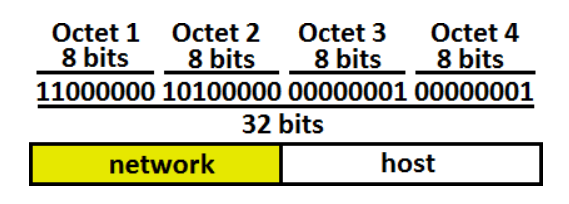
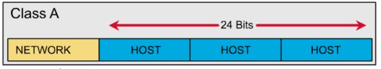
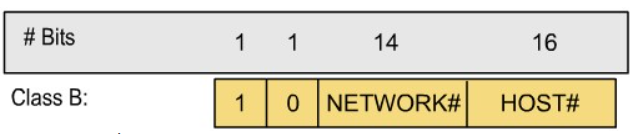
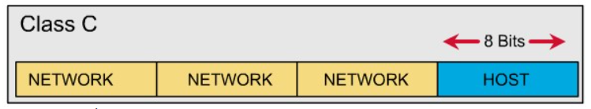

# 1. Tổng quan về IPv4
IPv4 (Internet Protocol version 4) là phiên bản thứ tư trong quá trình phát triển của các giao thức Internet. IP – Internet Protocol, là một giao thức của chồng giao thức TCP/IP thuộc về lớp Internet, tương ứng với tầng thứ ba (Network Layer) của mô hình OSI. Ngày nay, IP gần như là giao thức mạng thống trị, được sử dụng rộng rãi trong mọi hệ thống mạng trên phạm vi toàn thế giới.
## 1.1. Chức năng

Dùng định danh máy tính và tính toán trong các giao thức định tuyến (OSPF, EIRP, RIP,...). IP biểu diễn theo Bit:  1 hoặc 0.

1 Byte= 8 Bit

1 Octet= 8 Bit gồm các số nhị phân

## 1.2 Cấu trúc Ipv4

Địa chỉ IP gồm 32 bit nhị phân, chia thành 4 cụm 8 bit (gọi là các octet). Các octet được biểu diễn dưới dạng thập phân và được ngăn cách nhau bằng các dấu chấm.

Sẽ có 2 mũ 32 địa chỉ IP được sinh ra

Địa chỉ IP được chia thành hai phần: phần mạng (network) và phần host.

Việc đặt địa chỉ Ip phải tuân thủ theo các quy tắc sau:

- Các Bit phần mạng không được phép đồng thời bằng 0

Ví dụ: Địa chỉ 0.0.0.1 với phần mạng là 0.0.0 và phần host là 1 không hợp lệ

- Nếu các bit phần host đồng thời bằng không, ta có một địa chỉ mạng.

Ví dụ: Địa chỉ 192.168.1.1 là một địa chỉ có thể gán cho host nhưng địa chỉ 192.168.1.0 là một địa chỉ mạng, không thể gán cho host được

### 1.2.1. Các Lớp địa chỉ IP
#### 1.2.1.1. Lớp A

Địa chỉ lớp A có dạng 0xxxxxxx.host.host.host

Địa chỉ lớp A sử dụng 1 Octet đầu làm phần mạng, Ba Octet sau làm phần host

=> Các địa chỉ mạng của lớp A sẽ là 1.0.0.0 đến 127.0.0.0

Lưu ý: Mạng 127.0.0.0 được sử dụng làm loopback và địa chỉ 127.0.0.1 được làm loopback.

#### 1.2.1.2. Lớp B

Địa chỉ lớp B có dạng 10xxxxxx.network.host.host

Địa chỉ lớp B sử dụng 2 Octet đàu làm phần mạng và 2 Octest sau làm phần host

=> Các địa chỉ mạng của lớp B sẽ là 128.0.0.0 đến 191.255.0.0

Có tất cả 2 mũ 14 (16 bit của 2 octet trừ đi 2 bit 10 ở đầu) địa chỉ mạng trong lớp B

Phần host: 16 bit sau. Một mạng lớp B có 2^16 - 2 host

#### 1.2.1.3. Lớp C

Địa chỉ lớp C có dạng 110xxxxx.network.network.host

Địa chỉ lớp C sử dụng 3 Octet đầu làm phần mạng và 1 Octet cuối làm host.

Có tất cả 2^21 (24 bit của 3 octet đầu từ đi 3 bit đầu tiên là 110) địa chỉ mạng trong lớp C

Phần host 8 bit cuối, một lớp mạng C có 2^8 -2 host.

#### 1.2.1.4. Lớp D

Địa chỉ từ 224.0.0.0 đến 239.255.255.255 được dùng làm địa chỉ multicast

#### 1.2.1.5. Lớp E

Từ 240.0.0.0 trờ đi và được dùng cho mục đích dự phòng.

**Lưu ý**:

- Các lớp địa chỉ Ip có thể sử dụng để đặt cho các host là các lớp A,B,C.
- Để thuận tiện cho việc nhận diện 1 địa chỉ IP thuộc lớp nào, có network và host ra sao thì ta chỉ cần quan sát octet đầu của địa chỉ có giá trị bao nhiêu:

1-126 : địa chỉ lớp A

127-191: Địa chỉ lớp B

192-223: Địa chỉ lớp C

224-239: Địa chỉ lớp D

240-255: Địa chỉ lớp E

## 1.3. Phân Loại

## 1.4 Cách chia địa chỉ IPv4
# 2. Tổng quan về IPv6
## 2.1. Chức năng 
## 2.2. Cấu trúc IPv6