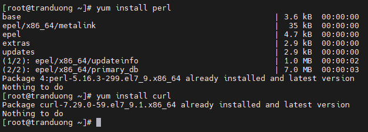
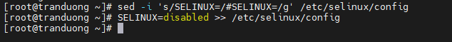
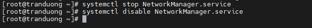
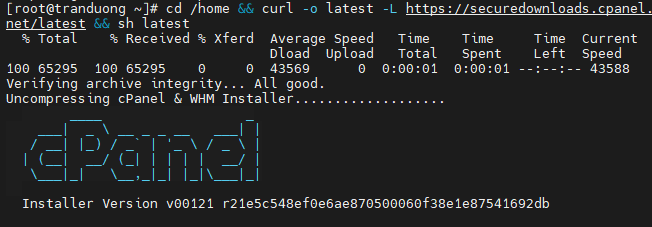
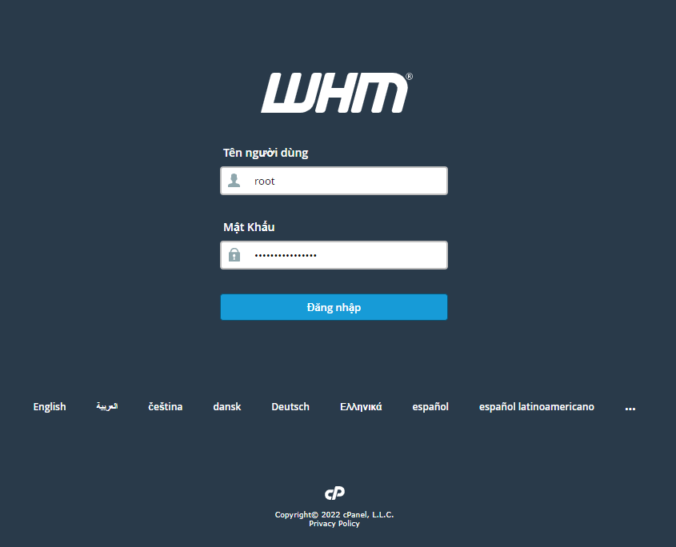
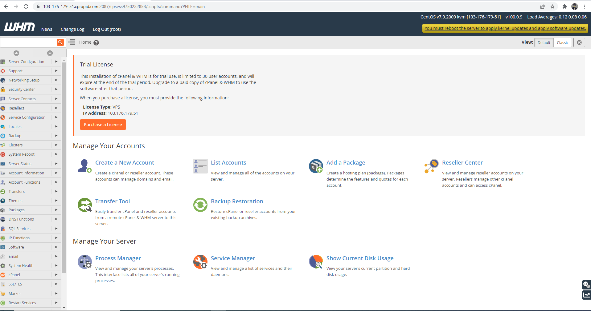
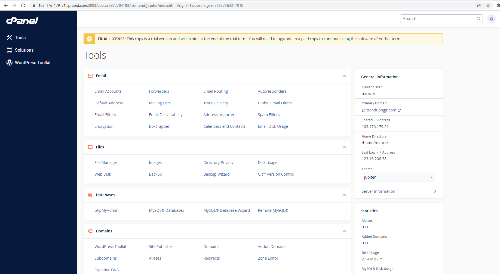

# Giới thiệu về Cpanel

Cpanel là trình quản lý file được xây dựng dựa trên hệ điều hành Linux dùng để lưu trữ dữ liệu nhanh chóng, đơn giản và hiệu quả.

Cpanel cung cấp nhiều tính năng hữu ích cho người quản trị website, hỗ trợ nhiều cho công việc quản lý dữ liệu hiệu quả. Tùy vào từng nhà cung cấp khác nhau sẽ quyết định đến số lượng và chất lượng các tính năng đó. Tuy vậy, Cpanel cơ bản sẽ có những tính năng:

- **Mở và cài đặt ứng dụng dễ dàng**

Sử dụng Cpanel giúp cài đặt nhiều ứng dụng hữu ích theo mong muốn của mình như Wordpress,...

- **Quản lý domain thuận tiện**

Người quản lý có thể sử dụng và quản lý domain thuận tiện, dễ dàng với các thao tác như thêm, xóa, tạo subdomain, chuyển hướng,...

- **Quản lý file**

Bên cạnh domain thì nó còn giúp quản lý các tệp tin, có thể sửa, đổi tên, nén, giải nén,... theo ý muốn, tạo tài khoản FTP,...

- **Quản lý email**

Cho phép thực hiện tất cả cac tác vụ trên mail giúp quản lý mail nhanh chóng, dễ dàng. Chúng ta có thể tạo mới, quản lý, thay đổi mật khẩu, cài đặt trình trả lời tự động, xóa hoặc gửi,... theo yêu cầu.

- **Bảo mật**

Cpanel có hệ thống bảo mật vượt trội được tích hợp tính năng tự động hóa, bảo mật thông tin vượt trội có với những hệ thống quản trị khác. Đây là một trong những tính năng được người dùng hài lòng nhất.

# Cài đặt Cpanel

1. Cài đặt Perl - Curl

```
yum install perl

yum install curl
```



2. Tắt SeLinux

```
sed -i 's/SELINUX=/#SELINUX=/g' /etc/selinux/config

SELINUX=disabled >> /etc/selinux/config
```



3. Tắt Network Manager

```
systemctl stop NetworkManager.service

systemctl disable NetworkManager.service
```



4. Update

```
yum update
```

**5. Cài đặt Cpanel**

```
cd /home && curl -o latest -L https://securedownloads.cpanel.net/latest && sh latest
```



Sau khi cài đặt xong ta tiến hành truy cập vào trang quản trị Cpanel với port :2087 đăng nhập với tài khoản mật khẩu root của VPS.



Tiếp đến tiến hành đăng nhập với tài khoản đăng kí dùng thử Cpanel (15 ngày- đăng ký tại Cpanel.net) kích hoạt trong email đăng ký và dùng email đó để đăng nhập.

Sau khi hoàn tất, giao diện của WHM của Cpanel hiện lên:



Giao diện chính của Cpanel dành cho các account được truy cập tại cổng :2083




