# Các chức năng trên WHM (Web Host Manager)

WHM được truy cập ở port 2087

Các chức năng chính của WHM:

1. Server Configuration: Cấu hình liên quan tới Server

- Quản lý cài đặt Web
- Thay đổi Password Root
- Configure CPanel Analytics
- Cấu hình các Cron jobs Cpanel
- Initial Quota Setup
- Link Server Nodes
- Quản lý Profile Server
- Thông tin thời gian trên Server
- Thống kê cấu hình các phần mềm
- Cửa sổ Terminal
- Chỉnh sửa các cài đặt
- Cập nhật các tiện ích
- WHM Marketplace

2. Support: Khởi tạo các Ticket và hộ trợ kiểm soát truy cập Cpanel

3. Networking Setup: Chỉnh sửa hostname và DNS

4. Security Center: Các bảo mật nâng cao

5. Server Contact: Thiết lập các cảnh báo từ Server tới mail quản trị

6. Reseller

- Thay đổi quyền sở hữu của một Account nào đó
- Thay đổi quyền sở hữu của nhóm Account nào đó
- Chỉnh sửa servername của reseller và các đặc quyền tương ứng
- Gửi cảnh báo tới các Reseller
- Quản lý ủy quyền các IP của Reseller
- Quản lý chia sẻ IP của Reseller
- Trung tâm quản lý Reseller
- Hiển thị các Reseller Account
- Xem trạng thái của các Reseller Account

7. Service Configuration: Cấu hình dịch vụ

8. Locales: Cấu hình thay đổi ngôn ngữ.

9. Backup: Backup hoặc Restore dữ liệu

10. Clusters

11. System Reboot: Khởi động lại hệ thống

12. Server Status: Xem trạng thái của hệ thống, các dịch đang chạy,...

13. Account Information: Thông tin các tài khoản

- Danh sách các tài khoản
- Danh sách các Domain
- Danh sách các Subdomain
- Danh sách các tài khoản đã bị tạm ngưng
- Hiển thị các tài khoản vượt quá giới hạn
- Xem băng thông sử dụng

14. Account Functions: Nơi thực thi các thiết lập với tài khoản

- Thay đổi địa chỉ của Site
- Tạo tài khoản mới
- Gửi cảnh báo tới tất cả các User
- Thay đổi password của Account
- Giới hạn băng thông sử dụng cho các Account
- Quản lý đình chỉ các Account
- Quản lý chế độ demo cho Account
- Sửa đổi mật khẩu
- Sửa đổi giới hạn Account
Và các tính năng khác như Reset băng thông, xóa Account, giải phóng băng thông,...

15. Tranfers: Truyền dữ liệu

- Chuyển dữ liệu từ Addon Domain tới Account
- Xem lại quá trình chuyển và khôi phục dữ liệu
- Chuyển và khôi phục một Account Cpanel
- Tranfer tool

16. Themes: Thay đổi giao diện của WHM

17. Packages: Quản lý các Package

- Tạo Packages
- Xóa Packages
- Chỉnh sửa Packages
- Feature Manager

18. DNS Function: Các tính năng quản lý DNS

- Thêm 1 DNS Zone
- Xóa 1 DNS Zone
- Quản lý các DNS Zone
- Chỉnh sửa Zone Templates
- Chỉnh sửa cấu hình các bản ghi mail
- Chỉnh sửa Nameserver

19. SQL Services: Quản lý dịch vụ SQL

Quản lý các Database, Username, Password, phpmyadmin, các tiến trình MySQL,...

20. IP Functions: Các tính năng liên quan tới quản lý các IP

21. Software

- EasyApache
- Cài đặt các Modules 
- Quản lý MultiPHP
- Quản lý Nginx
- Cập nhật hệ thống
- Cập nhật các phần mềm

22. Email: Quản lý các cấu hình liên quan tới Mail

23. System Health: Quản lý các tiến trình, trạng thái của hệ thống

24. CPanel: Quản lý các cầu hình, log, các Plugin hay các cài đặt cho Cpanel

25. SSL/TLS: Quản lý SSL Certificate cho các domain 

26. Market

27. Restart Services: Khởi động lại các dịch vụ của hệ thống như DNS Server, HTTP Server (Apache), IMAP,...

28. Development: Các tính năng dành cho nhà phát triển

29. Plugins

## Tạo Package

Tại giao diện WHM ta vào tùy chọn Add a Package

Sau đó điền các thông tin tùy ý cho Package và Add

Các tùy chọn đối với Package như thêm, xóa, sửa các package:

## Tạo Account

Để tạo Account ta có thể vào Account Functions => Create a New Account hoặc tại giao diện chính cũng có tùy chọn Create a New Account

Sau đó điền các thông tin để tạo account và các thiết lập đối với account sau đó nhấn Create để tạo:

Thông báo trả về tạo tài khoản thành công, ta có thể truy cập vào cpanel của account này hoặc truy cập theo port 2083 và đăng nhập với thông tin đã tạo trước đó để truy cập vào trang quản trị host của account

Để xem danh sách các Account hoặc chỉnh sửa thông tin, xóa account ta vào trong tùy chọn Account Information => List Account và thực thi các tùy chọn tương ứng. Tương tự cũng có các tùy chọn đối với các Subdomains, Suspended Account (các tài khoản đã bị tạm ngưng),...

## Cài đặt WordPress

WordPress Toolkit là tool hỗ trợ cài WordPress tự động, trên WHM vào tùy chọn Plugins => WordPress Toolkit sau đó click vào Install

Điền các thông tin khởi tạo WordPress như đường dẫn website, tiêu đề website, giao diện, ngôn ngữ, phiên bản, thông tin về tài khoản quản trị, database. Sau đó click vào Install để cài đặt.

Kết quả sau khi cài đặt

Có thể truy cập vào trang quản trị WordPress theo domain/wp-admin

## Cài đặt SSL

Trên WHM vào tùy chọn SSL/TLS => Install an SSL Certificate on a Domain và tiến hành thêm add chứng chỉ

Sau khi cài đặt thành công sẽ có thông báo trả về

# Các chức năng trên Cpanel

Truy cập bằng port 2083

Gồm quản trị về Email, tệp, cơ sở dữ liệu, miền, bảo mật, Phần mềm, nâng cao, tùy chọn

## Email

Gồm các chức năng như tạo tài khoản email. Chúng ta vào tùy chọn Tài khoản Email

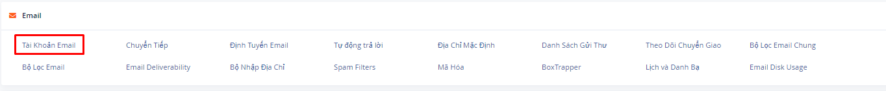

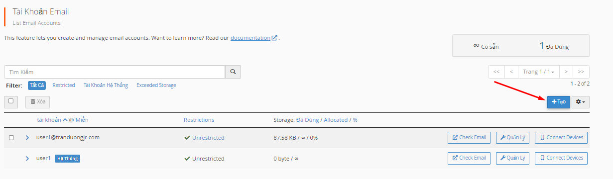

Điền thông tin để tạo tài khoản và click vào Tạo

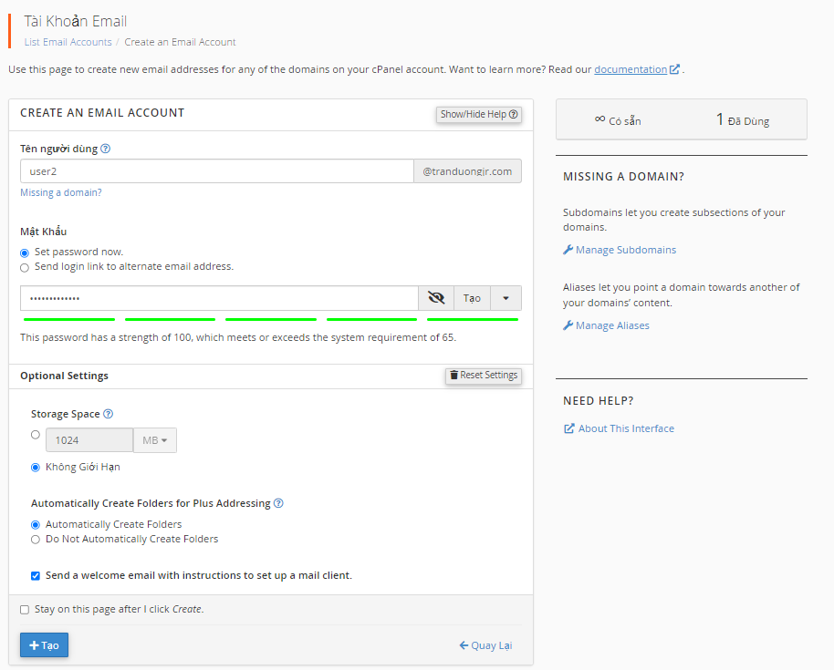

Thông tin các mail đã tạo cũng được quản lý tại đây

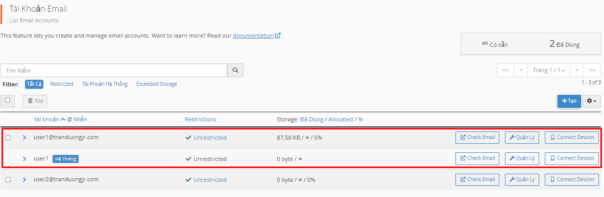

Tại đây ta có thể các tùy chọn về check mail, quản lý cấu hình của email, hoặc các thiết bị kết nối với tài khoản mail (connect devices)

Ta có thể vào webmail bằng tùy chọn check mail. Tại đây có các tùy chọn, tính năng đối với email đó:

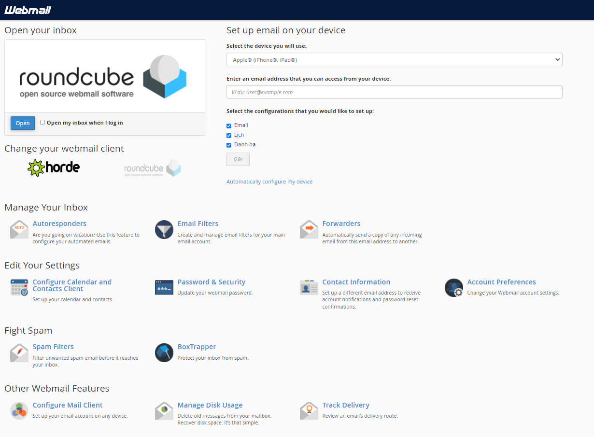

- Autoresponders: Thiết lập thư trả lời tự động
- Email Filters: Quản lý bộ lọc mail
- Forwarders: Thiết lập chuyển tiếp thư
- Configure Calender and contacts Client: Thiết lập lịch và danh bạ
- Password & Security: Thiết lập mật khẩu cho mail
- Contact Information: Thiết lập liên hệ cảnh báo cho mail
- Account Preferences: Tùy chọn tài khoản
- Spam Filters: Bộ lọc thư rác
- BoxTrapper: Bảo vệ hộp thư đến khỏi các tin nhắn spam
- Configure Mail Client: Thiết lập tài khoản email trên các thiết bị 
- Manage Disk usage Quản lý lưu lượng sử dụng của mail
- Track delivery: Theo dõi quá trình di chuyển của mail

Ngoài ra ta có thể truy cập vào roundcube để thực hiện các thao tác gửi nhận thư: 

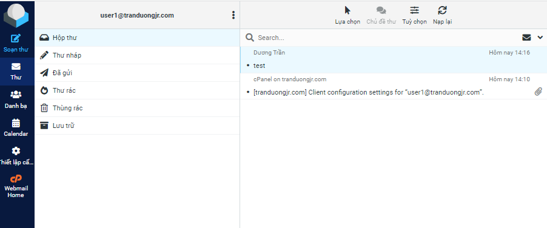

Các chức năng trong quản lý tài khoản Email của CPanel như:

**- Chuyển tiếp thư:**: Ta có thể chuyển tiếp theo mail hoặc theo miền

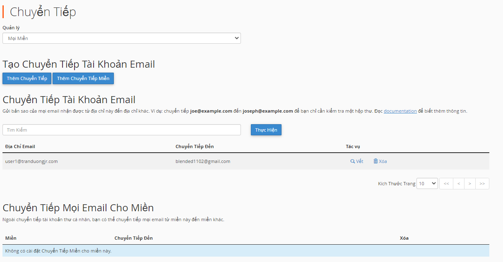

**- Định tuyến Mail**

**- Tự động trả lời**: Thiết lập trả lời tự động cho 1 tài khoản Email nào đó

**- Địa chỉ mặc định**

**- Danh sách Gửi Thư**: Tạo danh sách gửi thư

**- Theo dõi chuyển giao**: Hiển thị lịch sử gửi và nhận thư và kết quả

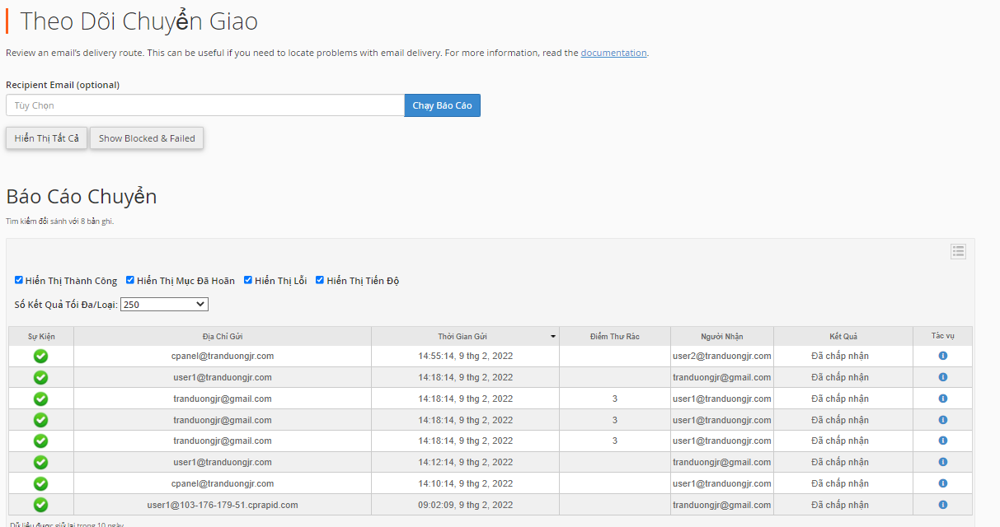

**- Bộ lọc email chung**: Thiết lập bộ lọc email chung cho các tài khoản email

**- Bộ lọc email**: Quản lý bộ lọc cho từng tài khoản email

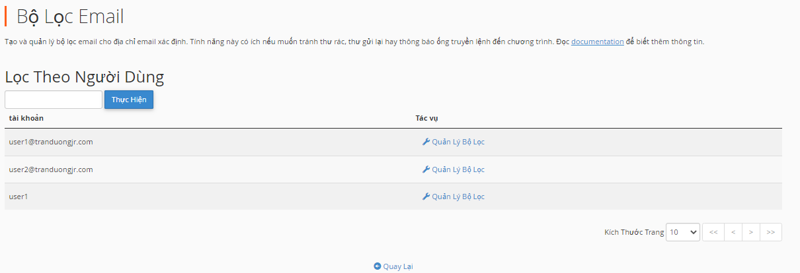

**- email - deliverability**: Cấu hình liên quan tới khả năng gửi thư, các bản ghi SPF,DKIM

**- Bộ nhập địa chỉ**

**- Spam Filters**: Bộ lọc thư rác

**- Mã hóa**: Mã hóa thư

**- BoxTrapper**: Bảo vệ hộp thư đến khỏi thư rác bằng cách yêu cầu người gửi email không nằm trong Danh Sách Trắng trả lời email xác minh trước khi bạn nhận thư của họ.

**- Lịch và danh bạ**

**- Email Disk Usage**

## Tệp

**- Quản lý tệp**

**- Hình ảnh**

**- Bảo mật thư mục**: Thiết lập bảo mật cho các thư mục tùy nhu cầu

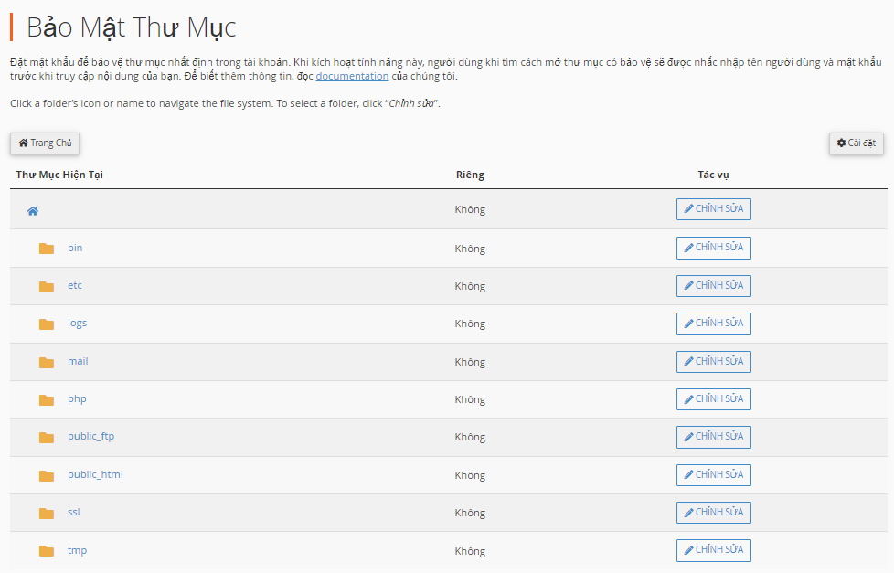

**- Mức dùng ổ đĩa**: Hiển thị dung lượng các thư mục

**- Đĩa Web**

**- Sao lưu**

Có thể full backup hoặc backup từng phần như backup thư mục, cơ sở dữ liệu, mail,..

Sau khi hoàn tất quá trình backup sẽ có thông báo được gửi tới email

**- Trình hướng dẫn sao lưu**: Sao lưu hoặc khôi phục dữ liệu

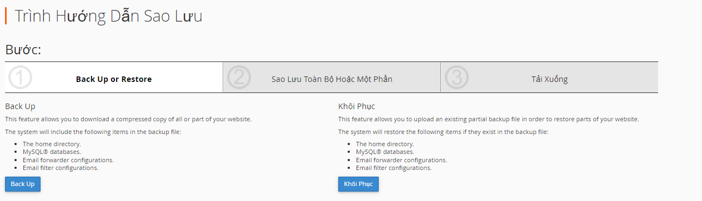

## Cơ sở dữ liệu

Gồm các trình quản lý cơ sở dữ liệu, tạo sửa xóa các database

## Miền

**- WordPress Toolkit**: Quản lý cài đặt WordPress

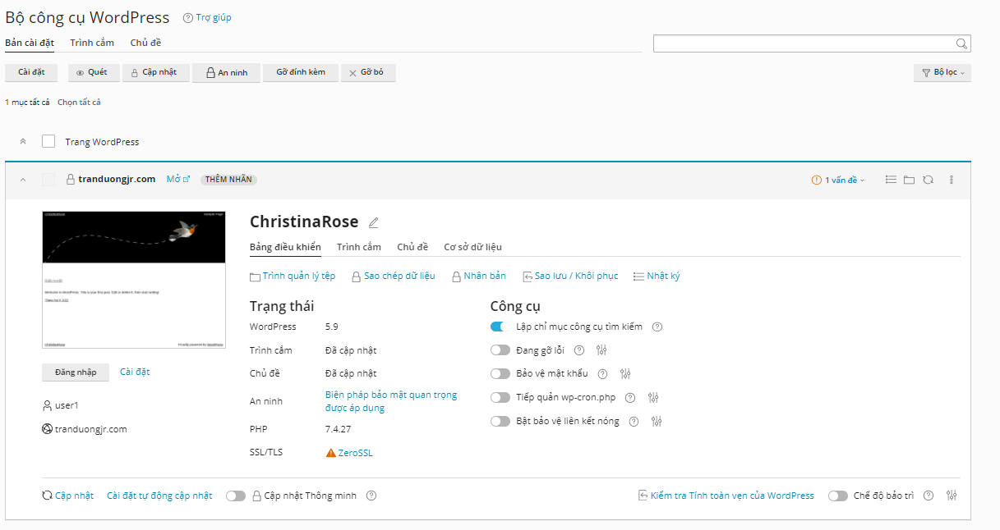

**- Site Publisher**: Sử dụng giao diện này để tạo nhanh một trang web từ tập hợp các mẫu có sẵn.

**- Miền**: Quản lý miền

**- Miền khác**: Tạo miền khác

**- Miền con**: Tạo các subdomain

**- Bí danh**: Tạo CName

**- Chuyển hướng**: Chuyển hướng Website tới địa chỉ URL tùy ý

**- Zone Editor**: Quản lý, cấu hình các bản ghi DNS

**- Dynamic DNS**

## Sơ đồ

Nơi quản lý các sơ đồ lỗi, băng thông, truy cập thô, awstarts, thống kê Analog, Webalizer

## Bảo mật

**- Truy cập SSH**: Cho phép truyền tệp bảo mật và thông tin đăng nhập từ xa qua internet. Ở tùy chọn này có quản lý khóa SSH (Tạo hoặc nhập khóa SSH)

**- SSL/TLS**
**Cài đặt SSL**

Để cài đặt chứng chỉ SSL cho Site thì cần có các file chứng chỉ được cung cấp bởi tổ chức CA tin cậy.

Tham khảo cách lấy chứng chỉ SSL tại: https://github.com/tranduongjr/baocaothuctap/blob/main/SSL/SSL%20tr%E1%BA%A3%20ph%C3%AD.md

Để cài đặt SSL từ CPanel ta vào tùy chọn Bảo mật(Security) => SSL/TLS

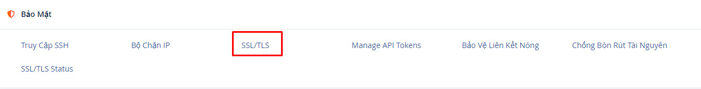

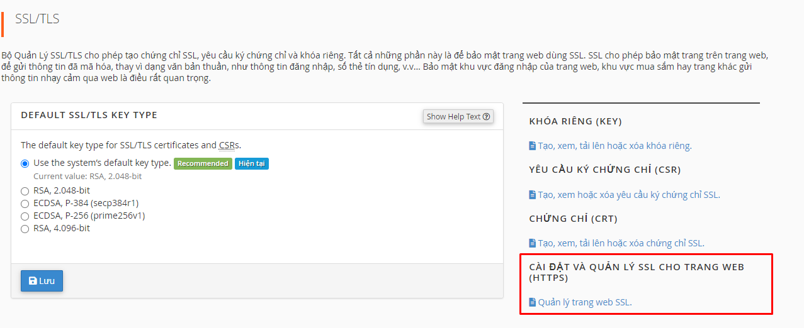

Tiến hành add các chứng chỉ tương ứng và click vào cài đặt chứng chỉ

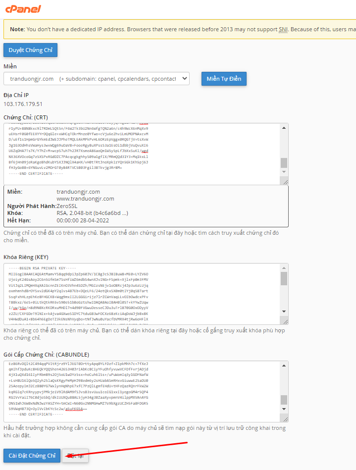

Sau khi cài đặt thành công sẽ có thông báo trả về

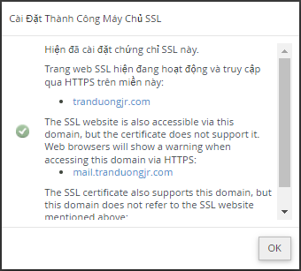

Để sửa hoặc xóa chứng chỉ ta và tùy chọn như sau:

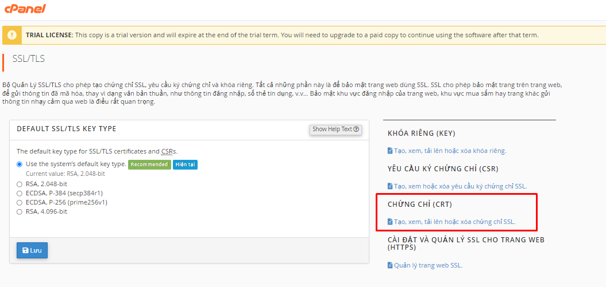
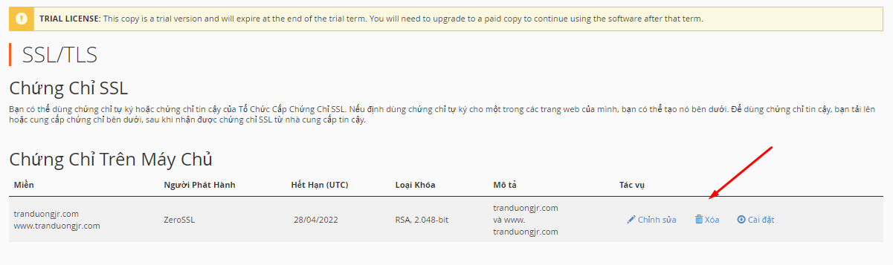

Ta có thể xem trạng thái của SSL/TLS tại tùy chọn SSL/TLS Status

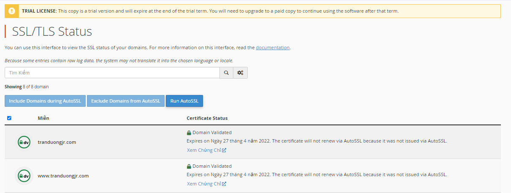

## Phần mềm

**Đổi version PHP**

Tại tùy chọn phần mềm (Software) => MultiPHP Manager

## Nâng cao

Tại đây có thể tạo các Cron Jobs, theo dõi DNS, quản lý cấu hình các trang lỗi,...

## Tùy chọn

**- Password & Security**: Thiết lập, thay đổi mật khẩu cho Account Cpanel

**- Đổi ngôn ngữ**: Thiết lập ngôn ngữ cho trang quản trị CPanel

**- Đổi kiểu**: Thiết lập kiểu giao diện cho Cpanel

**- Thông tin liên hệ**: Thiết lập liên hệ cảnh báo tới người quản trị

**- User Manager**: Quản lý các User của Account CPanel