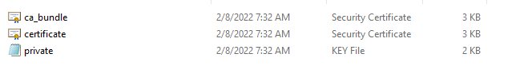
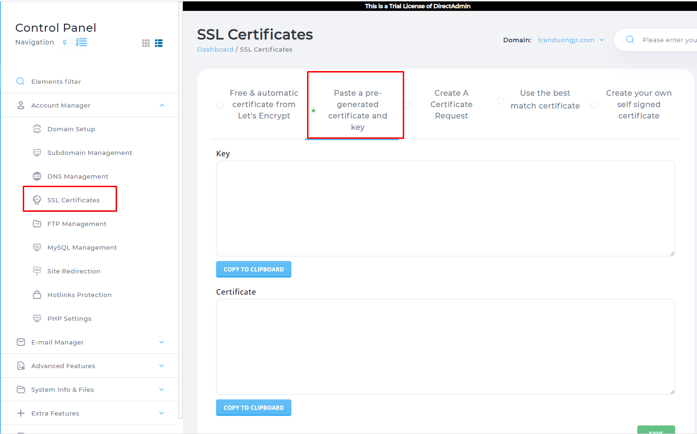
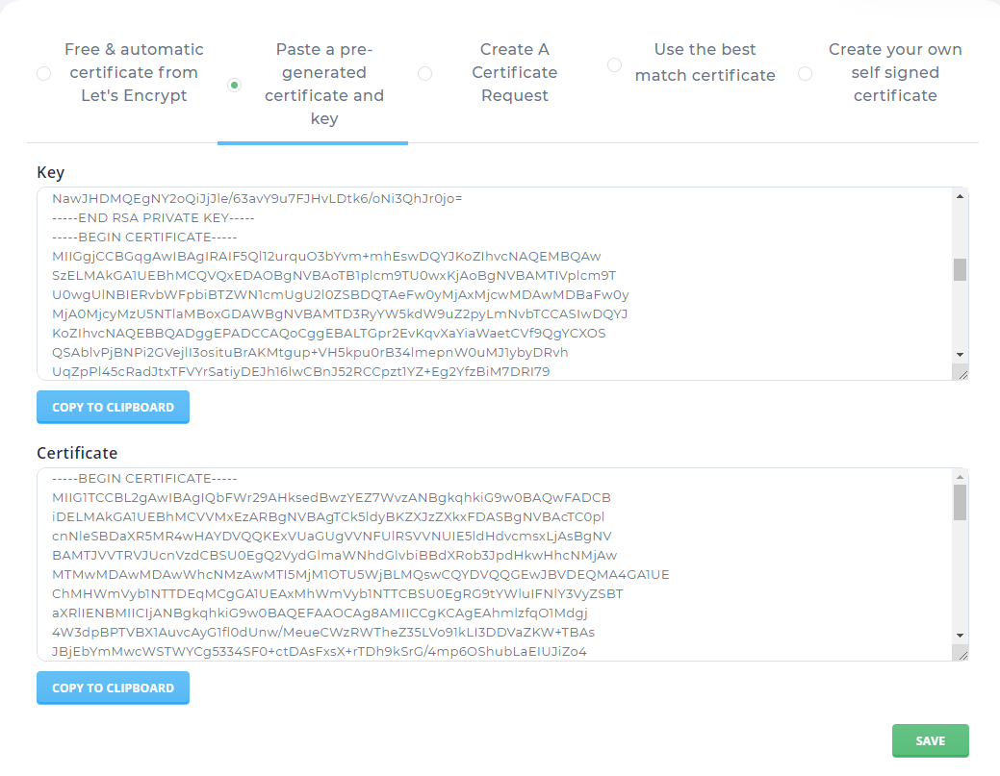
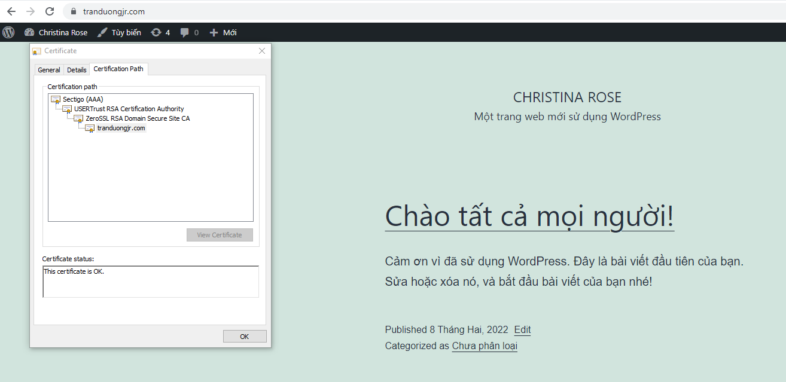

# Cài đặt SSL Certificates trên DA 
## Chuẩn bị
Cần chuẩn bị chứng chỉ SSL từ nhà cung cấp tin cậy

Tham khảo cách lấy chứng chỉ SSL tại: https://github.com/tranduongjr/baocaothuctap/blob/main/SSL/SSL%20tr%E1%BA%A3%20ph%C3%AD.md

## Tiến hành cài đặt SSL Certificates

Ta có 3 file thu được khi lấy chứng chỉ SSL:

Đăng nhập DirectAdmin với tài khoản User muốn cài SSL Certificates vào tùy chọn SSL Certificates => Paste a pre-generated certificate and key

Với mục Key ta sẽ copy từ file private.key và file certificate.crt. Tại file Certificates ta copy từ file ca_bundle.crt

Tích chọn vào Force SSL with https redirect để tự động chuyển hướng site sang https sau đó Save lại

Truy cập vào website để kiểm tra:

