# Hướng dẫn gán Domain, upload source Wordpress cho 1 user trên DirectAdmin.

## Tạo User và gán domain cho User

Đăng nhập DirectAdmin với tài khoản Admin và vào tùy chọn Account Manager sau đó click vào Create User Package và tạo một Package với thông số tùy ý:

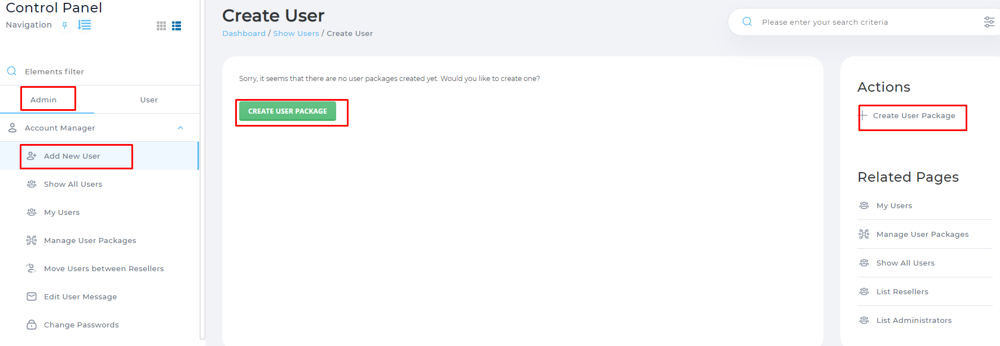

Sau đó đặt tên cho Package và Save lại

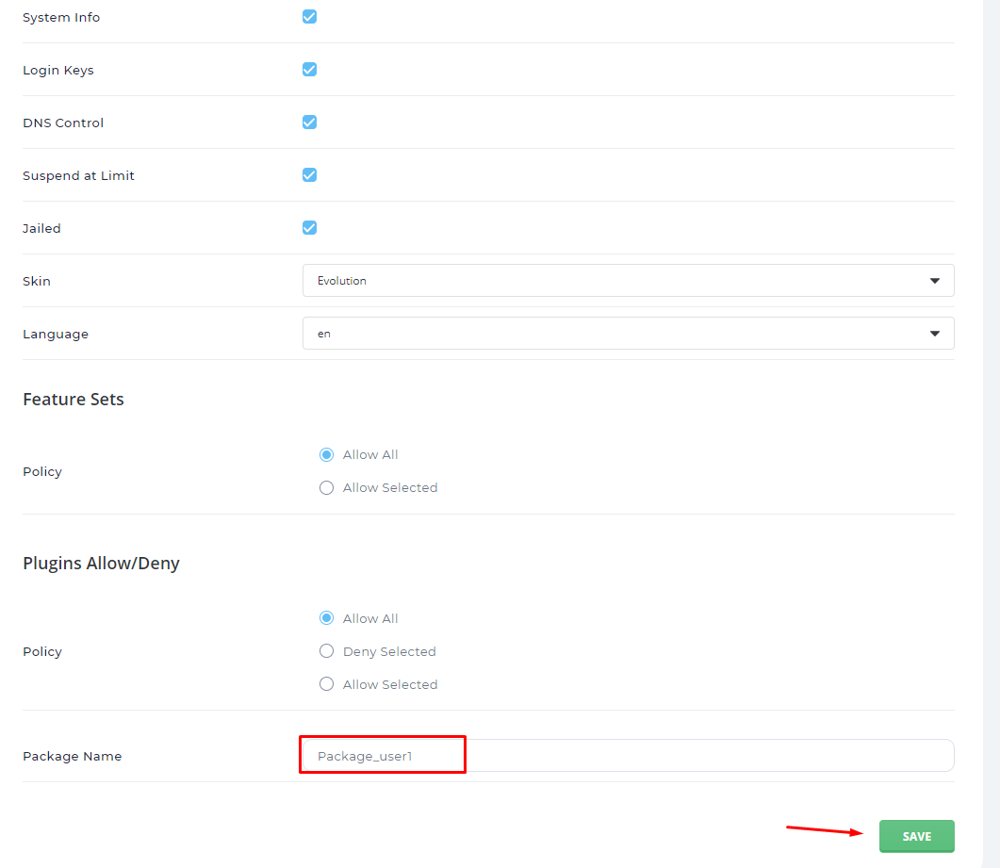

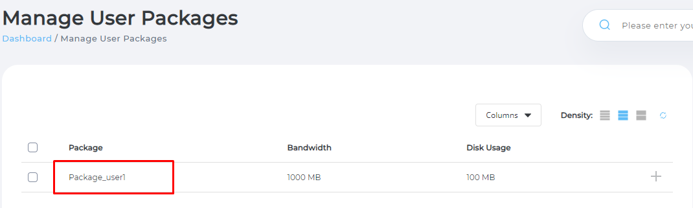

Tiếp đó vào vào tùy chon Add New User tiến hành tạo User mới:

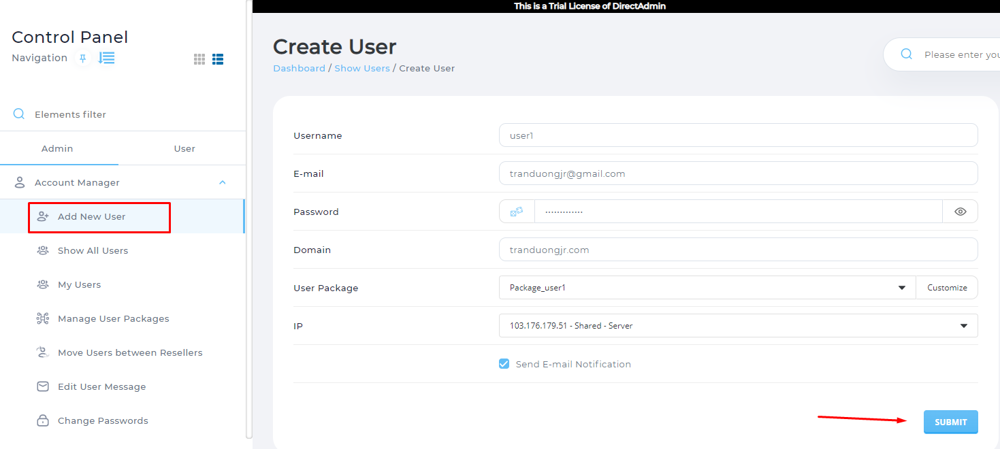

Lưu ý cần trỏ bản ghi domain về địa chỉ ip tương ứng. Sau đó nhấn vào Submit để xác nhận tạo user. Khi tạo xong sẽ có thông báo tạo thành công:

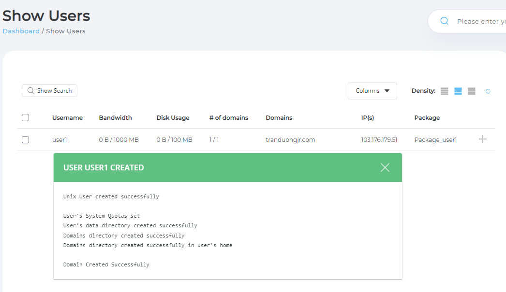

Như vậy ta đã tạo thành công user và gán domain cho user.

## Tạo database cho domain

Tiến hành login DirectAdmin với tài khoản user đã tạo. Vào tùy chọn MySQL Management click vào Create New Database

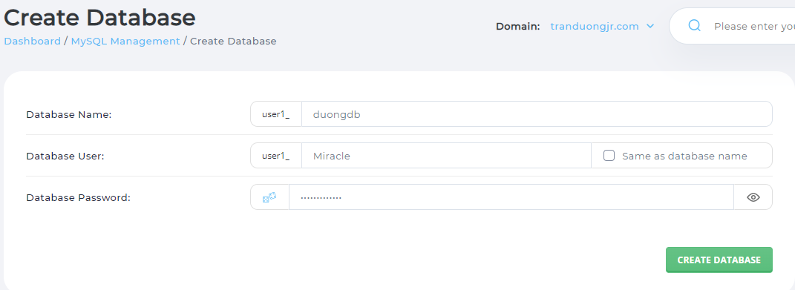

Khi tạo thành công sẽ có thông báo trả về:

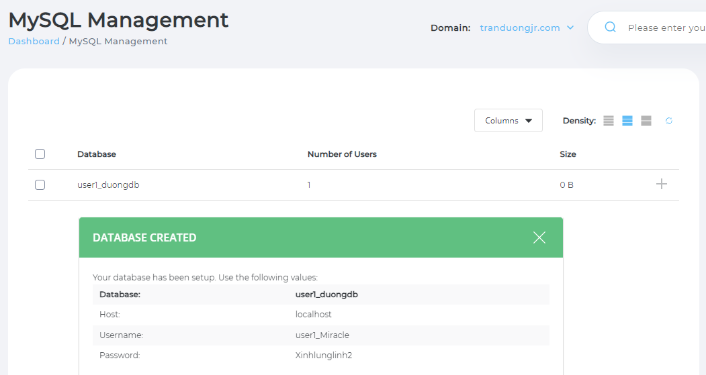

## Upload Source Wordpress

Đầu tiền ta cần tải file .taz.gz của Wordpress về máy tính tại link: https://vi.wordpress.org/download/

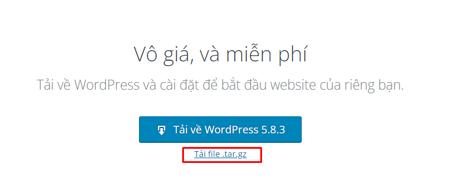

Trên DirectAdmin đang login với tài khoản user ta tiến hành vào tùy chọn System Info & File => File Manager để tiến hành upload Wordpress

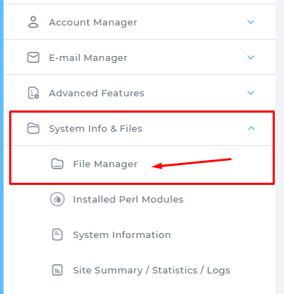

Vào thư mục domain cần upload và tiến hành upload vào trong file public_html và giải nén.

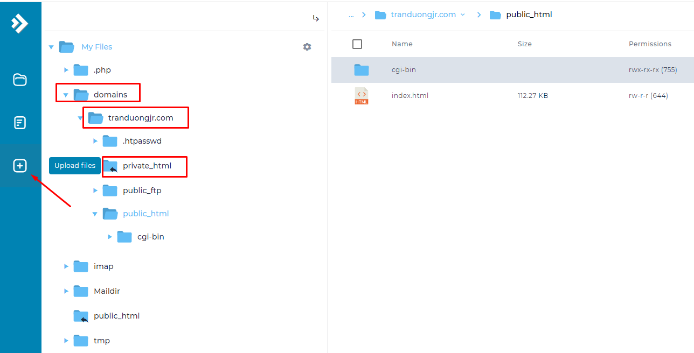
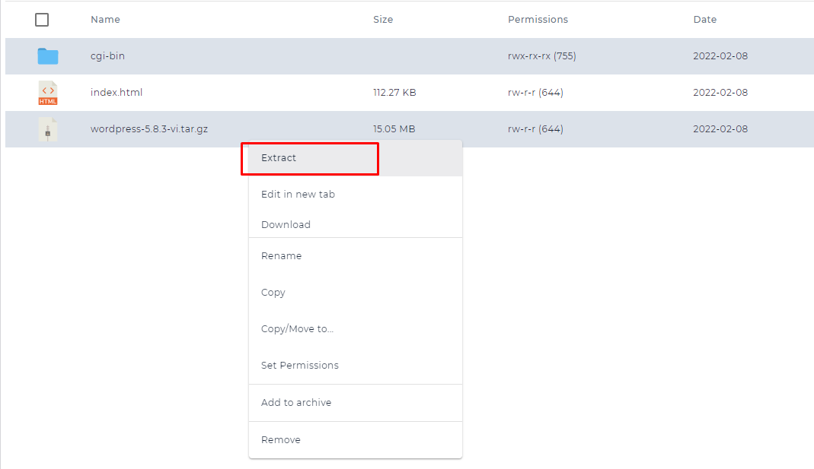

Đưa toàn bộ file con của Wordpress ra ngoài thư mục Public_html:

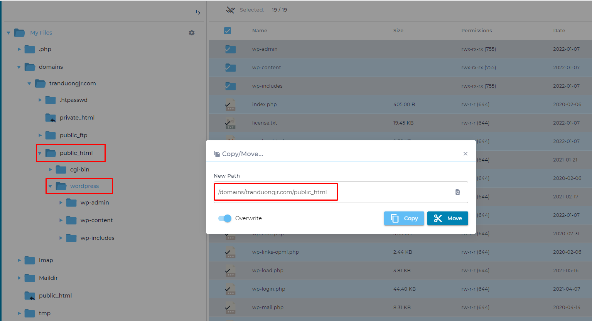

Trong file cấu hình của wordpress, đổi tên file wp-config-sample.php thành wp-config.php và chỉnh sửa cấu hình trong file đó tương ứng với các DB_name, DB_user, DB_password đã tạo trước đó.

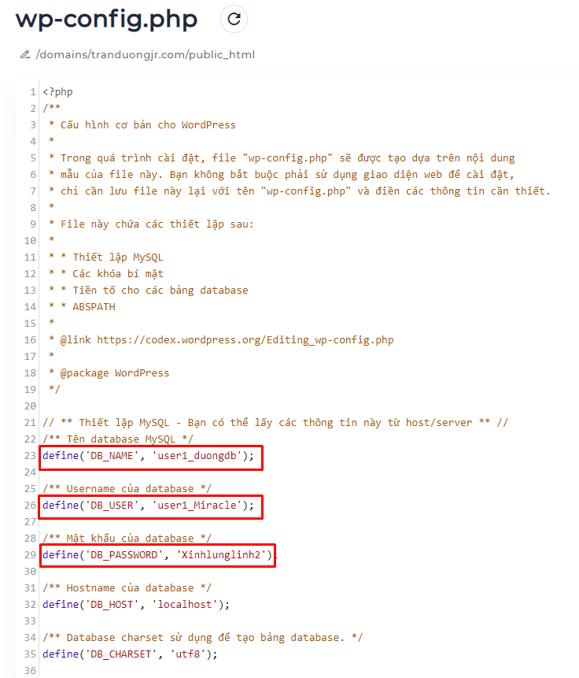

Xóa file cg-bin và index.html:

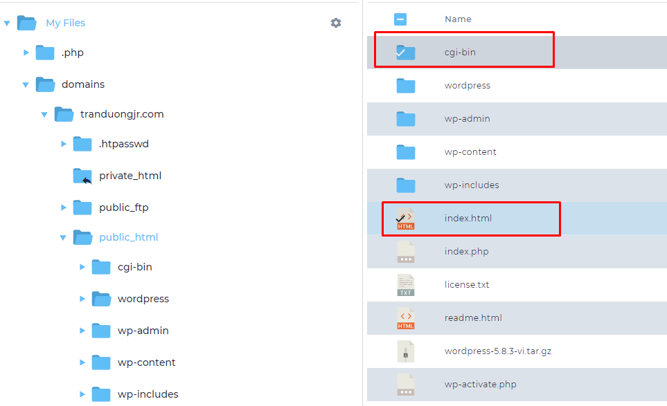

Tiến hành vào trang quản trị wordpress

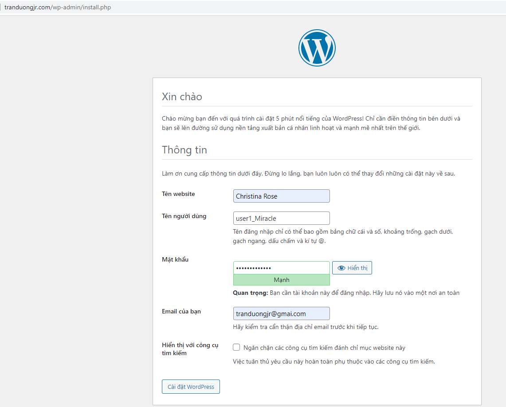

