# Cài đặt Mail Server Kerio

**Tải về Mail Kerio: SSH vào VPS với quyền root và nhập lệnh sau để tải Kerio về**

```
wget http://cdn.kerio.com/dwn/connect/connect-9.2.12-5000/kerio-connect-9.2.12-5000-linux-x86_64.rpm
```

**Cài đặt Mail Server Kerio**

```
yum install kerio-connect-9.2.12-5000-linux-x86_64.rpm -y
```

Truy cập mail bằng địa chỉ IP với port 4040 tiến hành cài đặt

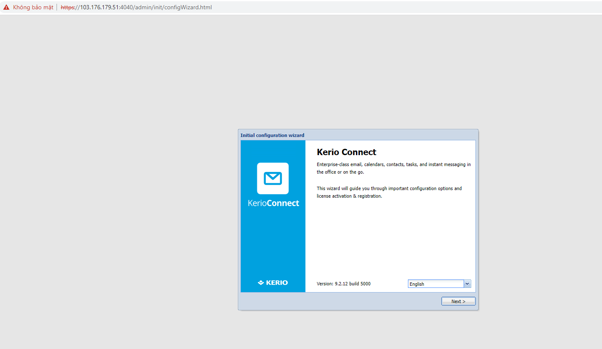
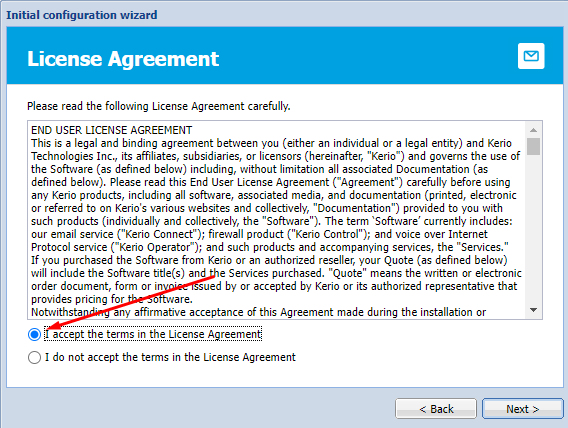

Thay đổi thông tin về tên miền và hostname của mail server kerio:

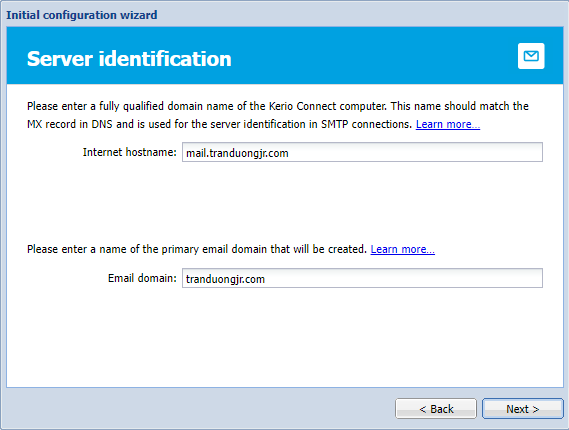
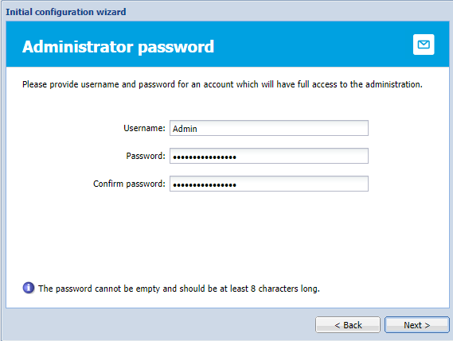


Chọn thư mục lưu trữ mail, dung lượng được khuyến nghị cho nơi lưu trữ là 20gb

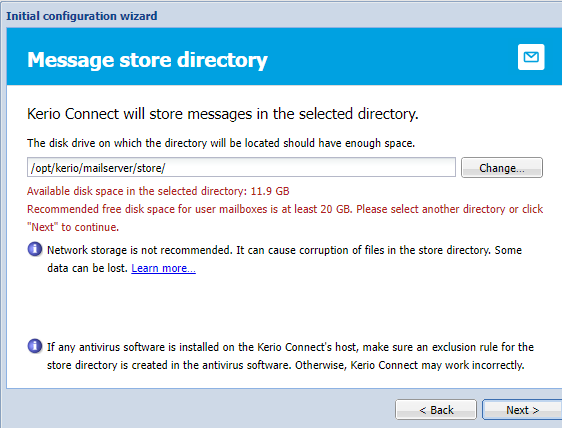

Nhập keu nếu bạn có mua license hoặc có thể sử dụng bản trial

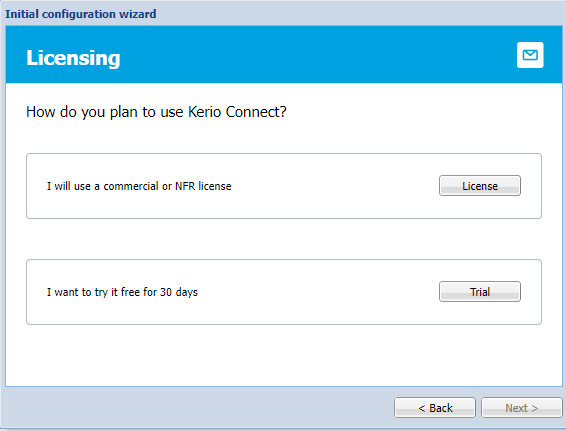

Nhập key

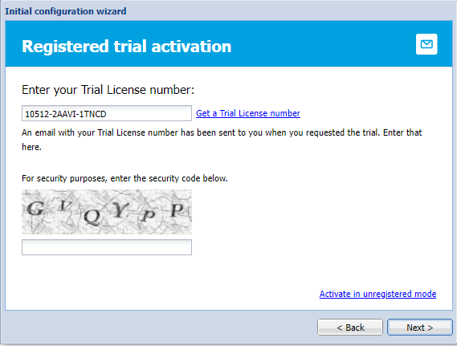

Để mặc định chọn next

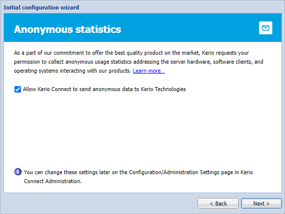

Kết thúc việc cài đặt

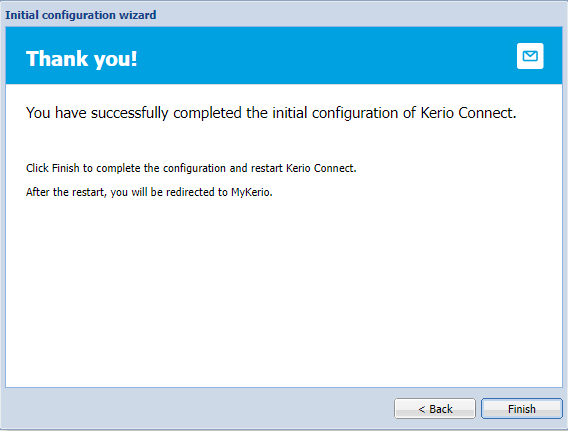

Truy cập trang quản trị với địa chỉ ip và port:4040

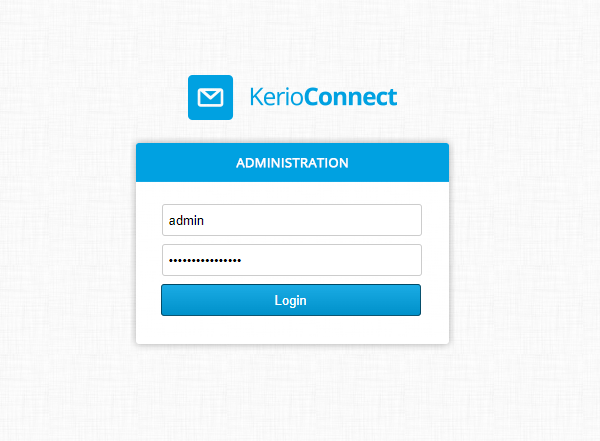

Sau khi đăng nhập thì giao diện trang quản trị Kerio hiện ra

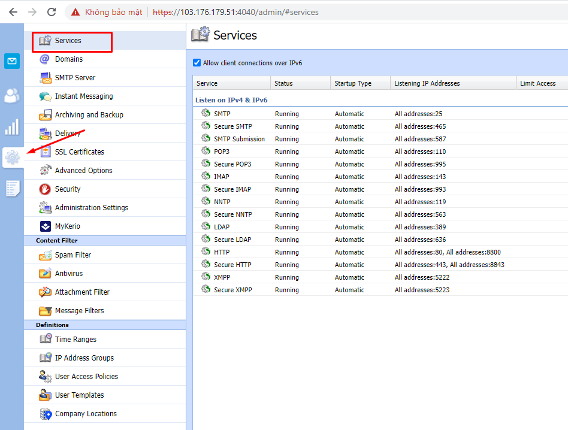

# Các thao tác với Kerio

## Tùy chọn Account

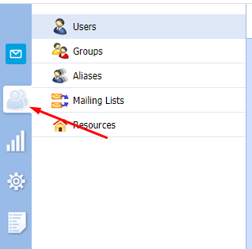

### Tạo User

Vào tùy chọn User và click chuột phải chọn add để thêm 1 user

Điền các thông tin tương ứng để tạo tài khoản mail

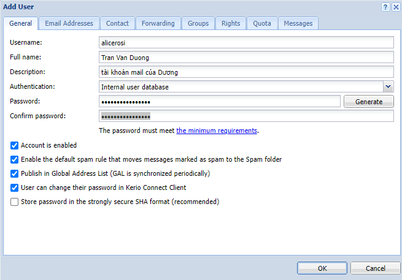

- Tùy chọn email address để hiện thị địa chỉ mail của User này.

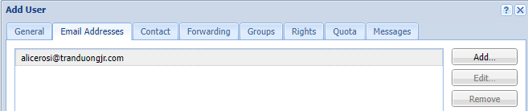

- Contact để tạo danh bạ, liên lạc khác
- Forwarding để tạo mail chuyển tiếp
- Group: thêm hoặc thoát khỏi group mail nào đó
- Rights: Thiết lập quyền cho User
- Quota: Thiết lập hạn ngạch cho User
- Messages: Thiết lập cấu hình cho Messages

Web mail truy cập theo vào mail.domain ví dụ mail.tranduongjr.com để truy cập vào web mail của người dùng

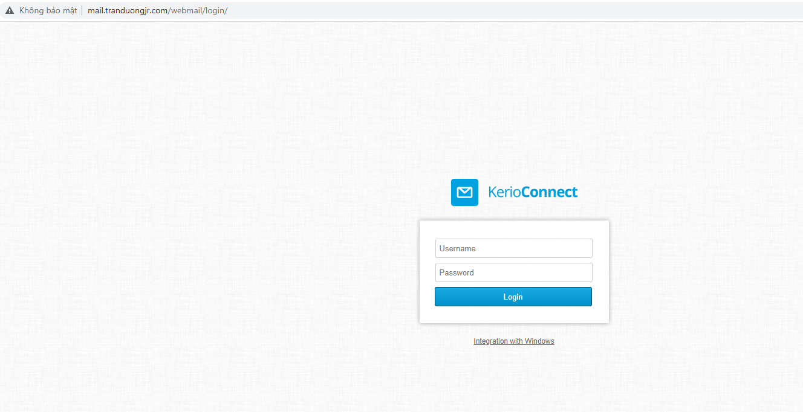

Giao diện web mail của người dùng

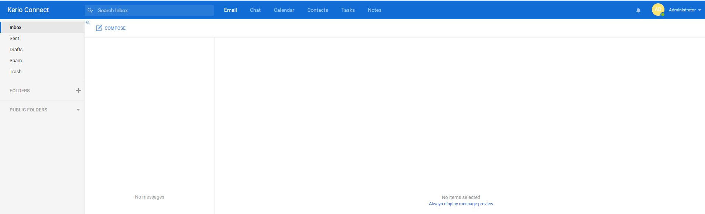

Các thiết lập của mail người dùng tại góc trên bên phải của giao diện:

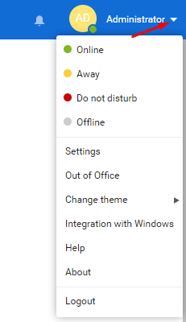

Ta có các thiết lập phổ biến như:

- Tạo chữ ký
- Ngôn ngữ, múi giờ
- Thông báo
- Xem Quota
- Thay đổi mật khẩu
- Thêm thiết bị đăng nhập

### Group

Thêm, sửa, xóa các Group và thiết lập cấu hình cho các Group

### Mailling list

Quản lý danh sách gửi thư

## Status

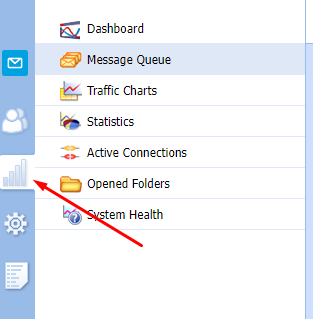

### Message Queue

Quản lý hàng đợi thư

### Trafic chart

Biểu đồ luồng gửi nhận mail

### Statistic

Thông số dữ liệu của Mail Server Kerio

### Active Connection

Quản lý các kết nối của các tài khoản.

### System Heath

Quản lý mức độ sử dụng RAM, CPU của Mail Server Kerio
## Tùy chọn Configuration (Hình bánh răng cưa)

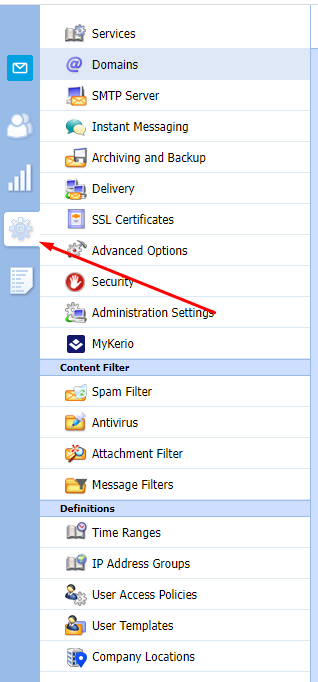

### Service

Hiển thị các dịch vụ và trạng thái dịch vụ của mail server


### Domain

Tại tùy chọn này có thể thêm hoặc sửa các domain

**- Thêm domain**

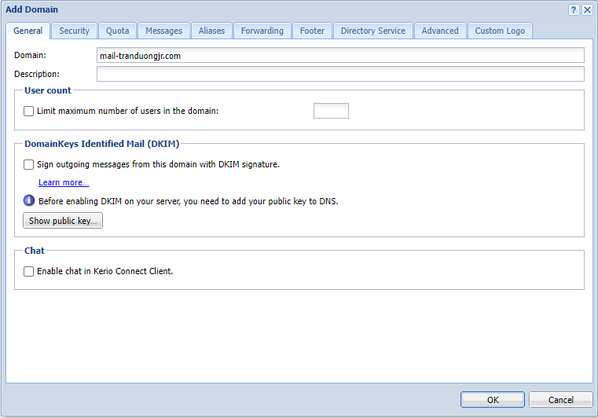

Khi thêm 1 domain ta có thể thiết lập các tùy chọn tương ứng cho domain đó như thiết lập DKIM

- Security: Thiết lập các chính sách với mật khẩu
- Quota: Thiết lập hạn ngạch cho domain
- Messages: Thiết lập chính sách đối với các message như giới hạn size của message, dọn dẹp các thư mục sau bao nhiêu ngày,...
- Forwarding: Chuyển tiếp Mail
- Footer: thiết lập các footer(chân trang) cho các message được gửi đi

#### Tạo bản ghi DKIM

Ta vào tùy chọn Edit miền đó

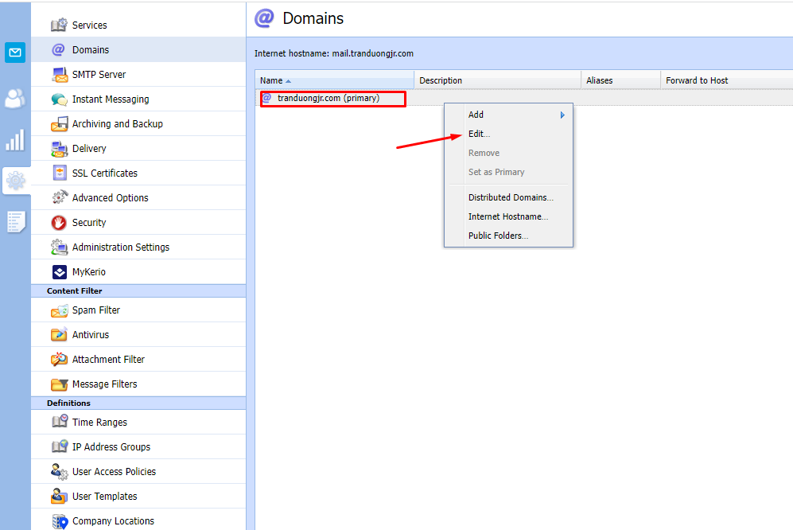

Tích vào Sign outgoing messages from this domain with DKIM signature

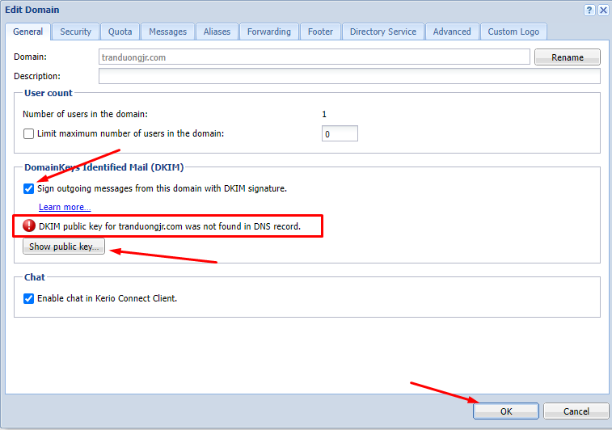

Một cảnh báo hiện ra là chúng ta cần cấu hình bản ghi DNS record trên trang quản trị tên miền. Ta vào show public key để lấy thông tin bản ghi DKIM

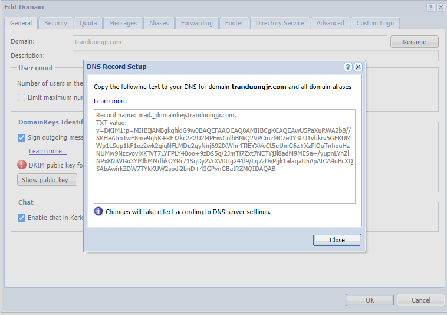

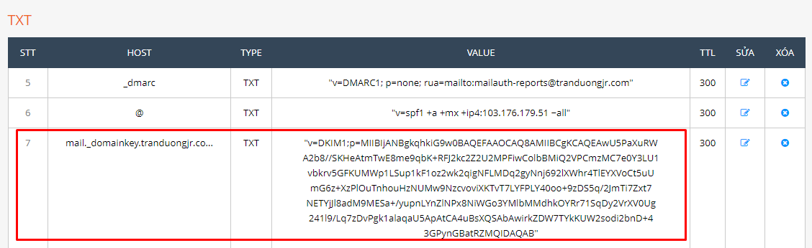

- Kiểm tra thư:

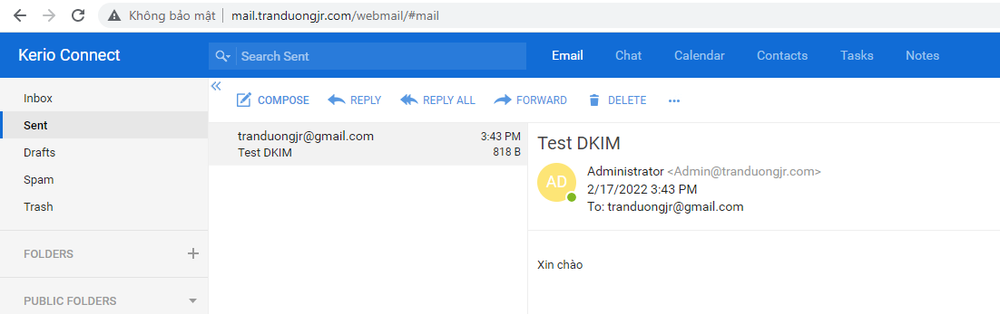
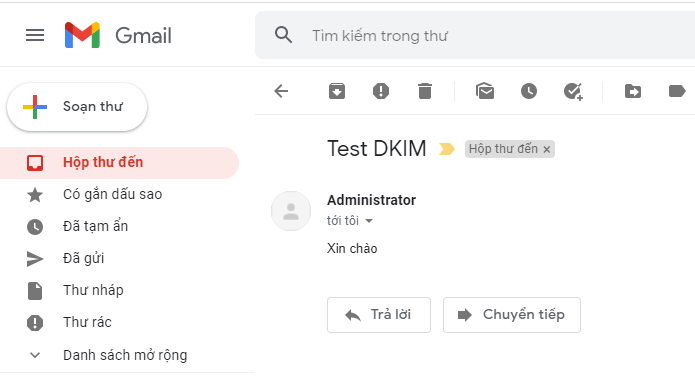
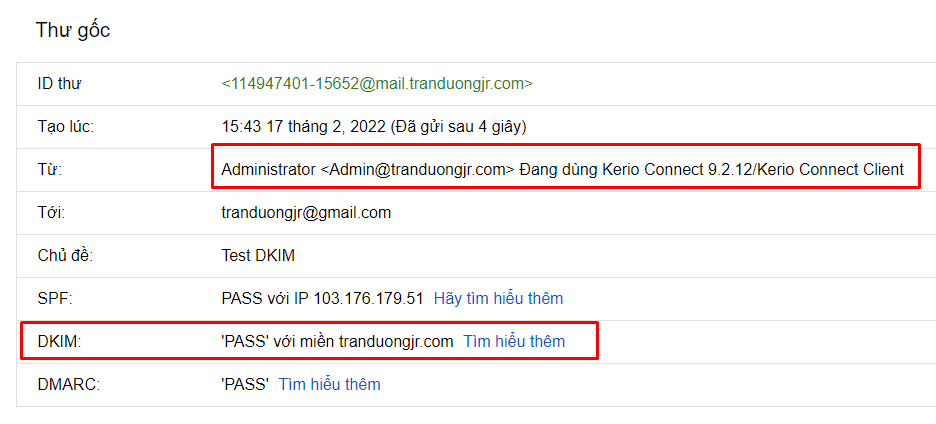

### SMTP Server

Quản lý máy chủ gửi thư

**Security Options**

- Maximun number of delivery threads: Số lượng tối đa tin nhắn được gửi cùng một lúc.

- Delivery retry interval: Khoảng thời gian Kerio Connect thử gửi lại các tin nhắn.

- Bounce the message to sender if not delivered in: Khoảng thời gian Kerio Connect gửi lại các tin nhắn chưa được gửi.

- Sent the sender a waring if the message is not delivery after: Khoảng thời gian mà người gửi được thông báo rằng thư của họ chưa được gửi.

### Archiving and Backup

Quản lý sao lưu và khôi phục dữ liệu


### SSL Certificate

Để bảo mật Kerio Connect sử dụng giao thức SSL/TLS, cần phải xác thực qua một chứng chỉ số SSL.

**Cài SSL Free Let's Encrypt**

Tải chứng chỉ

```
yum -y install git dialog libffi-devel mod_ssl openssl-devel python-devel python-pip python-tools python-virtualenv

git clone https://github.com/letsencrypt/letsencrypt
```

Cài Certbot

```
yum install -y certbot
```

Tắt kerio-connect

```
service kerio-connect stop
```

Cấp chứng chỉ tự động cho mail.tranduongjr.com

```
cerbot certonly --standalone -d mail.tranduongjr.com

ln -s /etc/letsencrypt/live/mail.tranduongjr.com/fullchain.pem /opt/kerio/mailserver/sslcert/mail.zaraoder.xyz.crt

ln -s /etc/letsencrypt/live/mail.tranduongjr.com/privkey.pem /opt/kerio/mailserver/sslcert/mail.zaraoder.xyz.key
```

Khởi động lại kerio-connect

```
service kerio-connect start
```

*Kiểm tra*

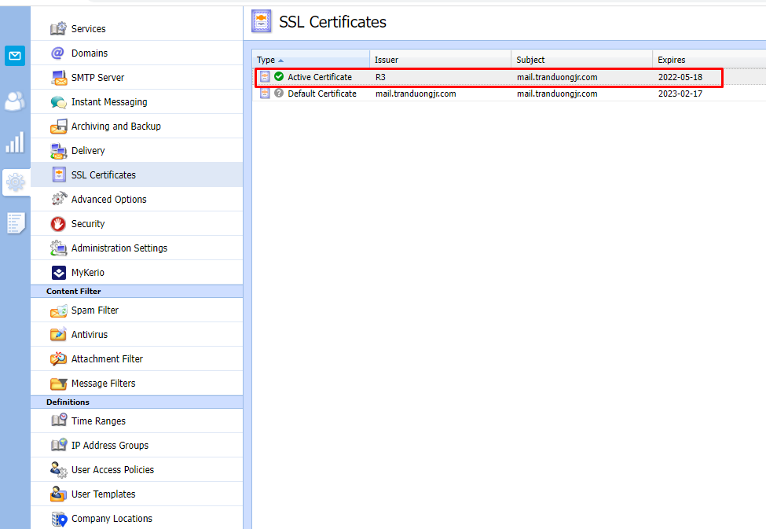
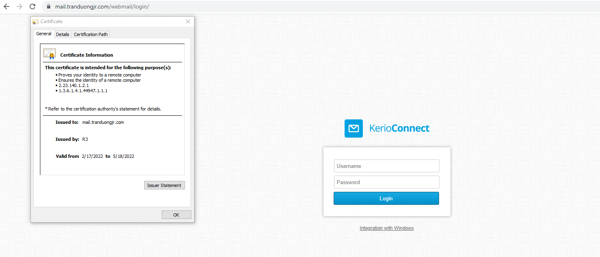
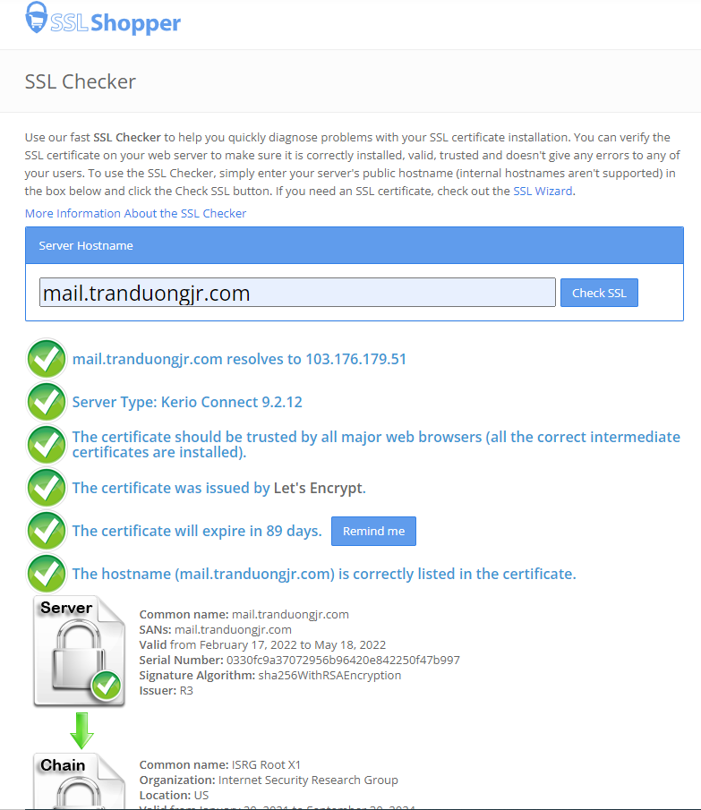

### Security

**Security Policy**

- CRAM-MD5: Xác thực mật khẩu sử dụng theo chuẩn MD5

- DIGEST-MD5: Xác thực mật khẩu sử dụng chuẩn MD5

**Sender Policy**

Thiết lập chính sách bảo vệ chống giả mạo người gửi

### Administration Settings

Thiết lập tài khoản Administration

### Content Filter (Bộ lọc nội dung)

#### Spam Filter

- Spam Rating: đánh giá mức độ spam

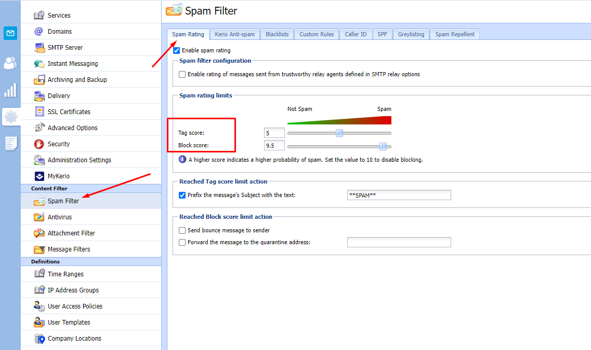

* Tag score: Nếu tin nhắn đạt điểm này Kerio Connect sẽ đánh dấu là tin nhắn spam.

* Block score: Nếu tin nhắn đạt số điểm này Kerio Connect sẽ loại bỏ thông điệp

- Kerio Anti-Spam

Kerio Connect gửi dữ liệu được mã hóa tới dịch vụ scan online Bitdefender.

Bitdefende quét dữ liệu và gửi kết quả tới Kerio Connect điểm số có thể là 0 cho thư rác không phải spam, 1-9 cho các mức spam khác nhau

- Blacklist: Thiết lập danh sách các địa chỉ IP được cho là black list và thêm sửa xóa các Internet blacklist

- Custom Rules: Cho phép thêm, sửa xóa các rule spam filter, thứ tự ưu tiên từ trên xuống dưới

- Caller ID: 

Bật tùy chọn Kiểm tra ID người gọi của mọi tin nhắn đến .

Nếu một tin nhắn bị chặn, Kerio Connect có thể

* Ghi nó vào Nhật ký bảo mật
* Từ chối nó
* Tăng / giảm điểm thư rác của nó

- SPF: Tùy chọn bật kiểm tra SPF của mọi tin nhắn đến, cũng có tùy chọn không kiểm tra SPF từ IP của 1 group nào đó

- Greylisting: Hỗ trợ chống spam

-Spam repelent: Tính năng chống thư rác hoạt động bằng cách quan tâm đến sự delay khi truyền thông với giao thức SMTP, các máy chủ hợp pháp thường phải đợi 2 phút trước khi kết thúc kết nối, trong khi các máy chủ thư rác chỉ có thể đợi 1 vài giây. Một giá trị tốt nhất là 25 giây. Sự điều chỉnh sẽ loại bỏ một số lượng đáng kể thư spam mà không mất email hợp pháp

#### Antivirus

Bảo vệ chống vi-rút trong Kerio Connect:

- Kerio Connect bao gồm Kerio Antivirus, một biện pháp bảo vệ tích hợp chống lại các email độc hại có chứa vi rút. Vi rút có thể lây nhiễm vào máy tính của bạn và gây hại cho các tệp của bạn hoặc cho hệ thống máy tính của bạn.

- Đối với bất kỳ thông báo nào mà Kerio Antivirus không thể quét, Kerio Connect có thể Gửi tin nhắn gốc có tiền tố cảnh báo hoặc Từ chối tin nhắn như thể đó là vi rút

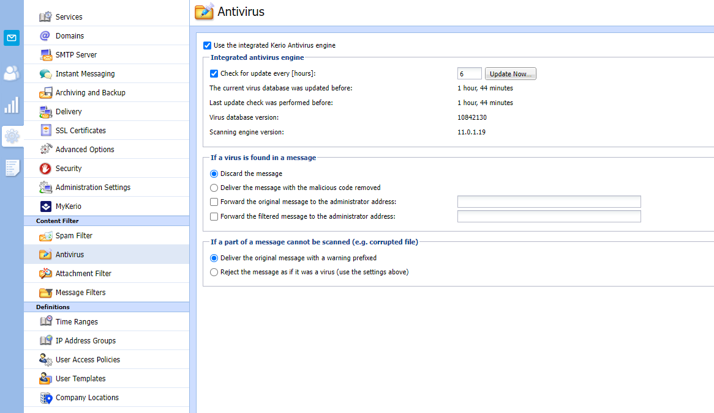

Chọn hành động thực hiện đối với tin nhắn chứa thư rác:

* Discard the message: Hủy thư
& Deliver the message with the malicious: Gửi thông điệp với mã độc được loại bỏ Ngoài ra có thể tùy chọn chuyển tiếp tin nhắn:
* Forward the original message to an administrator address: Chuyển tiếp thông báo tới quản trị viên.
* Forward the filtered message to an administrator address: Chuyển tiếp thư được lọc sang địa chỉ quản trị viên.

Đối với bất kỳ tin nhắn nào mà Kerio Antivirus không thể quét, Kerio Connect có thể thực hiện một trong các hành động:

* Deliver the original message with a warning prefixed: Cung cấp thông báo với một cảnh báo bắt đầu.
* Reject the message as if it was a virus: Từ chối tin nhắn coi đó là virus

#### Attachment Filter

Nhiều virus được ẩn dưới dạng file đính kèm, Kerio có thể lọc các tệp đính kèm theo những gì đã cài đặt, nếu phát hiện có vấn đề sẽ loại bỏ các tệp tin đính kèm đó


Chọn Enable attachment filter(Bật bộ lọc tệp đính kèm)

- Nếu muốn Kerio connect thông báo cho người gửi tệp đính kèm không được gửi chọn Send the sender a warning… (Gửi cho người gửi một cảnh báo…)

- Để Kerio connect gửi thư gốc đến một địa chỉ email khác hãy chọn Forward the original messages to(Chuyển tiếp các tin nhắn gốc tới) và nhập địa chỉ.

- Để Kerio connect gửi thư được lọc đến một địa chỉ email khác hãy chọn Forward the filtered messages to(Chuyển tiếp các tin nhắn đã lọc tới) và nhập địa chỉ.

- Để loại bỏ các file đính kèm ZIP với các tập tin nguy hiển chọn Discard zip archive containing files with dangerous extensions...

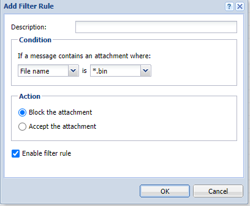

* Nhập mô tả cho rule mới
* Định nghĩa kiểu file đính kèm
* Xác định hành động Kerio Connect blocks/ accepts messages với tệp đính kèm.

* block the attachment: chặn tệp đính kèm
* accept the attachment: chấp nhận tệp đính kèm

### Definitions

## Logs

Nơi lưu trữ logs


