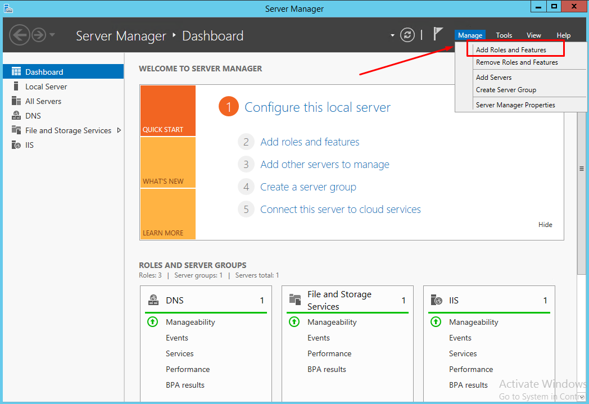
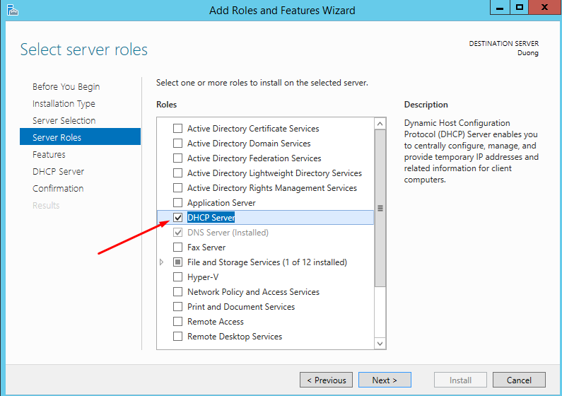

# Giới thiệu về Mail Server MDaemon
MDaemon Mail Server hay tên chính xác là dịch vụ MDaemon Mail Server. Đây là một phần mềm dịch vụ Mail Server đáng tin cậy, mạnh mẽ bảo mật thông tin email và là một nhà phát triển có hơn 20 năm kinh nghiệm trong việc phát triển mail server.

## Các tính năng nổi bật của MDaemon Mail Server

- MDaemon Mail Server được phát triển để tương thích hoàn toàn trên hệ điều hành Windows, đặc biệt là Windows Server với đầy đủ tính năng của một Mail Server.
- Không chỉ có khả năng gửi - nhận mail, MDaemon Mail Server còn có thể hỗ trợ thêm các phương thức như SMTP, POP3, IMAP4,...
- Hỗ trợ nhiều người dùng từ ít nhất 56 người dùng cho đến vô hạn theo thỏa thuận với MDaemon Mail Server.
- Có tính năng hỗ trợ đa luồng, hỗ trợ lọc nội dung thư, chặn spam, có thể điều khiển từ xa và hỗ trợ tên miền cho doanh nghiệp.

## Ưu điểm của MDaemon Mail Server

**Khả năng bảo mật mạnh mẽ**

Đối với các doanh nghiệp, bảo mật thông tin doanh nghiệp và bảo mật thông tin của khách hàng luôn là vấn đề ưu tiên hàng đầu. MDaemon đã:

- Kết hợp nhiều kỹ thuật bảo mật như: IP Shielding, kiểm soát chuyển tiếp, SMTP Authentication,... để giảm thiểu tối đa các cuộc tấn công vào Mail Server.
- Sử dụng những công nghệ email tiên tiến như: Vouch By Reference và những công nghệ xác nhận như: Sender-ID, SPF, DKIM,... vào phần mềm MDaemon Mail Server.
- Sử dụng nhiều công nghệ bảo mật khác như: SSL/TLS, Bayessian Learning, Backscatter và SecurityPlus nhằm tối ưu hóa bảo mật.

**Hỗ trợ quản trị từ xa ngay trên trình duyệt**

- Để hỗ trợ người dùng ở mức tối đa, MDaemon Mail Server còn triển khai thêm cả dịch vụ WorldClient- dựa trên nền tảng Web Mail để người dùng tiện lợi hơn, chỉ cần có mạng internet và một thiết bị kết nối mạng; người dùng có thể dễ dàng điều khiển được Mail Server.
- Với WorldClient, người dùng có thể thêm, sửa, xóa các tài khoản, chỉnh sửa cấu hình trực tiếp, có thể xem và nhanh chóng khắc phục các sự cố gửi - nhận thư,...
- Dịch vụ của MDaemon Mail Server đi kèm với chứng chỉ SSL/TLS, vì thế các quản trị viên Mail Server có thể an toàn truy cập từ xa qua kết nối HTTPS an toàn.

# Cài đặt MDaemon Mail Server trên Windows Server 2012

## Chuẩn bị

- Hệ điều hành Windows Server 2012 R2 Datacenter
- Mail Server: MDaemon Mail Server phiên bản thử nghiệm

Có thể tải MDaemon Mail Server tại: https://www.altn.com/Downloads/MDaemon-Mail-Server-Free-Trial/ . Sau khi tải xong tiến hành cài đặt

- CPU có tiến trình 2.4GHz trở lên
- RAM 1GB trở lên
- Dung lượng ổ đĩa ít nhất 10GB

## Cài đặt

### Cấu hình IIS

IIS là một dịch vụ Internet đi kèm với phiên bản Windows Server sử dụng để cấp phát các thông tin lên mạng như Web Server, FTP Server, Mail Server, DHCP Server,.. Do đó, cần phải cấu hình IIS đầu tiên.

- Truy cập vào Server Manager chọn Add Roles And Features.

- Bấm Next và chọn vào mục Server Roles => DHCP Server, một cửa sổ nhỏ hiện lên và nhấn vào Add features.

- Nhấn Next ở cả 3 mục tiếp theo và để cấu hình mặc định của phaafnmeefm là được. Sau đó nhấn Install để bắt đầu cài đặt

### Cài đặt phần mềm MDaemon Mail Server

- Sau khi tải về xong nhấn vào file.exe để chạy phần mềm MDaemon Mail Server. Tại màn hình giới thiệu nhấn Next => I Agree để đồng ý điều khoản.

