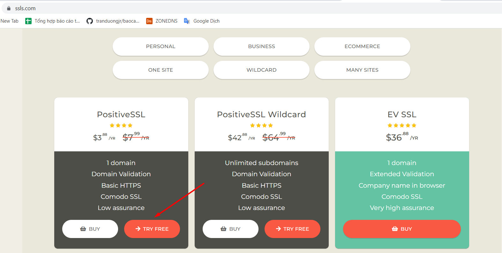
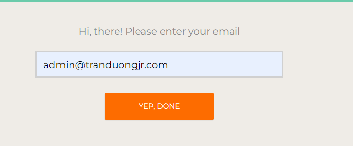
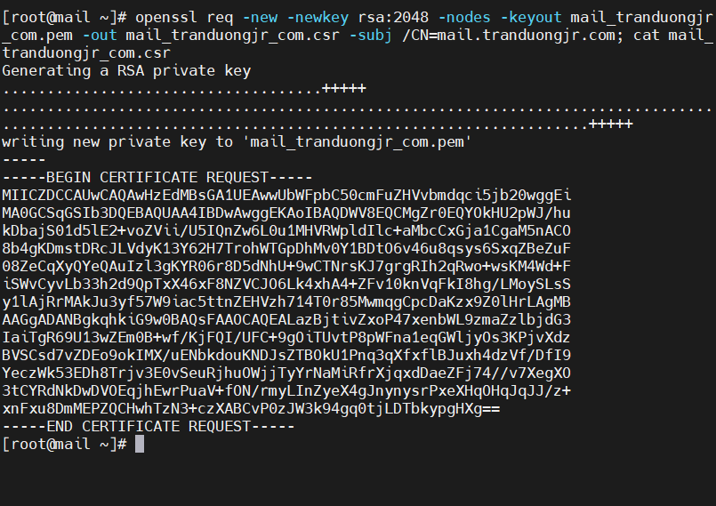
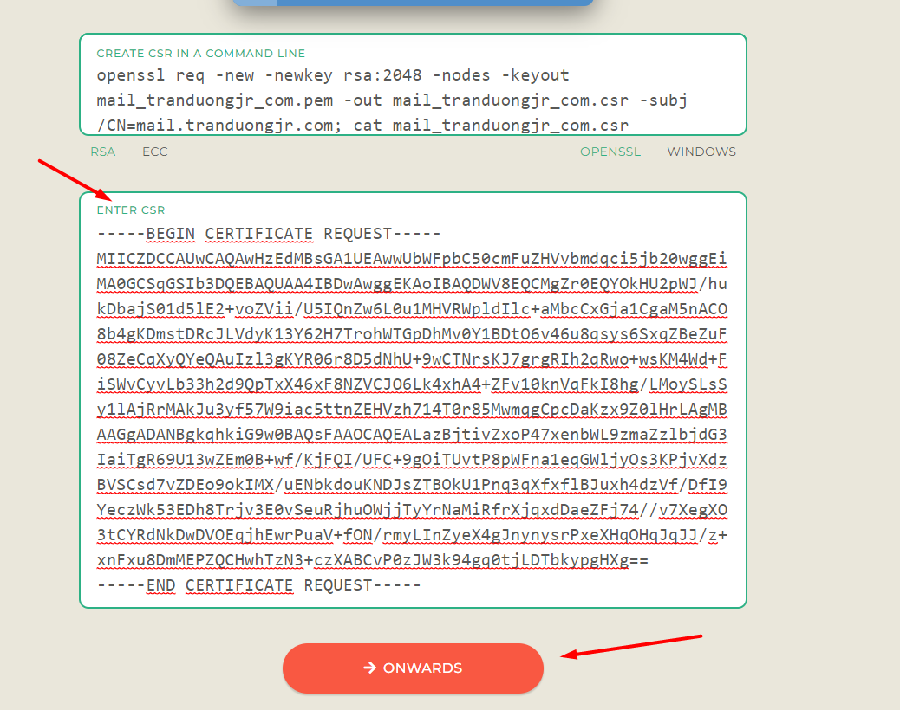
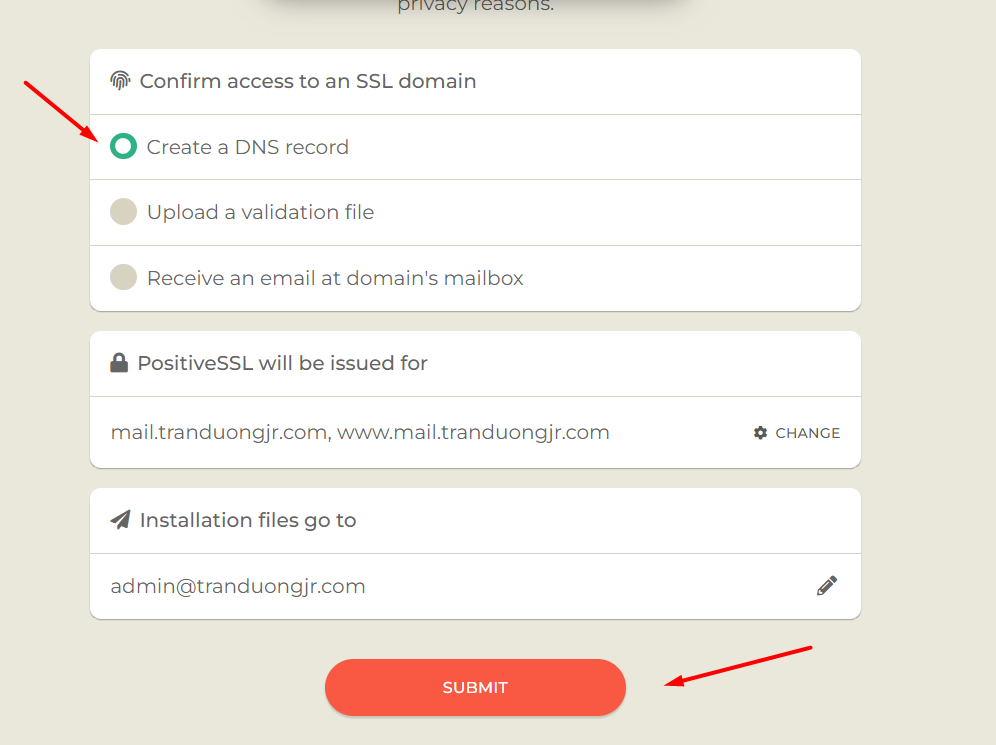
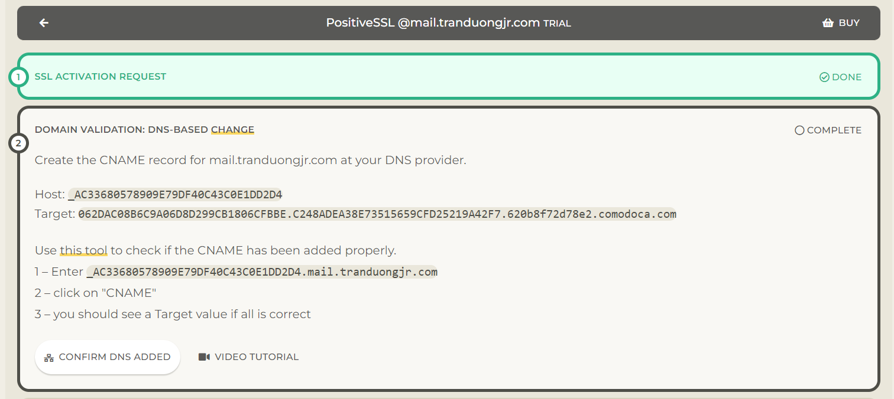
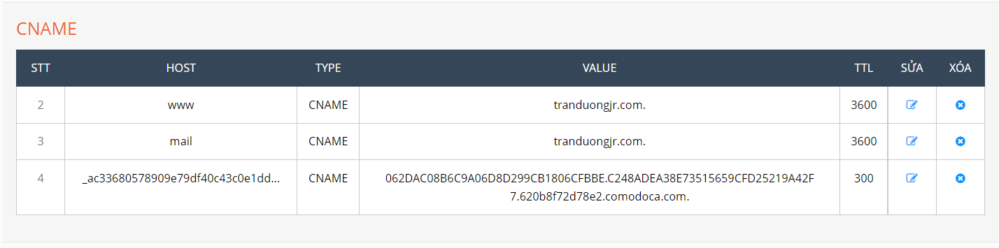
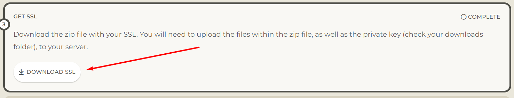
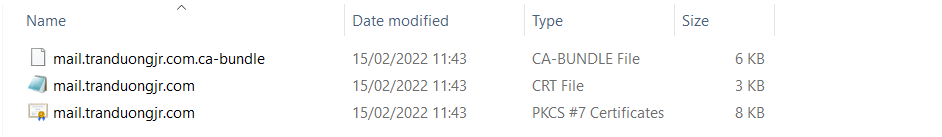
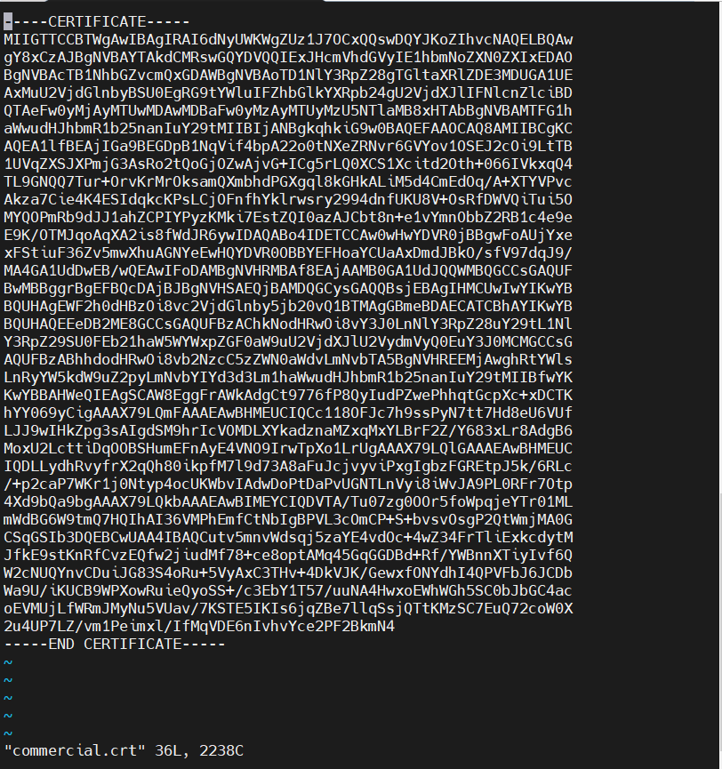

# Cài đặt SSL trên Zimbra lấy chứng chỉ ở ssls.com

## Lấy chứng chỉ

1. Vào trang web ssls.com để đăng ký một tài khoản 






















## Cài đặt chứng chỉ

```
cd /opt/zimbra/ssl/zimbra/commercial/
```

- Tạo file commercial.crt



- Tạo file commercial_ca.crt

