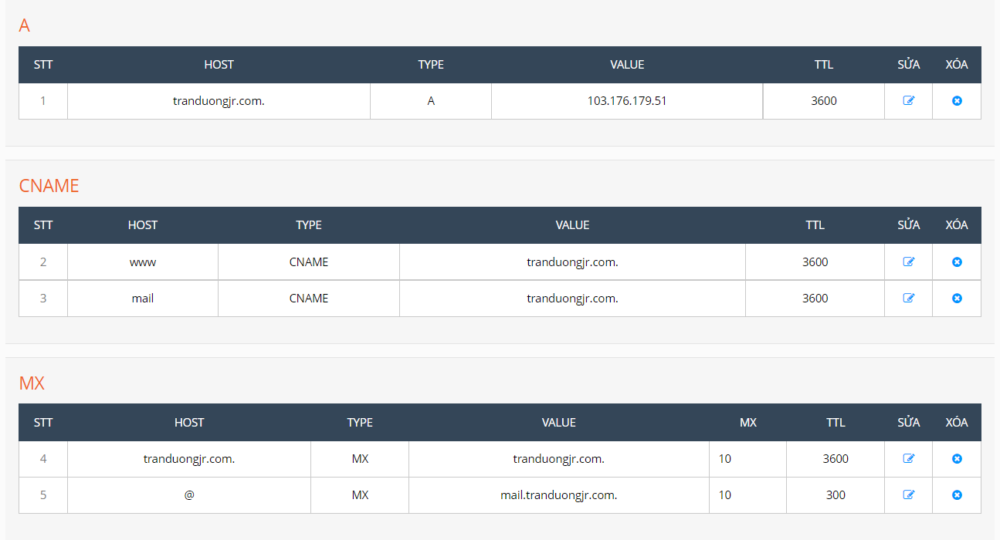
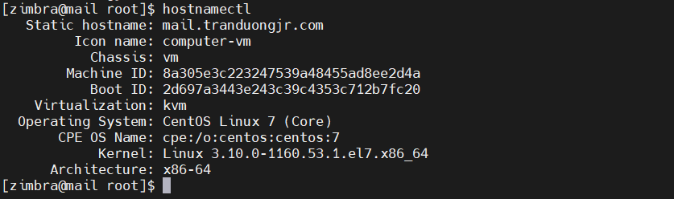
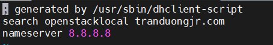
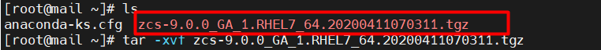
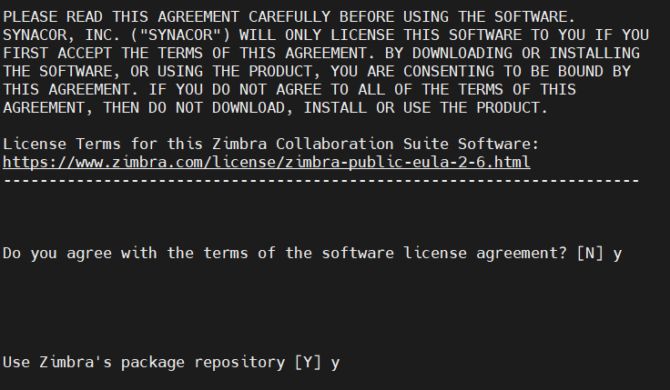
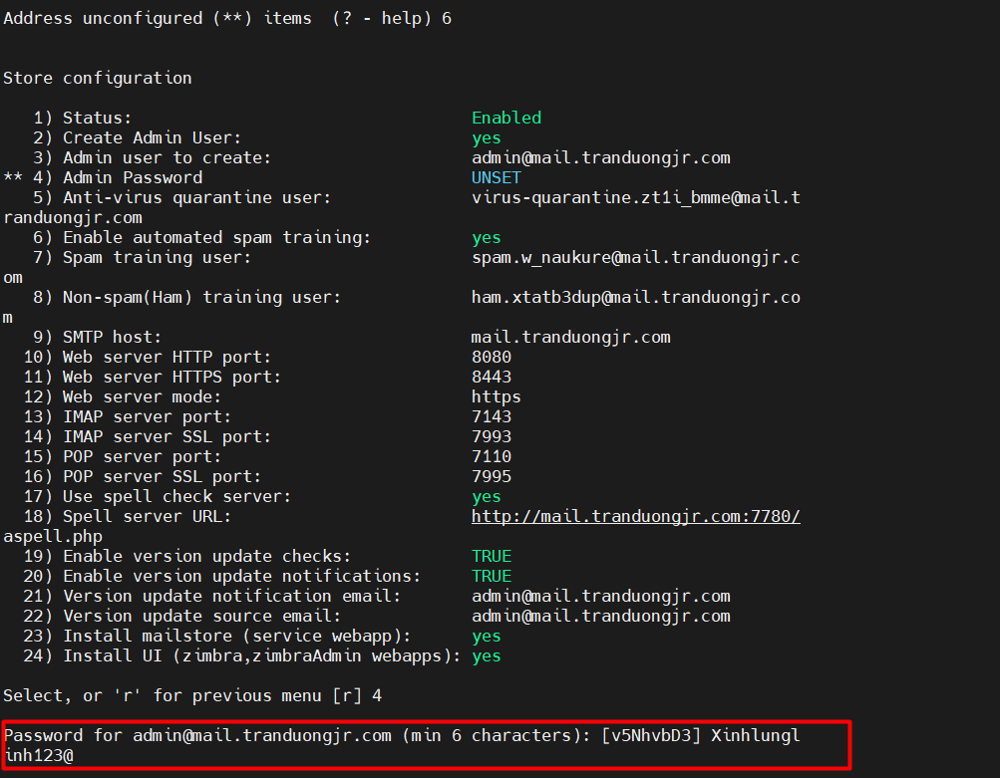
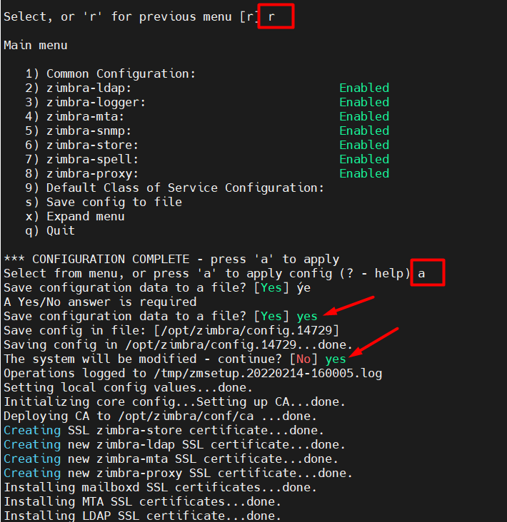

# Các bước cài Email Zimbra 9

## Chuẩn bị

- Phiên bản Zimbra 8 trên Centos 7

- Cấu hình tối thiểu: Ram 2GB, Disk: 30GB, CPu 3 core
- Chuẩn bị tên miền: Một tên miền đã trỏ bản ghi mail (điều này là cần thiết vì trong quá trình cài đặt sẽ yêu cầu tên miền phân giải được bản ghi mail)

    Tên miền: tranduongjr.com



**- Update OS**

```
yum install epel-release -y

yum update -y
```

**- Cài đặt NTP đồng bộ thời gian**

```
yum install chrony -y

systemctl start chronyd

systemctl enable chronyd

systemctl restart chronyd

chronyc source -v
```

```
ln -f -s /usr/share/zoneinfo/Asia/Ho_Chi_Minh /etc/localtime
```

**- Cài đặt cmdlog**

```
curl -Lso- https://raw.githubusercontent.com/nhanhoadocs/ghichep-cmdlog/master/cmdlog.sh | bash
```

**- Thiết lập Firewall, Selinux và một số package cơ bản**

```
sudo systemctl disable firewalld

sudo systemctl stop firewalld

sed -i 's/SELINUX=enforcing/SELINUX=disabled/g' /etc/sysconfig/selinux

sed -i 's/SELINUX=enforcing/SELINUX=disabled/g' /etc/selinux/config

yum install -y git wget byobu


service sendmail stop

service iptables stop

service ip6tables stop

chkconfig sendmail off

chkconfig iptables off

chkconfig ip6tables off

service httpd stop

chkconfig httpd off

init 6
```

## Cấu hình Email Zimbra 9

- Cài Package cần thiết

```
yum install unzip net-tools sysstat openssh-clients perl-core libaio nmap-ncat libstdc++.so.6 nano wget -y 
```

- Đổi hostname, add hostname

```
hostnamectl set-hostname mail.tranduongjr.com

cat << EOF >> /etc/hosts

103.176.179.51 mail.tranduongjr.com mail

EOF

init 6
```


Chỉnh sửa nameserver về 8.8.8.8 để có thể connect tới server download bộ cài zimbra 9  tại /etc/resolv.conf



**- Download bộ cài zimbra 9**

wget -c https://s3.beezim.fr/beebot/upload/09830127-c2f1-43cb-b3fa-c35fc514e539/zcs-9.0.0_GA_1.RHEL7_64.20200411070311.tgz

**- Lưu ý** : Nếu mà tải link trên wget thấy chậm quá hoặc không được thì ta có thể truy cập vào https://s3.beezim.fr/beebot/upload/09830127-c2f1-43cb-b3fa-c35fc514e539/zcs-9.0.0_GA_1.RHEL7_64.20200411070311.tgz để tải bộ cài zimbra về máy tính, sau đó transfer qua vps



**- Giải nén**

```
tar -xvf zcs-9.0.0_GA_1.RHEL7_64.20200411070311.tgz
```

**- Cài đặt**

```
cd zcs-9.0.0_GA_1.RHEL7_64.20200411070311

./install.sh
```

Ở bước này lưu ý một số tùy chọn cài đặt như sau:

```
Do you agree with the terms of the software license agreement? [N] Y

Use Zimbra's package repository [Y] Y

Select the packages to install

Install zimbra-ldap [Y] Y

Install zimbra-logger [Y] Y

Install zimbra-mta [Y] Y

Install zimbra-dnscache [Y] N

Install zimbra-snmp [Y] Y

Install zimbra-store [Y] Y

Install zimbra-apache [Y] Y

Install zimbra-spell [Y] Y

Install zimbra-memcached [Y] Y

Install zimbra-proxy [Y] Y

Install zimbra-drive [Y] Y

Install zimbra-imapd (BETA - for evaluation only) [N] N

The system will be modified.  Continue? [N] Y
```




Xác nhận thay đổi domain và nhập domain

```
It is suggested that the domain name have an MX record configured in DNS
Change domain name? [Yes] Yes
Create domain: [mail.tranduongjr.com] tranduongjr.com
```


Hệ thống cảnh báo password của admin chưa được cài đặt, cần đặt mật khẩu cho admin zimbra

```
Chọn 6 -> Chọn 4 -> Nhập pass => Enter

Address unconfigured (**) items  (? - help) 6

Select, or 'r' for previous menu [r] 4

Password for admin@tranduongjr.com (min 6 characters): [v5NhvbD3] Xinhlunglinh123@
```



Chọn "r" để quay lại menu chính và "a" để apply cấu hình



Chờ quá trình lưu cấu hình hoàn tất

```
Notify Zimbra of your installation? [Yes] Yes

Configuration complete - press return to exit
```

* **Blocking Memcached Exploi**

```
su  zimbra

/opt/zimbra/bin/zmprov ms `zmhostname` zimbraMemcachedBindAddress 127.0.0.1 

/opt/zimbra/bin/zmprov ms `zmhostname` zimbraMemcachedClientServerList 127.0.0.1
```

Restart memcached:

```
zmmemcachedctl restart
```
**- Kiểm tra hoạt động các dịch vụ của zimbra**

```
su zimbra

zmcontrol status
```

**- Truy cập**

```
https://mail.tranduongjr.com:7071
```

Đăng nhập với tài khoản admin và mật khẩu đã tạo bên trên để vào trang quản trị Mail Server


