# Các thao tác với Zimbra 9

Trang quản trị Mail Server truy cập tại cổng 7071


## Quản lý tài khoản

Tại tùy chọn quản lý, nơi quản lý các tài khoản mail người dùng:

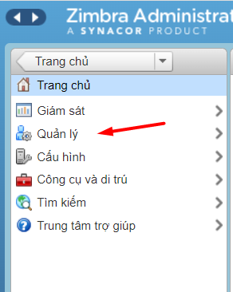

Các tùy chọn như thêm, sửa, xóa hoặc vô hiệu hóa phiên của một tài khoản mail. Hoặc ta có thể vào tùy chọn xem thư để có thể vào trong webmail của người dùng đó


### Gửi nhận mail zimbra

- Đăng nhập vào webmail theo thông tin được người quản trị server gửi ví dụ https://mail.tranduongjr.com

- Nhập user và pass của email sau đó thực hiện sign in:


**Gửi mail**

Sau khi đăng nhập chọn Thư mới để tiến hành soạn thảo email mới:

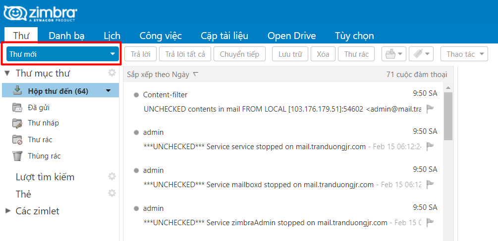

Nhập địa chỉ email cần gửi vào phần ``` Tới``` , CC là để tạo bản sao thư và gửi đến 1 người khác, nhập tiêu đề và nội dung thư, có thể đính kèm các tệp sau đó nhấn vào Gửi


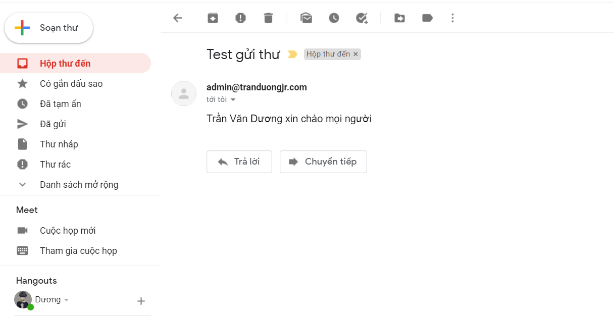

*Lưu ý: Nếu gửi đến nhiều địa chỉ thì các địa chỉ email cách nhau bằng dấu ;*

**Nhận Mail**

Khi có mail mới gửi đến vào phần Hộp thư đến, click vào email sẽ nhìn thấy nội dung email ở bên tay phải

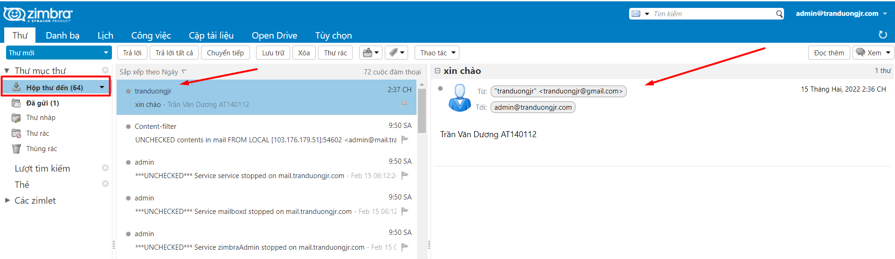

### Kiểm tra log gửi nhận mail

Việc kiểm tra log gửi/nhận của email server zimbra là rất cần thiết, giúp xác định được một email đã gửi/nhận thành công hay chưa và nếu chưa thành công thì bị dừng ở bước nào và báo lỗi ra sao.

**Đường dẫn file log**

```
/var/log/maillog
```

### Đổi mật khẩu account admin zimbra

Khi cài đặt email server zimbra mặc định sinh ra một account admin có toàn quyền quản trị trên hệ thống email server. Tuy nhiên trong quá trình vận hành sử dụng người quản trị không nhớ được mật khẩu admin nên phải thực hiện thao tác reset password account admin zimbra.

- Truy cập SSH vào email server và chuyển thao tác với user zimbra

```
su zimbra
```

- Kiểm tra những user nào có quyền admin

```
zmprov gaaa
```

- Thay đổi mật khẩu account có quyền admin

```
zmprov sp <admin email address> <mật khẩu mới>
```

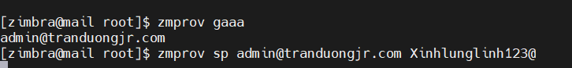

Lưu ý: Mật khẩu thiết lập phải phù hợp với chính sách mật khẩu được thiết lập

### Thiết lập chính sách mật khẩu

- Login và thao tác trên giao diện trang quản trị mail server zimbra

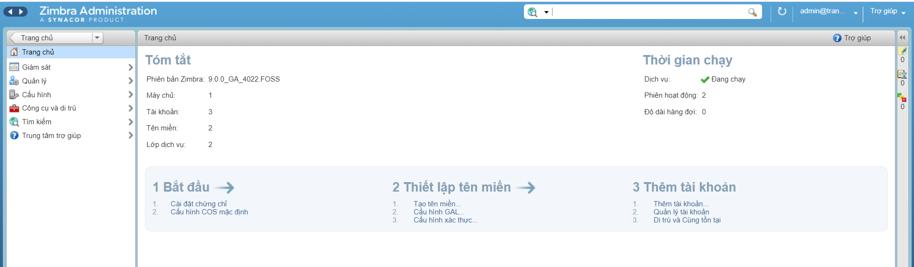

- Thiết lập chính sách mật khẩu

Vào tùy chọn Cấu hình => Default


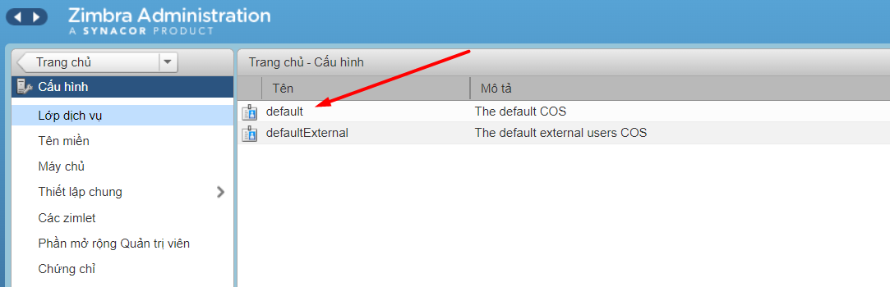

Vào tùy chọn Nâng cao và thiết lập các chính sách tương ứng cho mật khẩu

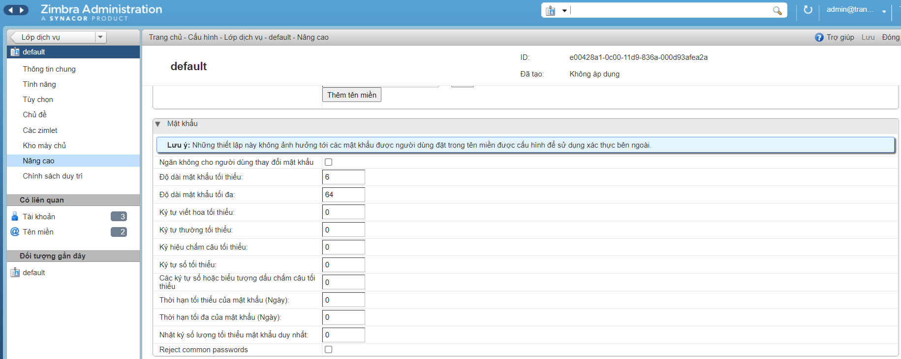

Tại tùy chọn này cũng có cách chính sách về đăng nhập thất bại:


### Thiết lập quota

Khi tạo một account email trong email server zimbra hệ thống sẽ tự động phân chia quota cho mỗi account theo mặc định. Trong thực tế việc thiết lập quota cho account khác nhau với giá trị khác nhau là cần thiết tùy thuộc vào nhu cầu sử dụng của account đó.

- Vào tùy chọn Quản lý (quản lý tài khoản), sau đó lựa chọn tài khoản muốn chỉnh sửa quota => chuột phải => sửa

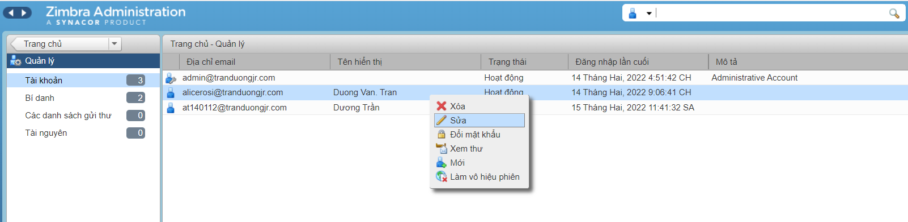

- Vào tùy chọn nâng cao => Hạn mức


**Tùy chỉnh các tham số**

- Giới hạn địa chỉ chuyển tiếp theo người dùng trong phạm vi (ký tự)
- Số lượng tối đa các địa chỉ chuyển tiếp theo người dùng
- Hạn mức tài khoản (MB) (0 là không có giới hạn)
- Số lượng liên hệ tối đa cho phép trong thư mục
- Ngưỡng phần trăm cho các thư cảnh báo hạn mức (%)
- Khoảng thời gian tối thiểu giữa các cảnh báo hạn mức
- Mẫu thư cảnh báo hạn mức

Lưu lại:


### Tạo Whitelist / BlackList

- Đăng nhập vào Webmail Zimbra và vào Tùy chọn => Thư

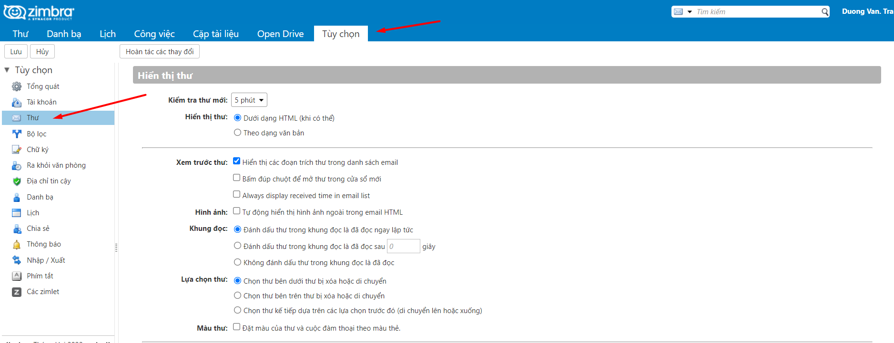

Tìm đến Tùy chọn thư rác

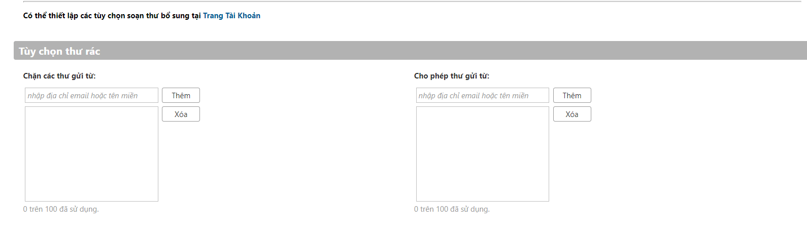

Để đưa tên miền vào Blacklist: Thêm tên miền hoặc địa chỉ email của địa chỉ gửi thư rác vào ô Chặn các thư gửi từ và chọn nút Thêm. Hoặc có thể xóa địa chỉ email hoặc tên miền tương tự khỏi danh sách.

Để đưa miền vào Whitelist: Thêm địa chỉ email hoặc miền dưới ô Cho phép thư gửi từ và chọn nút Thêm. Hoặc có thể xóa địa chỉ email hoặc miền tương tự khỏi danh sách.

Sau đó lưu lại cấu hình

