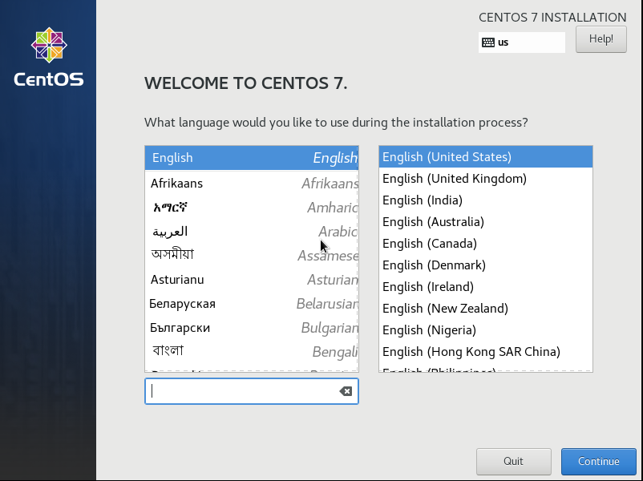
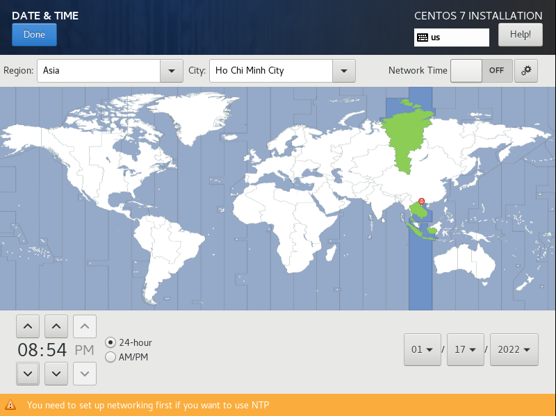
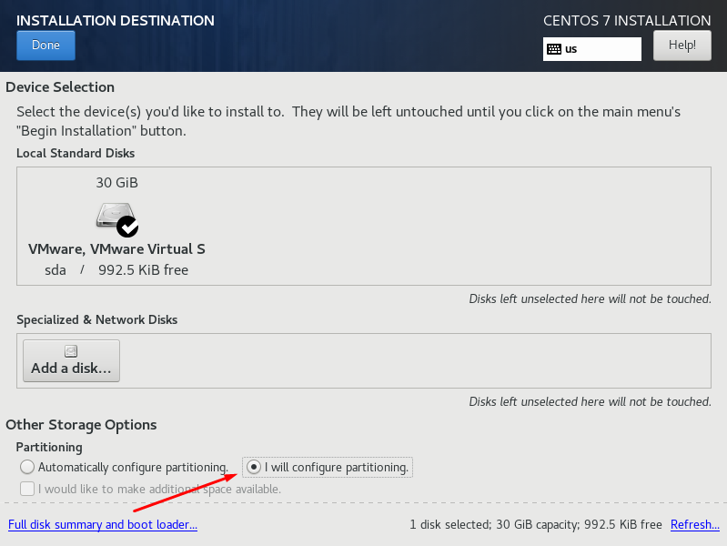
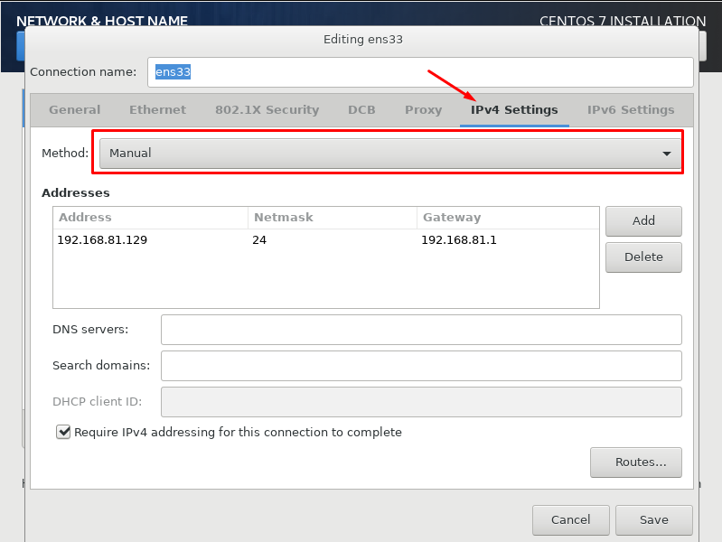
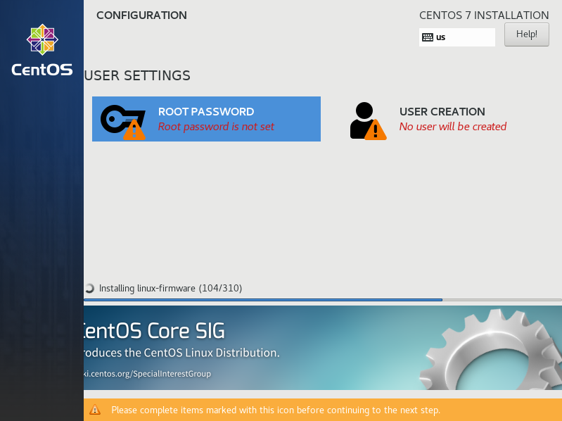
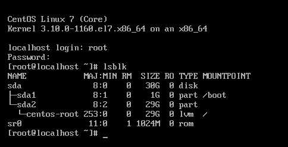
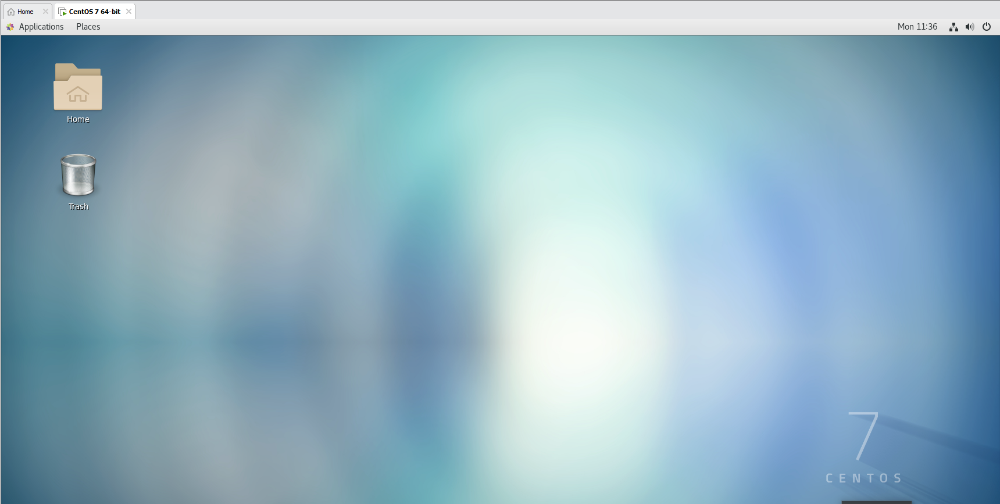

# 1. Cài đặt Centos 7

Tiến hành cài file iso Centos 7 tương tự như hướng dẫn tại : https://github.com/tranduongjr/baocaothuctap/blob/main/VM%20ware%20va%20may%20ao/VM%20ware%20va%20may%20ao.md

**Lựa chọn ngôn ngữ**

**Tiến hành thực hiện các cài đặt**

**Cài đặt thời gian, bàn phím,phần mềm,...**

**Tiếp theo với cài đặt hệ thống**

Để chia phân vùng ổ cứng, click vào "Installation Destination"

Click vào I will configure partitioning (Tôi sẽ định cấu hình phân vùng)

Phân vùng thủ công, chọn LVM trong partitioning scheme 

Click vào dấu "+" để lựa chọn tạo các phân vùng như: /, /boot , /swap,...

## Cấu trúc hệ thống tập tin trong Linux: 

Linux sử dụng cấu trúc hệ thống file có thứ bậc, cáu trúc cây từ trên xuống dưới, với root(/) tại cơ sở của hệ thống file và tất cả các thư mục khác trải ra từ nó.

Tùy theo nhu cầu sử dụng người dùng có thể phân vùng cho các thư mục này thủ công tùy ý

- / - Root:

Nó là thư mục gốc chứa các file thư mục khác
Chỉ có Root user mới có thể sử dụng thư mục này
/bin: Lưu trữ tập lệnh thường sử dụng nhất(như sao chép tập tin, tạo thư mục,...)

**/boot**: chứa phần nhân khởi động của Linux và file cấu hình khởi động (grub cũng trong thư mục này)

**/dev**: chứa các tập tin đặc biệt tương ứng với các thiest bị có trong hệ thống

**/etc**: chứa các file cấu hình của các chương trình, nó đồng thời còn chứa các shell script dùng để khởi động hoặc tắt các chương trình khác. Ví dụ /etc/sysconfig/network-scripts/ifcfg-ens33 dùng để cấu hình ip cho máy trên card mạng ens33

**/home**: Chứa các thư mục con có tên ứng với User name của người dùng, mỗi thư mục đó chính là nơi lưu trữ toàn bộ dữ liệu của người dùng. Thư mục này cũng chứa các thư mục con đại điện cho mỗi user khi đăng nhập. Nơi đây là thư viện làm việc thường xuyên của người dùng. Khi ngời quản trị tạo tài khoản, một thư mục user của tài khoản đó được tạo ra và nó nằm trong thư mục /home. Những user sẽ có quyền theo tác trên thư mục của mình mà không ảnh hưởng tới người khác.Nó tương tự như thư mục User ở trên Windows.

**/lib**: Chứa các thư viện dùng chung của các chương trình (giống file .dll trong windows)

**/tmp**: Chứa các file tạm dùng trong quá trình Linux hoạt động

**/usr**: Chứa những thứ quan trọng như phần mềm, thư viện hàm, các dữ liệu dùng chung. Tất cả user đều có thể truy cập được. Nói các khác, nó chứa các tệp được chia sẻ, nhưng ở chế độ chỉ đọc. Thư mục này thậm chí có thể được chia sẻ với các máy tính khác trong mạng nội bộ. Thư mục này tương tự như thư mục C:\Program File của Windows.

/usr/bin : Tập hợp các tệp thực thi (không phải quản trị cho tất cả người dùng) của hầu hết các ứng dụng máy tính để bàn trong số những ứng dụng khác (ví dụ như firefox).

/usr/lib: Thư viện dành cho C và C++

/usr/local: Đó là một cấp độ khác bên trong cung cấp hệ thống phân cấp tương tự như chính thư mục  /usr

/usr/share: Các tệp được chia sẻ như cấu tệp cấu hình,hình arnhm, biểu tượng, chủ đề,...

/usr/sbin: hệ thống nhị phân không thiết yếu, ví dụ deamon cho các dịch vụ mạng khác nhau, nó chứa các chương trình không cung cấp giao diện người dùng và thường chạy khi khởi động hệ thống hoặc trong một số trường hợp nhất định. Chúng không được quản lý trực tiếp bởi người dùng khi chúng đang chạy, mặc dù chúng có thể cấu hình trước khi chạy.

/usr/src: Mã nguồn của một số ứng dụng và nhân Linux. Giống như /mnt, thư mục nafydudowjc người dùng quản lý trực tiếp để họ có thể lưu vào đó mã nguồn của các chương trình và thư viện và do đó có thể truy cập dễ dàng mà không gặp vấn đề về quyền. Nó cho phép mã nguồn có không gian riêng, có thể truy cập nhưng cách xa tất cả người dùng.

**/var**: chứa các tập tin lưu lại các số liệu biến đổi gồm: hệ thống tập tin log(/var/log), các gói và các file dữ liệu(/var/lib), email(/var/mail), print queues(/var/spool); lock files (/var/lock), các file tạm thời cần khi reboot (/var/tmp). Các file biến thiên bất thường như các file dữ liệu đột ngột tăng kích thước trong một thời gian ngắn sau đó lại giảm kích thước xuống còn rất nhỏ. Điển hình là các file dùng làm hàng đợi chứa dữ liệu cần đưa ra máy in hoặc các hàng đợi chứa mail. Nó thường hoạt động như một cơ quan đăng ký hệ thống. Giúp tìm ra nguồn gốc của một vấn đề.

/var/log: Đây là một trong những thư mục con quan trọng nhất vì tất cả các loại nhật ký hệ thống đều được lưu trữ ở đây.

/var/mail: Hộp thư hoặc tin nhắn từ người dùng. Nếu không sử dụng mã hóa, thì thư mục cá nhân thường được sử dụng cho cùng một công việc bởi các chương trình xử lý email.

/var/opt: Dữ liệu được sử dụng bởi các gói được lưu trữ trong /opt

/var/tmp: các tệp tạm thời, không giống như /tmp. Chúng không bị xóa giữa các phiên hoặc hệ thống khởi động lại, những vẫn không thể thiếu

/var/spool: Các tác vụ đang chờ được xử lý

/var/game/: Dữ liệu biến đổi từ các trò chơi hệ thống. Thư mục này không cần thiết và thường bị chính các ứng dụng trò chơi bỏ qua, vì chúng sẻ dụng thư mục người dùng trong /home để lưu dữ liệu biến đổi.

/var/crash: Dữ liệu và thông tin được lưu trữ, đề cập đến sự cố hoặc lỗi của hệ điều hành. Nó cụ thể hơn /var nói chung

**/sbin**: Chứa các chương trình thực thi nhị phân được yêu cầu bởi System Administrator cho việc bảo trì(iptables, fdisk, ifconfig, reboot, etc)

**/proc**: Sử dụng cho nhân Linux. Chúng được sử dụng bởi nhân để xuất dữ liệu sang không gian người dùng

**/otp**: thư mục chứa các phần mềm cài thêm

**/mnt và /media** Mount point mặc định cho những hệ thống file kết nối bên ngoài

- /srv: dữ liệt được sử dụng bởi các máy chủ lưu trữ trên hệ thống

## Phân vùng ổ đĩa. 

**Phân vùng "/"** - Root: đây là nơi bắt đầu của tất cả các thư mục, là cơ sở của hệ thống file khác và tất cả các thư mục khác trải ra từ nó:

**/Boot** là phân vùng chứa những file như kernel và các tập tin sử dụng trong boot loader nên chỉ cần để 1GB

**/Swap** là phân vùng Ram ảo cho Server, nó sẽ lấy 1 phần dung lượng của ổ cứng để hoạt động khi Ram của Server gần hết hoặc đến ngưỡng do bạn thiết lập trước.

- Đối với server có cấu hình RAM thấp thì sẽ cần dùng đến phân vùng Swap
- Swap thường được đặt gấp đôi RAM vật lý, nếu thiết lập kích thước của swap quá lớn, sẽ gây lãng phí dung lượng mặc dù swap không được dùng.

*Vì máy này Ram cao nên không cần cài nữa*

## Các định dạng phân vùng ổ đĩa

*journaling*

Journaling (ghi nhật ký) được thiết kế để ngăn chặn sự cố dữ liệu bị hỏng và mất điện đột ngột. Giả sử hệ thống đang trong quá trình ghi tệp vào đĩa và nó đột ngột mất nguồn. Nếu không có nhật ký, máy tính sẽ khoog biết liệu tệp đã được ghi hoàn toàn vào đĩa hay chưa. Tệp vẫn sẽ owrddos trên đĩa, bị hỏng.

Với nhật ký, máy tính sẽ lưu rằng nó sẽ ghi một tệp nhát định vào đĩa trong nhật ký, ghi tệp đó vào đĩa, rồi xóa công việc đó khỏi nhật ký, nếu bị mất điện trong quá trình ghi tệp, Linux sẽ kiểm tra nhật ký của hệ thống tệp khi nó khởi động và tiếp tục mọi công việc đã hoàn thành một phần. Điều này ngăn ngừa mất dữ liệu và hỏng tệp.

### Các tùy chọn file system

- ext: Là định dạng file hệ thống đầu tiên được thiết kế dành riêng cho Linux. Có tổng cộng 4 phiên bản và mỗi phiên bản lại có 1 tính năng nổi bật. Phiên bản đầu tiên ext là phần nâng cấp từ file hệ thống minix được sử dụng tại thời điểm đó, nhưng lại không đáp ứng được nhiều tính năng phổ biến ngày này. Và tại thời điểm này không nên sử dụng ext vì có nhiều hạn chế, không còn được hỗ trợ trên nhiều bản phân phối của linux

- ext2: Không phải là một hệ thống tệp nhật ký. nó là hệ thống tệp đầu tiên hỗ trợ các thuộc tính tệp mở rộng và 2 ổ đĩa terabyte. Việc ext2 thiếu nhật ký có nhgiax là nó ghi ít hơn vào đĩa, điều này làm nó hữu ích cho bộ nhớ flash như USB. Tuy nhiên, các hệ thống tệp như exFAT và FAT32 cũng không sử dụng tính năng ghi nhật ký và tương thích hơn với các hệ điều hành khác nhau

- ext3: về cơ bản chỉ là ext2 với tính năng nhật ký. Ext3 được thiết kế ngược với ext2, cho phép chuyển đổi các phân vùng giữa ext2 và ext3 mà không cần bất kỳ định dạng nào

- ext4: được thiết kế để tương thích ngược. Bao gồm các tính năng mới hơn giúp giảm phân mảnh tệp, cho phép khối lượng và tệp lớn hơn, đồng thời sử dụng phân bổ trì hoãn để cải thiện tuổi thọ bộ nhớ flash. Đây là phiên bản hiện đại nhất của hệ thống tệp ext và là phiên bản mặc định hầu hết trên các bản phân phối linux.

**Định dạng LVM**

Là kiểu định dạng ổ đĩa giúp cho việc quản lý thay đỏi kích thước lưu trữ của ổ đĩa, giúp ấn định không gian ổ đĩa thành những logical volume khiến cho việc thay đổi kích thước phân vùng trở nên dễ dàng. Có thể gộp hoặc tách các logiacl volume. Noskhoong để hệ thống bị gián đoạn hoạt động, cũng không làm hỏng dịch vụ, còn có kể kết hợp swap. Tuy nhiên khả năng mất dữ liệu cao khi một trong số các đĩa cứng bị hỏng.

**Định dạng BtrFS**

Trong hệ thống lưu trữ bất kỳ, việc cấu trúc dữ liệu vẫn còn nguyên vẹn rất quan trọng vì nó bao gồm các thông tin quan trọng, chẳng hạn như cấu trúc thư mục, tên tệp, quyền truy cập và vị trí của mỗi tệp tin. BtrFS lưu trữ hai bản sao của siêu dữ liệu trên một ổ đĩa, cho phép khôi phục dữ liệu nếu ổ cứng bị hỏng bởi nhiều lý do.

Là hệ thống tệp B-tree và cho phép tổng hợp ổ đĩa, chụp ảnh nhanh, nén trong suốt và chống phân mảnh trực tuyến.

**Standard Pertition**

Phân vùng tiêu chuẩn 

**Lưu ý**: Hầu hết các file hệ thống này được định dạng với kiểu ext4 vì định dạng này chỉ cho phép Linux mới có quyền truy cập. Còn nếu sử dụng định dạng ổ đĩa ngoài và muốn chia sẻ với các hệ điều hành khác như windows, mac OS,... thì các hệ điều hành này không thể đọc được hệ thống tệp ext4, khi đó nên sử dụng định dạng exFAT hoặc FAT32

Chọn "Done" để hoàn tất quá trình phân vùng ổ đĩa

**Hoàn tất quá trình phân vùng ổ đĩa**

## Network and hostname

Tiếp theo trong phần Network & Host name chuyển sang chế độ ON để bật kết nối.

Tại đây cũng có thể cấu hình IP tĩnh cho máy bằng cách vào tùy chọn Configure

Click vào Done để hoàn tất quá trình cài đặt network

Click vào Begin Intallation để bắt đầu quá trình cài đặt

## Root and user creation

Cài đặt mật khẩu cho root trong tùy chọn root password

Và có thể tạo user trong tùy chọn User creation

Sau đó Reboot lại và truy cập centos với tài khoản mật khẩu root đã tạo trước đó.

Để xem phân vùng ổ cứng đã thực hiện, sử dụng lệnh #lsblk

Hoàn tất quá trình phân cài đặt và phân vùng ổ đĩa cho Centos7.

Để cài giao diện Gnome GUI Desktop cho centos 7, có thể tham khảo theo đường link: https://vinasupport.com/cai-dat-giao-dien-gnome-desktop-gui-cho-centos-7-rhel-7/

