# Các khái niệm cơ bản

- User (người dùng): Để sử dụng Linux, phải có 1 account đăng nhập vào máy linux. Thông tin về tài khoản gồm username, password, các quyền truy xuất tệp tin và thư mục dựa vào tài khoản đăng nhập.
- Group (nhóm): Các người dùng làm việc trên 1 bộ phận hoặc làm việc trên cùng 1 project có thể được đưa vào cùng 1 nhóm
- File (tệp tin): Tất cả các thông tin lưu trữ trên Linux được lưu giữ trong các tệp tin. Các tập tệp tin được tạo ra về người dùng và chủ thể tin có quyền truy xuất, tạo, sửa, thiết lập kích thước tệp tin và phân phối quyền để cho người khác có thể truy xuất tệp tin
- Directory (Thư nục): giống như Folder trong windows. Dùng để chứa tập tin và thư mục khác và tạo ra cấu trúc cho hệ thống tập tin.
- Path (đường dẫn): Là 1 chuỗi các thư mục và có thể kết thúc bằng tên của tập tin. Các thư mục và tập tin được phân cách bởi kí tự /
- Permission (quyền): Là 1 đặc tính quan trọng trong Linux, tạo ra bảo mật bằng cách giới hạn các hành động mà người dùng có thể thực hiện đối với tập tin và thư mục. Các quyền read, Write, execute điều khiển việc truy xuất đối với các truy xuất tới tập tin của người dùng tạo ra nó.
- Process (tiến trình): Khi người dùng thực thi 1 lệnh, Linux tạo ra 1 tiến trình chứa các chỉ thị lệnh. Một tiến trình còn chứa các thông tin điều khiển như thông tin người dùng thực thi lệnh, định danh duy nhất của tiến trình (PID - Process ID).
# 1. Các câu lệnh thường hay sử dụng:
## Thao tác với hệ thống

#ifconfig : xem ip của máy tính

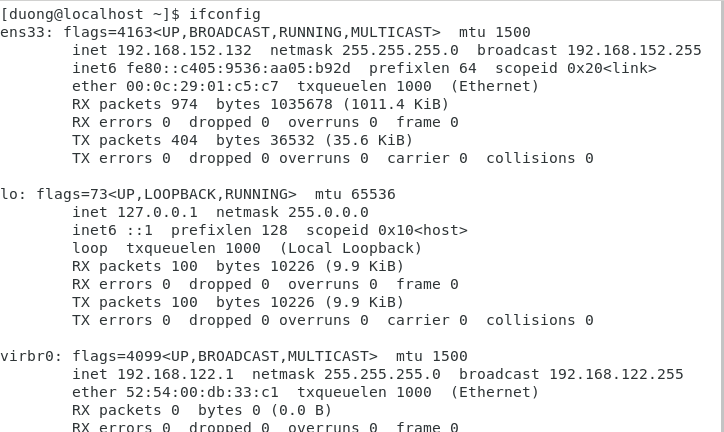

#uname : Kiểm tra hệ điều hành hiện tại đang sử dụng

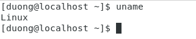

#cat /etc/os-release : kiểm tra thông tin bản phân phối của hệ điều hành hiện tại

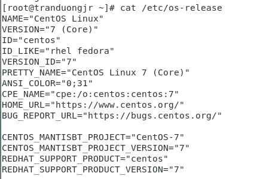

#date : kiểm tra ngày giờ hiện tại trên máy


#free -m : kiểm tra dung lượng RAM (-m thể hiện biểu diện dưới dạng MB)

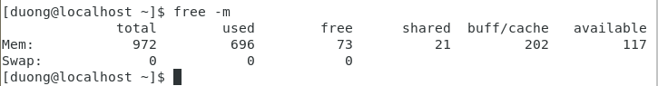

#lsblk : hiển thị phân vùng ổ đĩa


#cat /proc/cpuinfo : Xem thông tin CPU


#pwd : hiển thị đường dẫn đến thư mục đang làm việc hiện hành


#hostnamectl : xem thông tin hostname hiện tại của máy 

#su - : Truy cập vào tài khoản root

#su - duong :truy cập vào tài khoản duong đã tạo trước đó

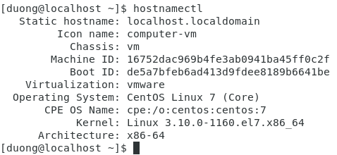

*Để có thể thay đổi hostname ta có thể sử dụng lệnh #hostnamectl set-hostname "tên hostname muốn đặt"* Để thực thi thay đổi này cần truy cập với tài khoản root. Sau đó chạy lệnh #systemctl restart systemd-hostnamed

#whoami : kiểm tra người user đang đăng nhập

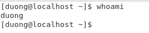

#history : hiển thị các lệnh đã được thực hiện bởi user hiện tại

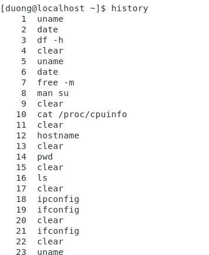
#ping + địa chỉ ip : để kiểm tra kết nối


#ps : Liệt kê các tiến trình đang kích hoạt bởi người dùng và PID của tiến trình đó.

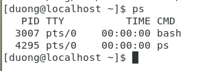

Để tạo user và group thì ta cần thực thi trên tài khoản root:

Dùng lệnh #su - sau đó xác nhận mật khẩu để truy cập root.

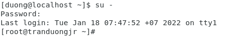

Tạo account cho user :
```
useradd + Tên user muốn tạo
```
Set password cho account:
```
passwd + Tên user muốn tạo mật khẩu
```


Tạo Group:
```
groupadd + Tên Group muốn tạo
```


Để thêm user vào group:
```
usermod -a -G +group muốn thêm user vào + tên user muốn thêm vào
```

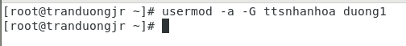

Để xem thông tin về group
```
cat /etc/group
```

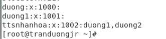

#yum update : update hệ thống


#yum install : cài đặt chương trình nào đó

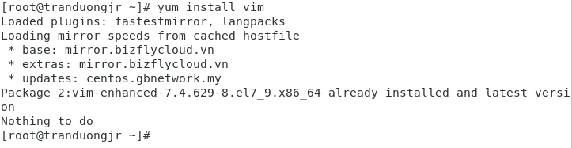

#logout : đăng xuất

#reboot : khởi động lại

#shutdown -h now : tắt máy ngay

#shutdown -h 10 & :lập lịch tắt máy lúc 10h

#shutdown -r now : khởi động lại

#init 0 : tắt máy

#init 6 : khởi động lại máy
## Thao tác với thư mục

#mkdir : tạo thư mục

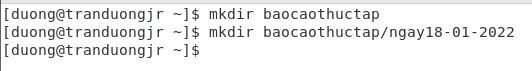

#rmdir : Để xóa thư mục và file rỗng

#rm -rf: xóa mà không cần hỏi lại những thư mục và file không rỗng

#cd : trỏ đến thư mục đó:

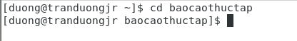

#ls : liệt kê nội dung của thư mục đang được trỏ tới.


#ls -l : xem quyền được phân trên thư mục đó.

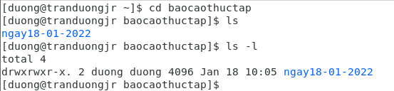

#du -sh : xem dung lượng của thư mục đang được trỏ tới.


### Phân quyền cho thư mục.

Phân quyền chia sẻ tài nguyên trên linux xem tại : https://docs.google.com/document/d/1nnxw7OR012pyAQkHc0xy4H-9pcRbSjCR/edit?usp=sharing&ouid=106628548253032794328&rtpof=true&sd=true

## Thao tác với file

#ls -a : liệt kê các file ẩn


#cat : xem nôi dung của file đó. Ví dụ xem file /etc/hosts

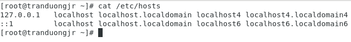

## Thao tác với trình soạn thảo Vi

- i : (insert) để bắt đầu thao tách ghi, sửa, xóa.
- w : (write) để lưu
- :q! : để thoát
- :wq :để thoát và lưu nội dung đã chỉnh sửa.
- / : để tìm kiếm. Ví dụ /duong
