# 1. Cài đặt Ubuntu 18 và 20.

1. Chuẩn bị:

Tùy theo nhu cầu của người dùng thì sẽ có thể lựa chọn dùng Ubuntu Server hoặc Ubuntu Desktop. Sự khác nhau cơ bản giữa hai phiên bản này chính là Ubuntu Desktop cung cấp cho người dùng một giao diện đồ họa trong khi phiên bản Server thì không. Ngoài ra, còn có một số điểm khác biệt như:

**Ubuntu Desktop**:

- Theo như truyền thống, Ubuntu Desktop bao gồm các ứng dụng phù hợp cho các công việc thông thường như hệ thống phần mềm văn phòng, phần mềm multimedia phục vụ nghe, nhìn,  record và web browser

**Ubuntu Server**

- Ubuntu Server cũng cung cấp các phiên bản tiêu chuẩn của Linux, nhưng tập trung hơn vào các yêu cầu cho Server, như tăng thêm các phần mềm máy tính cho email server, file server, web server và samba server.

*Tải Ubuntu server 18.04 và 20.04 Theo đường link*

Truy cập đường link: https://releases.ubuntu.com/18.04/ để tải ubuntu 18

Truy cập đường link: https://releases.ubuntu.com/20.04/ để tải ubuntu 20

2. Cài đặt

Các bước cài đặt tương tự như các máy ảo khác, tham khảo tại link : https://jii.li/cSxSi

Tiếp theo là các cài đặt đối với Ubuntu Server 18.04

Lựa chọn ngôn ngữ


Tiếp theo ta có thể cài ip tĩnh

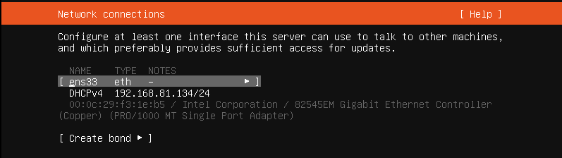


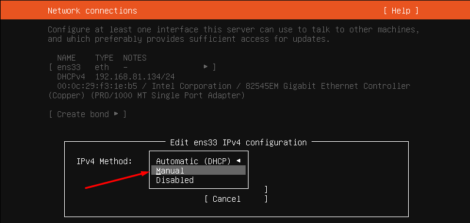


Sau đó có thể Save lại.

Tiếp theo phân vùng hệ điều hành:

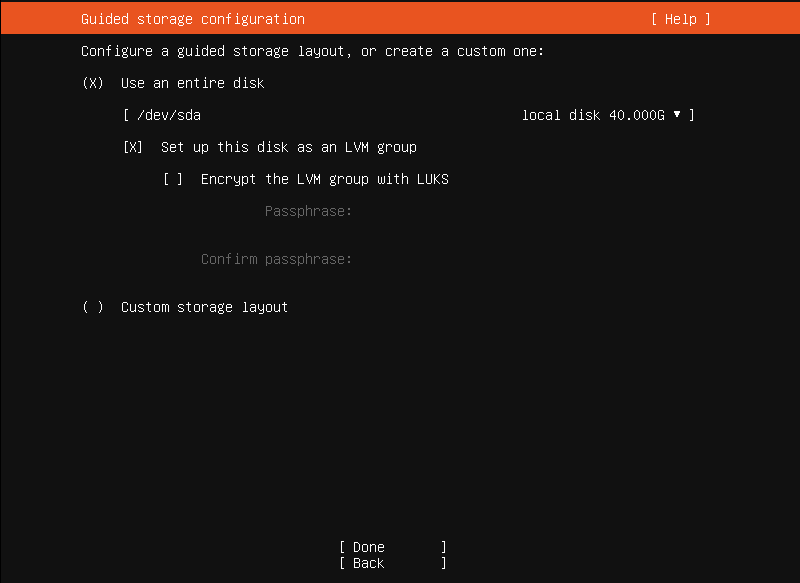

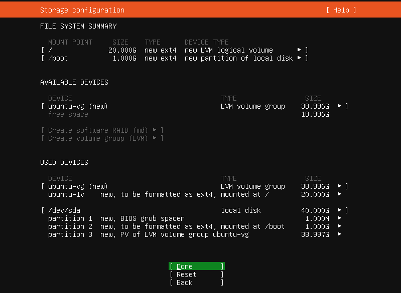

Cài đặt thông tin user


Tích chọn vào Install OpenSSH server để cài OpenSSH, sau đó Done.


Tiếp theo là cài đặt một số gói mở rộng, Nếu không cần thì ta có thể bỏ qua và Done. 


Chờ hệ thống cài đặt


Sau đó reboot now để khởi động lại và đăng nhập với tải khoản đã tạo


**Tương tự ta có thể cài được Ubuntu Server 20.04**

# 2. Các câu lệnh với Ubuntu.

Các câu lệnh của Ubuntu hầu hết giống các câu lệnh của Centos vì chúng đều là hệ điều hành Linux.

**Các lệnh cơ bản của Ubuntu**

## Các câu lệnh về hệ thống

cũng tương tự như đối với centos như:

uname : xem hệ điều hành

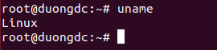

ifconfig : xem ip (hoặc dùng lệnh ip a)


cat /etc/*release : xem thông tin về bản phân phối hệ điều hành 

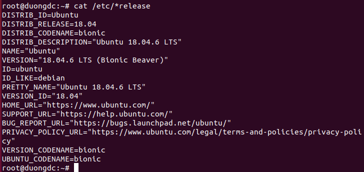

cat /proc/cpuinfo : xem thông tin cpu


cat /proc/meminfo : xem thông tin RAM


date : xem ngày giờ hiện tại trên máy.

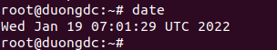

reboot : khởi động lại hệ thống

ps : kiểm tra tiến trình đang chạy của hệ thống.


pstree : hiển thị tiến trình của hệ thống dưới dạng cây

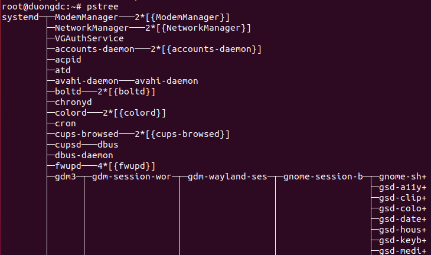

kill + PID : để dừng tiến trình có Prcess ID (PID - khi kiểm tra bằng lệnh ps)

top : hiển thị sự hoạt động của các tiến trình, đặc biệt là thông tin về tài nguyên hệ thống và việc sử dụng các tài nguyên của từng tiến trình.


lsblk : hiển thị phân vùng ổ đĩa 


whoami : xem người dùng hiện tại đang đăng nhập vào hệ thống.


history : hiển thị lịch sử cách dòng lệnh đã thực thi với user đang đăng nhập

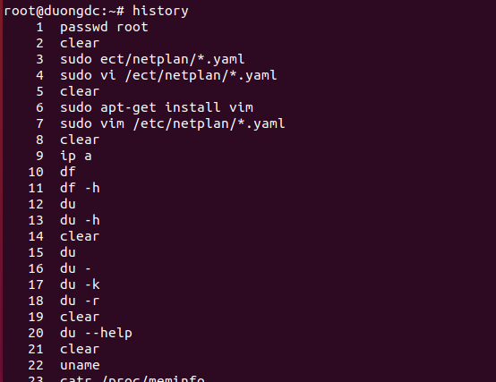

ping : kiểm tra kết nối

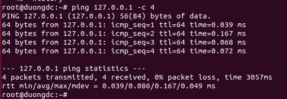

sudo apt-get update : update hệ thống


lsb_release -a : kiểm tra phiên bản linux đang dùng.


cal : xem lịch


logout : đăng xuất

reboot : khởi động lại

shutdown -h now : tắt máy ngay

shutdown -h 10 & :lập lịch tắt máy lúc 10h

shutdown -r now : khởi động lại

init 0 : tắt máy

init 6 : khởi động lại máy

useradd <tên user> : tạo user

passwd <tên user> : set password cho user đó

groupadd <tên group> : tạo group

usermod -a -G <tên group> <tên user> : thêm user vào group


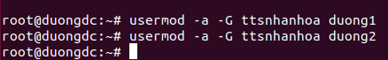

**Set ip tĩnh**

Dùng lệnh ip a để kiểm tra xem máy đang dùng card mạng nào 

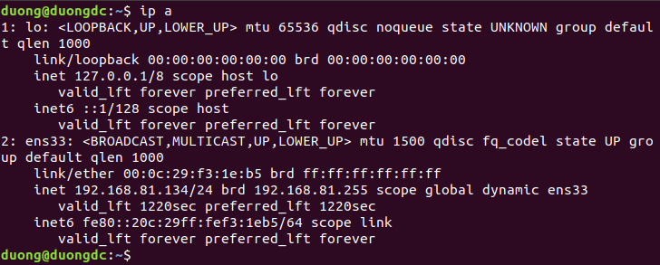

để đặt ip tĩnh trên card ens33 ta vào etc/netplan/*.yaml

```
sudo vi /etc/netplan/*.yaml
```

sau khi cấu hình ip tĩnh ta thoát và lưu :wq

dùng lệnh sudo netplan apply để chấp nhận cấu hình đã định.

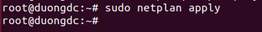

kiểm tra lại thấy ip đã được thiết lập

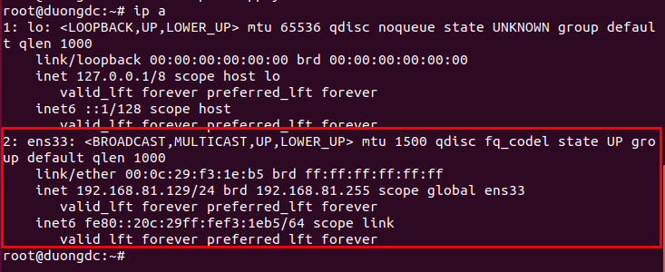

## Thao tác với thư mục

mkdir : tạo thư mục


rmdir : Để xóa thư mục và file rỗng

rm -rf: xóa mà không cần hỏi lại những thư mục và file không rỗng

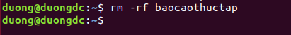

cd : trỏ đến thư mục đó:

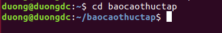

cat >tenfile.txt : tạo 1 file txt tại thư mục đang trỏ tới.


hoặc ta cũng có thể dùng lệnh #touch <tên tệp tin>


cat : để xem nội dung tệp tin


Để sửa tệp tin dùng trình soạn thảo vi
cú pháp vi + tên file muốn sửa nội dung

mv : dùng để đổi tên hoặc di chuyển thư mục

**Đổi tên**


**Di chuyển**

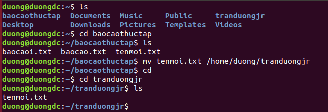

ls : liệt kê nội dung của thư mục đang được trỏ tới. ls -a sẽ liệt kê cả những file bị ẩn.

ls -l : xem quyền được phân trên thư mục đó.


du -sh : xem dung lượng của thư mục đang được trỏ tới.


## Thao tác với trình soạn thảo Vi

- i : (insert) để bắt đầu thao tách ghi, sửa, xóa.
- w : (write) để lưu
- :q! : để thoát
- :wq :để thoát và lưu nội dung đã chỉnh sửa.
- / : để tìm kiếm. Ví dụ /duong
