## Cài đặt Nginx

1. Update và cài thêm epel

```
yum update

yum install epel-release -y
```


2. Cài Nginx

```
yum install nginx
```

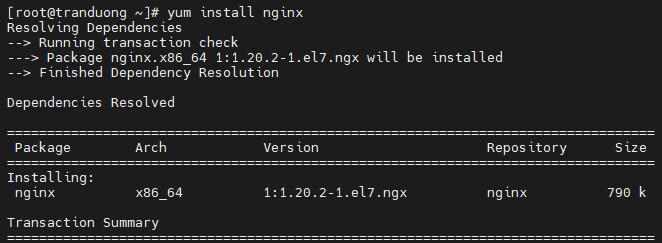

Sau đó khởi động nginx

```
systemctl enable nginx

systemctl start nginx
```


Thư mục mặc định của nginx là /usr/share/nginx/html/ Tại đây đã có sẵn 1 file index.html với nội dung có sẵn mặc định của Nginx.

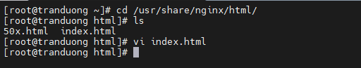

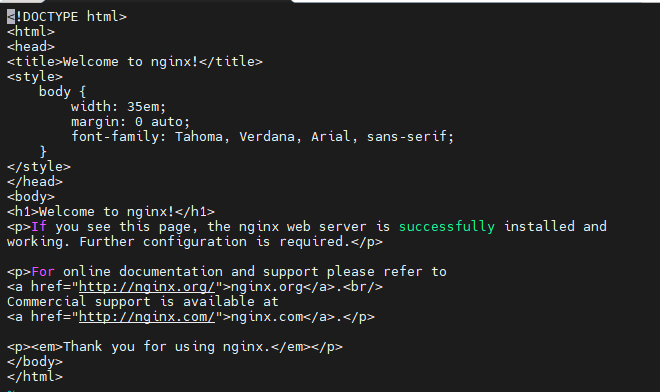

Tại đây ta có thể chỉnh sửa file index.html để hiển thị nội dung web của mình.

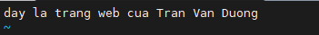

Kiểm tra hoạt động của Nginx (nhập địa chỉ ip của Webserver)

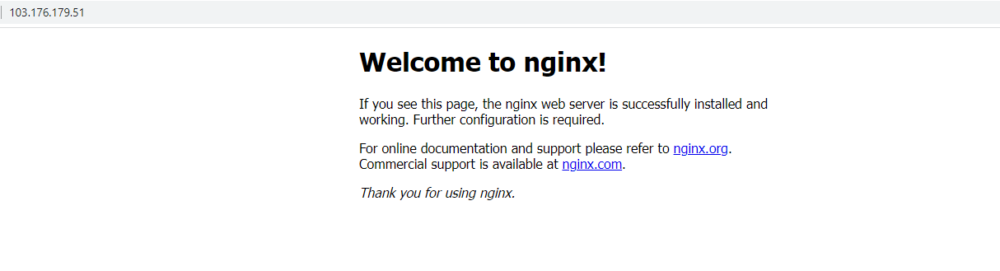

**Cấu  hình file Vhost**

- Tất cả các tệp cấu hình của Nginx đề nằm trong thư mục /etc/nginx

- Tệp cấu hình chính của Nginx là /etc/nginx/nginx.conf

- Dể duy trì, quản lý cấu hình Nginx dễ dàng thì ta nên tạo một file cấu hình riêng cho mỗi miền. Các file cấu hình này phải kết thúc bằng .conf và được lưu trữ tại /etc/nginx/conf.d/

Ví dụ tên miền tranduongjr.com thì ta sẽ tạo 1 tệp cấu hình đặt tại /etc/nginx/conf.d/ như sau

```
vi /etc/nginx/conf.d/tranduongjr.com.conf
```

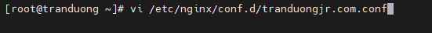

Và cấu hình như sau:

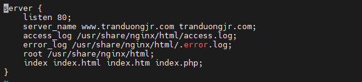

- Server_name : miền ánh xạ tới ip của webserver

- accesslog và errorlog : nơi lưu trữ các log 

- root : nơi lưu trữ tài nguyên của website

- trường index để web chạy các thư mục khi được yêu cầu. Yêu cầu đó có thể là html hoặc php,...


## Cài PHP

Cài 2 gói php-mysql và php-fpm

```
yum install php php-mysql php-fpm
```

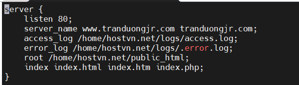

Sau đó cấu hình các thông số cho PHP. 

Chúng ta sử dụng Unix Domain Soket để kết nối Nginx tới php-fpm thay vì TCP/IP Socket. Chi tiết về 2 socket này tham khảo tại :

https://github.com/tranduongjr/baocaothuctap/blob/main/Unix%20Soket%20%26%20TCP%20IP%20socket/Unix%20Soket%20%26%20TCP%20IP%20socket.md

Ta mở file cấu hình php-fpm với dòng lệnh:

```
vi /etc/php.ini
```

Tìm đến tham số cgi.fix_pathinfo đang được comment lại bằng dấu ; và thiết lập giá trị cho tham số này bằng 0. Đây là một thiết lập cực lỏng lẻo về bảo mật, tham số này cho phép PHP sẽ thực thi một file gần nó nhất nếu không có file PHP nào phù hợp. 

Sử dụng /<từ tìm kiếm> để tìm kiếm trong vi

Chuyển tham số cgi.fix_pathinfo=0 chuyển thành 1

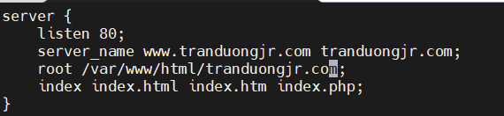

Lưu lại và thoát

Tiếp đến mở file cấu hình php-fpm.d/www/conf

```
vi /etc/php-fpm.d/www/conf
```

Tìm đến tham số listen và thay bằng:

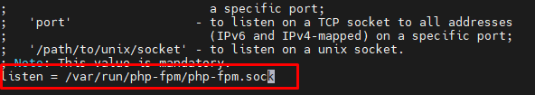

Tìm đến listen.owner và listen group rồi bỏ comment(;) đi

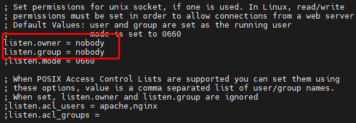

Tìm đến tham số user = apache, group = apache và thay bằng nginx:

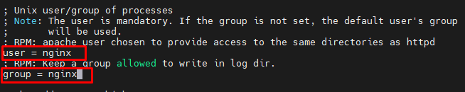

Như vậy ta đã cấu hình xong file www.conf thực hiện lưu và thoát sau đó khởi động php-fpm.

```
systemctl enable php-fpm

systemctl start php-fpm
```

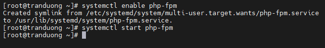

Phân quyền cho thư mục /var/run/php-fpm/php-fpm.sock cho owner Nginx và group Nginx có quyền truy xuất, chạy php-fpm.

```
chown -R nginx:nginx /var/run/php-fpm/php-fpm.sock
```

**Cấu hình nginx để xử lý các trang PHP**

Truy cập file Vhost để chỉnh sửa cấu hình:

```
vi /etc/nginx/conf.d/tranduongjr.com.conf
```

```
server {
    listen 80;
    server_name www.tranduongjr.com tranduongjr.com;
    access_log /usr/share/nginx/html/access.log;
    error_log /usr/share/nginx/html/error.log;
    root /usr/share/nginx/html;
    index index.php index.html index.htm;

    location / {
        try_files $uri $uri/ =404;
    }
    error_page 404 /404.html;
    error_page 500 502 503 504 /50x.html;
    location = /50x.html {
        root /usr/share/nginx/html;
    }

    location ~ \.php$ {
        roor /usr/share/nginx/html/;
        fastcgi_pass unix:/var/run/php-fpm/php-fpm.sock;
        fastcgi_index index.php;
        fastcgi_param SCRIPT_FILENAME $document_root$fastcgi_script_name;
        include fastcgi_params;
    }
}
```

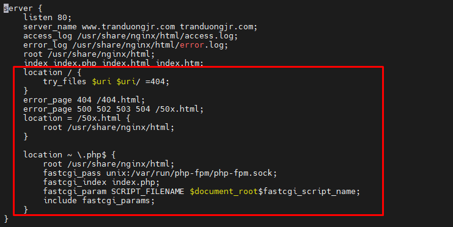 

Khởi động lại Nginx 

```
systemctl restart nginx
```

Kiểm tra xem webserver đã xử lý trang PHP chưa bằng cách:

- Tạo 1 file info.php tại /usr/share/nginx/html

```
vi /usr/share/nginx/html/info.php
```

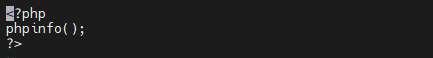

Khởi động lại Nginx và truy cập vào tranduongjr.com/info.php để kiểm tra

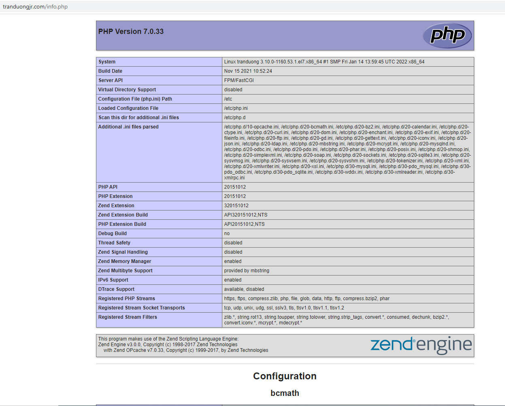

Như vậy là Webserver đã xử lý được trang PHP.

## Cài Mariadb và WordPress.
### Cài Mariadb

```
yum install mariadb-server mariadb
```

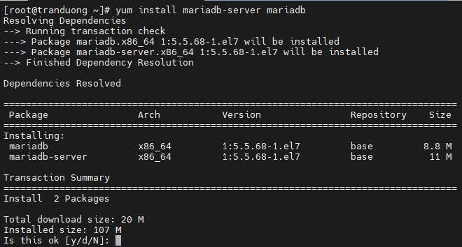

Khởi động Mariadb 

```
systemctl enable mariadb.service

systemctl start mariadb.service
```


Tiếp theo chạy 1 script về bảo mật giúp loại bỏ một số mặc định nguy hiểm với lệnh:

```
mysql_secure_installation
```

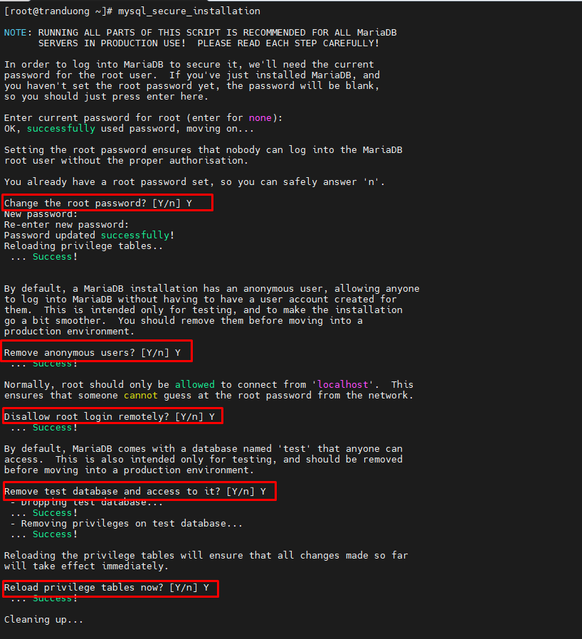


- Thay đổi mật khẩu root trên CSDL
- Loại bỏ những user nặc danh
- Không cho phép root remote từ xa
- Loại bỏ các CSDL test
- Tải lại các đặc quyền vừa thiết lập

### Cài WordPress

Truy cập vào nơi lưu trữ dữ liệu của Website

```
cd /usr/share/nginx/html
```

Tải WordPress về

```
wget https://wordpress.org/latest.tar.gz
```

Giải nén:

```
tar xzvf latest.tar.gz
```

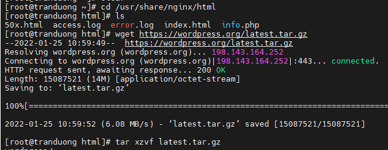

Chuyển tất cả dữ liệu trong WordPress ra ngoài thư mục /usr/share/nginx/html vì trước đó đã thiết lập Webserver đọc dữ liệu tại /usr/share/nginx/html

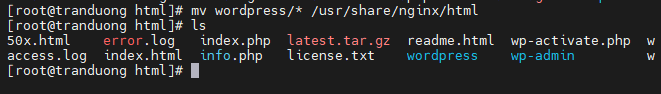

### Tạo cơ sở dữ liệu

Đăng nhập mariadb với tài khoản root, password đã được thiết lập trước đó khi cấu hình mysql_secure_installation

```
mysql -u root -p
```


- Tạo database tên duongdb
- Gán quyền thực thi với duongdb cho người dùng Miracle với mật khẩu Xinhlunglinh2
- Áp dụng thiết lập

### Thiết lập WordPress kết nối với database

Truy cập vào nơi lưu trữ các tệp cấu hình WordPress

```
cd /usr/share/nginx/html
```

Đổi tên tệp cấu hình wp-config-sample.php thành wp-config.php

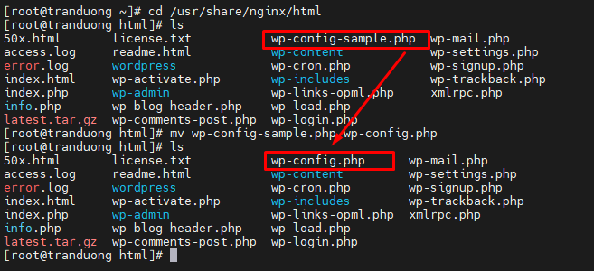

Chỉnh sửa cấu hình file wp-config.php

```
vi wp-config.php
```

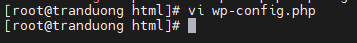

Thay đổi các giá trị DB_USERNAME, DB_USER, DB_PASSWORD như đã thiết lập cho database duongdb.

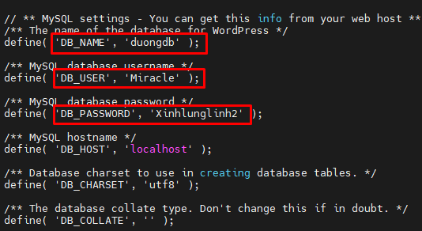

Xóa các file index.html và info.php đã dùng để test web và php trước đó

Khởi động lại Apache

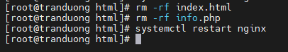

Truy cập vào trang quản trị WordPress bằng cách thêm /wp-admin vào sau tên miền.

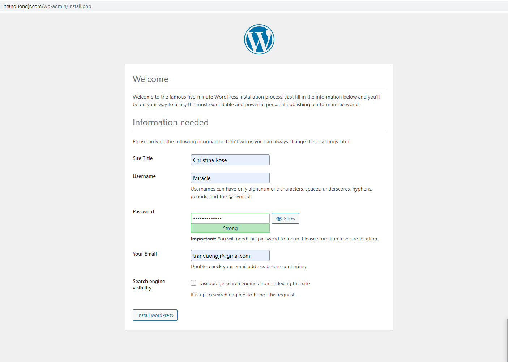

Thiết lập các thông tin như tên website, thông tin đăng nhập gồm tên người dùng và mật khẩu, địa chỉ email để dùng cho mục đích quản trị. Sau đó đăng nhập

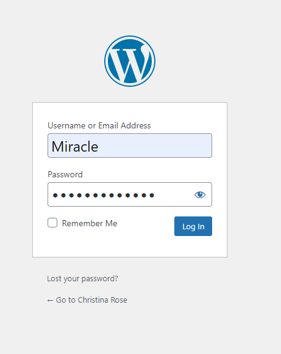

Trang quản trị WordPress hiện ra, tại đây ta có thể thực thi các thiết lập với trang web của mình.

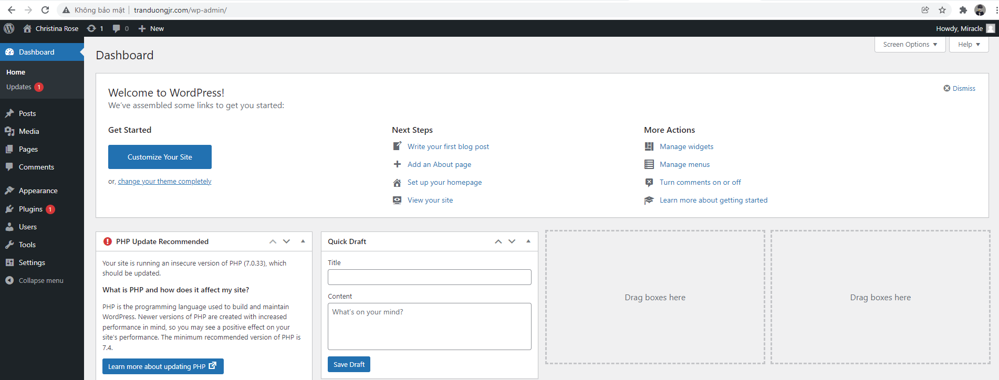