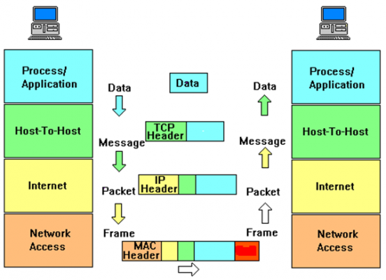
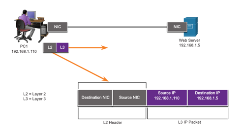
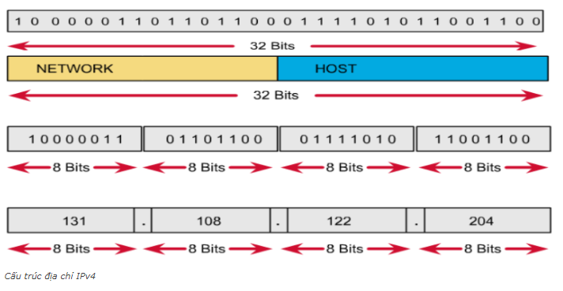
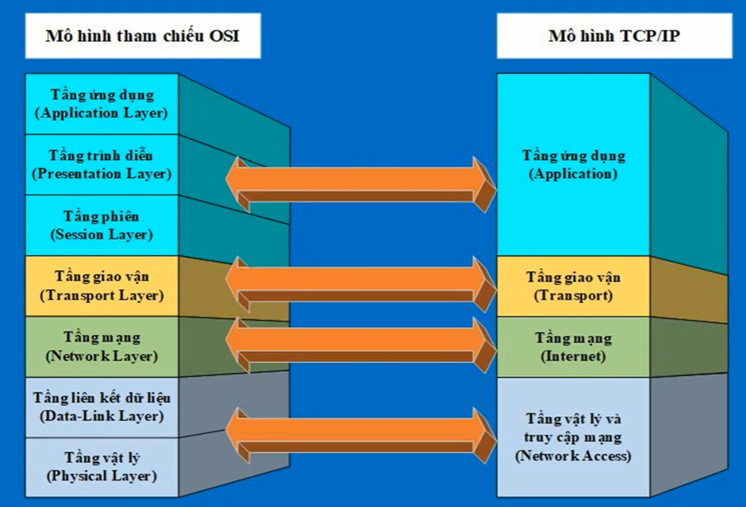

# 1. Tổng quan về mô hình OSI và TCP/IP

  Trong mạng máy tính, để truyền tải dữ liệu giữa các người dùng với nhau thì cần có một phương pháp nào đó mang tính hệ thống. Phương pháp này sẽ giúp truyền tải dữ liệu theo quy tắc nhất định, tạo điều kiện cho dữ liệu truyền đi trên môi trường mạng một cách mượt mà, có hệ thống. Mô hình OSI và TCP/IP là những mô hình phổ biến nhất hiện nay.

Quá trình truyền dữ liệu qua mạng:

Quá trình đóng gói dữ liệu:

Quá trình đóng gói dữ liệu diễn ra bên máy gửi. Dữ liệu xuất phát từ tầng ứng dụng được đóng gói và chuyển xuống các tầng kế tiếp, đến mỗi tầng dữ liệu được gắn thêm thông tin mô tả của tầng tương ứng gọi là header.

Khi dữ liệu đến tầng “transport”, tại đây diễn ra quá trình chia nhỏ gói tin nếu kích thước dữ liệu lớn hơn so với kích thước truyền tối đa cho phép. Dữ liệu đến đến tầng “network”, mỗi gói tin sẽ gắng thêm thông tin tương ứng ở tầng này gọi là “IP header”, trong đó có chứa thông tin quan trọng là địa chỉ IP nguồn và IP đích được sử dụng trong quá trình định tuyến.

Dữ liệu đến tầng “Data-Link” sẽ gắng thêm thông tin mô tả tầng này gọi là “Frame header”, trong đó có chứa thông tin về địa chỉ MAC nguồn và MAC đích. Trường hợp địa chỉ MAC đích không biết, máy tính sẽ dùng giao thức ARP để tìm. Sau đó dữ liệu chuyển xuống tầng “Physical”, chuyển thành các tín hiệu nhị phân để truyền đi.

Quá trình mở gói dữ liệu:

Quá trình mở gói dữ liệu diễn ra bên máy nhận. Nguyên tắc chung là các “header” sẽ được mở ở các tầng tương ứng. Khi máy đích nhận được một dãy các bit, dữ liệu được xử lý bởi quá trình mở gói như sau:

Tầng Data link kiểm tra trailer (FCS) để xem dữ liệu có bị lỗi hay không. Frame có thể bị loại bỏ hoặc yêu cầu để được truyền lại.

Nếu dữ liệu không bị lỗi, tầng Data Link đọc và thông dịch thông tin điều khiển trong tầng Data Link.

Tầng Data link gỡ bỏ “header” và “trailer”, sau đó gửi phần dữ liệu còn lại lên tầng Internet.

## 1.1. Mô hình OSI.
  Mô hình OSI (Open Systems Interconnection) là mô hình giúp kết nối giữa các thiết bị Internet trên toàn cầu. Mô hình này có kiến trúc phân tầng, gồm 7 tầng với những chức năng riêng biệt của từng tầng như mô hình sau: 

### a, Tầng vật lý (Physical Layer).

Trước khi bất kỳ giao tiếp mạng nào có thể xảy ra, kết nối vật lý với mạng cục bộ phải được thiết lập.

Kết nối này có thể là có dây hoặc không dây tùy thuộc vào thiết lập của mạng.

Các tiêu chuẩn Tiêu chuẩn lớp vật lý đề cập đến ba lĩnh vực chức năng:

- Thành phần vật lý
- Mã hóa
- Báo hiệu 

Thành phần Vật lý là các thiết bị phần cứng, phương tiện và các đầu nối khác truyền tín hiệu đại diện cho các bit.

Các thành phần phần cứng như NIC, giao diện và đầu nối, vật liệu cáp và thiết kế cáp đều được quy định trong các tiêu chuẩn liên quan đến lớp vật lý.

Mã hóa chuyển đổi luồng bit thành một định dạng có thể nhận biết được bởi thiết bị tiếp theo trong đường dẫn mạng.

Ở tầng này thì dữ liệu được truyền đi dưới dạng bit 0 và 1.

Việc 'mã hóa' này cung cấp các mẫu có thể dự
đoán được mà thiết bị tiếp theo có thể nhận ra

**Tóm lại** : Tầng này đảm bảo các vấn đề về các thiết bị vật lý liên quan tới quá trình định tuyến mạng. Xác định các chức năng, thủ tục về điện, cơ, quang để kích hoạt, đưa dữ liệu về dạng bit 0, 1, đảm bảo cho quá trình truyền tải dữ liệu được hiệu quả nhất. Ở tầng này thì dữ liệu được truyền đi dưới dạng bit 0 và 1.

### b, Tầng liên kết dữ liệu (Data Link Layer).

Đáp ứng các nhu cầu về tầng mạng và phát sinh các yêu cầu phục vụ gửi tới tầng vật lý. Đảm bảo truyền tải các khung dữ liệu (Frame) giữa hai máy tính có đường truyền vật lý nối trực tiếp với nhau là điều mà chúng thực hiện. Ngoài ra nó còn cài đặt cơ chế phát hiện và xử lý lỗi dữ liệu nhận.

Lớp Liên kết dữ liệu chịu trách nhiệm giao tiếp giữa các thẻ giao diện mạng thiết bị đầu cuối.

Nó cho phép các giao thức lớp trên truy cập phương tiện lớp vật lý và đóng gói các gói tin tầng mạng (IPv4 và IPv6) vào Khung tầng liên kết dữ liệu

Nó cũng thực hiện phát hiện lỗi và từ chối các khung bị hỏng

Một bộ định tuyến thực hiện bốn chức năng Cơ bản của Tầng liên kết dữ liệu:

Chấp nhận khung từ phương tiện mạng.

Khử đóng gói khung để hiển thị gói được đóng gói.

Đóng gói lại gói tin vào một khung mới.

Chuyển tiếp khung mới trên phương tiện của phân đoạn mạng tiếp theo.

**Khung dữ liệu**

Dữ liệu được đóng gói bởi lớp liên kết dữ liệu với header và trailer để tạo thành một khung.
Khung liên kết dữ liệu có ba phần:

- Header
- Data
- Trailer

Các trường của Header và Trailer khác nhau tùy theo giao thức lớp liên kết dữ liệu.

Lượng thông tin điều khiển được mang theo trong khung thay đổi tùy theo thông tin điều khiển truy cập và cấu trúc liên kết logic.

| Trường | Mô tả |
|--------|-------|
|Frame Start and Stop|Xác định phần đầu và phần cuối của khung|
|Address|Chỉ ra nút nguồn và đích|
|Type|Xác định giao thức mà tầng mạng đóng gói (Ipv6,ipv6,..)|
|Control|Xác định dịch vụ kiểm soát luồng|
|Data|chứa dữ liệu được tải trong khung|
|Error Detection|Được dùng để xác định lỗi đường truyền|

### c, Tầng mạng (Network Layer).

Đáp ứng các nhu cầu về tầng vận chuyển. Tầng mạng đảm nhiệm việc truyền các gói tin (packet) giữa hai máy tính bất kỳ trong mạng máy tính.

Cung cấp các dịch vụ để cho phép các thiết bị cuối trao đổi dữ liệu.

IP version 4 (IPv4) và IP version 6 (IPv6) là các giao thức truyền thông lớp mạng nguyên tắc.

Lớp mạng thực hiện bốn hoạt động cơ bản:

- Giải quyết các thiết bị đầu cuối
- Đóng gói
- Lộ trình (routing)
- Khử đóng gói

Đặc điểm lớp mạng đóng gói IP:

Đóng gói IP phân đoạn của tầng vận chuyển (transpot layer).

Gói IP có thể sử dụng là gói IPv4 hoặc IPv6 và không ảnh hưởng đến phân đoạn tầng vận chuyển.

Gói IP sẽ được kiểm tra bởi tất cả các thiết bị tầng mạng khi nó truyền qua mạng.

Địa chỉ IP không thay đổi từ nguồn đến đích.

**Ipv4**

IPv4 là giao thức truyền thông chính cho lớp mạng.

Tiêu đề mạng có nhiều mục đích:

- Nó đảm bảo gói tin được gửi theo đúng hướng (đến đích).
- Nó chứa thông tin để xử lý lớp mạng trong các lĩnh vực khác nhau.
- Thông tin trong tiêu đề được sử dụng bởi tất cả các thiết bị tầng mạng xử lý gói tin.

Đặc điểm gói tin IPv4:
- Nó ở dạng nhị phân.
- Chứa một số trường thông tin
- Sơ đồ được đọc từ trái sang phải, 4 byte mỗi dòng
- Hai trường quan trọng nhất là nguồn và đích

IPv4 có ba hạn chế chính:
- Sự cạn kiệt địa chỉ IPv4
- Thiếu kết nối end-to-end: Để IPv4 tồn tại lâu dài, địa chỉ riêng tư và NAT đã được tạo ra. Điều này đã kết thúc các giao tiếp trực tiếp với việc giải quyết công khai.
- Tăng độ phức tạp của mạng: NAT được coi là giải pháp tạm thời và tạo ra các vấn đề trên mạng như một tác dụng phụ của việc thao tác địa chỉ tiêu đề mạng. NAT gây ra sự cố về độ trễ và khắc phục sự cố

**Ipv6**

IPv6 khắc phục những hạn chế của IPv4.

Những cải tiến mà IPv6 cung cấp:

- Tăng không gian địa chỉ: dựa trên địa chỉ 128 bit, không phải 32 bit
- Cải thiện xử lý gói: tiêu đề đơn giản hóa với ít trường hơn
- Loại bỏ nhu cầu về NAT: vì có một lượng lớn địa chỉ, không cần sử dụng địa chỉ riêng tư trong nội bộ và được ánh xạ tới một địa chỉ công cộng được chia sẻ

Tiêu đề IPv6 được đơn giản hóa, nhưng không nhỏ hơn.

Tiêu đề được cố định ở độ dài 40 Byte hoặc octet.

Một số trường IPv4 đã bị xóa để cải thiện hiệu suất:

Gói IPv6 cũng có thể chứa các tiêu đề mở rộng (EH).

Đặc điểm của tiêu đề EH:

- Cung cấp thông tin lớp mạng tùy chọn
- là tùy chọn
- Được đặt giữa tiêu đề IPv6 và tải trọng
- Có thể được sử dụng để phân mảnh, bảo mật, hỗ trợ di động, v.v.

Không giống như IPv4, bộ định tuyến không phân mảnh các gói IPv6

### d, Tầng vận chuyển (Transport Layer).

Vai trò của chúng là phân mảnh các gói tin có kích thước lớn khi gửi và tập hợp chúng khi nhận, quá trình phân mảnh khi gửi và nhận đảm bảo tính toàn vẹn cho dữ liệu (không bị mất mát, không lặp và đúng thứ tự).

=> Khi A muốn gửi dữ liệu cho bên B. 1 kết nối được thiết lập giữa A và B, bên máy A gửi dữ liệu sử dụng cơ chế phân mảnh thì bên máy B sẽ nhận dữ liệu theo đúng trật tự ban đầu bên gửi.

Tại tầng này, dữ liệu truyền đi và nhận về sẽ được kiểm soát luồng và kiểm soát lỗi để đảm bảo dữ liệu truyền đi được chính xác và không quá tải cho bên nhận.

### e, Tầng phiên (Session).

Tầng này tạo ra và duy trì một phiên cho quá trình truyền tải dữ liệu giữa hai thiết bị. Nó chịu trách nhiệm cho việc đóng, mở luồng cho quá trình giao tiếp giữa 2 thiết bị với nhau, đảm bảo rằng phiên mở đủ lâu để dữ liệu có thể truyền tải hết và đóng đủ nhanh để tránh lãng phí tài nguyên.

Tầng phiên còn đánh dấu điểm hoàn thành. Ví dụ khi truyền 1 file 10gb dữ liệu. Sau mỗi 1gb được truyền đi thì sẽ được đánh dấu điểm hoàn thành tại đó. Nên khi có sự cố đường truyền tại điểm 5gb thì khi có kết nối lại sẽ tiếp tục truyền từ điểm 5gb đến khi truyền hết 10gb.

### f, Tầng trình bày (Presentation Layer).

  Đáp ứng các yêu cầu của tầng ứng dụng như phiên dịch, giải mã, mã hóa và nén dữ liệu trước khi đưa xuống tầng phiên.
  
  Tại tầng này, dữ liệu được phiên dịch thành ngôn ngữ mà ứng dụng có thể hiểu được
### g, Tầng ứng dụng.

  Là tầng đầu tiên của mô hình OSI, tầng này cung cấp giao diện cũng như các thao tác dữ liệu giúp người dùng tương tác trực tiếp với ứng dụng. Thông qua các phần mềm sẽ giúp cho người dùng truy cập các thông tin và dữ liệu trên mạng. Một số giao thức hoạt động tại tầng này như HTTP, FTP, POP, IMAP, SMTP, SNMP,TCP, DNS,.... Một số ứng dụng về tầng này như Web, Mail,...

**Tóm lược quá trình truyền dữ liệu trong mô hình OSI:**

Khi người dùng A muốn gửi dữ liệu cho người dùng B :

*Phía A gửi dữ liệu:*

- Tại tầng ứng dụng (Application) A sẽ thao tác với ứng dụng để đưa thông tin cần gửi vào thiết bị máy tính (Thông tin có thể là hình ảnh, văn bản, âm thanh,...) và khi dữ liệu đi qua các mỗi tầng nó sẽ được gán 1 Header tương ứng.
- Dữ liệu khi xuống tầng Trình diễn (Presentation Layer) sẽ được chuyển thành 1 dạng chung để mã hóa và nén dữ liệu.
- Tiếp tới tầng Phiên (session) sẽ bổ sung các thông tin cần thiết cho phiên giao dịch giữa A và B, mở ra phiên liên lạc cho quá trình truyền dữ liệu.
- Dữ liệu tiếp tục được đưa xuống tầng vận chuyển, tùy vào kích thước của gói tin thì tại đây dữ liệu sẽ được phân mảnh thành các segment và được bổ sung thêm các thông tin về phương thức vận chuyển dữ liệu để đảm bảo tính bảo mật, tin cậy khi truyền
- Xuống tầng Network thì các segment lại tiếp tục được phân thành nhiều gói Package khác nhau (ipv4 hoặc ipv6,...) và được bổ sung thông tin định tuyến, đây là nơi định tuyến đường đi cho gói tin.
- Tới tầng Data link thì mỗi Package sẽ được băm ra thành nhiều Frame và bổ sung thêm các thông tin kiểm tra gói tin chứa dữ liệu để kiểm tra ở máy nhận. Riêng tại tầng Data Link này thì ngoài việc gán 1 Header cho gói tin thì nó còn đống thêm 1 phần đó là kiểm tra lỗi FCS.
- Cuối cùng, các Frame này khi chuyển xuống tầng vật lý sẽ được chuyển thành một chuỗi các bit nhị phân 0, 1.Và được đưa lên trên các phương tiện truyền dẫn để truyền dữ liệu tới máy người nhận

*Phía B nhận dữ liệu*

- Từ tầng vật lý phía người nhận sẽ kiểm tra quá trình đồng bộ và đưa các chuỗi bit nhị phân nhận được vào vùng đệm. Sau đó gửi thông báo tới tầng Data Link rằng đã nhận được dữ liệu.
- Dữ liệu được đưa tới tầng Data Link. tại đây sẽ tiến hành kiểm tra lỗi trong frame bằng cách tiến hành kiểm tra FCS trong gói tin. Nếu có lỗi thì frame đó sẽ bị hủy bỏ. Sau đó kiểm tra địa chỉ lớp Data Link (MAC address) xem có trùng với địa chỉ máy nhận hay không. Nếu trùng thì gỡ bỏ Header đã gán của tầng Data Link và chuyển dữ liệu lên tầng Network. Còn nếu không tìm được địa chỉ MAC tương ứng, máy tính sẽ sử dụng giao thức ARP.
- Tầng Network sẽ kiểm tra địa chỉ trong gói tincos phải là địa chỉ của máy nhận hay không. Nếu đúng thì sẽ gỡ bỏ header của nó và tiếp tục chuyển đến tầng Transport.
- Tại tầng transport sẽ hỗ trợ phục hồi và xử lý lỗi bằng cách gửi các gói tin ACK, NAK (Phản hồi xem gói tin chứa dữ liệu đã gửi đến máy nhận hay chưa?) Sau khi hoàn thành thì sẽ sắp xếp thứ tự phân đoạn dữ liệu rồi đưa lên tầng Phiên
- Tầng phiên sẽ đảm bảo dữ liệu trong các gói tin được toàn vẹn. Sau đó gỡ bỏ header của tầng này và đưa lên tầng Presentation.
- Tầng trình diễn sẽ chuyển đổi các định dạng dữ liệu sao cho phù hợp rồi đưa tới tầng ứng dụng.
- Tầng ứng dụng tiến hành xử lý và gỡ bỏ Header cuối cùng. Khi đó B nhận được thông điệp mà A gửi tới.

## 1.2. Mô hình TCP/IP.
Mô hình TCP/IP (Transmission Control Protocol/Internet Protocol) là giao thức truyền thông được sử dụng để kết nối các thiết bị với nhau thông qua mạng Internet.
Bộ giao thức TCP/IP hoạt động như một lớp trìu tượng giữa các ứng dụng Internet và hạ tầng Router/Switch.

TCP/IP là sự kết hợp của 2 giao thức là TCP (Giao thức truyền vận) đóng vai trò kiểm tra và đảm bảo sự an toàn của mỗi gói tin khi đi qua mỗi trạm. Trong quá trình này, nếu giao thức TCP nhận được gói tin bị lỗi thì một tín hiệu được truyền đi và yêu cầu hệ thống gửi lại một gói tin khác. Và giao thức IP (Giao thức liên mạng) cho phép các gói tin được gửi đến đích định sẵn bằng cách gán thông tin đường dẫn cho các gói tin để gói tin có thể đến được đích đã định sẵn ban đầu.
Mô hình TCP/IP gồm 4 tầng:
### a, Tầng ứng dụng (Application)
Đây là lớp giao tiếp trên cùng của mô hình. Đúng với tên gọi, tầng Ứng dụng đảm nhận vai trò giao tiếp dữ liệu giữa 2 máy khác nhau thông qua các dịch vụ mạng khác nhau (duyệt web, chat, gửi email, một số giao thức trao đổi dữ liệu: HTTP, SMTP, SSH, FTP,...)
Các dữ liệu khi tới tầng này sẽ được định dạng để kết nối theo kiểu Byte nối Byte. Các thông tin định tuyến tại đây sẽ giúp xác định đúng đường đi của một gói tin.
### b, Tầng giao vận (Transpot Layer).
Chức năng chính của tầng 3 là xử lý vấn đề giao tiếp giữa các máy chủ trong cùng một mạng hoặc khác mạng được kết nối với nhau thông qua bộ định tuyến. Tại đây dữ liệu sẽ được phân đoạn, mỗi đoạn sẽ không bằng nhau nhưng kích thước phải nhỏ hơn 64KB. Cấu trúc đầy đủ của một Segment lúc này là Header chứa thông tin điều khiển và sau đó là dữ liệu.

Trong tầng này còn bao gồm 2 giao thức cốt lõi là TCP và UDP.

#### b.1. Giao thức TCP:

TCP là giao thức truyền tải hướng kết nối (connection-oriented), nghĩa là phải thực hiện thiết lập kết nối với đầu xa trước khi thực hiện truyền dữ liệu. Tiến trình thiết lập kết nối ở TCP được gọi là tiến trình bắt tay 3 bước (threeway handshake).
    
Cung cấp cơ chế báo nhận (Acknowledgement) :Khi A gửi dữ liệu cho B, B nhận được thì gửi gói tin cho A xác nhận là đã nhận. Nếu không nhận được tin xác nhận thì A sẽ gửi cho đến khi B báo nhận thì thôi.
    
Cung cấp cơ chế đánh số thứ tự gói tin (sequencing) cho các đơn vị dữ liệu được truyền, sử dụng để ráp các gói tin chính xác ở điểm nhận và loại bỏ gói tin trùng lặp.
    
Có các cơ chế điều khiển luồng thích hợp (flow control) để tránh nghẽn xảy ra.
    
Hỗ trợ cơ chế full-duplex ( truyền và nhận dữ liệu cùng một lúc)
    
Phục hồi dữ liệu bị mất trên đường truyền ( A gửi B mà không thấy xác nhận sẽ gửi lại) .
    
#### b.2. Giao thức UDP:

Ngược lại với giao thức TCP thì UDP là giao thức truyền tải hướng không kết nối (connectionless). Nó sẽ không thực hiện thao tác xây dựng kết nối trước khi truyền dữ liệu mà thực hiện truyền ngay lập tức khi có dữ liệu cần truyền (kiểu truyền best effort) => truyền tải rất nhanh cho dữ liệu của lớp ứng dụng.
    
Không đảm bảo tính tin cậy khi truyền dữ liệu và không có cơ chế phục hồi dữ liệu ( nó không quan tâm gói tin có đến đích hay không, không biết gói tin có bị mất mát trên đường đi hay không) => dễ bị lỗi.
    
Không thực hiện các biện pháp đánh số thứ tự cho các đơn vị dữ liệu được truyền…
    
Nhanh và hiệu quả hơn đối với các dữ liệu có kích thước nhỏ và yêu cầu khắt khe về thời gian.
    
Bản chất không trạng thái nên UDP hữu dụng đối với việc trả lời các truy vấn nhỏ với số lượng lớn người yêu cầu.

UDP được sử dụng khi tốc độ nhanh và không cần thiết sửa lỗi. Ví dụ, UDP thường được sử dụng cho các chương trình phát sóng trực tiếp và game online.

Ví dụ, bạn đang xem phát video trực tiếp, thường được phát bằng UDP thay vì TCP. Máy chủ sẽ gửi một luồng liên tục các gói tin UDP tới máy tính đang xem. Nếu bạn mất kết nối trong vài giây, video sẽ bị dừng hoặc bị giật trong giây lát và sau đó chuyển sang bit hiện tại của chương trình phát sóng. Nếu bạn chỉ bị mất gói tin nhỏ, video hoặc âm thanh có thể bị méo trong giây lát vì video sẽ tiếp tục phát mà không có dữ liệu bị thiếu.

Điều này hoạt động tương tự trong các trò chơi trực tuyến. Nếu bạn bỏ lỡ một số gói tin UDP, nhân vật người chơi có thể dịch chuyển trên bản đồ khi bạn nhận gói tin UDP mới. Việc bỏ qua sửa lỗi của TCP sẽ giúp tăng tốc kết nối trò chơi và giảm độ trễ

#### b.3. So sánh phân biệt TCP và UDP

*Giống nhau*
Cả 2 giao thức đều gửi dữ liệu qua Internet dưới dạng gói.
Đều là các giao thức mạng TCP/IP hoạt động tại tầng giao vận (Transpot Layer)

*Khác nhau*

| TCP | UDP |
|-----|-----|
|Hướng kết nối|Hướng không kết nối|
|Độ tin cậy cao|Độ tin cậy thấp|
|Gửi dữ liệu theo dạng luồng byte|Gửi dữ liệu theo datagram|
|Không cho phép mất gói tin|Cho phép mất gói tin|
|Đảm bảo việc truyền dữ liệu|Không đảm bảo việc truyền dữ liệu|
|Có sắp xếp thứ tự các gói tin|Không sắp xếp thứ tự các gói tin|
|Tốc độ truyền dữ liệu thấp hơn UDP|Tốc độ truyền dữ liệu cao hơn|

=> Tùy thuộc vào yêu cầu của từng ứng dụng, hầu hết các ứng dụng muốn sửa lỗi và phát triển hơn thì sử dụng TCP, TCP tốt nhất cho web, truyền file,mail, SSH,... Một số ứng dụng cần tốc độ và giảm chi phí thì sử dụng UDP như VPN, phát video trực tuyến, phát sóng trực tuyến, chơi game,... Vì tính an toàn, đảm bảo truyền dữ liệu, tốc độ truyền dữ liệu bây giờ không còn là vấn đề ảnh hưởng nên TCP là giao thức được sử dụng phổ biến nhất trên Internet. 

### c, Tầng mạng (Network Layer)

Gần giống như tầng mạng của mô hình OSI. Tại đây, nó cũng được định nghĩa là một giao thức chịu trách nhiệm truyền tải dữ liệu một cách logic trong mạng. Các phân đoạn dữ liệu sẽ được đóng gói (Packets) với kích thước mỗi gói phù hợp với mạng chuyển mạch mà nó dùng để truyền dữ liệu. Lúc này, các gói tin được chèn thêm phần Header chứa thông tin của tầng mạng và tiếp tục được chuyển đến tầng tiếp theo. Các giao thức chính trong tầng là IP, ICMP và ARP.

  

### d, Tầng vật lý (Physical Layer).

Là sự kết hợp giữa tầng Vật lý và tầng liên kết dữ liệu của mô hình OSI. Chịu trách nhiệm truyền dữ liệu giữa hai thiết bị trong cùng một mạng. Tại đây, các gói dữ liệu được đóng vào khung (gọi là Frame) và được định tuyến đi đến đích đã được chỉ định ban đầu.

# 2. Sự tương quan giữa mô hình OSI và TCP/IP.
## 2.1. Giống nhau.
*Sự tương đồng giữa 2 mô hình:*
- Là các giao thức truyền thông được sử dụng rộng rãi và phổ biến
- Cả 2 mô hình đều là mô hình triển khai giúp thiết lập kết nối giữa các thiết bị với nhau thông qua mạng Internet
- Chúng đều là mô hình logic và có kiến trúc tương tự nhau vì cả 2 được xây dựng dựa trên các lớp.  
- Cả 2 cung cấp các tiêu chuẩn xác định và cung cấp khuân khổ được sử dụng để thực hiện các tiêu chuẩn và thiết bị mạng.
## 2.2. Khác nhau

 Cấu trúc phân tầng tương ứng của 2 mô hình được thể hiện như hình trên trong đó:
 
 Tầng ứng dụng của mô hình TCP/IP bao gồm luôn cả 3 tầng trên (Ứng dụng, Trình diễn, Phiên) của mô hình OSI.
 
 TCP/IP sử dụng một tầng vật lý để xác định chức năng của các lớp dưới cùng trong khi OSI sử dụng 2 tầng ( tầng vật lý và tầng liên kết)

 Tầng giao vận trong mô hình TCP/IP không phải luôn đảm bảo độ tin cậy của việc truyền dữ liệu như ở mô hình OSI mà cho phép có thêm 1 tùy chọn khác đó là UDP.
 
 | OSI | TCP/IP |
 |----|----|
 |Là mô hình khái niệm, dùng để tham chiếu mà không được sử dụng thực tế|Là mô hình được sử dụng rộng rãi để thiết lập các liên kết và tương tác mạng|
 |Cung cấp các hướng dẫn về cách thức giao tiếp phải được thực hiện|Các giao thức TCP IP đặt ra các tiêu chuẩn mà Internet được tạo ra nên đây là mô hình thực tế hơn rất nhiều so với OSI|
 |Mô hình chung dựa trên các chức năng của từng lớp|Là một tiêu chuẩn hướng giao thức|
 |Theo cách tiếp cận dọc|Theo cách tiếp cận ngang|
 |Mô hình phát triển đầu tiên, sau đó các giao thức trong mỗi lớp được phát triển|Các giao thức được phát triển đầu tiên, sau đó mô hình được phát triển|
 |Chuẩn hóa bộ định tuyến, thiết bị chuyển mạch, bo mạch chủ và các phần cứng khác|Thiết lập kết nối giữa các loại máy tính khác nhau|

## 2.3 Kết Luận

Mô hình TCP/IP đáng tin cậy hơn so với mô hình OSI, trong hầu hết các trường hợp, mô hình OSI dùng để tham khảo. Mô hình TCP/IP được sử dụng cho kết nối đầu cuối để truyền dữ liệu qua internet. TCP/IP mạnh mẽ, linh hoạt, hữu hình và cũng gợi ý cách dữ liệu nên được gửi qua web. Lớp vận chuyển của mô hình TCP/IP (Giao thức TCP và UDP) kiểm tra xem dữ liệu đã đến theo thứ tự chưa, nó có lỗi hay không, các gói bị mất có được gửi hay không, xác nhận có được nhận hay không, v.v. và khả năng mở rộng của mô hình TCP nên từ đó có thể thấy mô hình TCP/IP được thịnh hành hiện nay.

