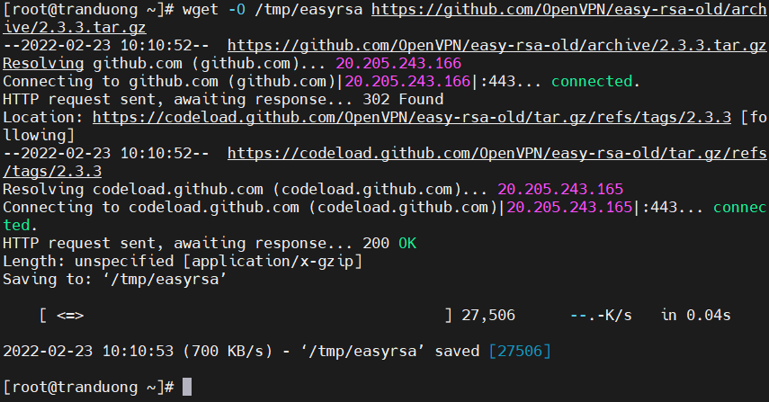
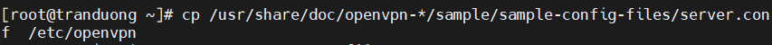
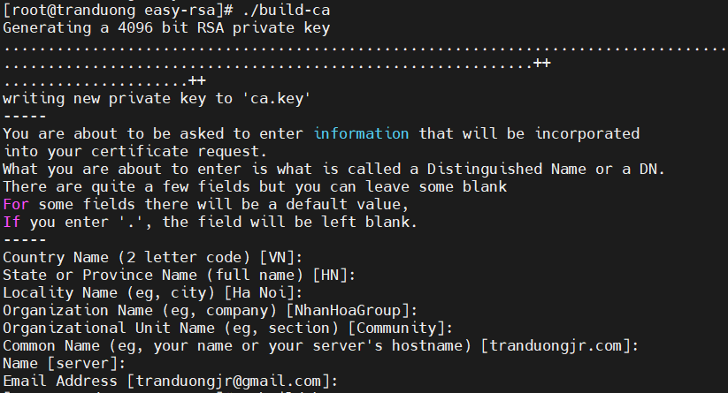
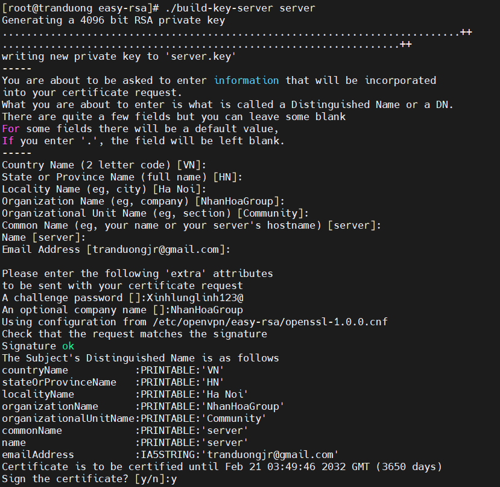
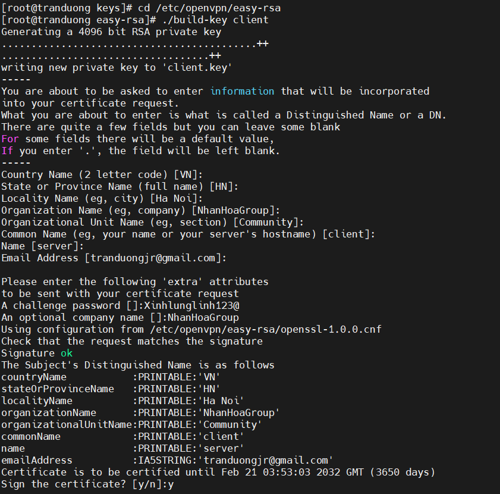
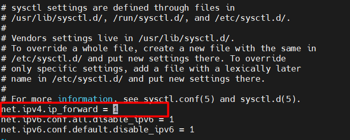

# Giới thiệu về VPN

## Mạng riêng ảo VPN là gì?

VPN là mạng riêng ảo, Virtual Private Network, là một công nghệ mạng giúp tạo kết nối mạng an toàn khi tham gia vào mạng công cộng như Internet hoặc mạng riêng do một nhà cung cấp dịch vụ sở hữu. Công nghệ VPN để cho phép người dùng từ xa kết nối an toàn đến mạng riêng của cơ quan mình.

## Cách thức hoạt động của VPN

Khi kết nối máy tính (hoặc các thiết bị khác như điện thoại thông minh hoặc máy tính bảng) với VPN, máy tính sẽ hoạt động như thể một kết nối cục bộ như VPN. Tất cả lưu lượng mạng sẽ được gửi thông qua một kết nối an toàn đến VPN. Và bởi vì máy tính hoạt động trên hệ thống mạng này, điều này cho phép người dùng truy cập nguồn tài nguyên mạng cục bộ từ xa.

Ngoài ra người dùng cũng có thể sử dụng Internet giống như thể họ đang hiện diện tại vị trí của VPN. Điều này có lợi trong một số trường hợp nếu bạn đang sử dụng Wifi công cộng hoặc muốn truy cập các trang web bị chặn về mặt địa lý.

## Ưu điểm và nhược điểm của VPN

**1. Ưu điểm**

- Lưu lượng cá nhân được mã hóa và truyền an toàn qua Internet. Điều này giúp tránh xa khỏi các mối đe dọa trên Internet.

- VPN khiến tin tặc gặp khó khăn khi xâm nhập hay gây trở ngại tới công việc của cá nhân hoặc doanh nghiệp.

- Người dùng có thể yên tâm sử dụng Wifi công cộng và không phải lo nghĩ về những tên tin tặc, đồng thời có thể an toàn kết nối từ xa với máy chủ.

- Với trình bảo mật cao như vậy, người dùng hoàn toàn có thể ẩn danh khi lướt web. Không những thế, đa số các VPN còn có giao diện rất dễ cấu hình, những người không rành công nghệ cũng có thể thao tác được.

**2. Nhược điểm**

- Nhiều trang web trực tuyến đang trở nên cảnh giác với VPN và tạo ra nhiều trở ngại nhằm ngăn cản hay giảm lượng truy cập vào nội dung bị hạn chế.

- Không may là người dùng cũng có thể sử dụng VPN vào các hoạt động bất hợp pháp, khiến công nghệ này bị mang tiếng xấu.

# Cấu hình OpenVPN trên Centos 7

Bảo mật an toàn thông tin là một trong những yếu tố quan trọng nhất trên môi trường Internet. Nếu hệ thống máy tính có lỗ hổng bảo mật, hacker bên ngoài có thể truy cập và điểu khiển traffic từ máy tính và website. Và đó cũng là lí do mà VPN ra đời. VPN, tên đầy đủ là Virtual Private Network, là phương thức kết nối máy tính từ xa vào mạng LAN an toàn và bảo mật.

## Chuẩn bị

- Centos 7 Server

- Quyền truy cập Root access

- Domain hoặc subdomain phân giải Server để sử dụng Certificates.

## Cài đặt OpenVPN

Do OpenVPN không có sẵn trong Repository mặc định của Centos 7. Vì vậy cần cài đặt Enterprise Linux (EPEL) repository. Sử dụng lệnh sau để cài EPEL repository

```
yum install epel-release -y
```

**1. Cài đặt OpenVPN**

```
yum install openvpn -y
```


**2. Cài đặt Easy RSA**

Để tạo các cặp khóa SSL thực hiện mã hóa bảo mật cho VPN. Sử dụng wget để tải xuống Easy RSA. Ta sử dụng Easy RSA 2 vì nhiều tài liệu có sẵn cho phiên bản này.

```
wget -O /tmp/easyrsa https://github.com/OpenVPN/easy-rsa-old/archive/2.3.3.tar.gz
```



Sử dụng tar để giải nén

```
tar xfz /tmp/easyrsa
```

Sao chép các tệp Easy RSA đã giải nén sang thư mục mới

```
cp -rf easy-rsa-old-2.3.3/easy-rsa/2.0/* /etc/openvpn/easy-rsa
```

**3. Cấu  hình OpenVPN**

Tiến hành copy file mẫu sampleserver.conf để thực hiện cấu hình:

```
cp /usr/share/doc/openvpn-*/sample/sample-config-files/server.conf  /etc/openvpn
```



Mở và chỉnh sửa file cấu hình:

```
vi /etc/openvpn/server.conf
```

Bỏ comment bằng cách bỏ dấu ``` ; ``` ở đầu dòng

- Tìm và bỏ comment dòng push "redirect-gateway def1 bypass-dhcp" để chuyển hướng tất cả các lưu lượng truy cập của client sang máy máy chủ Openvpn

- Khai báo DNS server sử dụng để kết nối Openvpn, trong bài này chúng ta sẽ sử dụng DNS server của Google:

Bỏ comment cả hai dòng push "dhcp-option DNS ..." và cập nhật địa chỉ IP:

```
push "dhcp-option DNS 8.8.8.8"

push "dhcp-option DNS 8.8.4.4"
```

Bỏ comment 2 dòng user nobody và group nobody để OpenVPN chạy không đặc quyền khi start:

```
user nobody

group nobody
```

- Tiếp theo, bỏ comment dòng topology subnet. Điều này, cùng với dòng server 10.8.0.0 255.255.255.0 ở bên dưới nó, cài đặt OpenVPN để hoạt động như một subnetwork và báo cho client biết địa chỉ IP nào sẽ sử dụng. Trong trường hợp này, máy chủ sẽ trở thành 10.8.0.1 và client đầu tiên sẽ trở thành 10.8.0.2:

```
topology subnet
```

Ta nên thêm dòng sau vào file cấu hình máy chủ để kiểm tra xem mọi chứng chỉ client đến có thực sự từ client hay không

```
remote-cert-eku "TLS Web Client Authentication"
```

- OpenVPN khuyến nghị người dùng kích hoạt TLS Authentication, một giao thức mã hóa đảm bảo liên lạc an toàn qua mạng máy tính. Để làm điều này, ta cần tạo một khóa mã hóa tĩnh (được đặt tên trong hướng dẫn này là myvpn.tlsauth). Trước khi tạo khóa này, hãy comment dòng trong file cấu hình có chứa tls-auth ta.key 0. Sau đó, thêm tls-crypt myvpn.tlsauth vào dòng bên dưới nó:

```
;tls-auth ta.key 0
tls-crypt myvpn.tlsauth
```

- Lưu và thoát khỏi file cấu hình máy chủ Openvpn, sau đó tạo khóa mã hóa tĩnh bằng lệnh sau:

```
openvpn --genkey --secret /etc/openvpn/myvpn.tlsauth
```

**Bây giờ thì máy chủ đã được thiết lập cấu hình,  chúng ta có thể chuyển sang thiết lập các khóa SSL và chứng chỉ cần thiết để kết nối an toàn với kết nối VPN.**

**4. Tạo khóa và chứng chỉ**

Easy RSA sử dụng script để tạo khóa và chứng chỉ. Để tránh cấu hình lại mỗi khi bạn cần tạo chứng chỉ, chúng ta có thể sửa đổi cấu hình Easy RSA để xác định các giá trị mặc định mà nó sẽ sử dụng cho các trường chứng chỉ, bao gồm quốc gia, thành phố và địa chỉ email.

Tạo một thư mục để lưu trữ khóa và chứng chỉ đã tạo:

```
mkdir /etc/openvpn/easy-rsa/keys
```

Các biến chứng chỉ mặc định được đặt trong tệp vars trong /etc/openvpn/easy-rsa, vì vậy hãy mở tệp đó để chỉnh sửa:

```
vi /etc/openvpn/easy-rsa/vars
```

Thay đổi các thông số:


Lưu và đóng tập tin.

Để bắt đầu tạo khóa và chứng chỉ, hãy di chuyển vào thư mục easy-rsa và source trong các biến mới bạn đặt trong file vars

```
cd /etc/openvpn/easy-rsa

source ./vars
```

Xóa mọi khóa và chứng chỉ đã có trong thư mục và tạo quyền chứng chỉ:

```
./clean-all
```

Tạo CA, ta cần nhập các giá trị cho các trường của chứng chỉ, nhưng nếu đã đặt các biến trong tệp vars trước đó, tất cả các tùy chọn sẽ được đặt làm mặc định. Nhấn ENTER để chấp nhận mặc định cho từng trường:

```
./build-ca
```



Script này tạo ra một tệp gọi là ca.key.

Tiếp theo, tạo khóa và chứng chỉ cho máy chủ, chạy lệnh sau:

```
./build-key-server server
```



Cũng giống khi tạo CA, ta có thể nhấn ENTER để lấy các giá trị mặc định. Ngoài ra còn có yêu cầu nhập mật khẩu và tên công ty (tùy chọn). Mật khẩu này được sử dụng khi kết nối với VPN từ client. Nếu bạn không muốn đặt mật khẩu, chỉ cần để trống dòng này và nhấn ENTER rồi nhập Y để chấp nhận thay đổi.

Phần cuối cùng của việc tạo các khóa và chứng chỉ máy chủ là tạo tệp trao đổi khóa Diffie-Hellman. Sử dụng lệnh dưới đây:

```
./build-dh
```

Chờ một vài phút để hoàn thành.

Khi máy chủ kết thúc việc tạo tệp trao đổi khóa, hãy sao chép các khóa máy chủ và chứng chỉ từ thư mục thekeys vào thư mục openvpn:

```
cd /etc/openvpn/easy-rsa/keys

cp dh2048.pem ca.crt server.crt server.key /etc/openvpn
```

Mỗi khách hàng cũng sẽ cần một chứng chỉ để máy chủ OpenVPN xác thực nó. Các khóa và chứng chỉ này sẽ được tạo trên máy chủ và sau đó bạn sẽ phải sao chép chúng sang máy khách của mình, chúng tôi sẽ thực hiện trong bước sau. Nó khuyên bạn nên tạo các khóa và chứng chỉ riêng cho từng khách hàng mà bạn dự định kết nối với VPN.

Bởi vì chúng tôi chỉ thiết lập một client ở đây, nên chúng tôi gọi đó là client, nhưng bạn có thể thay đổi tên này thành một tên mô tả hơn nếu bạn như thế:

```
cd /etc/openvpn/easy-rsa

./build-key client
```



Cuối cùng, sao chép tệp cấu hình OpenSSL đã được phiên bản, openssl-1.0.0.cnf, sang một tên không có phiên bản, openssl.cnf. Không làm như vậy có thể dẫn đến lỗi trong đó OpenSSL không thể tải cấu hình vì nó không thể phát hiện phiên bản của nó:

```
cp /etc/openvpn/easy-rsa/openssl-1.0.0.cnf /etc/openvpn/easy-rsa/openssl.cnf
```

**Giờ đây, tất cả các khóa và chứng chỉ cần thiết đã được tạo cho máy chủ và máy khách của bạn, bạn có thể chuyển sang thiết lập định tuyến giữa hai máy**

## Định Tuyến

Cài đặt iptable và disable firewalld bằng dòng lệnh :

```
yum install iptables-services -y

systemctl mask firewalld

systemctl enable iptables

systemctl stop firewalld

systemctl start iptables

iptables –flush
```

Tiếp theo, add một rule vào iptables, để cho phép định tuyến tới subnet của OpenVPN, và save rule này lại.

```
iptables -t nat -A POSTROUTING -s 10.8.0.0/24 -o eth0 -j MASQUERADE

iptables-save > /etc/sysconfig/iptables
```

Tiếp tục, enable IP Forwarding trong sysctl. chỉnh sửa file sysctl.conf 

```
vi /etc/sysctl.conf
```

Thêm dòng này vào đầu file :

```
net.ipv4.ip_forward = 1
```



Để IP forwarding có hiệu lực, chúng ta cần restart lại network service. Nhập vào dòng lệnh :

```
systemctl restart network.service
```

**Khởi chạy OpenVPN**

Như vậy là chúng ta đã hoàn thành cài đặt và bắt đầu có thể tiến hành khởi chạy OpenVPN. Sử dụng dòng lệnh :

```
systemctl -f enable openvpn@server.service
```

Khởi chạy OpenVPN :

```
systemctl start openvpn@server.service
```

## Kết nối OpenVPN

1. Cài đặt OpenVPN Client

- Cài đặt gói Epel Repo

```
yum install epel-release -y
```

- Cài đặt OpenVPN

```
yum install openvpn -y
```


 