# Các thao tác cơ bản với Plesk

## Service Plans (gói dịch vụ)

Quản lý các gói dịch vụ lưu trữ. Để tạo các gói dịch vụ lưu trữ ta vào (thêm gói dịch vụ lưu trữ)

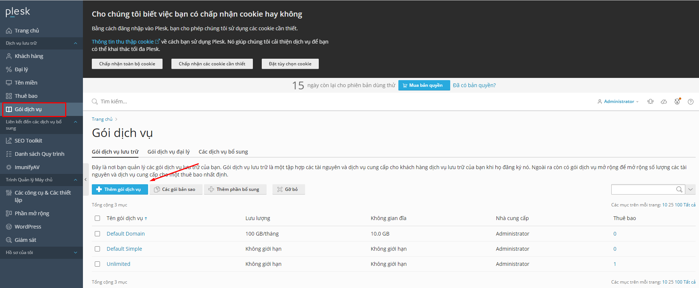

Đặt tên cho gói dịch vụ và thiết lập các thông số tùy ý cho gói dịch vụ và lưu lại

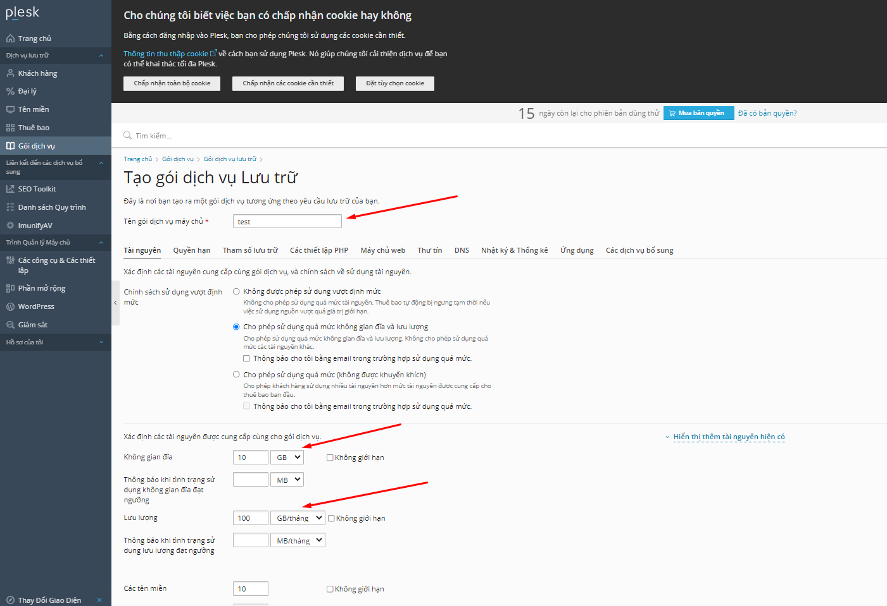

Sau khi tạo thành công, các gói dịch vụ đã có sẽ hiện ra

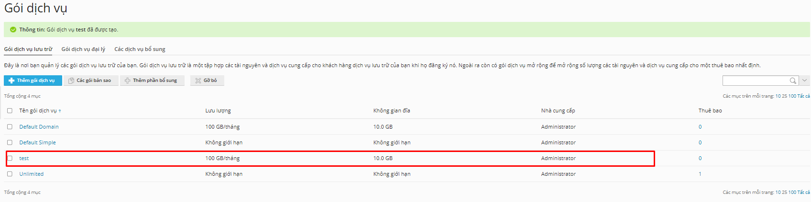

Tùy vào nhu cầu của khách hàng mà nhà cung cấp sẽ thiết lập các gói dịch vụ tương ứng

## Customer (Khách hàng)

**Thêm khách hàng**

Điền các thông tin tương ứng

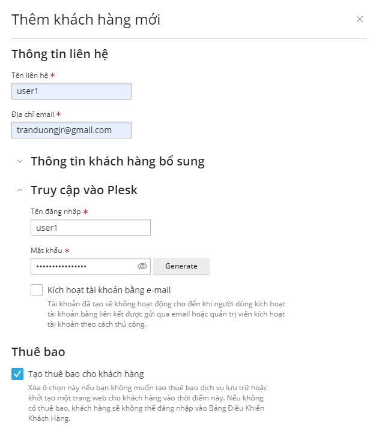
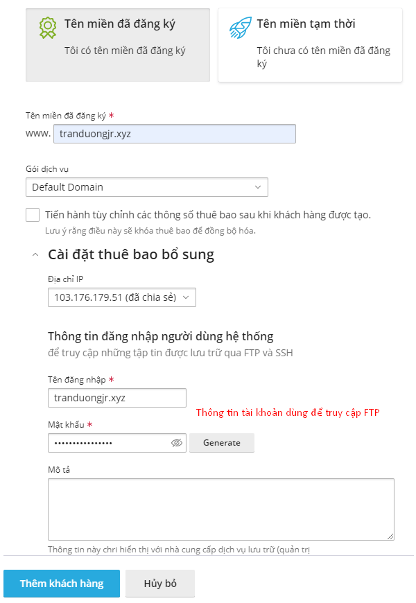

Sau khi tạo xong ta có thể xem thông tin, cấu hình của khách hàng như sau:

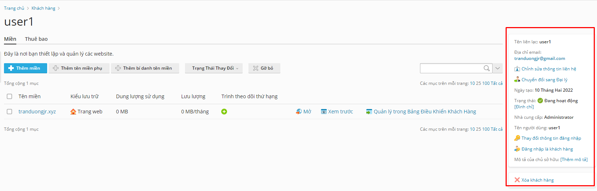

Tại đây thì ta có thể thêm domain, subdomain, domain alias hoặc thay đổi trạng thái của các domain nếu có nhiều domain,...

Trong danh sách khách hàng, ta có thể lựa chọn vào trang quản trị hosting của từng khách hàng

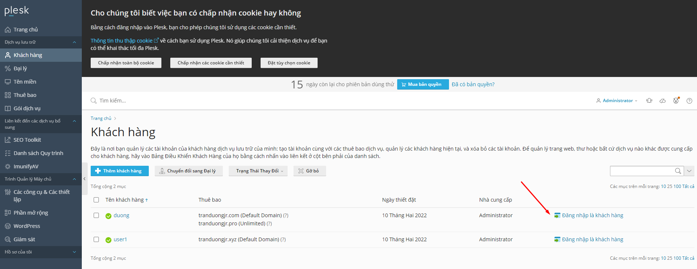

Giao diện của trang quản lý của khách hàng hiện ra:

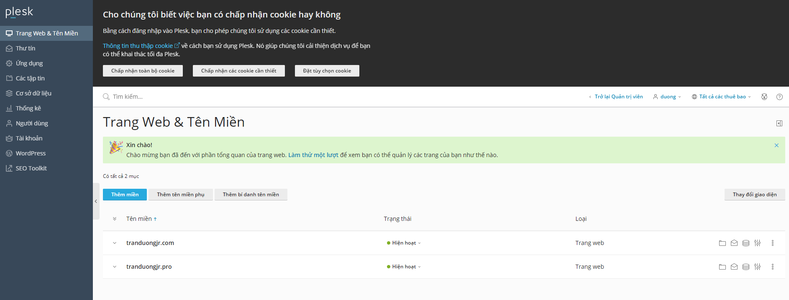

(Hoặc ta cũng có thể truy cập theo cổng 8443 và đăng nhập với username password của account khách hàng đã tạo trước đó)

Tại trang quản trị của khách hàng cũng gồm các tùy chọn

- Trang web & tên miền : để quản lý các hosting của khách hàng
- Thư tín (Email): Quản lý mail của các hosting, tạo mail, chuyển tiếp, cấu hình trả lời mail tự động,...
- Các tập tin: nơi lưu trữ dữ các tập tin của các host, có thể up load, back up các tập tin, thực hiện các thay đổi với các tập tin,...
- Cơ sở dữ liệu: Lưu trữ databse của site
- Thống kê: thống kê không gian đĩa đã sử dụng và lưu lượng đã sử dụng,...
- Người dùng: Quản lý thông tin của khách hàng, có thể thay đổi thiết lập với tài khoản của khách hàng, tạo tài khoản người dùng,...
- Tài khoản: nơi quản lý các thuê bao được quản lý bởi khách hàng.

- WordPress: để tạo trang WordPress

## Đại lý

**Thêm đại lý**

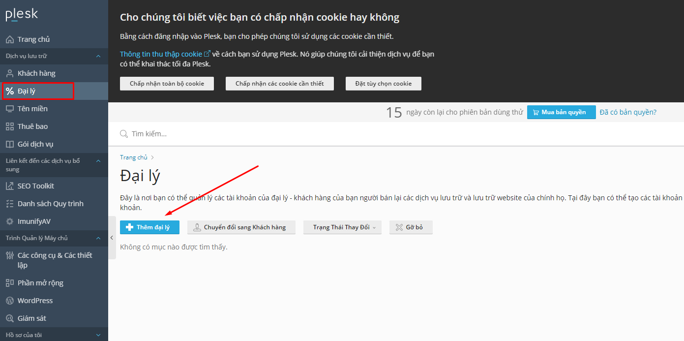

Điền các thông tin để khởi tạo Reseller

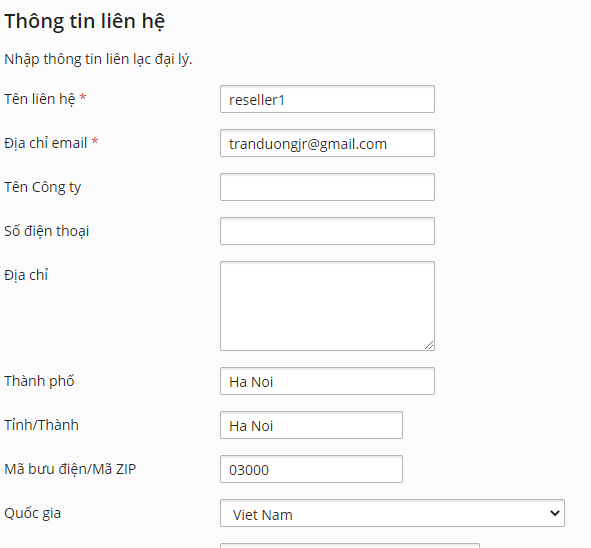
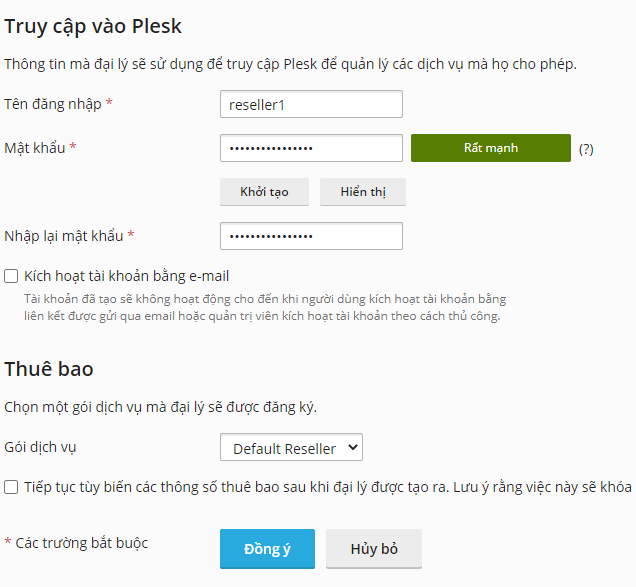

Ta có thể truy cập vào tài khoản của Reseller để quản lý hoặc vào tùy chọn như hình dưới:

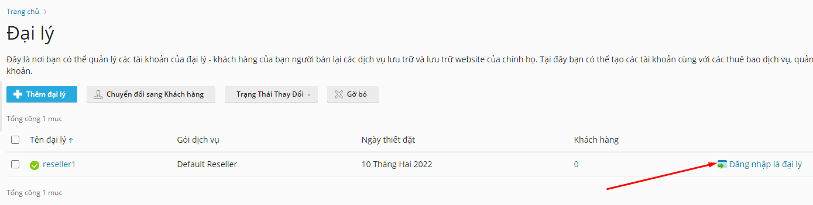

Trang quản trị của Resller hiện ra

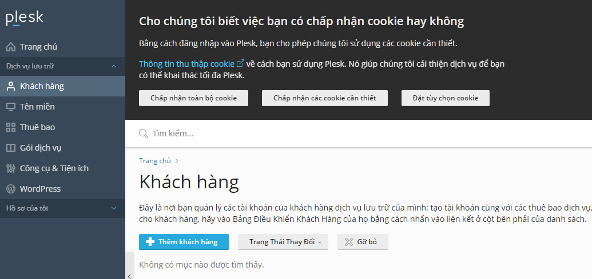

Gồm các tính năng như:

- Khách hàng: nơi quản lý khách hàng, tương tự như bên trên
- Tên miền: Quản lý các tên miền như thêm miền, thêm miền phụ, thêm bí danh tên miền hay thay đổi trạng thái cho miền như (tạm ngưng, vô hiệu hóa hoặc kích hoạt), gỡ bỏ miền
- Thuê bao: Quản lý các thuê bao, gói dịch vụ, trạng thái thay đổi, gỡ bỏ
- Gói dịch vụ: tương tự như trên cũng gồm các gói dịch vụ được thiết lập để gán cho khách hàng tùy theo nhu cầu sử dụng của họ
- WordPress: Cài đặt WordPress, quản lý WordPress

## Tên miền

Nơi quản lý các tên miền của các khách hàng, gồm các tùy chọn để cấu hình

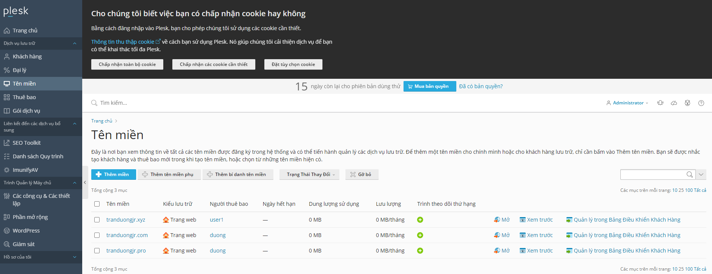

## Thuê bao

Quản lý các thuê bao của các khách hàng, tại đây có các tùy chọn như thêm thuê bao, thay đổi gói dịch vụ cho các thuê bao, thay đổi người thuê bao, trạng thái thay đổi, gỡ bỏ:

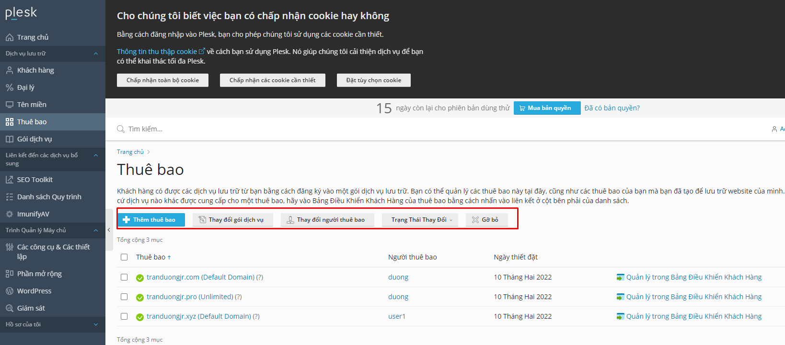

## Danh sách Quy trình

Theo dõi các tiến trình đang chạy trên máy chủ và hiển thị mức độ sử dụng của các tiến trình:

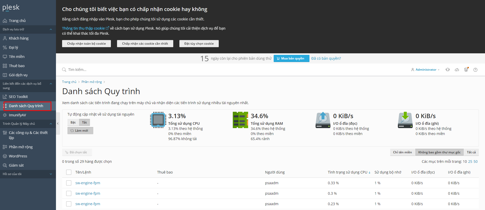

## ImunifyAV

Chương trình để quét hầu hết các mã nguồn PHP nhằm phát hiện các phần mềm độc hại như Malware, Fishing, Backdoor

## Các công cụ & Các thiết lập

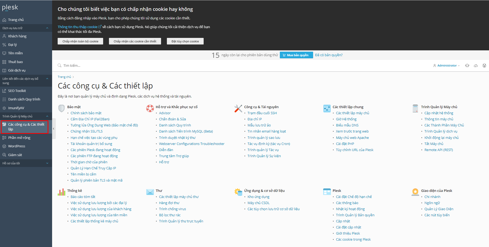

### Bảo mật

- Chính sách bảo mật: Thiết lập các chính sách bảo mật về kết nối FTP hoặc thiết lập chính sách về độ mạnh của mật khẩu
- Cấm địa chỉ IP
- Tường lửa ứng dụng Web: bật tắt tường lửa, thiết lập bộ quy tắc tường lửa
- Chứng nhận SSL/TLS: nơi quản lý các chứng chỉ SSL trên máy chủ
- Hạn chế tạo các miền phụ
- Tài khoản quản trị bổ sung: Thêm tài khoản quản trị viên bổ sung hoặc gỡ bỏ tài khoản quản trị viên nào đó
- Các quản lý về phiên Plesk và FTP đang hoạt động: tại đây có thể tắt phiên hoặc thiết lập kết nối phiền
- Quản lý hạn chế truy cập IP
- Quản lý tên miền bị cấm
- Quản lý phiên bản TLS và mật mã

### Hỗ trợ và khắc phục sự cố

- Chẩn đoán và sửa chữa : Phát hiện và giải quyết các vấn đề kỹ thuật khiến dịch vụ Plesk hoặc Plesk hoạt động không đúng cách bằng công cụ tự sửa chữa Plesk.
- Danh sách tiến trình MySQL
- Trình duyệt nhật ký thư

### Công cụ & tài nguyên

- Trạm đầu cuối SSH: SSH vào máy chủ trực tiếp từ Plesk

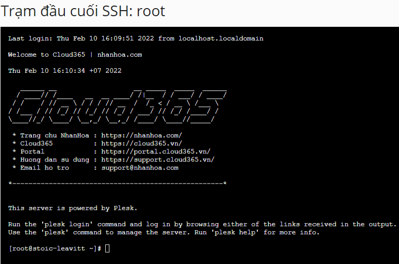

- Địa chỉ IP: quản lý các địa chỉ ip, có thể thêm, sửa, xóa và chỉ định ip đến các reseller

- Trình quản lý sao lưu dùng để backup dữ liệu của máy chủ

- Tạo Cron jobs (Tác vụ định kỳ)

- Trình quản lý tác vụ và sự kiện

### Các thiết lập chung

Nơi thực hiện các thiết lập về máy chủ, giờ của hệ thống, các bản ghi DNS, xem trước các trang web, các dịch vụ của máy chủ web apache, cài đặt các phiên bản php, hoặc tùy chỉnh URL của Plesk

### Trình quản lý máy chủ

Gồm các tùy chọn:

- Cập nhật hệ thống
- Thông tin máy chủ

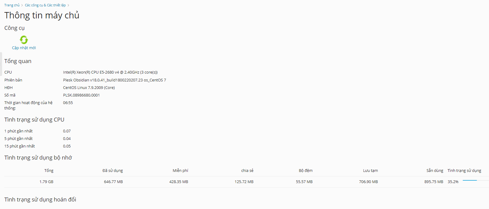

- Các thành phần của máy chủ: Các thành phần, phiên bản của của các thành phần đó

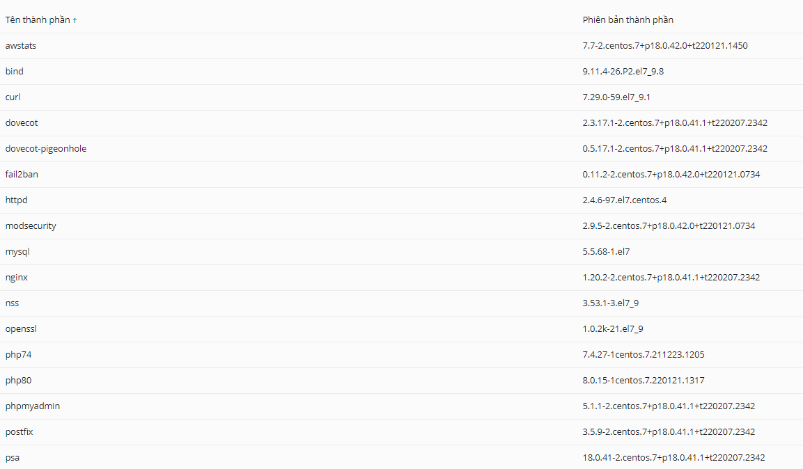

- Các dịch vụ của máy chủ, tại đây có thể tạm dừng, chạy hoặc khởi động lại các dịch vụ

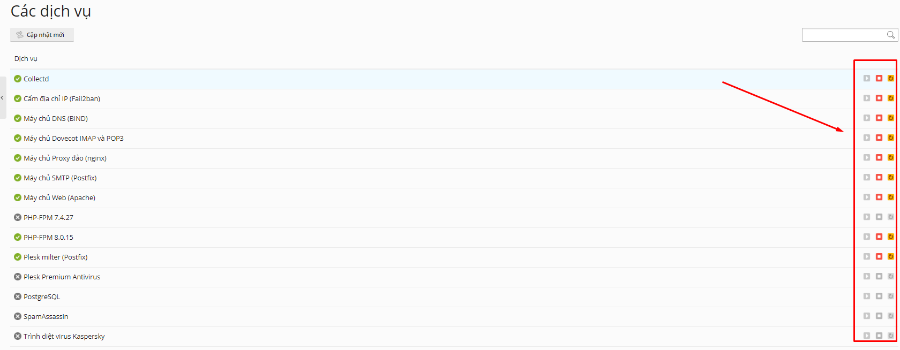

- Ngoài ra trong Trình quản lý máy chủ còn có tùy chọn tắt máy chủ hoặc khởi động lại máy chủ

### Thống kê

- Báo cáo tóm tắt: Hiển thị bản báo cáo tóm tắt về Người quản trị, các Reseller, các customer, các tên miền,...
- Các thống kê về lưu lượng được sử dụng bởi Resllers, Customers, Domain, máy chủ
### Thư (Mail)

- Thiết lập máy chủ thư: Các cài đặt về máy chủ,thêm các danh sách từ chối thư, xem hàng đợi thư
- Trình chống virus, bộ lọc thư rác, trình quản lý thư trực tuyến (webmail - tiện ích có sẵn là Roundcube)

### Máy chủ cơ sở dữ liệu

- Kho ứng dụng: nơi quản lý các ứng dụng đã được cài đặt bởi người quản trị hoặc khách hàng
- Máy chủ cơ sở dữ liệu: Quản lý các máy chủ cơ sở dữ liệu, quản lý cơ sở dữ liệu

### Plesk

Các thiết lập với Plesk như quản lý thông báo, nhật ký hoạt động, quản lý bản quyền, cập nhật phiên bản,...
### Giao diện của Plesk

Quản lý, thiết lập giao diện của Plesk, thiết lập ngôn ngữ Plesk

## WordPress

Nơi cài đặt WordPress cho các site

### Cài đặt WordPress

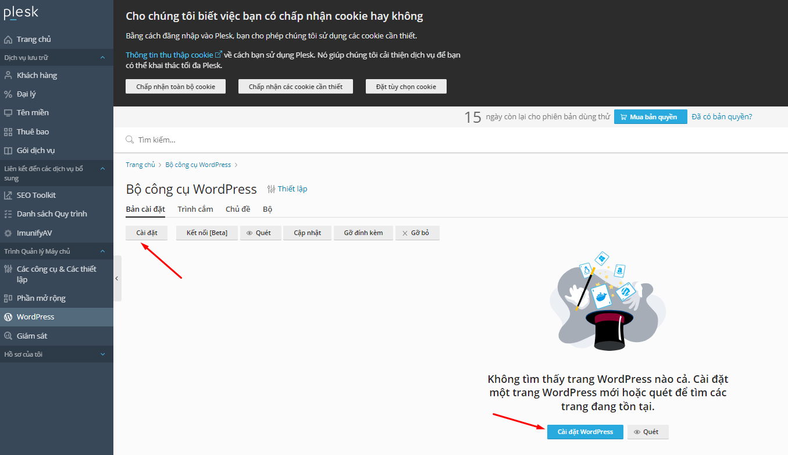

Hoặc ta cũng có thể vào trang quản trị của khách hàng để cài đặt WordPress

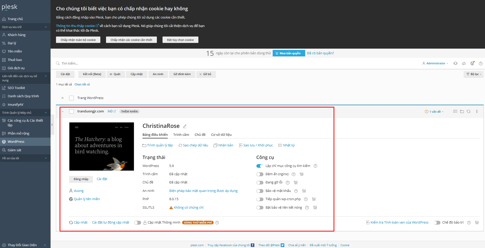

Để quản lý tên miền ta vào tùy chọn như sau:

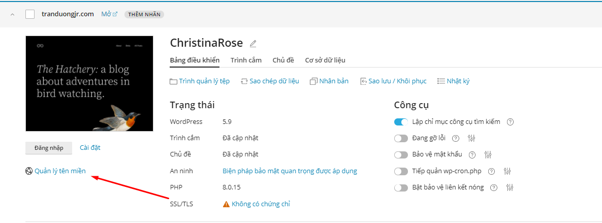

Trong đó có các tùy chọn để cấu hình cho site

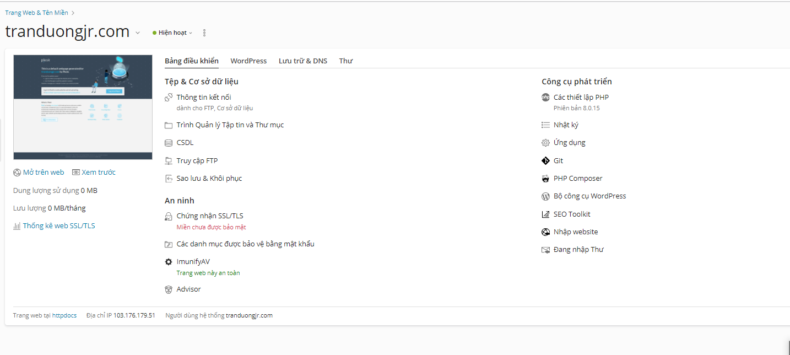

Để cấu hình SSL ta vào tùy chọn SSL/TLS:

Có tùy chọn cài đặt một chứng chỉ cơ bản miễn phí do Let's Encrypts cung cấp hoặc nếu ta muốn cài đặt chứng chỉ trả  phí từ nhà cung cấp tin cậy nào đó,ta cần tải lên tập .pem của chứng chỉ đó. Tham khảo cách tạo tập tin .pem từ chứng chỉ của nhà cung cấp tin cậy tại : 