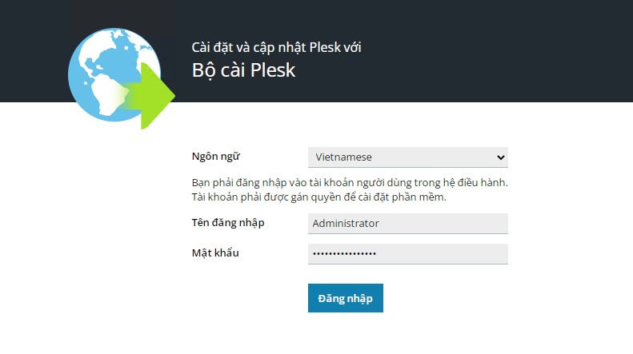
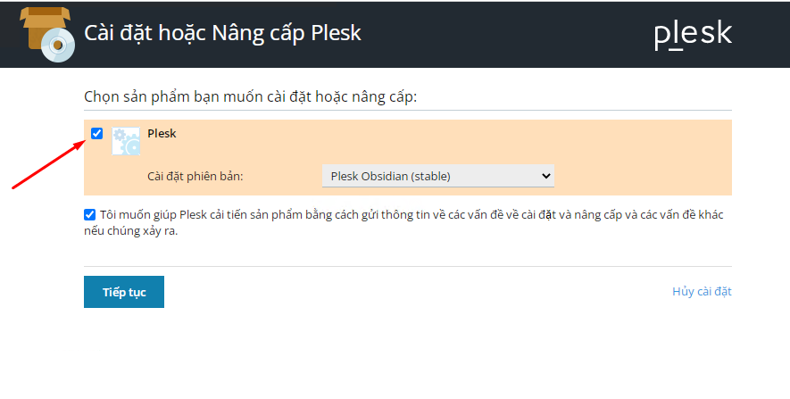
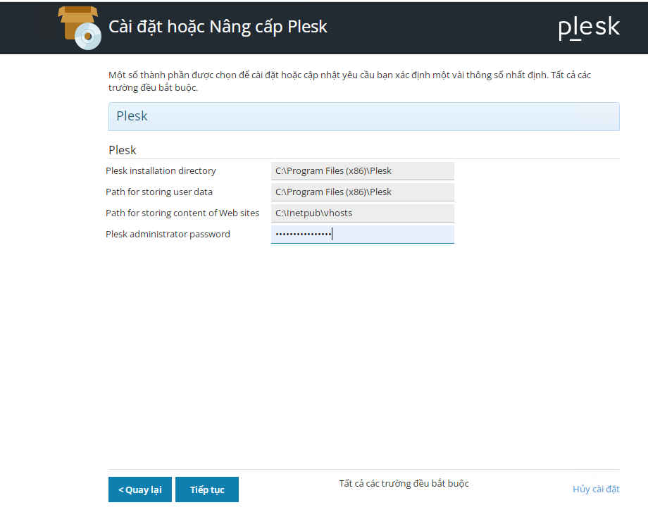
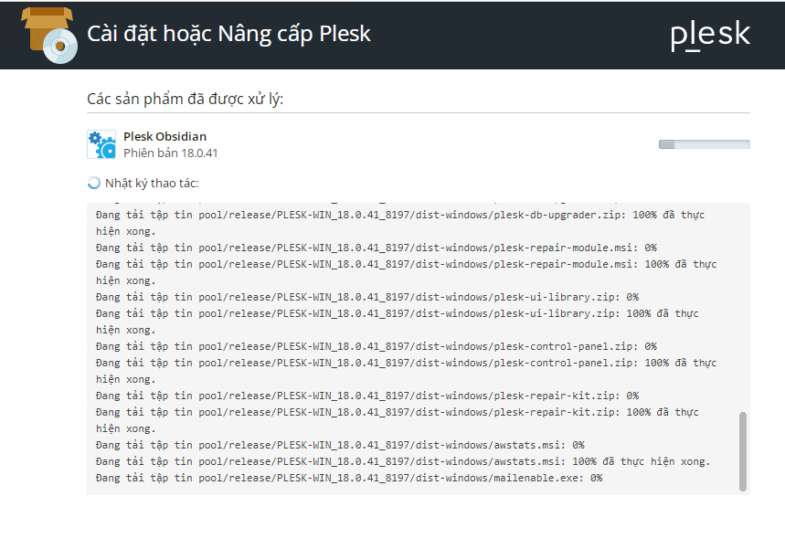
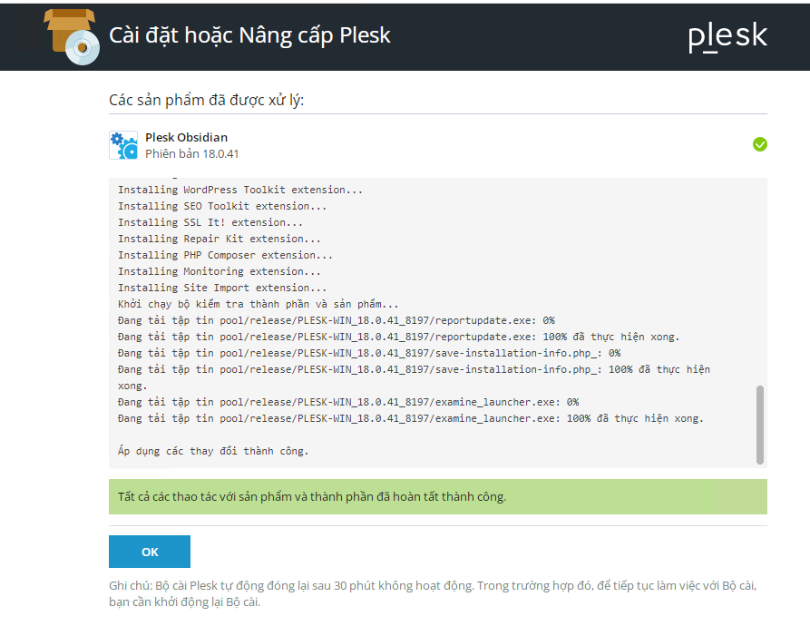
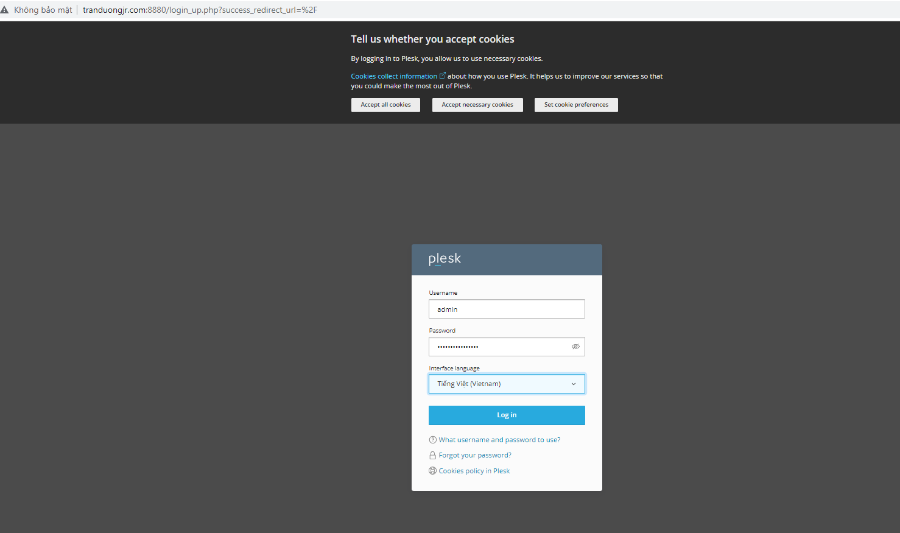
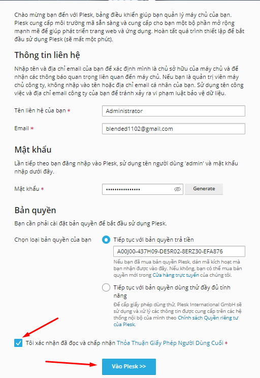
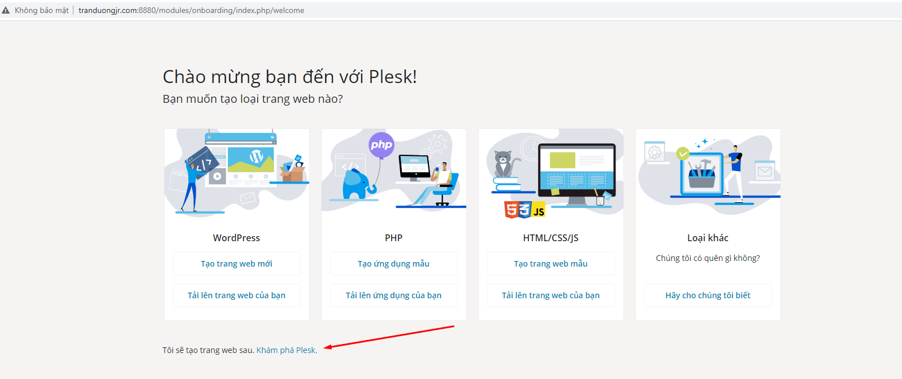
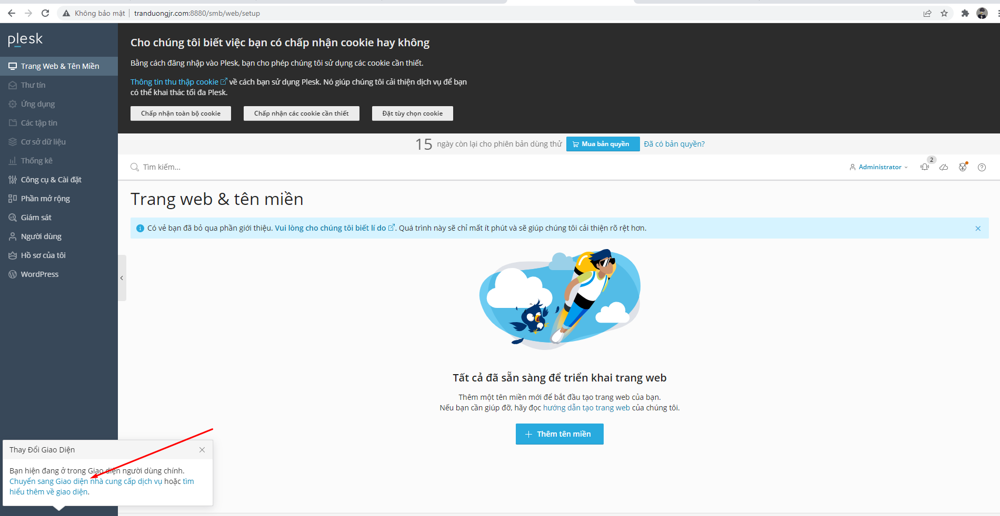
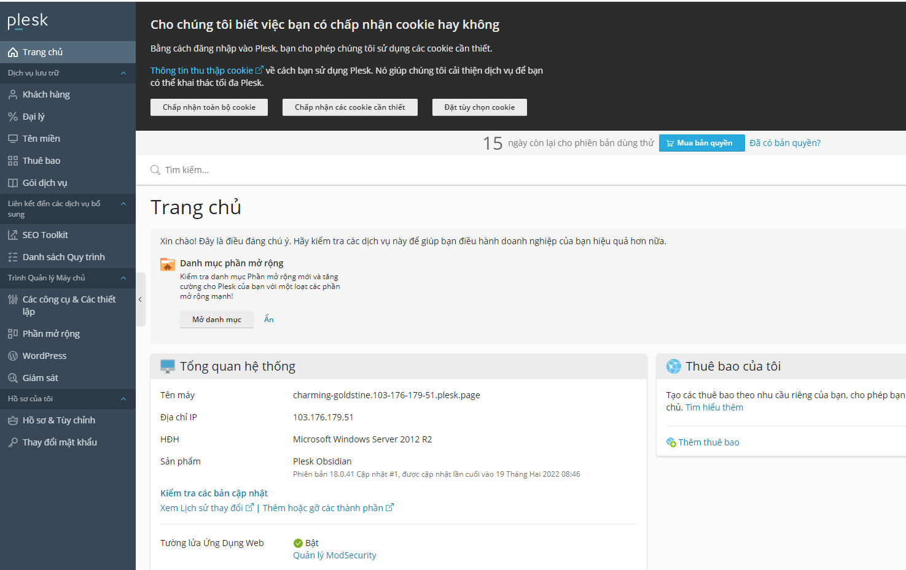

# Cài Đặt Plesk Panel trên Windows:

## Chuẩn bị

Yêu cầu cấu hình:

- RAM 1-2GB RAM (tối thiểu 1GB RAM)
- Ổ đĩa 32GB (tối thiểu)
- OS: Windows Server 2008 SP2 trở lên (khuyên dùng Windows Server 2012)

## Cài đặt

**Các bước cài đặt**

Đăng nhập vào trang Download Plesk: https://bitly.com.vn/wzzk42

Tiến hành run file cài đặt cho windows. Chọn ngôn ngữ và nhập Password của tài khoản quản trị viên



chọn vào ```Cài đặt hoặc nâng cấp sản phẩm```


Tích chọn vào Plesk để cài đặt và nhấn Tiếp tục



Nhập password cho Plesk Administrator



Chờ quá trình cài đặt



Hoàn tất quá trình cài đặt



Các bước tiếp theo sau là các bước tùy chỉnh cấu hình mặc định cho Plesk Panel. Có thể kết nối từ Client bên ngoài hoặc trực tiếp tại Server theo port 8880



Đăng nhập với thông tin quản trị username: admin và password đã tạo ở trên. Sau đó tiếp tục tiến hành nhập các thông tin để tiến hành cài đặt như Email, đặt lại mật khẩu cho admin, key. (Tham khảo cách lấy key Free Trial tại: https://github.com/tranduongjr/baocaothuctap/blob/main/Plesk/L%E1%BA%A5y%20key.md)



Click vào Khám phá Plesk



Trang quản trị Plesk hiện ra





## Các thao tác với Plesk

Các Thao tác Plesk khi cài trên Windows tương tự như khi cài trên Linux.

Tham khảo các thao tác cơ bản với Plesk tại: https://github.com/tranduongjr/baocaothuctap/blob/main/Plesk/C%C3%A1c%20thao%20t%C3%A1c%20c%C6%A1%20b%E1%BA%A3n%20v%E1%BB%9Bi%20Plesk.md


