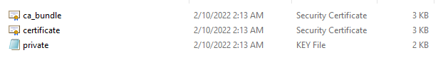
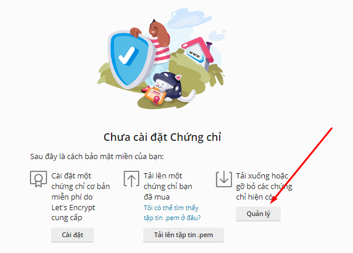
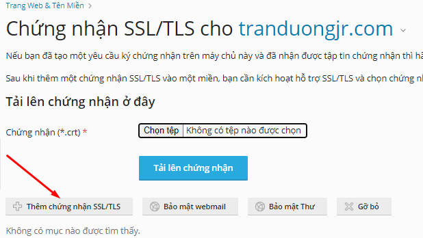
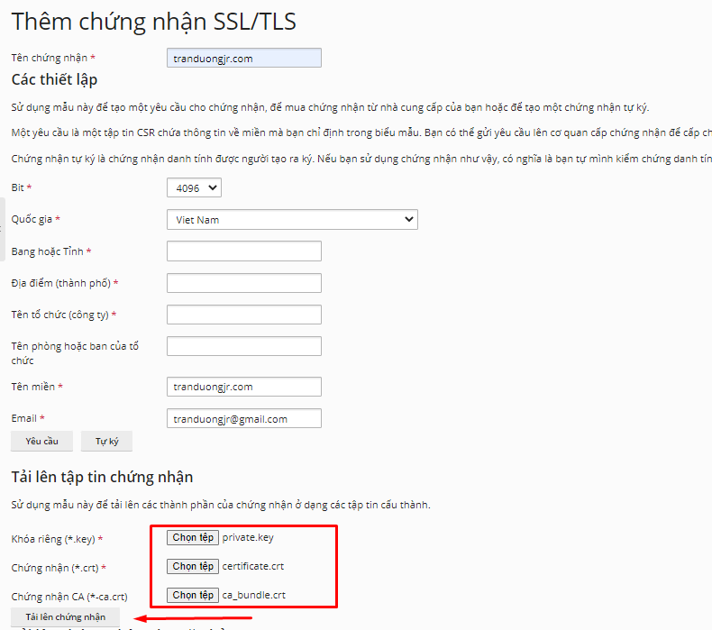
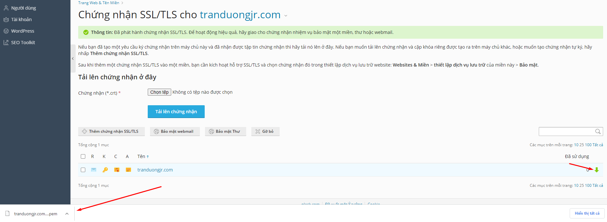

# Các tạo tệp tin .pem từ chứng chỉ đã mua

## Chuẩn bị

Chứng chỉ được cấp từ nhà cung cấp chứng chỉ tin cậy, gồm 3 file:

## Tạo tệp tin .pem

Tiến hành vào tùy chọn Quản lý tên miền => Chứng nhận SSL/TLS:

Tiến hành đặt tên cho tệp tin pem, điền các thông tin tương ứng, tải lên các tệp private.key. certificate, ca_bundle tương ứng và click vào tải lên chứng nhận

Sau đó chứng nhận được tải lên và click vào mũi tên màu xanh để down tệp tin chứng nhận ở dạng .pem về

Vậy là ta đã có chứng chỉ SSL ở dạng .pem