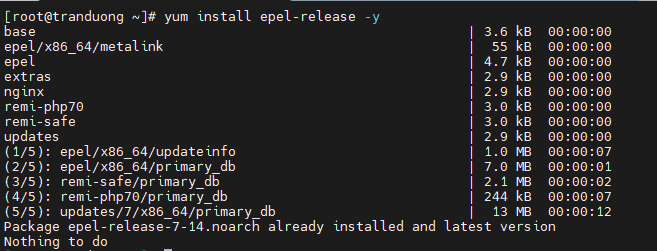
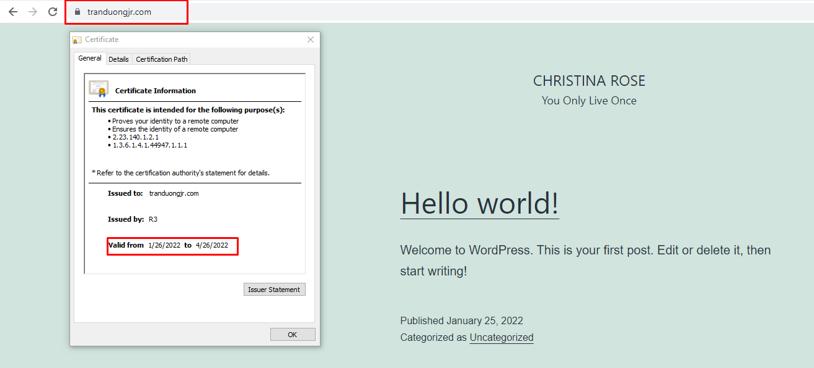
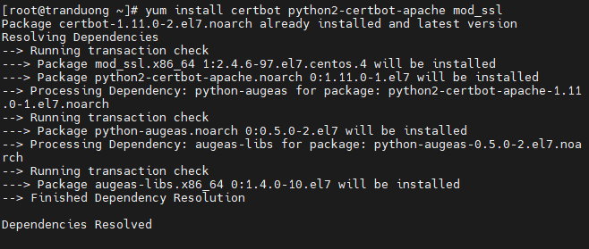
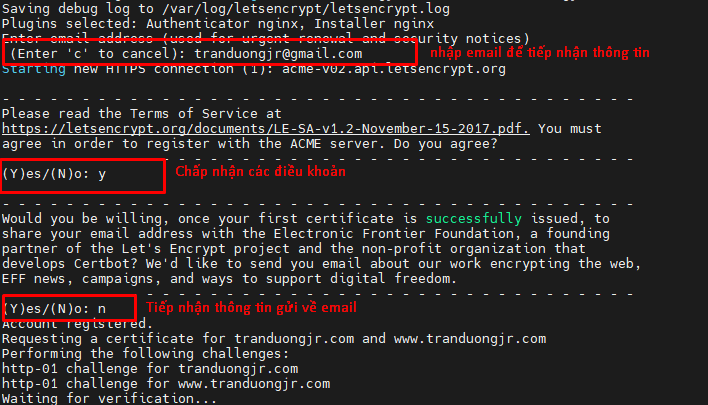

# 1. Giới thiệu
## SSL là gì?
- SSL là chữ viết tắt của Secure Socket Layer (lớp socket bảo mật). Một loại bảo mật giúp mã hóa liên lạc giữa website và trình duyệt. 

- Chức năng chính của SSL là bảo vệ thông tin và giao tiếp giữa máy khách và máy chủ. Giao tiếp này chủ yếu liên quan tới các trang web trên HTTP, email, và SSL đảm bảo mã hóa và giải mã các thông điệp được chuyển giữa các máy chủ này.

- SSL cho phép các trang web bảo mật vì nó loại bỏ bất kỳ người trung gian nào trên mạng. Nó cũng cung cấp một đường truyền thông tin liên lạc an toàn, nơi khách hàng có thể truyền thông tin đến và đi từ một trình duyệt mà không bị can thiệp.

## Tại sao nên sử dụng SSL

Khi đăng ký tên miền để sử dụng các dịch vụ website, email sẽ luôn có những lỗ hổng bảo mật dẫn tới nguy cơ bị tấn công từ hacker. Giải pháp SSL giúp bảo vệ website và dữ liệu trong quá trình trao đổi thông tin giữa máy khách và máy chủ.

- Bảo mật dữ liệu: Dữ liệu được mã hóa và chỉ người nhận đích thực mới có thể giải mã 
- Toàn vẹn dữ liệu: Dữ liệu không thể bị thay đổi trên đường truyền
- Chống chối bỏ: Đối tượng thực hiện gửi dữ liệu không thể phủ nhận dữ liệu của mình

## Các loại chứng chỉ SSL

### Dựa theo mức độ xác thực

1. Chứng chỉ SSL DV

DV là viết tắt của Domain Validated. SSL DV là kiểu chứng chỉ có tốc độ cấp phát nhanh nhất, chỉ trong vài phút. Thích hợp với người dùng cá nhân vì chỉ cần chứng thực tên miền bằng cách verify qua email tên miền là xong.

2. Chứng chỉ SSL OV

OV là viết tắt của (Organization Validation). OV SSL dành cho các tổ chức hoặc doanh nghiệp. Ngoài việc xác minh quyền sở hữu tên miền, bạn còn phải chứng thực doanh nghiệp qua các giấy tờ hợp lệ.

3. Chứng chỉ SSL EV

EV là viết tắt của (Exented Validation). EV SSL chỉ dành cho các doanh nghiệp hay các tổ chức chính phủ có giấy tờ hợp lệ. Ngoài việc xác minh các giấy phép hoạt động, CA còn phải tuân thủ nghiêm ngặt các quá trình chứng thực tổ chức đang hoạt động và có uy tín. Mỗi EV SSL chỉ được đăng ký tối đa 2 năm, vì sau mỗi 2 năm CA sẽ cần chứng thực lại và chắc chắn doanh nghiệp của bạn vẫn đang hoạt động.

### Dựa theo số lượng tên miền

1. Single Name SSL Certificate

Đối với SSL này sẽ chỉ có 1 tên miền được đảm bảo

2. Chứng chỉ Wildcard SSL

Đối với chứng chỉ này sẽ đảm bảo sự không giới hạn các subdomain và một tên miền duy nhất.

3. Chứng chỉ SSL Multi-domain

Một chứng chỉ SSL Multi-domain hỗ trợ tất cả các loại tên miền và subdomain khác nhau. SSL Multi-domain được đề xuất cho người có nhiều tên miền và subdomain.

4. UCC SSL

UCC là viết tắt của (Unified Communication Certificate). Người ta có thể gọi nó là UC Certificate và chứng chỉ này được thiết kế riêng cho các dịch vụ như Exchange Server hay Office Communications

## Hoạt động của SSL

Hai hệ thống mã hóa chi phối cách SSL hoạt động là:

- Mã hóa khóa bất đối xứng
- Mã hóa khóa đối xứng

Mã hóa khóa bất đối xứng hay còn gọi là mật mã khóa công khai. Trong mật mã bất đối xứng, có 1 cặp khóa là khóa công khai và khóa riêng. Cả hai đều tham gia vào quá trình mã hóa hoặc giải mã dữ liệu.

Trong mã hóa bất đối xứng thì một khóa được gán cho một trong hai bên ở đầu kia một khóa công khai. Khóa còn lại là khóa riêng được dùng để mã hóa dữ liệu và các bên không xác định được. Dữ liệu được xử lý bằng khóa riêng để mã hóa và giải mã bằng khóa công khai.

Trong mã hóa khóa đối xứng thì chỉ có một khóa có sẵn cho cả máy khách và máy chủ. Khóa này mã hóa và giải mã dữ liệu.

SSL sử dụng cả mã hóa bất đối xứng và mã hóa đối xứng để truyền dữ liệu một cách an toàn

## Cách truyền dữ liệu qua SSL

Giao tiếp giữa máy chủ và máy khách được ví như bắt đầu bằng một cái bắt tay. khi bắt đầu, trình duyệt cố gắng giao tiếp với máy chủ web. Trong SSL sự bắt đầu này sử dụng mã hóa khóa bất đối xứng. Khi bắt đầu :

- Trình duyệt xác minh tính xác thực của máy chủ.
- Trình duyệt và máy chủ mở một kết nối an toàn để liên lạc.
- Trình duyệt và máy chủ tạo khóa phiên.

Trong quá trình truyền dữ liệu, máy khách và máy chủ chia sẻ một khóa để mã hóa và giải mã dữ liệu. Quá trình này là mã hóa khóa đối xứng.

## Chứng thư số SSL

SSL thực tế là một tệp chứa khóa công khai cho trang web. Nó nằm trên máy chủ của trang web và nếu không có nó, không thể thực hiện kết nối an toàn được. Nhờ có nó mà máy khách khi truy cập có thể xác minh được tính xác thực, tin cậy của website, đảm bảo mọi dữ liệu, thông tin trao đổi giữa máy chủ và máy khách luôn được bảo mật và an toàn.

Chứng thư số SSL được cấp bởi CA (tổ chức phát hành chứng thư số). Trước tiên, CA sẽ xác minh danh tính và tính hợp pháp của chủ sở hữu trang web trước khi tiến hành cấp chứng thư số SSL.

Let's Encrypt là một tổ chức xác thực SSL giống như Comodo, Geotrust, Symantec nhưng cái khác là Let's Encrypt là một tổ chức phi lợi nhuận được thành lập với sự bảo trợ của những tổ chức lớn trên thế giới như Cisco, Akamai, Mozilla, Facebook,... với mục đích là cung cấp chứng thư số SSL miễn phí cho mọi người, giúp mọi website đều được mã hóa, tạo lên môi trường Internet an toàn hơn

Có 2 cách tạo SSL:

- Nhờ một tổ chức CA (Certification Authority) cấp, là tổ chức có độ tin cậy cao, được quyền cấp và chứng nhận SSL. Sẽ mất phí.

- Self - Signed SSL: Là server tự cấp, tự kí, tự xác thực (không an toàn và tin tưởng bằng nhờ bên thứ 3). Với cách này thì không mất phí.
## Các phương pháp xác thực SSL

1. Xác thực qua Email

Người dùng sẽ nhận được một email xác thực tương ứng với email đăng ký SSL, Email sẽ chứa một mã xác thực và một liên kết. Nhấp vào liên kết và nhập mã xác thực để xác nhận việc sở hữu tên miền

2. Xác thực bằng DNS CName-Based 

Nhà cung cấp sẽ gửi cho khách hàng nội dung một record CName để khách hàng cấu hình bản ghi CName trên hệ thống DNS domain và sau đó xác nhận lại với nhà cung cấp để nhà cung cấp kiểm tra và tiến hành cấp chứng chỉ SSL

3. HTTP-based

Là hệ thống xác thực qua file. Nhà cung cấp sẽ gửi cho khách hàng nội dung của file xác thực kèm đường dẫn để khách hàng khởi tạo file theo đường dẫn được cung cấp trên Server.

# 2 Cài đặt SSL cho Nginx
## 2.1 Chuẩn bị

Một Webserver Nginx chạy trên hệ điều hành Centos 7

Tham khảo cách cấu hình Nginx trên centos 7 tại:

https://github.com/tranduongjr/baocaothuctap/blob/main/Nginx/Nginx.md

## 2.2. Cài đặt SSL cho Nginx

### Cài đặt Certbot Let's Encrypt Client

- Cài đặt epel respository

```
yum install epel-release -y
```



- Cài certbot-nginx

```
yum install certbot-nginx -y
```


### Cài đặt SSL Let's Encrypt

Lưu ý: Phải đảm bảo domain đã được trỏ về máy chủ (Nếu cài SSL cho cả www.domain.com thì sub www cũng phải được trỏ về máy chủ)

Để cài SSL cho Website, sử dụng lệnh sau (Tùy thuộc vào website của mọi người, ví dụ ở đây là website tranduongjr.com)

```
certbot --nginx -d tranduongjr.com -d www.tranduongjr.com
```


Khi cài đặt thành công, sẽ có thông báo và sẽ có thông tin về nơi lưu trữ chứng thư số và khóa.


### Kiểm tra kết quả

Ta có thể kiểm tra trực tiếp bằng cách truy cập vào website trên trình duyệt:



Hoặc ta có thể truy cập vào trang sslshopper.com và kiểm tra bằng cách nhập địa chỉ website vào và check thông ti:


Chứng chỉ do Let's Encrypt cấp là miễn phí và có hạn 90 ngày, sau 90 ngày chúng ta cần gia hạn hoặc có thể cấu hình gia hạn tự động.

### Cấu hình gia hạn

Chứng chỉ Let's Encrypt chỉ có hiệu lực 90 ngày, thay vì mỗi khi hết 90 ngày ta lại phải cấu hình thủ công lại thì ta sẽ cấu hình gia hạn tự động.

Ta có thể gia hạn thủ với lệnh:

```
certbot renew --dry-run
```
Hoặc cấu hình gia hạn tự động:

Đầu tiên ta mở cửa sổ thêm Cronjob:

```
export VISUAL=vi; crontab -e
```


Thêm cấu hình 


Cronjob này nghĩa là cứ đúng 6:00 AM nó sẽ tự động check chứng chỉ, nếu chứng chỉ hết hạn nó sẽ thực hiện tự động gia hạn.

# 3. Cài đặt SSL cho Apache

## 3.1. Chuẩn bị

Một Webserver Apache chạy trên hệ điều hành Centos 7

Tham khảo cách cấu hình Webserver Apache tại:

https://github.com/tranduongjr/baocaothuctap/tree/main/Web%20Server%20Apache

## 3.2. Cài đặt SSL cho Apache

### Cài Certbot Let's Encrypt Client

- Cài đặt epel respository

```
yum install epel-release -y
```


Cài Certbot Apache:

```
yum install certbot python2-certbot-apache mod_ssl
```



### Cài SSL Let's Encrypt

Lưu ý: Phải đảm bảo domain đã được trỏ về máy chủ ( Nếu cài SSL cho cả www.domain.com thì sub www cũng phải được trỏ về máy chủ)

Để cài SSL cho Website, sử dụng lệnh sau (Tùy thuộc vào website của mọi người, ví dụ ở đây là website tranduongjr.com)

```
certbot --apache -d tranduongjr.com -d www.tranduongjr.com
```

Cũng sẽ có các thông tin như đối với cài SSL cho Nginx như bên trên, bao gồm:

- Nhập email của bạn (Yes or no)
- Đồng ý các điều khoản (Yes or No)
- Từ chối các thông tin, tin tức từ Let's Encrypt và Certbot (Yes or No)



### Kiểm tra kết quả

Ta có thể kiểm tra trực tiếp bằng cách truy cập vào website trên trình duyệt:


Chứng chỉ do Let's Encrypt cấp là miễn phí và có hạn 90 ngày, sau 90 ngày chúng ta cần gia hạn hoặc có thể cấu hình gia hạn tự động.

### Cấu hình gia hạn

Chứng chỉ Let's Encrypt chỉ có hiệu lực 90 ngày, thay vì mỗi khi hết 90 ngày ta lại phải cấu hình thủ công lại thì ta sẽ cấu hình gia hạn tự động.

Ta có thể gia hạn thủ công với lệnh:

```
certbot renew --dry-run
```
Hoặc cấu hình gia hạn tự động:

Đầu tiên ta mở cửa sổ thêm Cronjob:

```
export VISUAL=vi; crontab -e
```


Thêm cấu hình 


Cronjob này nghĩa là cứ đúng 6:00 AM nó sẽ tự động check chứng chỉ, nếu chứng chỉ hết hạn nó sẽ thực hiện tự động gia hạn.