# Cài đặt SSL trả phí

## Hướng dẫn lấy chứng chỉ SSL ZeroSSL

1. Đăng ký tài khoản

Truy cập vào đường link https://www.sslforfree.com/ và tiến hành đăng ký người dùng.

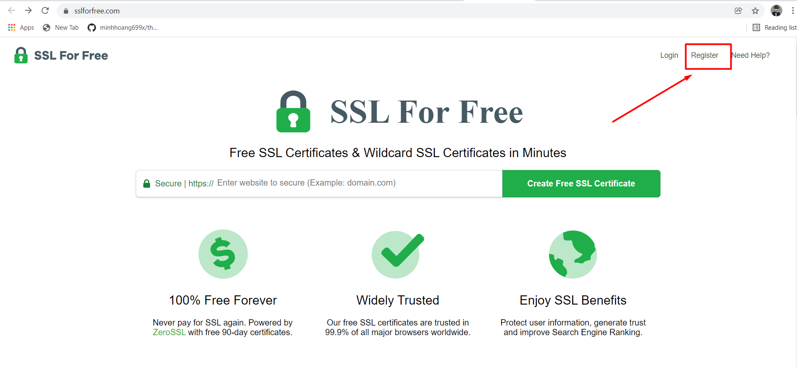

Nhập thông tin đăng ký.

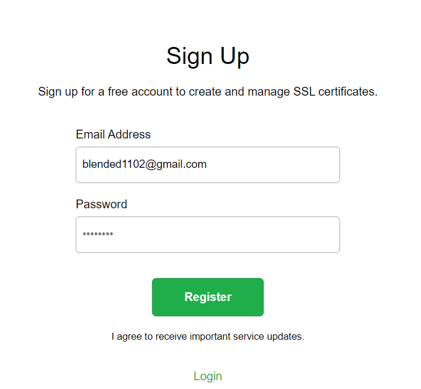

Sau khi đăng ký tài khoản thành công, đăng nhập vào giao diện quản trị của SSL ZeroSSL

2. Tạo CSR

Click vào Dashboard và chọn New Certificate

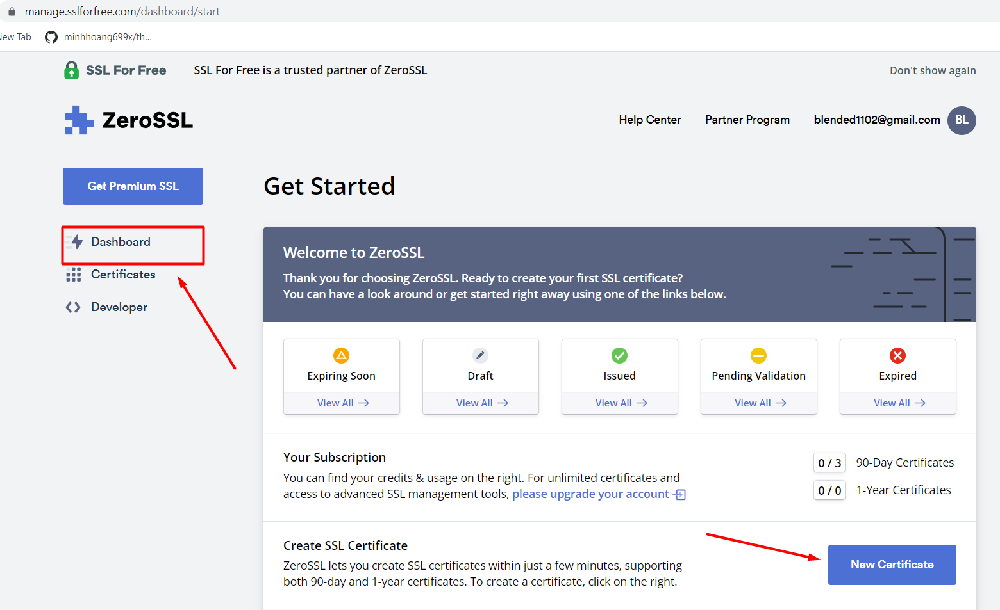

Chọn đăng ký 90-Day Certificate (chứng chỉ sử dụng trong 90 ngày miễn phí và đối với tài khoản miễn phí thì ta chỉ được sử dụng tối đa là 3 lượt cấp chứng chỉ). Nhấn Next Step để tiếp tục.

Nhập domain và click vào next step->

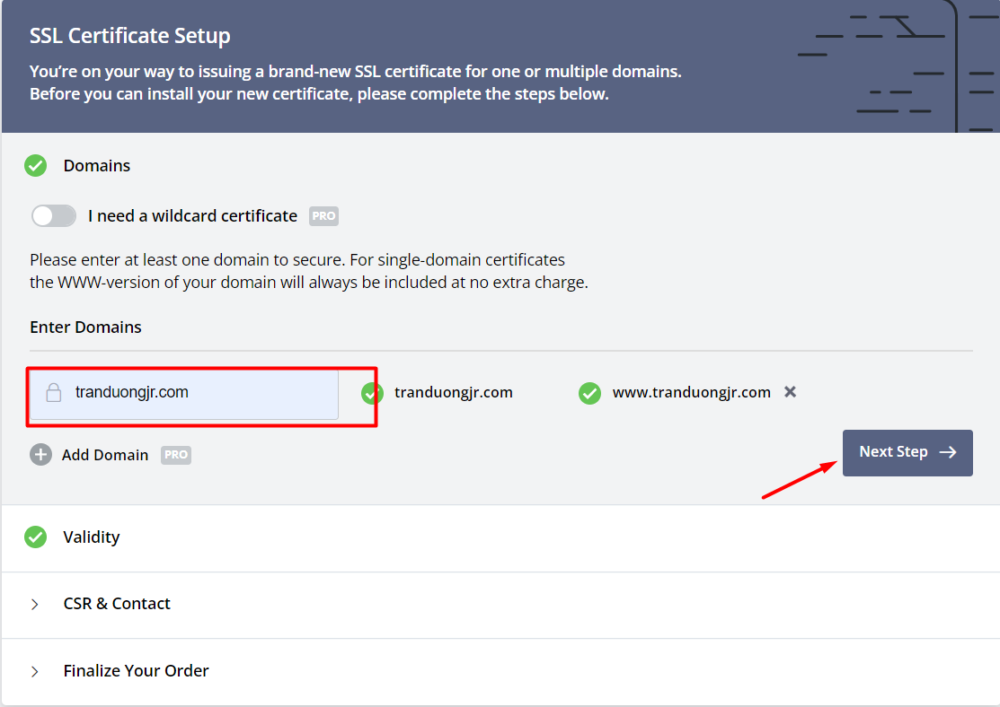

Click Auto CSR

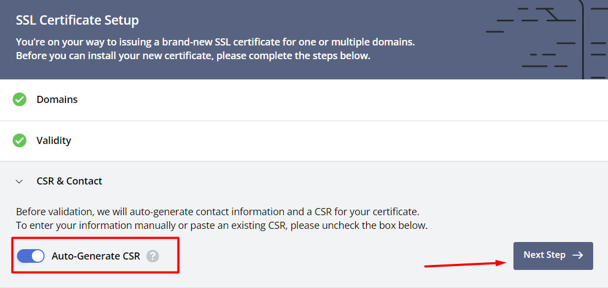

Chứng chỉ 90 ngày sẽ được free, Ở đây ta có những tùy chọn chứng chỉ khác.

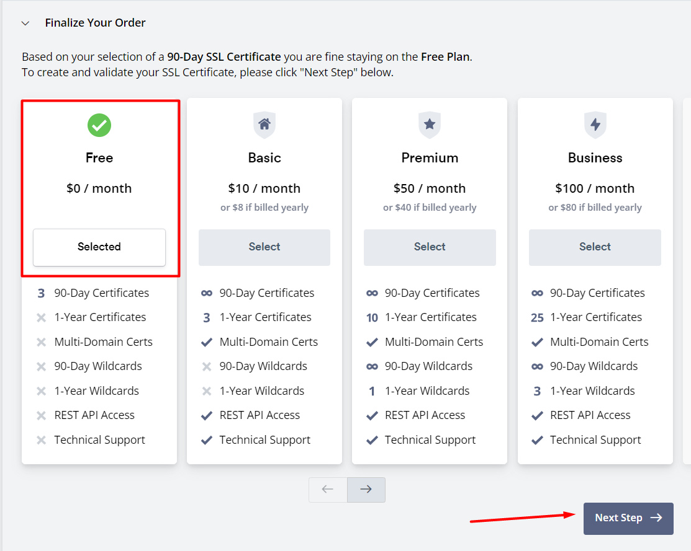

Tiếp theo là trỏ bản ghi để xác nhận miền

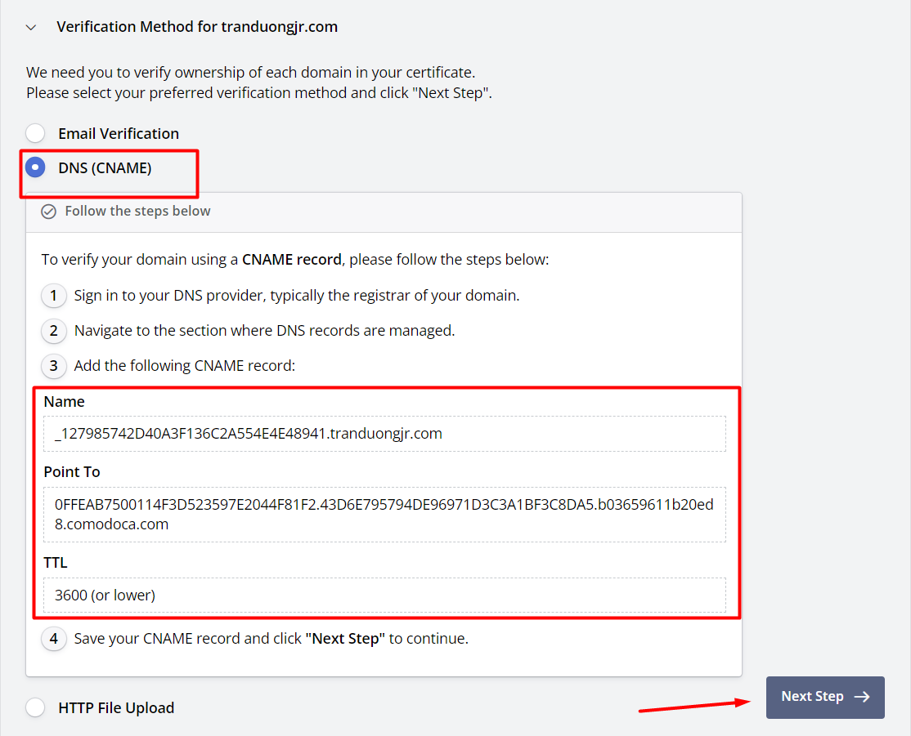

Ta lấy giá trị Name và Point để cấu hình bản ghi CName

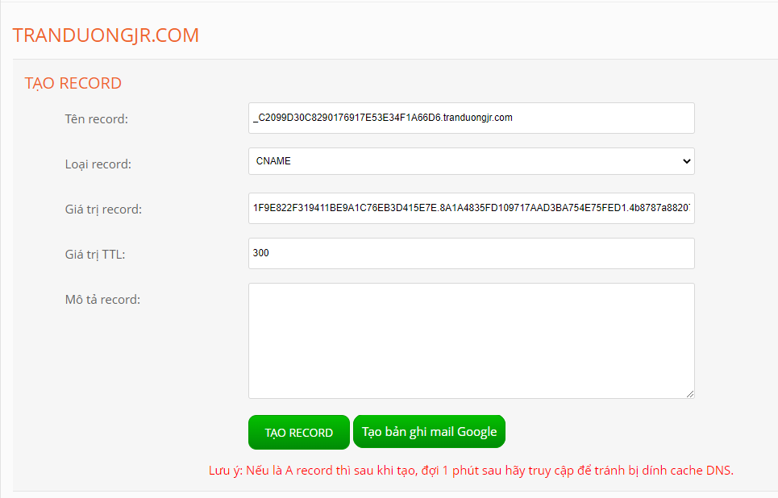

Sau đó Verify Domain


Sau khi xác nhận miền ta sẽ được cấp File Certificate, chúng ta sẽ tải về vài tiếp tục cài đặt chứng chỉ SSL cho website


Chứng chỉ sẽ gồm 3 file là key, crt và ca_bundle

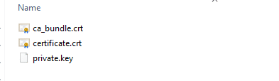

- ca_bundle.crt : file này là CA root
-certificate.crt : file này là chứng chỉ SSL
- private.key : File này là Private key

## Cài SSL lên máy chủ Web

### Chuẩn bị 

Một Webserver Nginx chạy trên hệ điều hành Centos 7

Tham khảo cách cấu hình Nginx trên centos 7 tại:

https://github.com/tranduongjr/baocaothuctap/blob/main/Nginx/Nginx.m

File chứng chỉ SSL được cấp bởi nhà cung cấp SSL gồm 3 file ca_bundle.crt, certificate.crt và private.key như đã cài đặt ở trên


### Cài đặt SSL

Cài mod_ssl

```
yum install mod_ssl
```

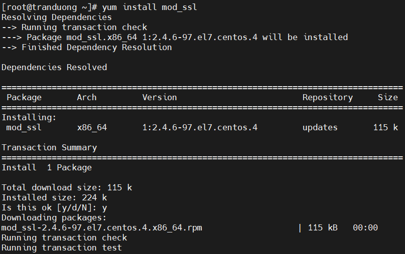

Tạo thư mục chứa SSL

```
mkdir /etc/nginx/ssl
```

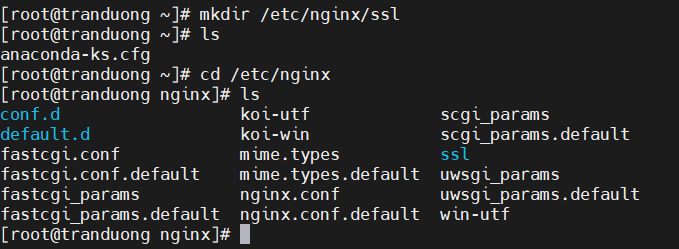

Tạo file ".key" và dán key vào

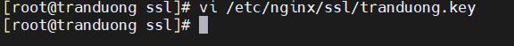

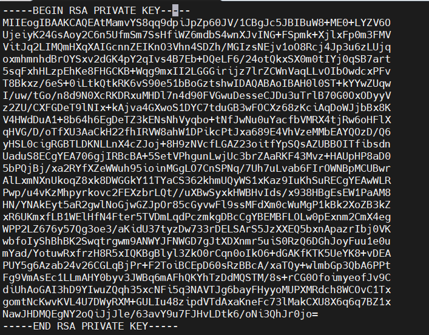

Tạo file ".crt" và đưa  cerfiticate.crt và ca_bunlde.crt vào

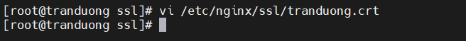

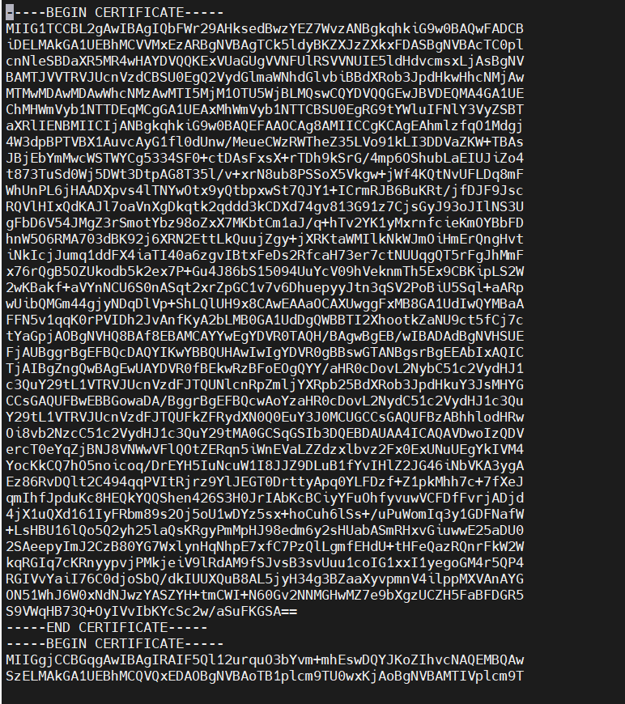

Tiếp đến chúng ta chỉnh sửa config của Vhost. (ví dụ ở đây file Vhost mình đã cấu hình là tranduongjr.com.conf)

```
vi /etc/nginx/conf.d/tranduongjr.com.conf
```

```
server {
    listen 80;
    server_name www.tranduongjr.com tranduongjr.com;
    access_log /usr/share/nginx/html/access.log;
    error_log /usr/share/nginx/html/error.log;
    root /usr/share/nginx/html;
    index index.php index.html index.htm;

    location / {
        try_files $uri $uri/ =404;
    }
    error_page 404 /404.html;
    error_page 500 502 503 504 /50x.html;
    location = /50x.html {
        root /usr/share/nginx/html;
    }

    location ~ \.php$ {
        root /usr/share/nginx/html;
        fastcgi_pass unix:/var/run/php-fpm/php-fpm.sock;
        fastcgi_index index.php;
        fastcgi_param SCRIPT_FILENAME $document_root$fastcgi_script_name;
        include fastcgi_params;
    }

}

server {
    listen 443 ssl;
    ssl_certificate /etc/nginx/ssl/tranduong.crt;
    ssl_certificate_key /etc/nginx/ssl/tranduong.key;
    server_name www.tranduongjr.com tranduongjr.com;
    access_log /usr/share/nginx/html/access.log;
    error_log /usr/share/nginx/html/error.log;
    root /usr/share/nginx/html;
    index index.php index.html index.htm;

    location / {
        try_files $uri $uri/ =404;
    }
    error_page 404 /404.html;
    error_page 500 502 503 504 /50x.html;
    location = /50x.html {
        root /usr/share/nginx/html;
    }

    location ~ \.php$ {
        root /usr/share/nginx/html;
        fastcgi_pass unix:/var/run/php-fpm/php-fpm.sock;
        fastcgi_index index.php;
        fastcgi_param SCRIPT_FILENAME $document_root$fastcgi_script_name;
        include fastcgi_params;
    }
}
```

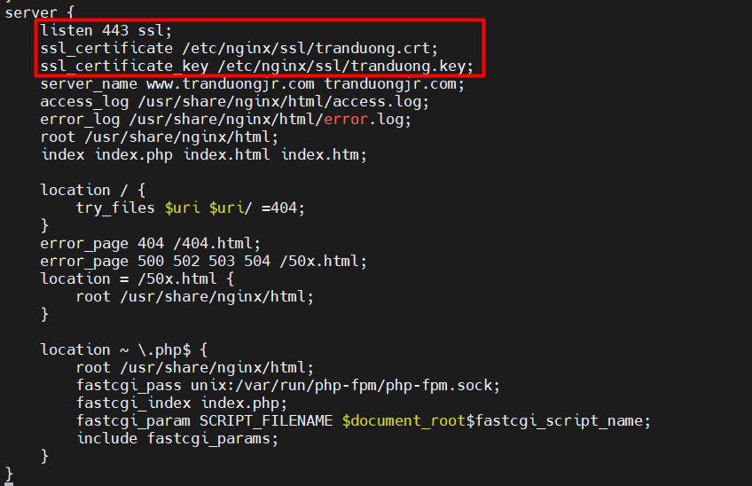

Lưu lại và thoát

Khởi động lại Webserver

```
systemctl restart nginx
```

Truy cập vào trang web trên trình duyệt để kiểm tra kết quả:

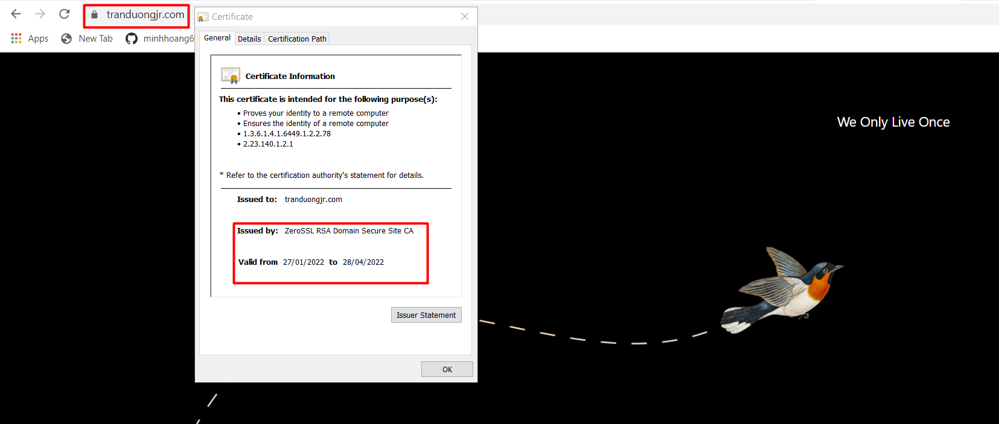
