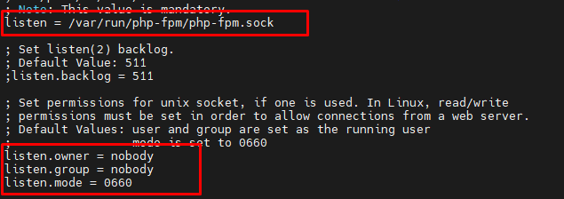
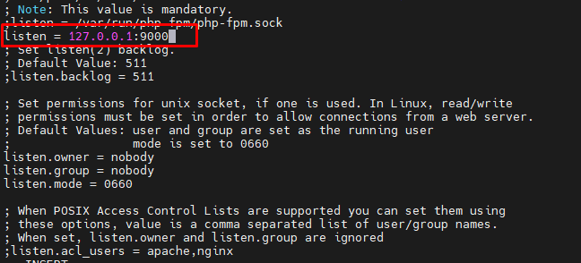
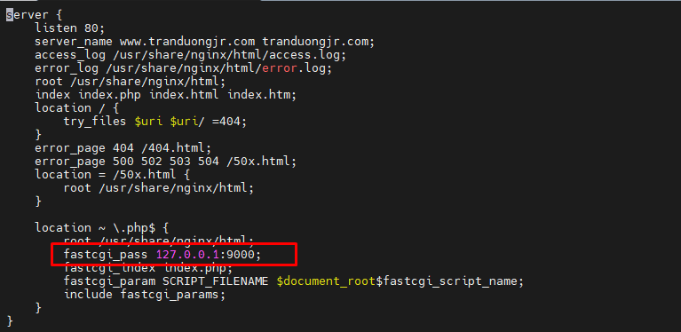

# Kết nối Nginx tới PHP-FPM sử dụng Unix domain socket hoặc TCP/IP Socket.

Máy chủ Web Nginx phục vụ các ứng dụng PHP thông qua giao thức FastCGI (Một giao thức mở rộng từ CGI, mục đính là để webserver tối ưu trong việc xử lý các kết nối giữa máy chủ và chương trình). Nginx sử dụng php-fpm, một tiến trình php FastCGI thay thế chạy ở chế độ nền dưới dạng daemon, lắng nghe các yêu cầu CGI. 

Để chấp nhận các yêu cầu từ FastCGI từ Nginx, PHP-FDM có thể lắng nghe trên TCP/IP socket hoặc Unix domain socket. 

TCP/IP socket được sử dụng để giao tiếp giữa các tiến trình qua mạng. Một TCP/IP socket đã kết nối hay đang lắng nghe được xác định bởi máy chủ bằng địa chỉ IP và cổng (Ví dụ 127.0.0.1:9000). Khi đó trên các TCP/IP socket thì luôn dẫn tới việc tạo và giải mã các gói TCP/IP. Ta cũng có thể sử dụng TCP/IP Socket để giao tiếp giữa các tiến trình đang chạy trên cùng một máy (Sử dụng loopback interface)

Với Unix domain socket, nó là một cơ chế giao tiếp giữa các quá trình cho phép trao đổi dữ liệu hai chiều trên các quá trình đang chạy trên cùng một máy. Vì chúng chỉ hoạt động trên cùng 1 máy nên có thể tránh một số hoạt động như định tuyến mạng, tạo và giải mã gói tin (vì Unix tuân theo quyền của hệ thống tệp); từ đó làm chúng nhanh hơn và nhẹ hơn so với TCP/IP socket.

Vì vậy, nếu dùng để giao tiếp các tiến trình chạy trên cùng một máy chủ lưu trữ thì Unix domain socket là lựa chọn tốt hơn so với TCP/IP socket.


## Cấu hình Nginx kết nối PHP-FPM trên Unix domain socket.

Để cấu hình PHP-FPM lắng nghe Unix domain socket, ta mở file cấu hình của PHP-FPM 

```
vi /etc/php-fdm.d/www.conf
```


Tìm đến tham số listen và thay thế bằng :



Sau đó khởi động lại php-fpm

```
systemctl restart php-fpm
```

Như thế là ta đã hoàn thành cấu hình địa chỉ mà PHP-FPM lắng nghe, tiếp theo ta cần cấu hình cho Nginx để yêu cầu proxy tới nó qua địa chỉ đó, sử dụng tham số cấu hình fastcgi_pass trong tệp cấu hình Vhost.

Ta truy cập vào file Vhost và cấu hình fastcgi_pass unix

```
vi /etc/nginx/conf.d/tranduongjr.com.conf
```


Lưu lại cấu hình. Như thế là ta đã có thể triển khai Nginx kết nối với PHP-FDM bằng Unix domain socket

Khởi động lại Nginx

```
systemctl restart nginx
```

## Cấu hình Nginx kết nối với PHP-FDM trên TCP/IP socket

Để cấu hình PHP-FPM lắng nghe TCP/IP socket ta cũng mở file cấu hình của PHP-FDM

```
vi /etc/php-fdm.d/www.conf
```


Tìm đến tham số listen và thay thế bằng:



Sau đó khởi động lại php-fpm

```
systemctl restart php-fpm
```

Tiếp tục cấu hình trong file Vhost:



Khởi động lại Nginx

```
systemctl restart nginx
```

**Như vậy ta đã có thể cấu hình Nginx kết nối PHP-FPM theo 2 cách khách nhau đó là sử dụng Unix domain socket và TCP/IP socket. Phụ thuộc vào tình huống cụ thể mà ta có thể sử dụng các socket cho thích hợp để tối ưu hóa được máy chủ**