# Giới thiệu về VM Ware

VM Ware là một chương trình tạo máy ảo trên máy tính, nó giúp cho một máy tính có thể chạy song song nhiều hệ điều hành khác nhau tùy theo nhu cầu của người dùng thay vì một hệ điều hành trên một máy như bình thường.

**Lợi ích của VM Ware**

Ảo hóa hạ tầng CNTT cho phép tiết kiệm chi phí trong khi đó lại tăng hiệu quả, hiệu năng và tăng tính linh động cho hạ tầng hiện hữu của người sử dụng.

Giảm số lượng máy chủ vật lý, giảm năng lượng điện năng tiêu thụ, tiết kiệm được chi phí cho việc bảo trì phần cứng, nâng cao hiệu quả công việc.

Dễ dàng mở rộng hệ thống khi có nhu cầu, triển khai máy chủ ảo nhanh, tận dụng tài nguyên hiện có; vì mỗi máy ảo đơn giản chỉ là một tập tin hoặc một thư mục, ta có thể tạo ra máy chủ ảo mới bằng cách sao chép 1 file của máy chủ ảo hiện tại và cấu hình lại, chọn máy chủ vật lý còn dư tài nguyên để đưa máy chủ ảo mới lên.

Với công cụ quản lý tập trung, ta có thể theo dõi được máy chủ nào đang quá tải, từ đó sẽ áp dụng chính sách tăng tài nguyên về CPU, Ram, ổ cứng cho máy chủ ảo đó hoặc di chuyển máy ảo đang quá tải đó sang máy chủ vật lý có cấu hình mạnh hơn, có nhiều tài nguyên hơn để chạy.

Khai thác triệt để các tài nguyên của phần cứng vật lý bằng cách chạy nhiều hệ điều hành trên một máy chủ vật lý.

# 1. Hướng dẫn cài đặt phần mềm VM Ware.
Truy cập https://download.com.vn/vmware-workstation-8587 để tải Vm Ware. 

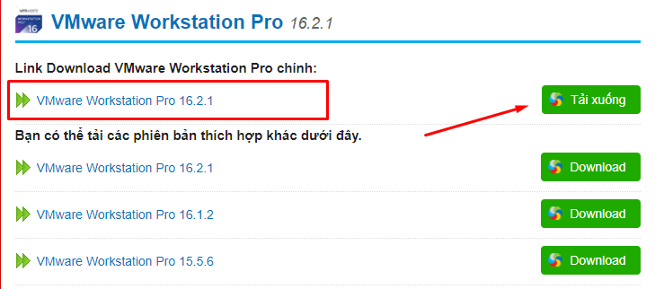

Sau đó tiến hành cài đặt.

Tiến hành Run as Administrator và cài đặt, chấp nhận chính sách của VM Ware.

Tiếp theo để kích hoạt ta có thể nhập key: ZF3R0-FHED2-M80TY-8QYGC-NPKYF để tiến hành active.

Quá trình cài đặt xong ta sẽ có được giao diện chính của VM Ware như sau:

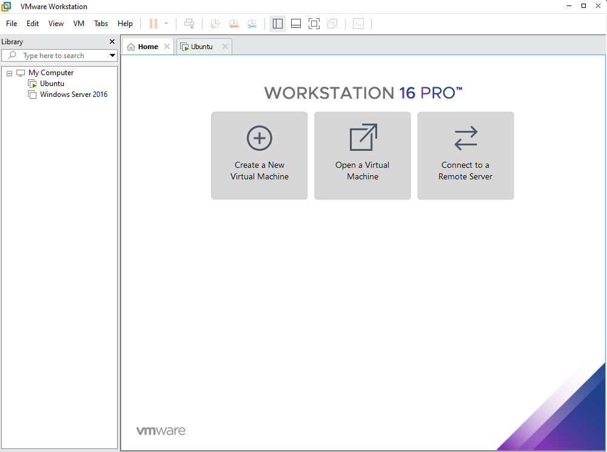

## 2. Cài đặt máy ảo trên VM ware

Sau khi tải và cài đặt VM ware. Để cài máy ảo trên Vm ware ta thực hiện như sau:

Kích chọn Create a New Vitual Machine để tài máy ảo trên Vm Ware.

Lựa chọn cài đặt mặc định **Typical** -> kích chọn Next

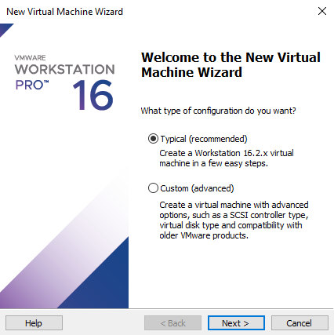

Kích chọn Browser để chọn đường dẫn tới file ISO của hệ điều hành cần cài đặt.

*Lưu ý* để cài hệ điều hành nào đó thì bạn cần file iso của hệ điều hành đó. File này thường được cung cấp trên trang chủ của hệ điều hành.

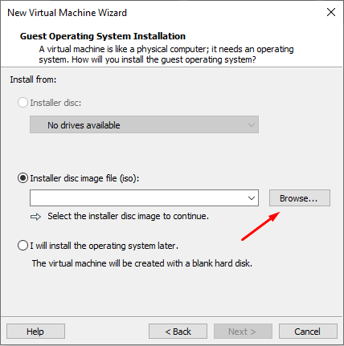

Ví dụ ở đây cài hệ điều hành Windows 7

Sau khi chọn đường dẫn tới file cần cài đặt kích chọn Next.

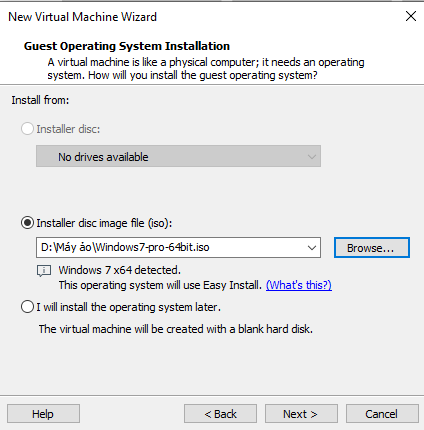

Hệ thống yê cầu nhập các thông tin gồm key active, username, password.

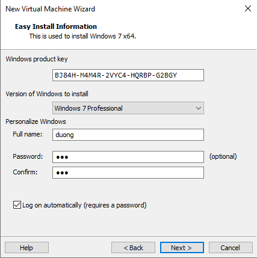

Tiếp theo bạn có thể chọn nơi lưu trữ dữ liệu của máy ảo này

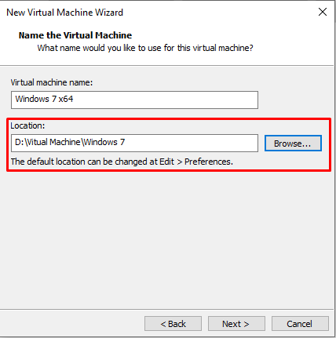

Lựa chọn dung lượng cho hệ điều hành

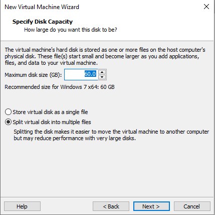

Và Click chọn Finish để bắt đầu cài đặt.

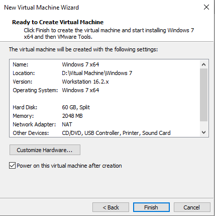

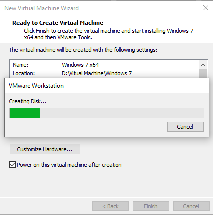

Hoàn tất quá trình cài đặt ta sẽ được 1 máy ảo và có các chức năng hoàn toàn như một vật lý.

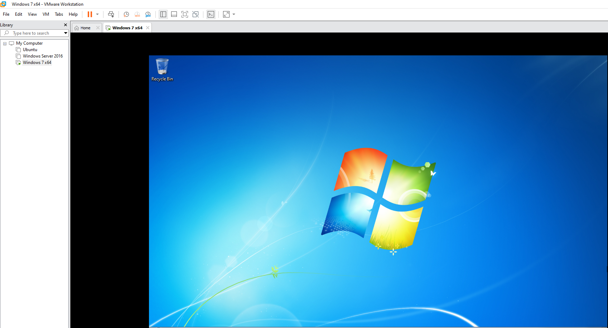

Ta có thể snapshot ban đầu lại

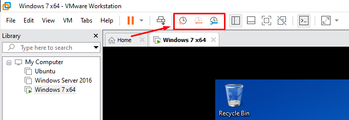

**Trường hợp muốn cài  nhiều hệ điều hành khác nhau thì thực hiện các thao tác tương tự**

Cài đặt được thêm Snapshot

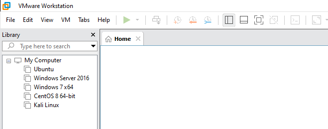

Tiến hành cài đặt các máy ảo:

- Ubuntu
- Windows Server 2016
- Windows 7
- Centos 8
- Kali Linux

Tất cả đều đã được Snapshot ban đầu