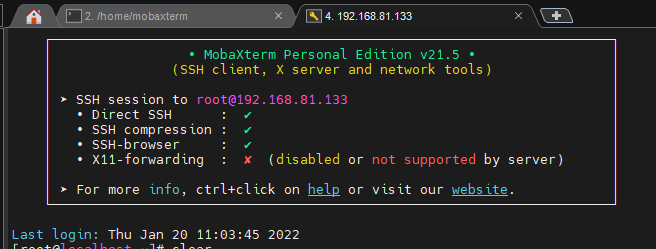
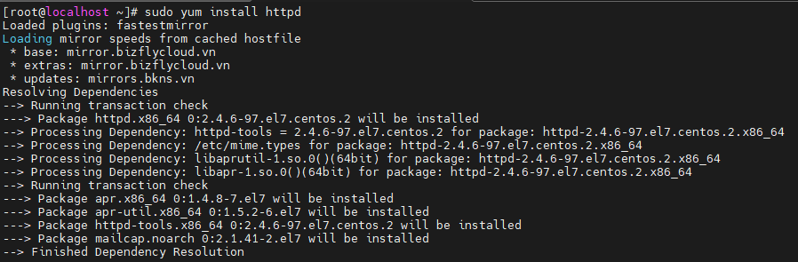
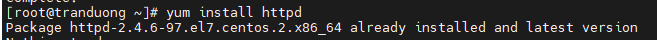
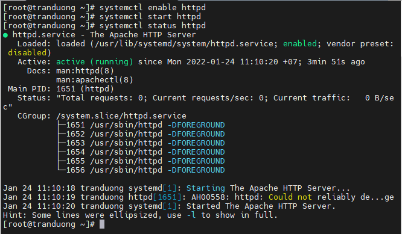
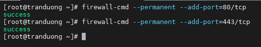
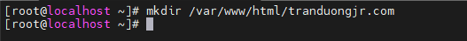
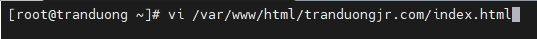
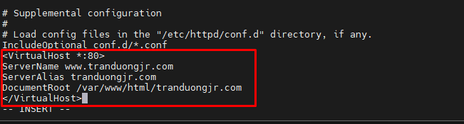
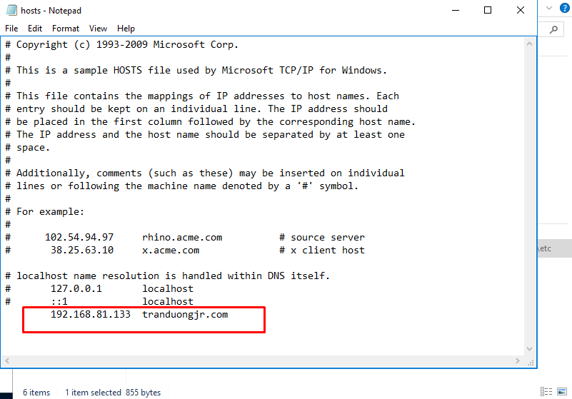
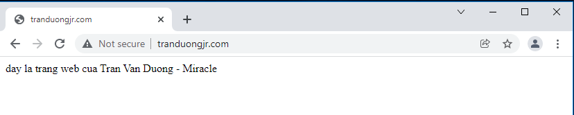

# Cài đặt Apache web server trên Centos 7

**Dùng mobaXterm để truy cập SSH vào Centos 7**



**1. Cập nhật Packages mới nhất cho máy**

```
yum update
```


**2. Cài đặt Apache**



**3. Khởi động và xem trạng thái hoạt động của Apache**



Khi cấu hình xong hoặc chỉnh sửa cấu hình ta có thể dùng lệnh

```
systemctl restart httpd : để khởi động lại httpd

systemctl reload httpd : để load lại httpd

systemctl stop httpd : Dừng httpd

systemctl disable httpd : Dừng kích hoạt httpd
```

**4. Cấu hình Firewall để cho phép truy cập Apache**

Lưu lượng truy cập web thông thường sử dụng giao thức http trên cổng 80, trong khi lưu lượng truy cập web được mã hóa sử dụng giao thức https trên cổng 443. Ta sẽ cấu hình firewall để cho phép kết nối các cổng này.




**5. Thêm domain vào Apache**

Một phần không thể thiếu của máy chủ web là chạy nhiều web trên 1 server. Ta có thể thêm domain vào máy chủ và cấu hình chúng riêng rẽ. Mỗi cấu hình đó được gọi là Virtual host (Vhost), mỗi 1 Vhost sẽ quy định cho mỗi tên miền riêng. Ta có thể tạo ra vô số Vhost để thêm domain vào VPS và chạy nhiều web trên 1 server.

Bước 1. Tạo thư mục chứa Website.



Gán quyền để đảm bảo website hoạt động bình thường.

```
chown -R apache:apache /var/www/html/tranduongjr.com
```

Tạo file index.html và ghi nội dung website (sử dụng trình soạn thảo Vi)





Bước 2. Cài đặt Vhost

Chỉnh sửa trong File cấu hình mặc định của Apache

```
vi /etc/httpd/conf/httpd.conf
```

Di chuyển xuống cuối file và thêm các dòng như sau



<VirtualHost *:80> - Cho phép các cài đặt sau cho tất cả các yêu cầu http được thực hiện trên cổng 80 đến ip mà máy chủ này có thể liên hệ.

ServerName - Miền ánh xạ tới ip

ServerAlias - Tên thay thế được chấp nhận bởi máy chủ

DocumentRoot - nơi lưu trữ dữ liệu của website

ErrorLog lưu trữ ErrorLog của website

CustomLog lưu trữ các request tới website


Lưu lại và thoát.

Khởi động lại Apache

```
systemctl restart httpd
```

*Lưu ý*: Trong trường hợp cấu hình nhiều vhost trong 1 server, Để dễ quản lý các vhost cho các website ta có thể tạo cho mỗi vhost 1 file conf riêng và lưu tại /etc/httpd/conf.d/

Ví dụ với tranduongjr.com thì ta có thể tạo 1 file vhost riêng cho nó :

```
vi /etc/httpd/conf.d/tranduongjr.com.conf
```

Và trong đó ta cấu hình Vhost tương tự như bên trên


Truy cập vào tranduongjr.com để kiểm tra kết quả.



Hoàn thành cấu hình Apache chạy với file index.html
