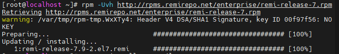

# 1. Cài đặt apache

Như đã cài trước đó

# 2. Cài PHP

Thêm Remi repo:

- rpm -Uvh http://rpms.remirepo.net/enterprise/remi-release-7.rpm

Cài yum-untils để lấy tiện ích yum-config-manager:

Cập nhật:

Cài đặt PHP 7.0

- yum-config-manager --enable remi-php70
- yum -y install php php-opcache

Khởi động lại Apache

Sau đó tạo file index.php trong /var/www/html/tranduongjr.com và push nội dung vào.

