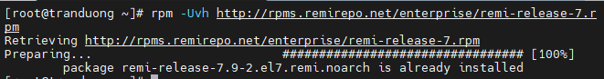
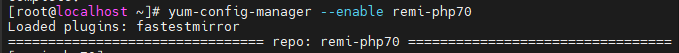
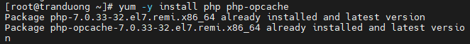
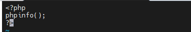
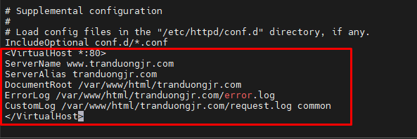

# 1. Cài đặt Apache
Để cài Apache kết hợp PHP trước hết cần phải cài Apache

Tham khảo cài Apache tại https://github.com/tranduongjr/baocaothuctap/blob/main/Web%20Server%20Apache/1.%20Apache%20with%20html.md 

# 2. Cài PHP

Thêm Remi repo:

```
rpm -Uvh http://rpms.remirepo.net/enterprise/remi-release-7.rpm
```



Cài yum-untils để lấy tiện ích yum-config-manager:

```
yum -y install yum-utils
```


Cập nhật:

```
yum update
```

Cài đặt PHP 7.0

```
yum-config-manager --enable remi-php70
```



Cài php-opcache để opcache tối ưu tốc độ và caching khi thiết kế hệ thống website bằng php

```
yum -y install php php-opcache
```



Khởi động lại Apache

```
systemctl reload httpd
```

Sau đó tạo file index.php trong /var/www/html/tranduongjr.com và push nội dung vào.




Khởi động lại Apache

```
systemctl reload httpd
```

Truy cập vào tranduongjr.com để kiểm tra kết quả



Kết quả thành công. Như vậy ta đã có thể kết hợp php vào Apache
