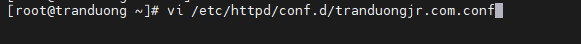

## Cài Apache và PHP

Tham khảo tại 
https://github.com/tranduongjr/baocaothuctap/blob/main/Web%20Server%20Apache/1.%20Apache%20with%20html.md

https://github.com/tranduongjr/baocaothuctap/blob/main/Web%20Server%20Apache/Apache%20with%20php.md

# Cài MySQL - MariaDB

MySQL được thay thế bằng MariaDB trong centOS 7.

Phải bổ sung kho yêu cầu:

rpm --import /etc/pki/rpm-gpg/RPM-GPG-KEY*

yum -y install epel-release

Cài MariaDB:

```
yum -y install mariadb-server mariadb
```



Khởi động MariaDB:

```
systemctl enable mariadb.service
systemctl start mariadb.service
```

Chạy mysql_sercure_installation để bảo vệ

```
mysql_sercure_installation
```

Cài đặt hỗ trợ Mysql trong PHP

```
yum search php

yum -y install php-mysql

yum -y install php-gd php-ldap php-odbc php-pear php-xml php-xmlrpc php-mbstring php-soap curl curl-devel

```

Khởi động lại Apache

**Cài đặt word press**

Vào nơi lưu trữ Vhost:

```
cd /var/www/html/tranduongjr.com/
```

Tải WP về:

```
wget https://wordpress.org/latest.tar.gz
```


Giải nén:

```
tar xzvf latest.tar.gz
```

**Tạo cơ sở dữ liệu**

Đăng nhập vào MariaDB

```
mysql -u root -p
```
Tạo cơ sở dữ liệu và người dùng mới có quyền sử dụng nó: người dùng Miracle pass Xinhlunglinh2.


Phải có @'localhost'

```
FLUSH PRIVILEGES
```

Thoát khỏi MariaDB

**Cấu hình WP kết nối với DB**

1 Đổi tên chỉnh sửa tệp cấu hình WP

```
cd /var/www/html/tranduongjr.com/wordpress

mv wp-config-sample.php wp-config.php
```


Chỉnh sửa cấu hình:

```
vi wp-config.php
```

Thay đổi các giá trị DB_NAME, DB_USER, DB_PASSWORD như đã thiết lập ở trên.


Khởi động lại Apache.

Truy cập vào trang quản trị WP bằng cách thêm /wp-admin vào sau tên miền.


