# Cài Apache và PHP

Chi tiết cách cài Apache và PHP tham khảo tại:

https://github.com/tranduongjr/baocaothuctap/blob/main/Web%20Server%20Apache/1.%20Apache%20with%20html.md

và 

https://github.com/tranduongjr/baocaothuctap/blob/main/Web%20Server%20Apache/Apache%20with%20php.md

# Cài MySQL - MariaDB và Wordpress

MySQL được thay thế bằng MariaDB trong CentOS 7.

Phải bổ sung kho yêu cầu:

rpm --import /etc/pki/rpm-gpg/RPM-GPG-KEY*

yum -y install epel-release

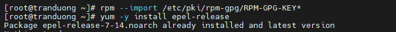

**Cài MariaDB:**

```
yum -y install mariadb-server mariadb
```

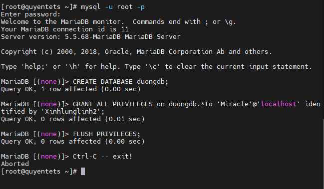

**Khởi động MariaDB:**

```
systemctl enable mariadb.service
systemctl start mariadb.service
```

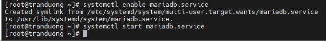

**Chạy mysql_secure_installation để bảo vệ database**

```
mysql_sercure_installation
```


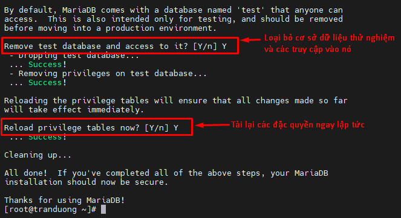

**Cài đặt hỗ trợ Mysql trong PHP**

```
yum search php
```

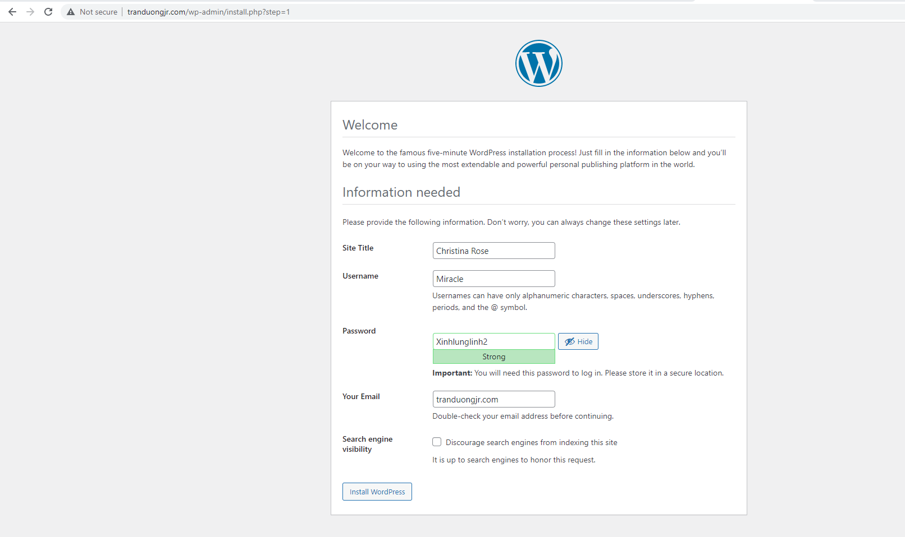

```
yum -y install php-mysql
```

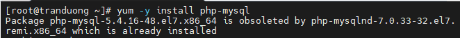

```
yum -y install php-gd php-ldap php-odbc php-pear php-xml php-xmlrpc php-mbstring php-soap curl curl-devel
```

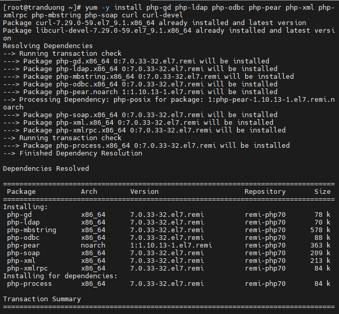

**Khởi động lại Apache**

```
systemctl reload httpd
```

**Cài đặt WordPress**

Vào nơi lưu trữ dữ liệu của website:

```
cd /var/www/html/tranduongjr.com/
```

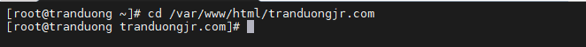

Tải WordPress về:

```
wget https://wordpress.org/latest.tar.gz
```

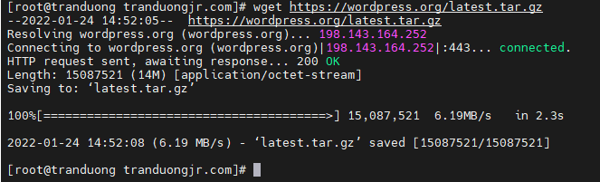

Giải nén:

```
tar xzvf latest.tar.gz
```

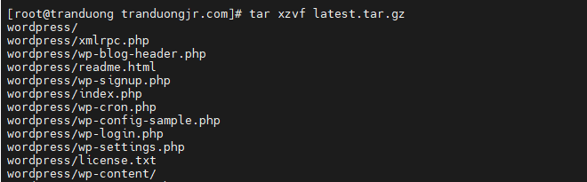

Thiết lập quyền để tránh phát sinh vấn đề:

```
chown -R apache:apache /var/www/html/tranduongjr.com
```

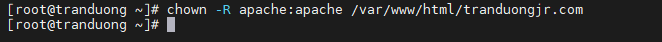

Chuyển tất cả dữ liệu trong WordPress ra ngoài thư mục tranduongjr.com vì trước đó đã thiết lập webserver đọc dữ liệu tại /var/www/html/tranduongjr.com

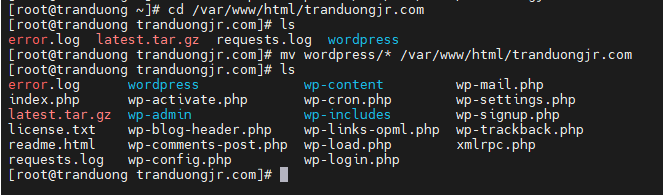

**Tạo cơ sở dữ liệu**

Đăng nhập vào MariaDB

```
mysql -u root -p
```
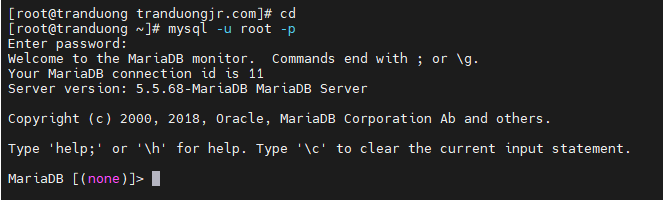

Đăng nhập với password đã thiết lập cho root khi cấu hình mysql_secure_installation

Tạo cơ sở dữ liệu và người dùng mới có quyền sử dụng nó: người dùng Miracle với password Xinhlunglinh2.

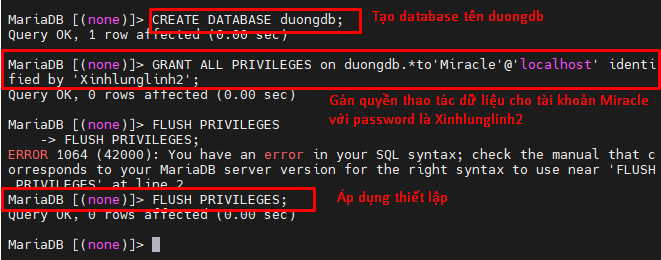

Phải có '@'localhost'


Thoát khỏi MariaDB với lệnh exit

**Cấu hình WP kết nối với DB**

1 Đổi tên chỉnh sửa tệp cấu hình WP

Truy cập vào file WordPress đã tải về và giải nén trước đó

```
cd /var/www/html/tranduongjr.com/wordpress
```

Đổi tên tệp cấu hình wp-config-sample.php thành wp-config.php (cho dễ nhớ chứ không nhất thiết phải đổi tên)

```
mv wp-config-sample.php wp-config.php
```

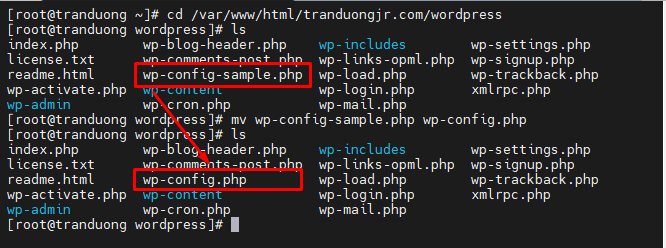

Chỉnh sửa cấu hình:

```
vi wp-config.php
```

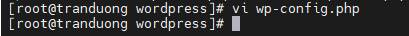

Thay đổi các giá trị DB_NAME, DB_USER, DB_PASSWORD như đã thiết lập ở trên.

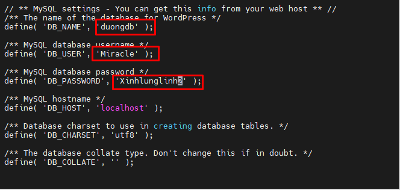

Khởi động lại Apache.

```
systemctl reload httpd
```

Truy cập vào trang quản trị WordPress bằng cách thêm /wp-admin vào sau tên miền. (tranduongjr.com/wp-admin)

Thiết lập ngôn ngữ:

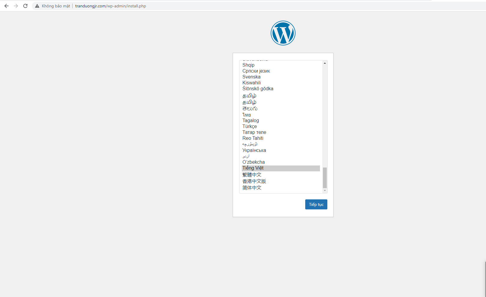

Tiếp tục thiết lập các thông tin như tên website, điền thông tin đăng nhập gồm tên người dùng và mật khẩu đã thiết lập trước đó cho database duongdb, Email của bạn - là địa chỉ email được dùng cho mục đích quản trị


Sau đó Click vào cài đặt WordPress và đăng nhập.

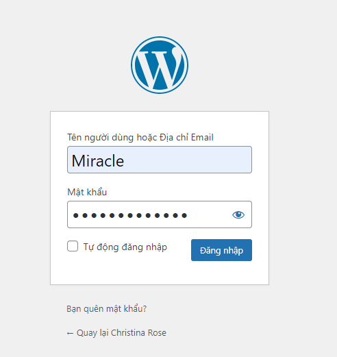

Trang chủ quản trị wordpress hiện ra. Tại đây có thể thực thi các thiết lập với trang web tranduongjr.com

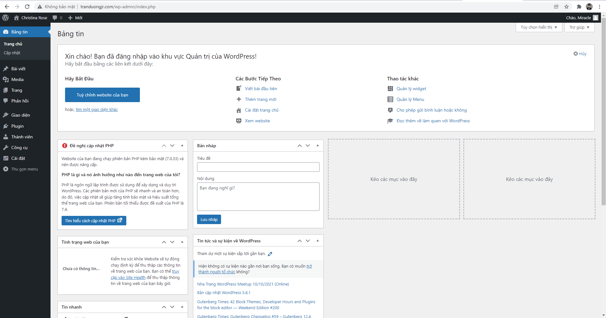