# Các thao tác trên Dashboard zabbix

Giao diện tổng quan khi cài đặt zabbix thành công, gồm các tùy chọn như Monitoring, Inventory, Reports, Configuration, Administration. Trong các tùy chọn đó sẽ gồm các tùy chọn thành phần,...

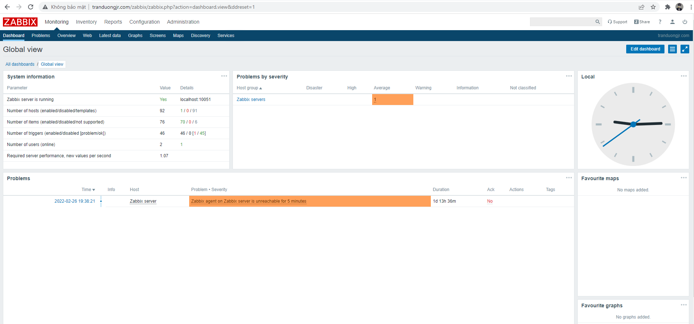


## 1. Monitoring

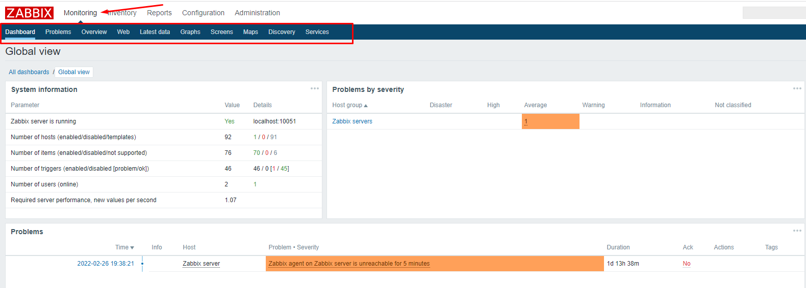

**1.1. Dashboard**

Dashboard hiển thị các dashboard trực quan để người quản trị có cái nhìn tổng quan về hệ thống, người quản trị có thể thêm nhiều các dashboard khác nhau, nhưng tại 1 tab screen thì chỉ có thể xem 1 dashboard bất kỳ được chỉ định.

Từ dashboard có thể nhanh chóng liên kết tới các thành phần như Graphs, Screens, Maps bằng cách thêm cách thành phần mong muốn vào mục Favourite graphs, Favourite Screens và Favourite maps.

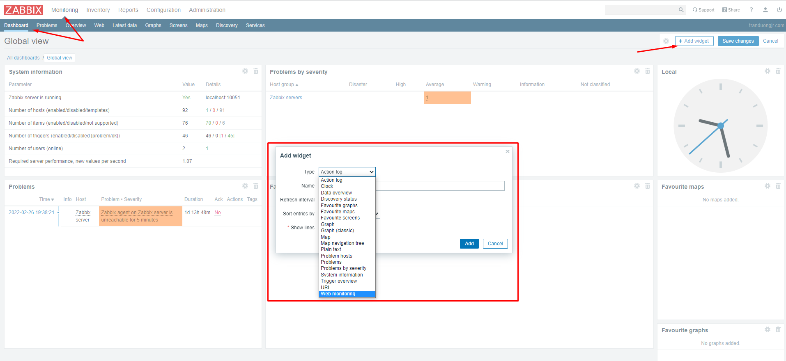

* Status of Zabbix: Hiển thị trạng thái của Zabbix Server, số lượng các host, trigger, item, số người đang đăng nhập và chi tiết các thông số đó dựa trên 2 cột là value và details

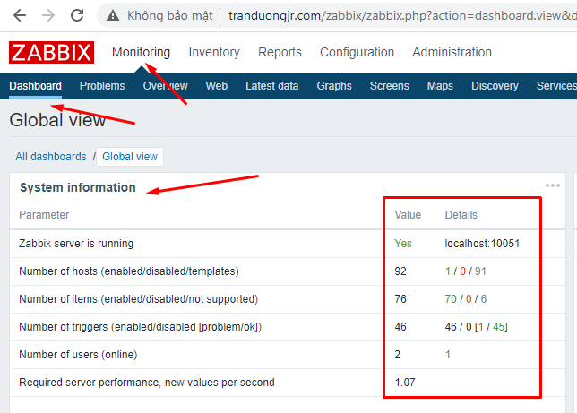

* Problems: Tất cả các vấn đề xảy ra với các host trong các group thống kê theo thời gian

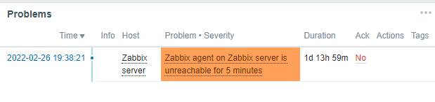

* Các bảng để hiển thị sẵn graphs, screens, maps

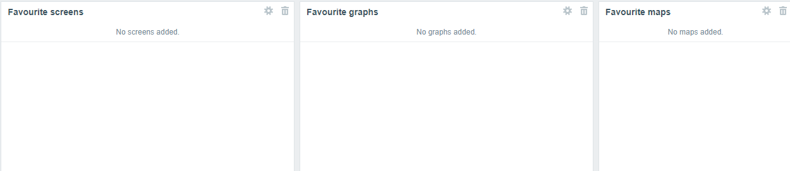

Đối với mỗi bảng có thể tùy chính thời gian refresh để update lại data bằng cách click vào dấu ```...``` ở góc của bảng đó

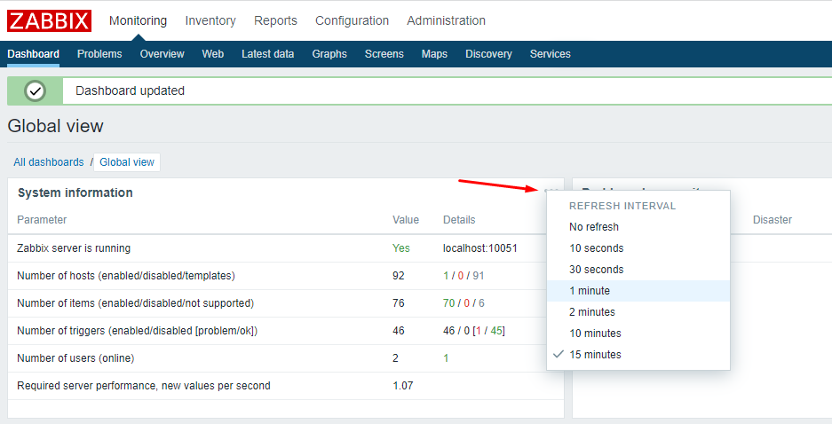

**1.2. Problems**

- Problems: hiển thị các vấn đề đối với từng device mà zabbix server thu thập dữ liệu về. Hỗ trợ cơ chế lọc tùy theo ý người quản trị.

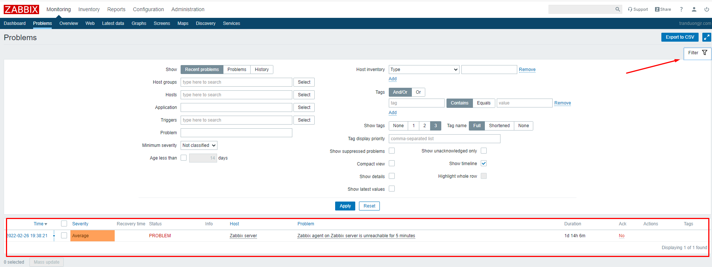

Có thể lọc theo các tiêu chí và export ra file csv để lưu trữ lại.

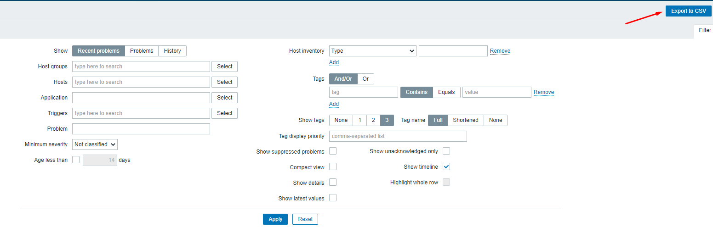

Show: Recent problems (hiển thị các vấn đề đang gặp phải), Problems (hiển thị tất cả các vấn đề đã gặp phải), History (hiển thị lịch sử các vấn đề đã gặp phải)

Host group, Host, Application, Trigger, Problem, Host Inventory, Tags, Show hosts in maintenace,... là các lựa chọn để lọc thông tin, có thể lọc theo 1 tiêu chí hoặc kết hợp nhiều tiêu chí.

**1.3. Overview**

Đem lại cái nhìn tổng quan về data zabbix server thu thập được, có thể lọc theo Group => kiểu data => host

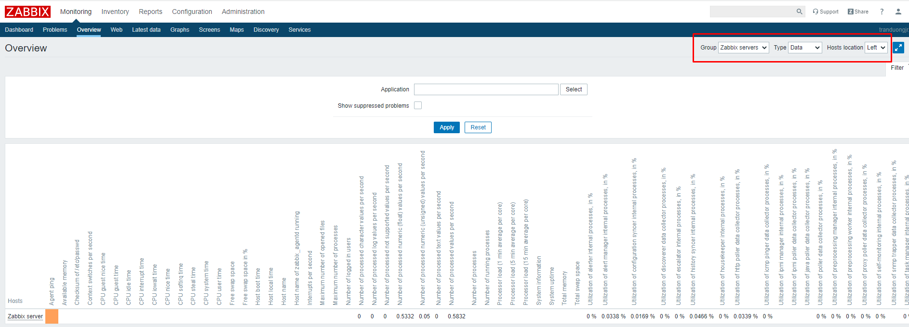

**1.4. Lastest data**

Dữ liệu mới nhất mà zabbix server thu thập được

**1.5. Graphs**

Nơi các thông tin dữ liệu được biểu diễn dưới dạng biểu đồ theo thời gian thực, ví dụ như traffic quan interface của thiết bị, thông tin, tình trạng của CPU, RAM, ổ cứng,... các thông tin này được định nghĩa trong các Templates.

**1.6. Screen**

Là nơi tập hợp các thông tin như Graphs, Maps, data overview,... vào chung một màn hình giám sát. Giúp người quản trị có thể lựa chọn các thông tin cần thiết hiển thị, giúp có cái nhìn tổng quát những thông tin mà người quản trị mong muốn. 

**1.7. Maps**

Maps là thành phần cung cấp khả năng giám sát hệ thống dưới hình thức mô hình mạng. Giúp người quản trị có cái nhìn tổng quan về hệ thống sống mạng dưới sơ đồ, trong trường hợp có sự cố sẽ giúp người quản trị đánh giá tầm ảnh hưởng của thiết bị gặp sự cố và đưa ra giải pháp phù hợp.

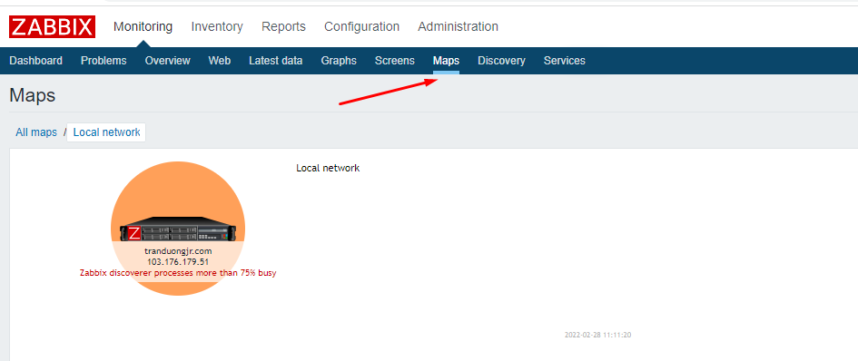

**1.8. Discovery**

Tính năng cho phép zabbix server tự động tìm kiếm các thiết bị được cài đặt zabbix agent đã cấu hình kết nối về zabbix server trong cùng mạng với zabbix server.

## 2. Configuration

**2.1. Hostgroup**

Tập hợp lại các host có chung một mục đích sử dụng hoặc người quản trị tập hợp lại để phục vụ một mục đích quản lý chung. 


**2.2. Templates**

Tập hợp các thực thể có thể áp dụng cho các Host, một Template sẽ chứa trong nó các tập lệnh để truy vấn dữ liệu, hiển thị thông tin dữ liệu lấy được, thông tin tình trạng thiết bị, hiển thị và thông báo lỗi,...

Trong mỗi Template, các tệp lệnh được chia thành: item, graphs, applications, screens,... Tùy theo giám sát thiết bị, dịch vụ, ứng dụng,... nào thì các thành phần này được thiết lập khác nhau.

Có thể import template tự viết vào.

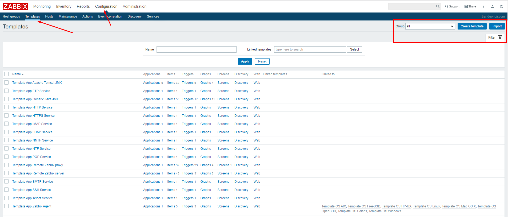

**2.3. Host**

Là một máy tính, server, vps, chạy các hệ điều hành khác nhau hoặc một thực thể trong hệ thống mạng như máy in, máy chấm công, máy photo, máy camera có hỗ trợ các giao thức mà monitor zabbix cung cấp.

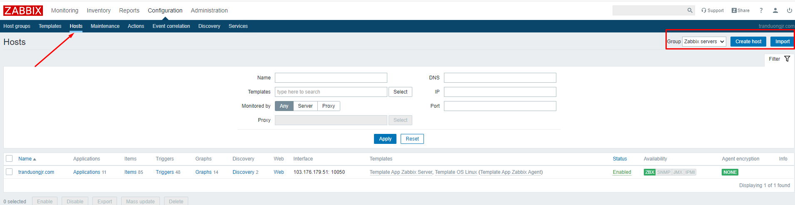

**2.4. Maintance**

Có thể xác định thời gian bảo trì cho máy chủ và group trong zabbix. Có hai loại Maintance - với thu thập dữ liệu và không thu thập dữ liệu.

Ví dụ server off trong thời gian này để nâng cấp sửa chữa thì maintance sẽ được lựa chọn cấu hình để không thu thập data trong khoảng thời gian đó.

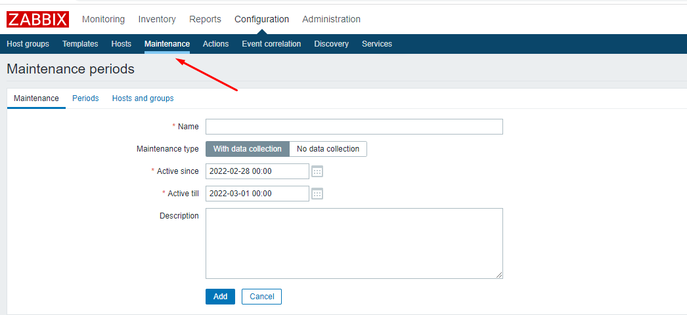

**2.5. Action**

Nơi cấu hình, lựa chọn các kiểu thông báo khi có sự kiện xảy ra bởi cấu hình

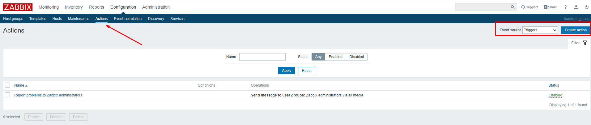

**2.6. Event correlation**

Cho phép cấu hình tương quan giữa các sự kiện với độ chính xác cao và tùy biến linh hoạt

**2.7. Discovery**

Thiết lập range  IP,nếu trong range có thiết bị nào cài đặt các giao thức mà zabbix server hỗ trợ thì sẽ tự động thu thập data về.

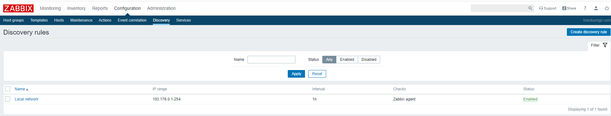

## 3. Administrator

Chức năng của Tab Administrator là để cấu hình chung cho zabbix đối với user vó quyền Admin

**3.1. General**

Mục này cho phép người quản trị cấu hình tùy chỉnh giao diện cho Zabbix

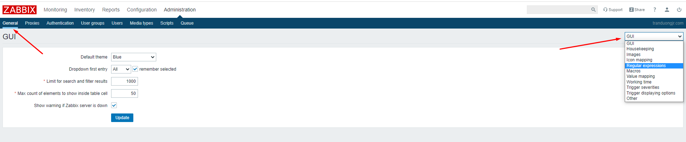

Có thể tùy chỉnh rất nhiều giao diện như:

**GUI**: cung cấp một số tùy chỉnh mặc định liên quan tới giao diện:

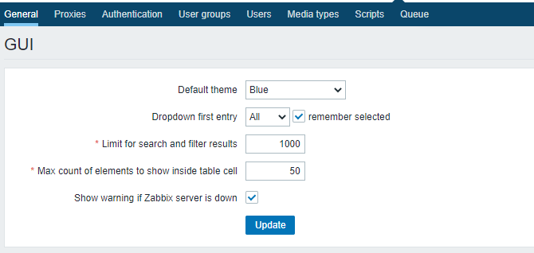

- Default theme: Chủ đề mặc định của giao diện. Thường là màu xanh da trời.

- Dropdown first entry: Chọn nó là mục đầu tiên trong Drop down.

- Search/Filter elements limit: Số lượng tối đa hiển thị các hàng trong tìm kiếm và lọc.

- Max count of elements to show inside table cell: Giới hạn hiển thị trong bảng.

- Show warning if Zabbix server is down: Cho phép hiển thị một thông điệp cảnh báo khi không kết nối được Zabbix Server.

**HouseKeeping**: quy định các thời gian định kì được thực hiện bởi Zabbix . Quá trình xóa thông tin hết hạn và thông tin được xóa bởi người dùng .Có thể tùy chỉnh các dữ liệu được lưu tối đa trong bao lâu trên Zabbix. Gồm các phần có thể cấu hình như Event and alerts, Services, Audit, User sessions, History, Trends.

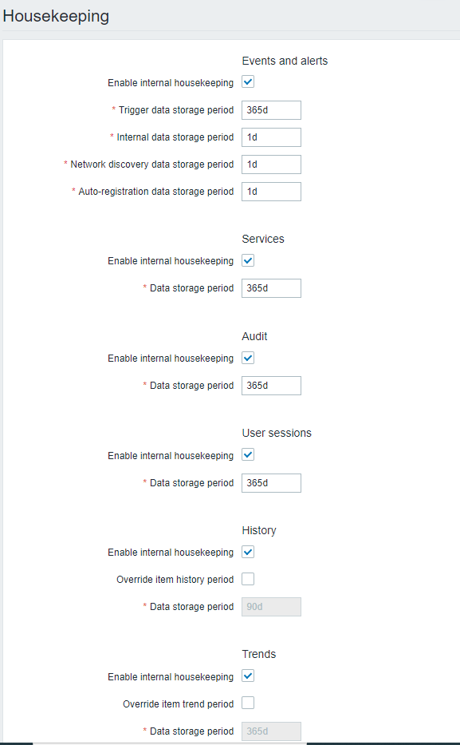

- Enable internal housekeeping: Lựa chọn bật hoặc tính time để xóa bỏ thông tin.

- Trigger data storage period: Khoảng thời gian dọn dẹp các thông tin về việc lưu trữ data trigger

- Internal data storage period: Khoảng thời gian dọn dẹp Internal data storage.

- Network discovery data storage period: Khoảng thời gian dọn dẹp discovery data storage.

**Images:**: Chứa tất cả các hình ảnh, icon, background được hiển thị trong Zabbix


**Icon mapping**: Cho phép tạo biểu tượng bản đồ của một host với các biểu tượng nhất định. Các thông tin trong các tùy chọn phục vụ cho việc tạo biểu đồ

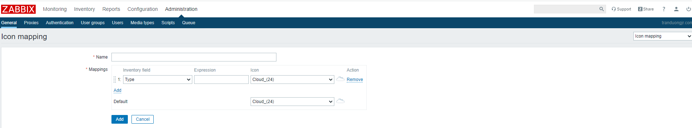

**Regular expressions**: Tạo và quy ước các biểu thức chính quy.

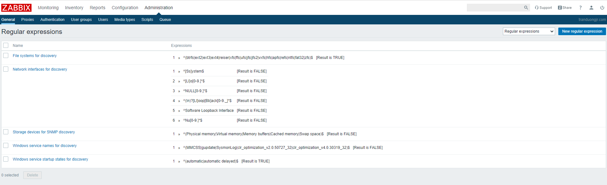

Macros: Tạo các đoạn macro tương ứng với giá trị

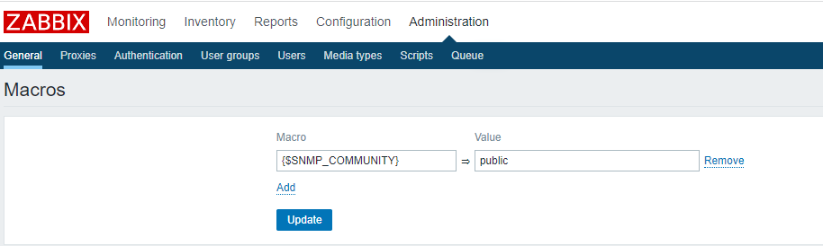

**Value mapping**: Tạo các giá trị tương ứng với các mức.

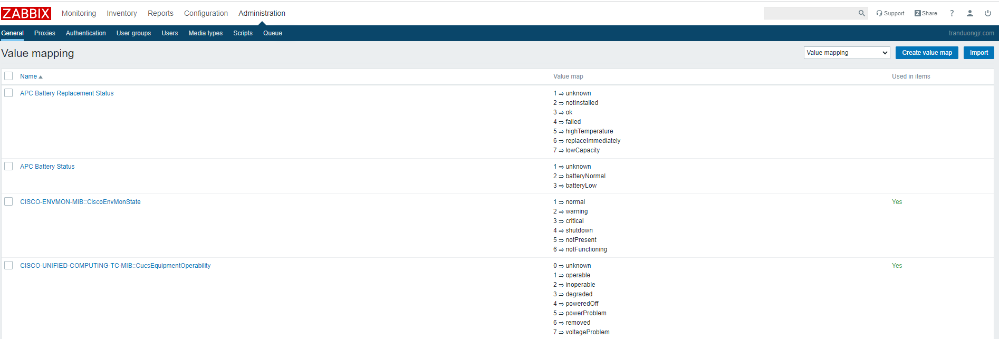

**Working time**: Tham số toàn hệ thống xác định thời gian làm việc


Trigger severities: Cấu hình màu hiển thị đối với các mức của trigger.

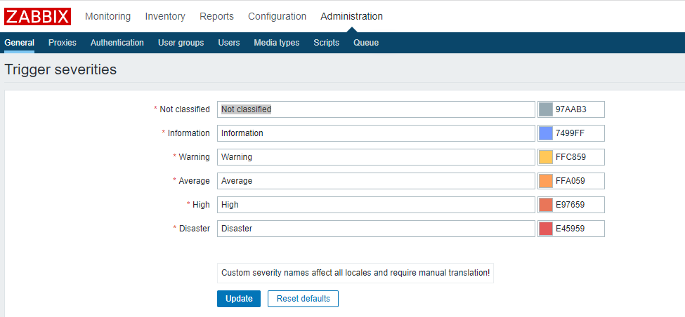

**Trigger displaying options**: Màu sắc, hiệu ứng hiển thị khi có event.

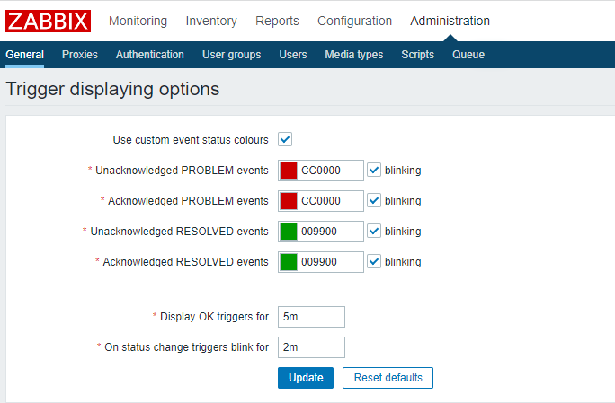

**3.2. Proxies**

Cho phép cấu hình các Proxy trên giao diện Zabbix

**3.3. Authentication**

Phương pháp xác thực người dùng Zabbix : Thẩm định nội bộ, LDAP

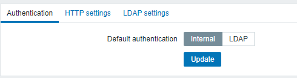

Cài đặt xác thực qua HTTP

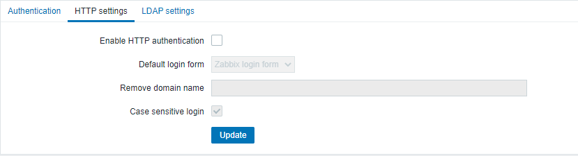

Cài đặt xác thực LDAP

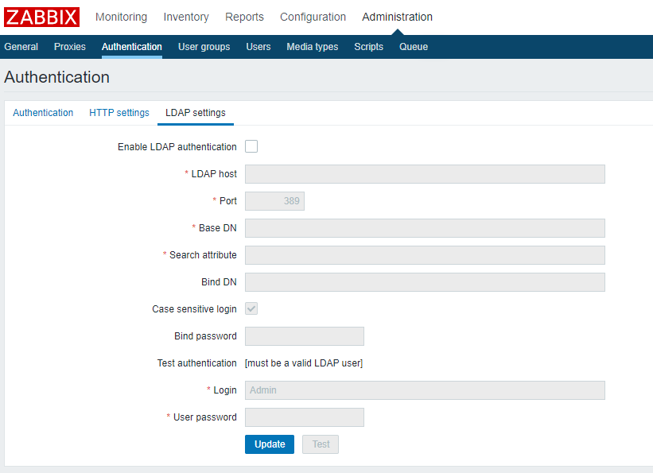

**3.4. User Groups**

Quản lý các nhóm người dùng trong Zabbix

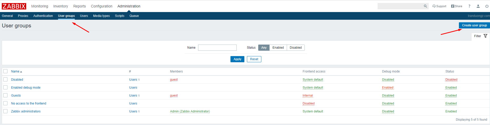

**3.5. Users**

Tùy chỉnh các tài khoản cho Zabbix

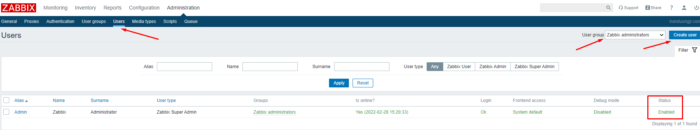

Có thể tạo thêm các user khác với việc phân quyền tương ứng

**3.6. Media types**

Các kênh báo động

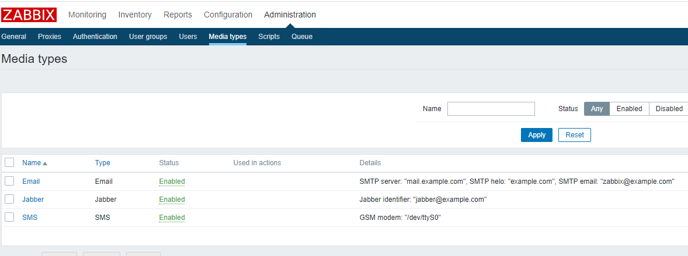

**3.7. Scripts**

Các tệp lệnh

**3.8. Queue**

Thông tin về hàng đợi trong quá trình cập nhật dữ liệu về từ các nguồn agent

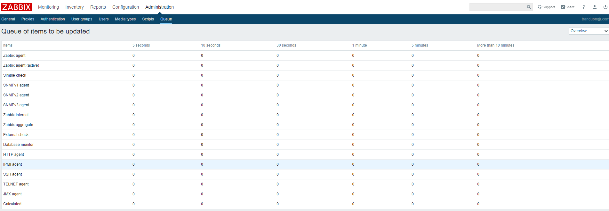

## 4. Report

Nơi tổng hợp các báo cáo về các hoạt động đối với hệ thống.

## 5. Inventory