# Giới thiệu về Zabbix
## Zabbix là gì?

Zabbix là một phần mềm mã nguồn mở được công bố lần đầu năm 2001, có chức năng giám sát các dịch vụ mạng và tài nguyên công nghệ khác như máy chủ, phần cứng,... một cách nhanh chóng hiệu quả. Kết quả phân tích, thống kê số liệu được thể hiện một cách trực quan; các thông báo về vấn đề tiềm ẩn được cập nhật chính xác và kịp thời.

Tính đến nay, Zabbix là nền tảng được nhiều công ty có quy mô lớn sử dụng khi nó có thể theo dõi và thu thập chỉ số thực từ hàng triệu server trên thế giới.

## Khả năng hoạt động của Zabbix

**Thực hiện chức năng giám sát toàn diện**

- *Giám sát phần cứng:* Zabbix thực hiện giám sát các vấn đề như nhiệt độ của máy chủ, công tắc bộ định tuyến,... thông qua SNMP (giao thức quản lý, kiểm tra hoạt động và hỗ trợ vận hành từ xa cho các thiết bị mạng như router, switch hay server,...)

Tuy nhiên, chúng ta không cần thiết phải giám sát phần cứng thường xuyên. Vì nó không ảnh hướng đến việc quản lý của doanh nghiệp.

- *Giám sát hệ thống:* Là việc theo dõi các số liệu về dung lượng, tốc độ của hạ tầng như CPU, RAM, ổ cứng,... nhằm đảm bảo tài nguyên của bạn luôn đủ để sử dụng. Tránh trường hợp gây mất ổn định, hoặc khởi động lại hệ thống. Như hosting chạy trên hệ điều hành  windows chỉ nên sử dụng đến giới hạn tài nguyên 80% để đảm bảo mọi hoạt động diễn ra bình thường.

- *Giám sát mạng:* thường sử dụng với các công ty sử dụng giải pháp mạng điện toán đám mây.

- *Giám sát bảo mật:* Bao gồm tường lửa, phần mềm chống DDOS, mật khẩu, sao lưu, phục hồi và các hệ thống bảo mật được các nhà cung cấp cài đặt sẵn trên các giải pháp mạng. Báo cáo quá trình hoạt động của các công cụ này, sự ghé thăm của mã độc, những đường link chứa nhiều mã độc truy cập vào trang,...

- *Giám sát web*: chức năng này có thể được phát triển cao hơn với nhu cầu kiểm soát của người dùng. Nó đưa ra các số liệu về thời gian tải trang, tốc độ load, thời gian phản hồi,...

Theo dõi nhật ký: là quá trình thu thập, lưu trữ, truy vấn dữ liệu. Bạn có thể theo dõi Nginx thông qua nhật ký 500x, lỗi PHP,... Ngoài ra, bạn có thể phát triển chức năng này bằng cách sử dụng mã nguồn mở ELKstack để đạt được .logstash, elasticsearch (lưu trữ và tìm kiếm), kibana (hiển thị)

**Phân tích lưu lương**

Giúp người sử dụng theo dõi được hoạt động của trang web, số lượng traffic, chất lượng của những lượt ghé thăm, qua đó đánh giá được hiệu quả của chiến lược marketing và những vấn đề cần thay đổi.

## Ưu điểm và nhược điểm quả Zabbix

### Ưu điểm

- Đây là một công cụ mã nguồn mở, dễ phát triển và mở rộng theo ý người dùng. Chi phí đầu tư ban đầu thấp

- Thực hiện chức năng giám sát toàn diện trên các thiết bị phần cứng và dịch vụ mạng

- Hỗ trợ tốt các máy chủ đặt trên hệ điều hành Linux

- Giao diện thân thiện và đẹp mắt

- Phân quyền user linh động và dễ thực hiện.

- Thông váo các sự cố nhanh chóng qua email hoặc app

- Các chức năng theo dõi thống kê được thực hiện chủ động, dễ thiết lập và sửa đổi

- Sở hữu tài nguyên công cụ lớn và nhiều lugin hỗ trợ cho các dịch vụ hệ thống khác nhau

- Có tính năng chứng thực người dùng

- Kết quả được trả về dưới dạng biểu đồ trực quan, dễ phân tích và đánh giá.

### Nhược điểm

- Zabbix không hỗ trợ giao diện web mobile

- Thiết kế template/alerting rule của hệ thống được người dùng đánh giá là không mấy thân thiện vì đôi khi nó yêu cầu cao về kiến thức code của người dùng.

- Sẽ gặp tình trạng mất ổn định và các vấn đề hiệu suất về PHP và Database khi sử dụng hệ thống mạng lớn hơn 1000+ node

## Cài đặt Zabbix

### Chuẩn bị

- Máy chủ web apache

- PHP và các extention cần thiết

- Máy chủ cơ sở dữ liệu MySQL/MariaDB

### Cài đặt

1. Vô hiệu hóa SELinux

Đầu tiên cần kiểm tra xem Selinux có đang tắt không, nếu đang bật thì cần tắt đi. Kiểm tra bằng lệnh

```
sestatus
```

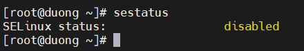

Nếu disable thì thôi, còn Enable thì tắt bầng cách vào file cấu hình của nó:

```
vi /etc/sysconfig/selinux
```

Change SELINUX=enforcing to SELINUX=disabled

Sau đó reboot lại máy chủ bằng lệnh reboot

1. Cài đặt và cấu hình Apache

Bạn thực hiện chạy các lệnh sau

**Cài đặt httpd**:

```
yum -y install httpd
```

**Start httpd**

```
systemctl start httpd
```

**Kích hoạt httpd khi khởi động**

```
systemctl enable httpd
```

**Kiểm tra trạng thái httpd**

```
systemctl status httpd
```

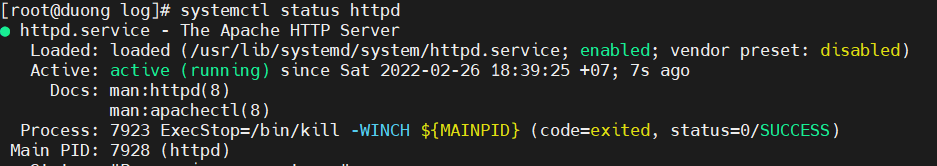

2. Cài đặt PHP và các exention cần thiết

Cấu hình các repo cần thiết

**Cài đặt epel và remi repos**

```
yum -y install epel-release -y

yum install http://rpms.remirepo.net/enterprise/remi-release-7.rpm
```

**Vô hiệu PHP 5 repositories và enable PHP 7.2 repo**

```
yum -y install yum-utils

yum-config-manager --disable remi-php54

yum-config-manager --enable remi-php72
```

**Cài đặt PHP**

```
yum install php php-pear php-cgi php-common php-mbstring php-snmp php-gd php-pecl-mysql php-xml php-mysql php-gettext php-bcmath
```

Cài NTP đồng bộ thời gian

```
yum install chrony -y 

systemctl start chronyd 

systemctl enable chronyd

systemctl restart chronyd 

chronyc sources -v

ln -f -s /usr/share/zoneinfo/Asia/Ho_Chi_Minh /etc/localtime
```

Chỉnh sửa time Zone PHP tại file php.ini

```
vi /etc/php.ini
```

Bỏ comment và chỉnh sửa như sau (date.timezone ở dòng 878)

date.timezone = Asia/Ho_Chi_Minh


4. Cài đặt MariaDB

Chạy lệnh sau để cài đặt

```
yum --enablerepo=remi install mariadb-server
```

**Start MariaDB**

```
systemctl start mariadb.service
```

**Kích hoạt MariaDB khi boot hệ thống**

```
systemctl enable mariadb
```

**Kiểm tra trạng thái MariaDB**

```
systemctl status mariadb.service
```

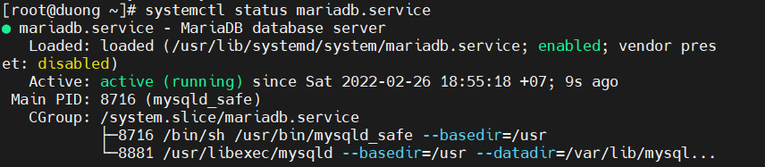

Sau đó chạy lệnh sau để cấu hình bảo mật MariaDB

```
mysql_secure_installation
```

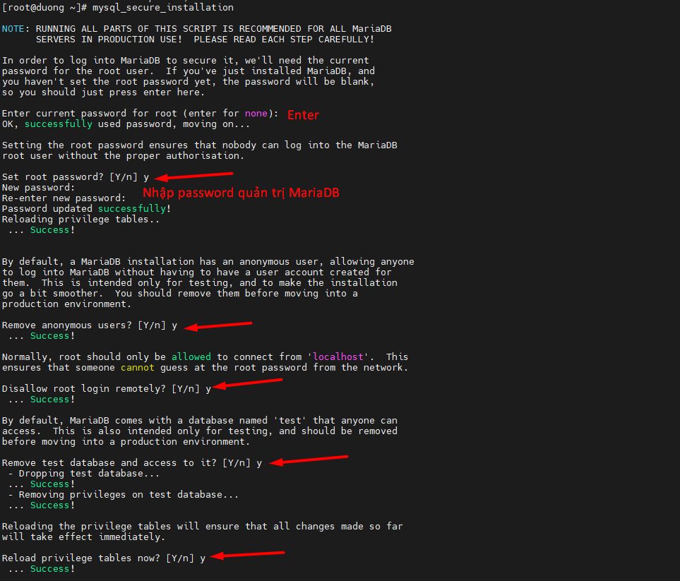

Sau đó bạn đăng nhập vào DB server và nhập password vào

```
mysql -u root -p
```
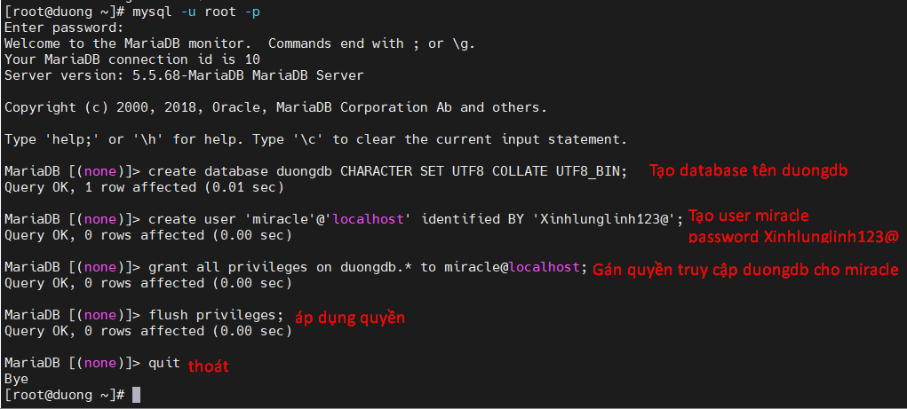

6. Cài đặt Zabbix

Thực hiện chạy các lệnh sau

**Thêm Zabbix repository bằng cách copy lệnh bên dưới và chạy**

```
rpm -ivh https://repo.zabbix.com/zabbix/4.0/rhel/7/x86_64/zabbix-release-4.0-1.el7.noarch.rpm
```

**Cài đặt Zabbix**

```
yum install zabbix-server-mysql zabbix-web-mysql zabbix-agent zab
```

7. Configure Zabbix

Thay đổi Time Zone trong cấu hình Zabbix Apache,mở file /etc/httpd/conf.d/zabbix.conf và sửa như sau.

Uncomment Time Zone và sửa như sau

```
php_value date.timezone Asia/Ho_Chi_Minh
```

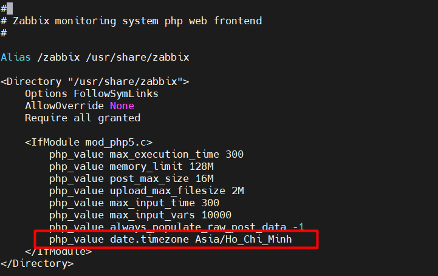

Sau đó bạn Restart lại httpd

```
systemctl restart httpd.service
```

Tiếp theo bạn truy cập vào thư mục sau /usr/share/doc/zabbix-server-mysql-4.0.38 và import MySQL và import MySQL-MariaDB

Lưu ý: Tùy phiên bản zabix-server-mysql (ta có thể xem nó tại trong /usr/share/doc/ để xem là phiên bản bao nhiêu)

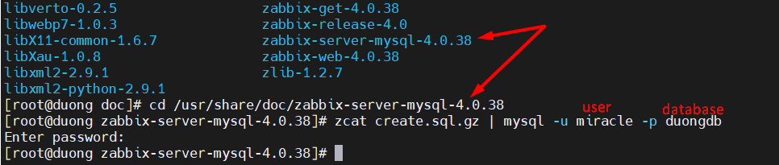

```
zcat create.sql.gz | mysql -u miracle -p duongdb
```

Sau khi import hoàn tất ta bắt đầu chỉnh sửa cấu hình Database tại file zabbix_server.conf

```
vi /etc/zabbix/zabbix_server.conf
```

Chỉnh sửa các thông số cấu hình mặc định thành thông tin database mà đã tạo trước đó

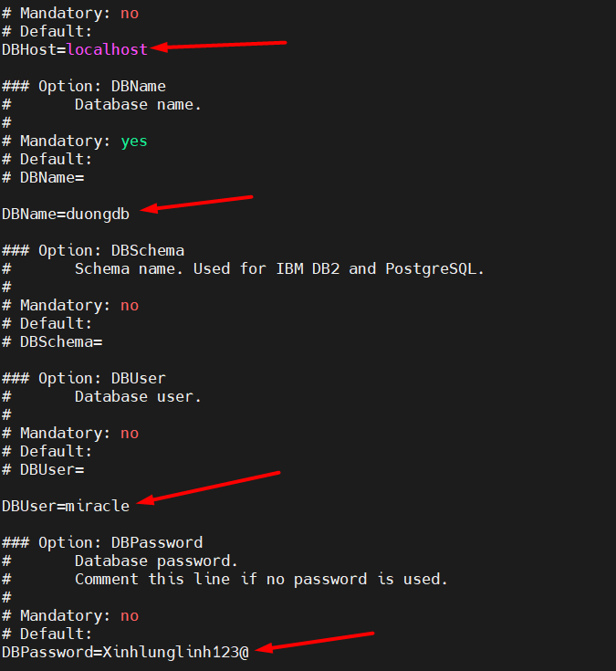

Sau khi hoàn tất chỉnh sửa, Restart lại dịch vụ Zabbix

**Start Zabbix**

```
systemctl start zabbix-server.service
```

**Kích hoạt Zabbix khi boot**

```
systemctl enable zabbix-server.service
```

**Restart lại Zabbix**

```
systemctl restart zabbix-server.service
```

**Kiểm tra trạng thái**

```
systemctl status zabbix-server.service
```

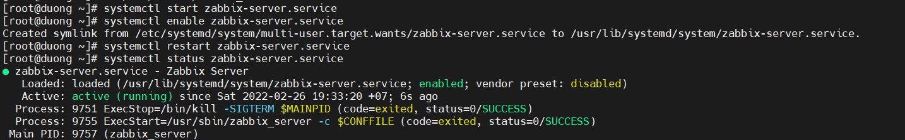

8. Setup Zabbix

Để truy cập thẳng vào ip hoặc url không cần thêm /zabbix thì bạn hãy tạo một virtuahost sau trong file /etc/httpd/conf/httpd.conf hoặc tạo riêng 1 file host tại /etc/httpd/conf.d/tranduongjr.com

```
vi /etc/httpd.conf.d/tranduongjr.com
```

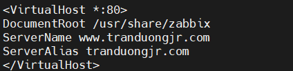

Lưu lại và khởi động lại apache

```
systemctl restart httpd
```

Truy cập vào Zabbix tại trình duyệt với tên miền đã cấu hình /zabbix

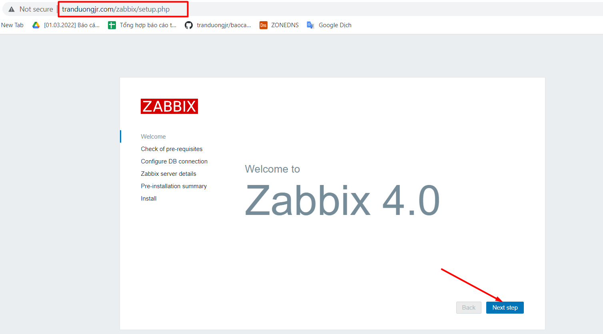

Chọn Next Step  để đến các bước thực hiện

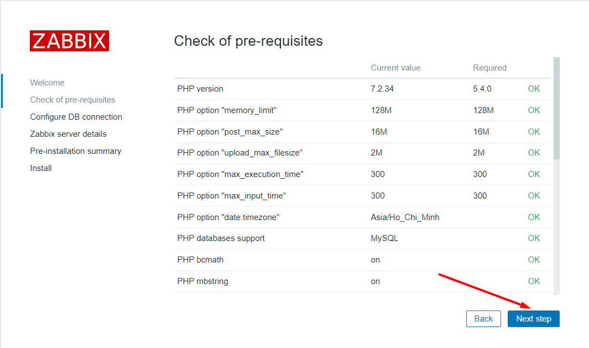

Tiếp theo nhập vào thông tin Database đã tạo ở các bước trên trên và đã set trong file cấu hình ở trên

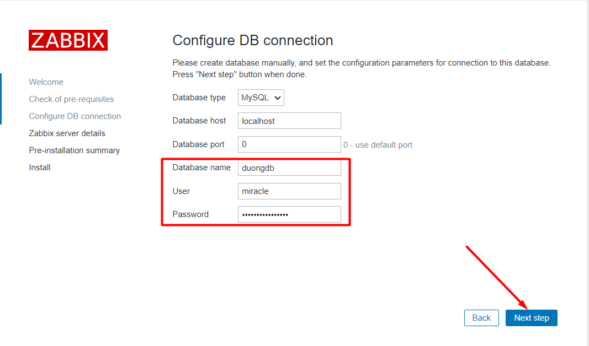

Nhập Hostname or IP và nhấn Next step

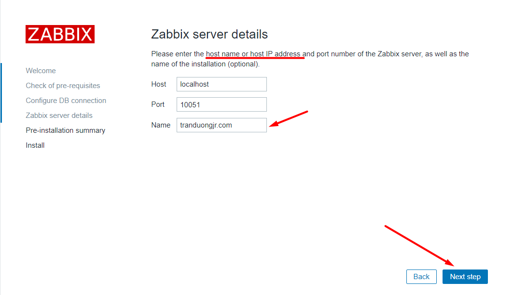

Xác nhận cấu hình setup và nhấn vào Next step

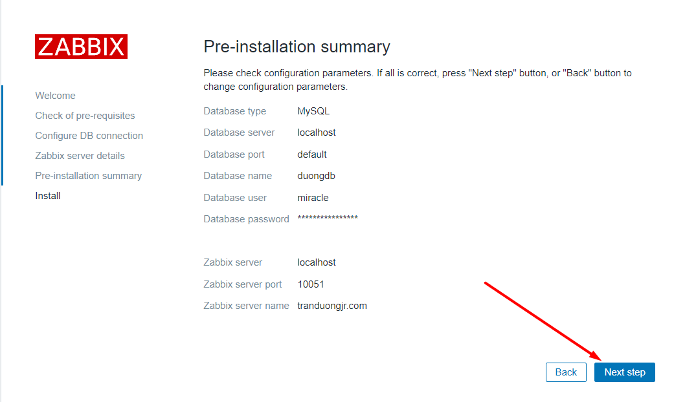

Thông báo cài đặt thành công:

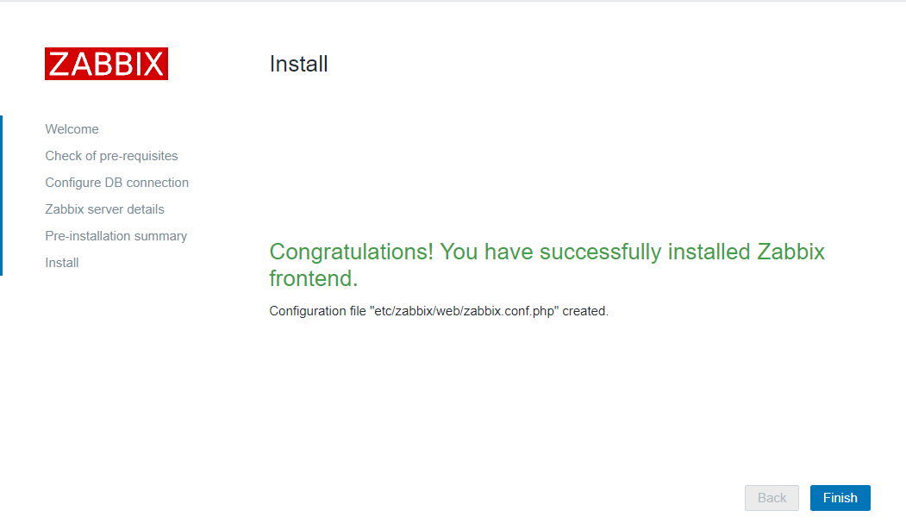

Cửa sổ đăng nhập bây giờ bạn hãy đăng nhập với thông tin mặc định là

```
username: Admin

password: zabbix
```

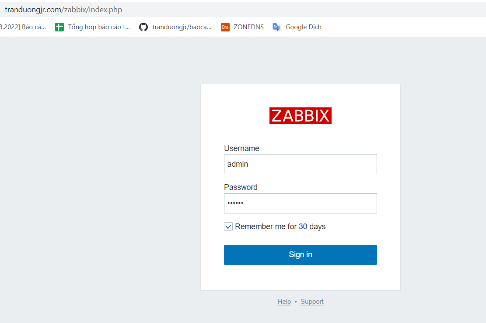

trang quản trị của zabbix hiện ra

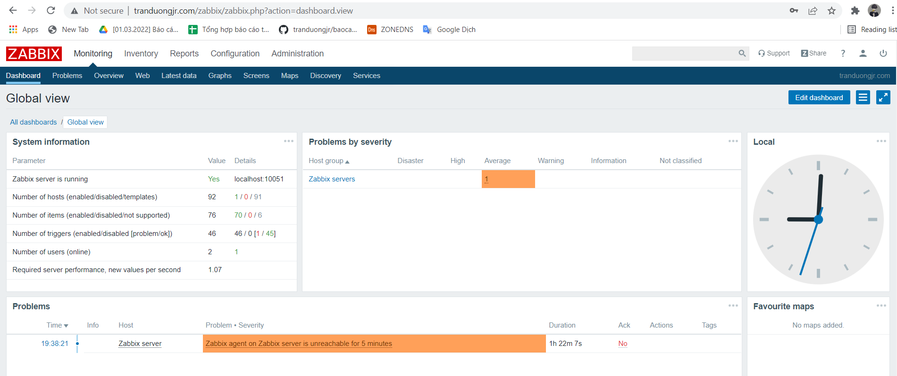
