# Tìm hiểu về Check mk

Khi càng nhiều công ty hoạt động dựa trên hệ thống mạng, việc giám sát hệ thống cũng trở nên quan trọng hơn. Các sự cố gián đoạn hệ thống mạng, máy chủ không hoạt động, các dịch vụ và ứng dụng gặp vấn đề… đều gây ảnh hưởng nghiêm trọng đến hoạt động doanh nghiệp. Tổn thất có thể lên đến hàng ngàn, thậm chí hàng triệu USD tùy theo doanh thu và lĩnh vực hoạt động. Để giảm thiểu thiệt hại đến mức tối thiểu hoặc ngăn chặn những sự cố đáng tiếc xả ra thì sẽ cần sự giúp đỡ rất nhiều từ các hệ thống giám sát. OMD checkmk là một giải pháp giám sát mã nguồn mở có khả năng giám sát, cảnh báo và hiển thị các biểu đồ đối với những hệ thống tầm trung không sẵn sàng chi nhiều kinh phí cho việc giám sát hệ thống, mạng.

## OMD Checkmk là gì?

OMD - Open Monitoring Distribution là một dự án được phát triển sử dụng nhân là Nagios Core, kết hợp với các phần mềm mã nguồn mở khác để đóng gói thành một sản phẩm phục vụ cho nhu cầu giám sát, cảnh báo và hiển thị.

Checkmk là một phần của OMD. Checkmk ra đời để giải quyết bài toán về hiệu năng mà Nagios gặp phải trong quá khứ. Cơ chế mới của checkmk cho phép việc mở rộng hệ thống trở lên dễ dàng hơn, có thể giám sát nhiều hệ thống chỉ từ một máy chủ Nagios server.

Có 2 Modun mà checkmk sử dụng để cải thiện đáng kể hiệu năng là Livestatus và Livecheck.

* Livestatus có những thay đổi để cải thiện hiệu năng đó là:

- Livestatus cũng sử dụng Nagios Event Broker API như NDO, nhưng nó sẽ không chủ động ghi dữ liệu ra. Thay vào đó, nó sẽ mở ra một socket để dữ liệu có thể được lấy ra theo yêu cầu.

- Livestatus tiêu tốn ít CPU

- Livestatus không làm cho Disk I/O thay đổi khi truy vấn trạng thái dữ liệu

- Không cần cấu hình. Không cần cơ sở dữ liệu. Không cần quản lý.

* Livecheck hoạt động thế nào để cải thiện được hiệu năng:

- Livecheck sử dụng các helper process, các core giao tiếp với helper thông qua Unix socket(điều này không xảy ra trên file system).

- Chỉ có một helper program được fork thay vì toàn bộ Nagios Core.

- Các tiến trình fork được phân tán trên tất cả các CPU thay vì chỉ một như trước.

- Process VM size tổng chỉ khoảng 100kb

# Cài đặt check_mk trên Centos 7.

Truy cập vào link sau đây để xem các phiên bản được release, ở bài này mình sẽ sử dụng phiên bản 2.0.0p20 để cài đặt 

https://checkmk.com/de/download?edition=cfe&version=stable

Cài đặt wget và epel-release

```
yum install -y epel-release wget
```

Tải về file cài đặt:

```
wget https://mathias-kettner.de/support/2.0.0p20/check-mk-raw-2.0.0p20-el7-38.x86_64.rpm
```

Sử dụng yum để cài đặt gói rpm để có thể tải được đầy đủ những dependencies:

```
yum install -y check-mk-raw-2.0.0p20-el7-38.x86_64.rpm
```

Đợi từ 3 đến 5 phút để hoàn thành quá trình cài đặt, sau đó tạo site mới bằng câu lệnh sau:

```
omd create cloud365
```

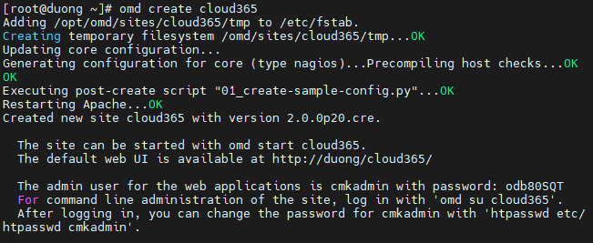

Sử dụng lệnh sau để tạo mật khẩu ```cmkadmin```

```
htpasswd -m /omd/sites/cloud365/etc/htpasswd cmkadmin
```

Trong đó /omd/sites/cloud365/ là $HOME_SITE của site tạo password, ở đây là cloud365

Kết quả như sau:

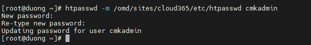

Khởi động site

```
omd start cloud365
```

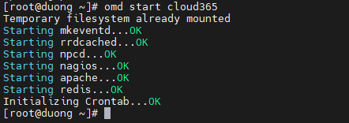

Truy cập địa chỉ ip-server/cloud365 để kiểm tra đã cài đặt và khởi động thành công hay chưa, nếu thành công sẽ nhận được kết quả như sau:

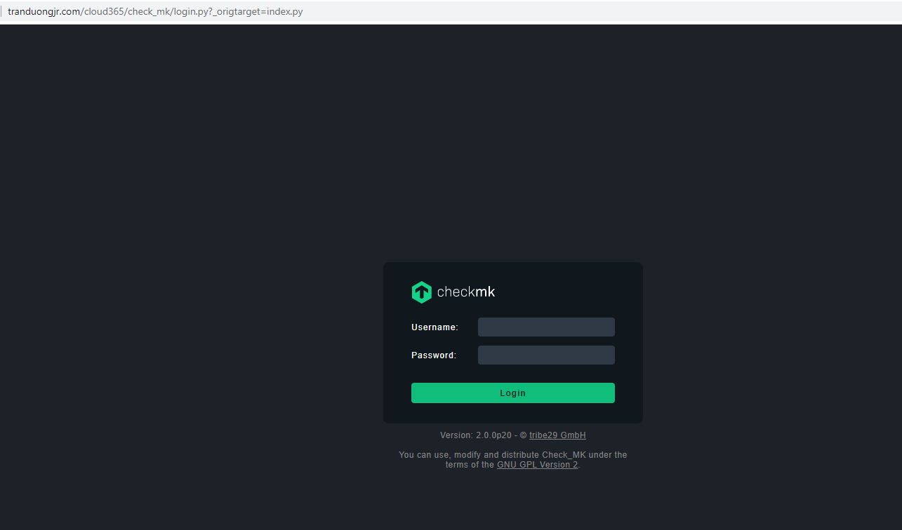

Đăng nhập với tài khoản cmkadmin và mật khẩu đã khởi tạo cho site ở bên trên. Giao diện checkmk hiện ra:

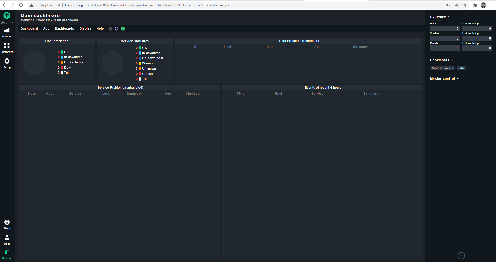

Như thế là đã cài đặt thành công trên CentOS 7

# Cài đặt checkmk agent giám sát hệ thống Linux

## Chuẩn bị 

- Một máy chủ đã được cài đặt checkmk, nếu chưa có thì cài như phần trên

- Một hoặc nhiều máy chủ client để đẩy metrics về checkmk

## Cài đặt agent trên Centos 7.

Đầu tiên ta vào trang quản trị checkmk => Setup và trong tùy chọn Agent ta chọn Linux để cài agent trên Centos 7

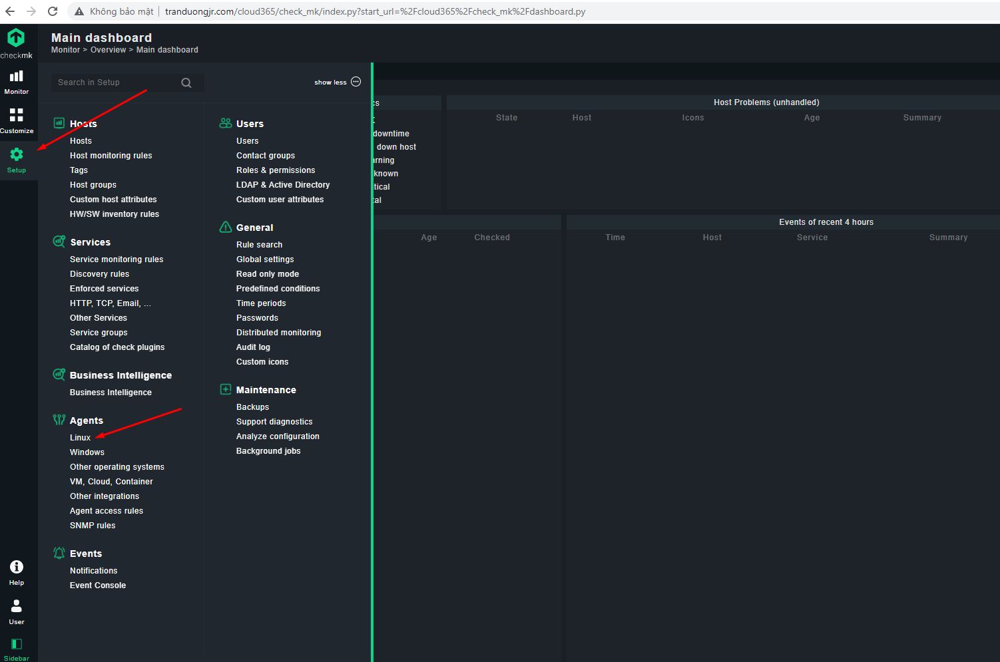

Ở đây, agent là CentOS 7 thì chúng ta sẽ chọn *.rpm: Dành cho các host sử dụng RHEL.

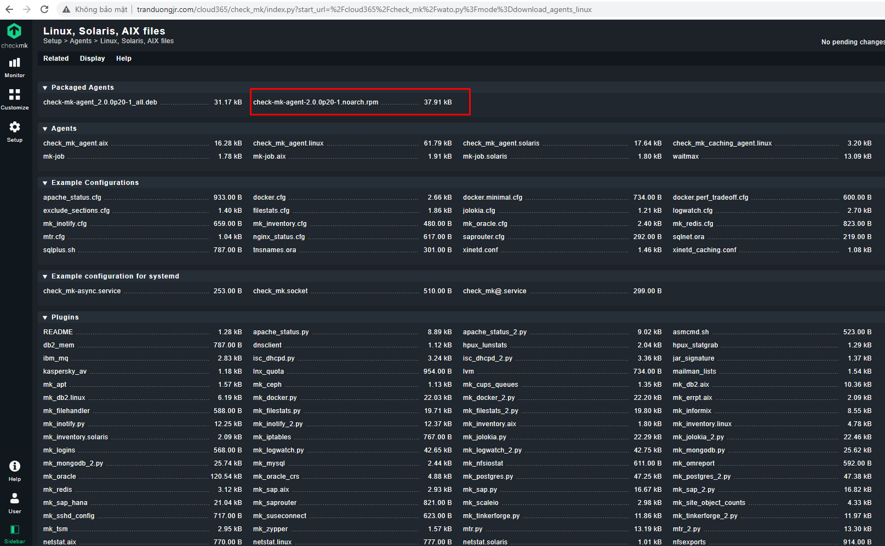

Copy địa chỉ đường dẫn và dùng wget để tải file cài đặt về


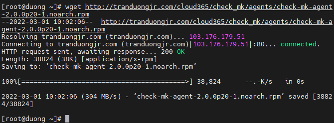

Cài đặt xinetd

```
yum install xinetd -y
```

Khởi động lại dịch vụ xinetd và cho phép khởi động cùng hệ thống :

```
systemctl start xinetd

systemctl enable xinetd
```

Cài đặt agent bằng câu lệnh:

```
rpm -ivh check-mk-agent-2.0.0p20-1.noarch.rpm
```

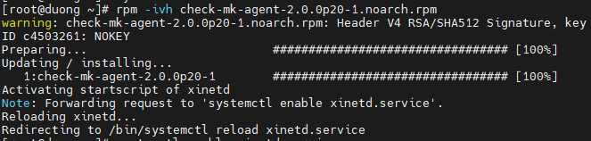

Sửa file cấu hình xinetd của checkmk tại /etc/xinetd.d/check_mk :

```
vi /etc/xinetd.d/check_mk
```

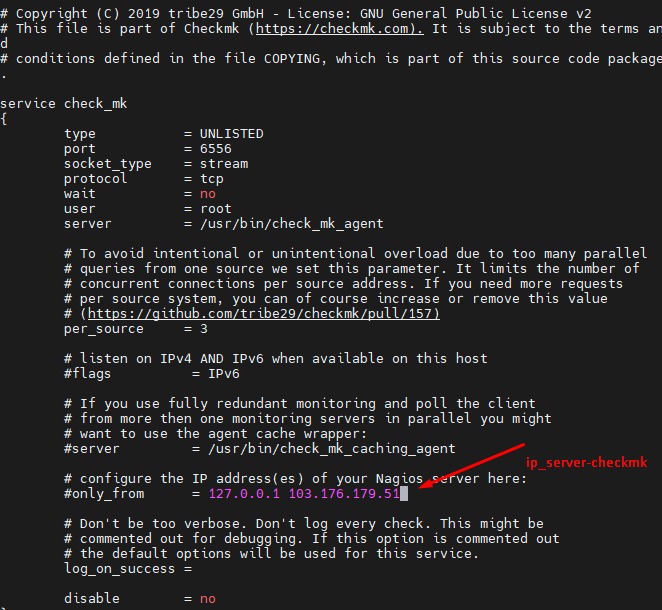

Khởi động lại xinetd:

```
systemctl restart xinetd
```

Thêm host trên checkmk server, tại Setup chọn host => Add a Host

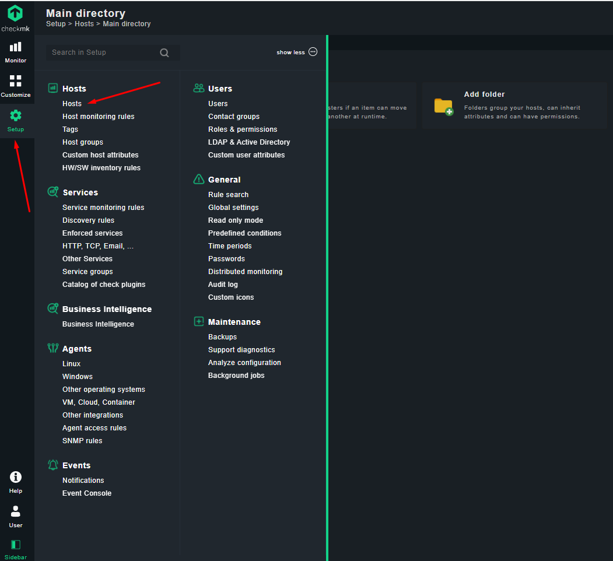

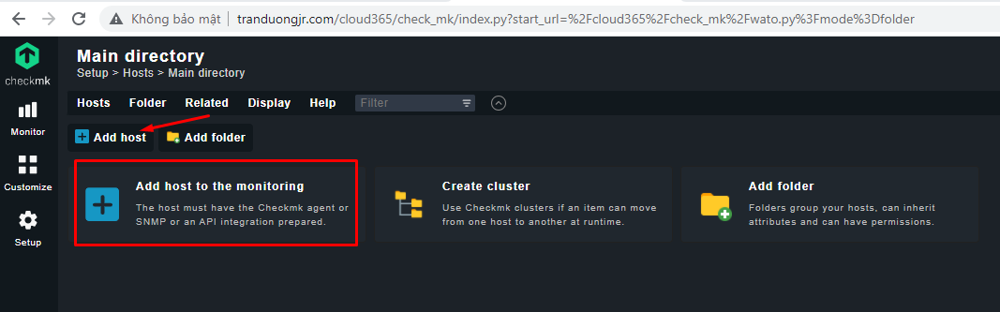

Điền các thông tin cần thiết

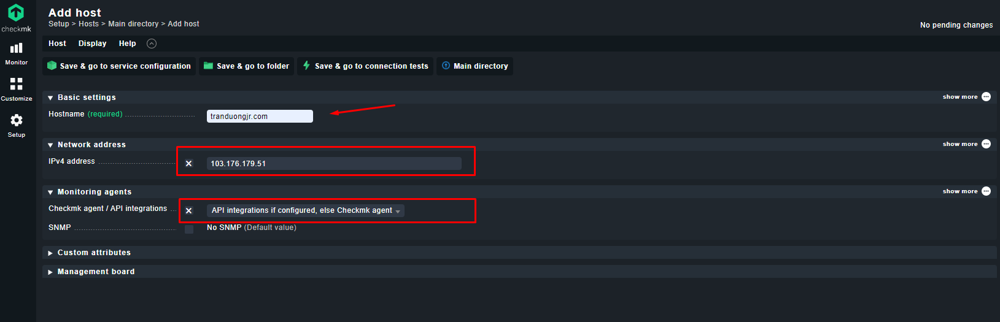

Sau đó chọn Save & go to connection tests để kiểm tra.

Kết quả thu được như sau:

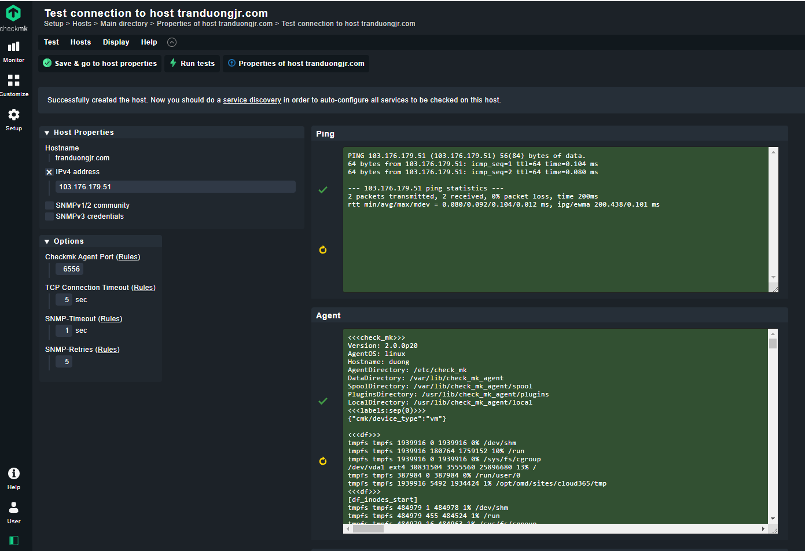

Chọn Save & go to host properties để lưu lại và quay về control quản lý host

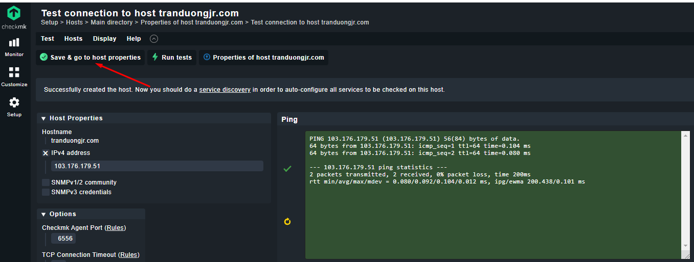

Hoặc chọn Save & go to service configuration để xem các dịch vụ được cấu hình trên host đó

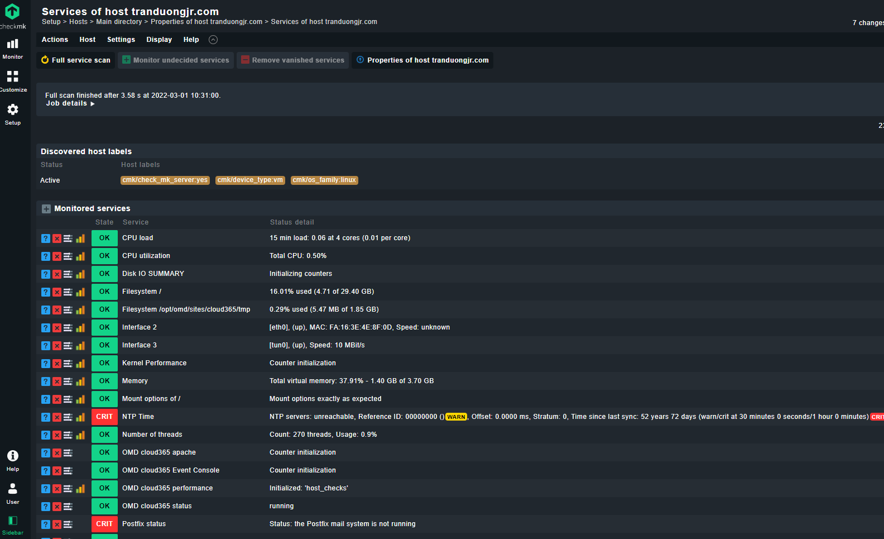

Sau các bước làm như trên thì checkmk sẽ có những thay đổi, chúng ta chọn Changes để xem những thay đổi đó

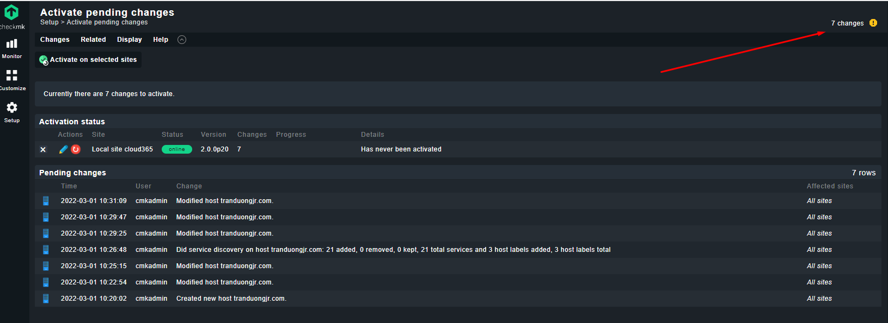

Chọn Activate on selected sites để hoàn thành thêm host mới.

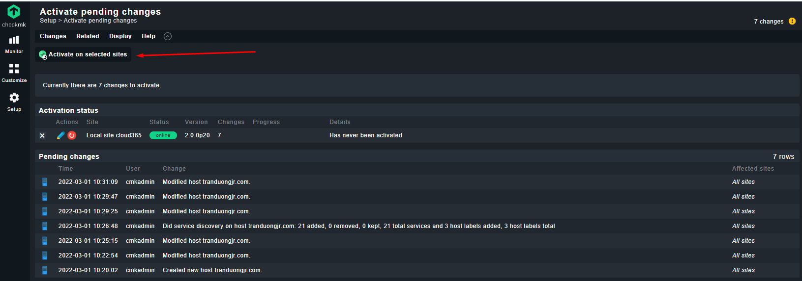

Thông báo trả về đã thêm thành công

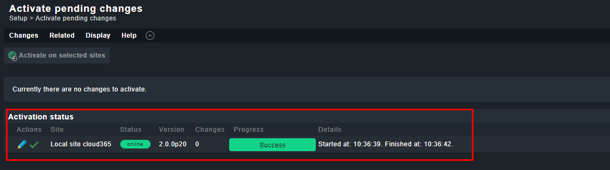

Kiểm tra host vừa mới thêm vào tại Monitor => All hosts

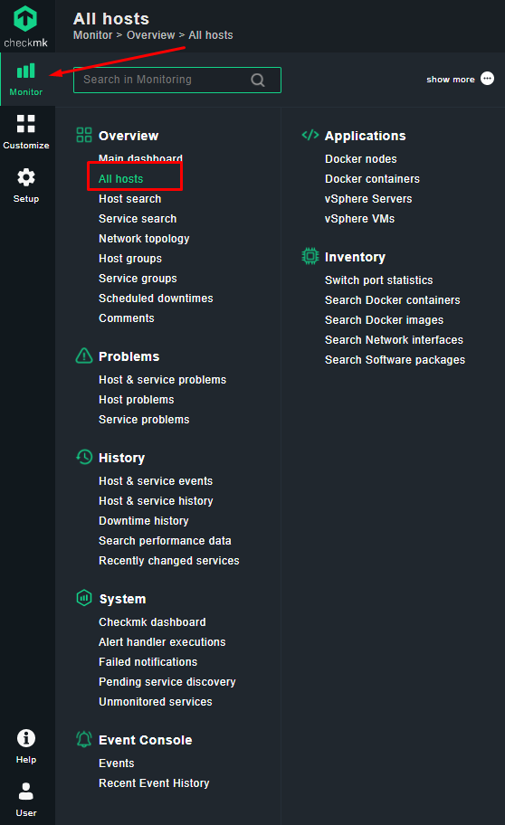

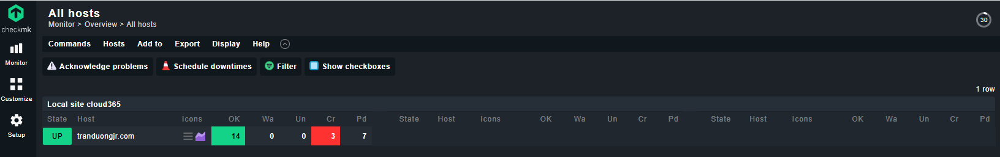

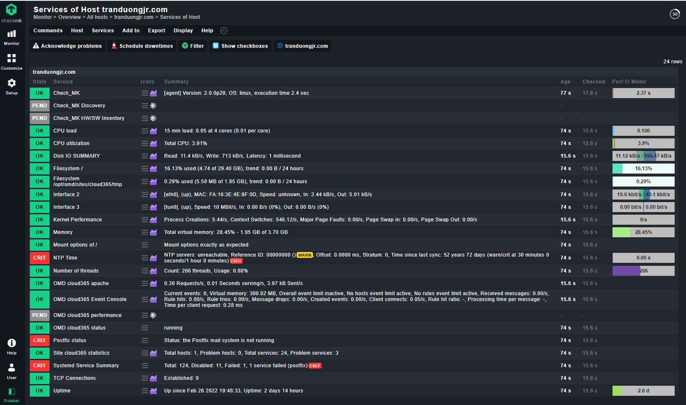

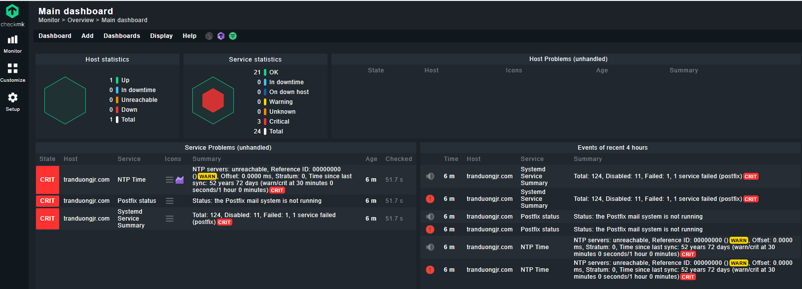

Như vậy ta đã hoàn thành thêm agent trên Centos 7 để giám sát cho client.

